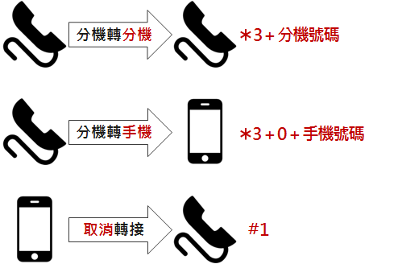

# 基本須知

## 生活

### HR

@import "1.csv"

### Phone



### 工作時段

- 8:30-17:30
- 無打卡
- 無晚餐限時

### 用餐

- 每餐公司補助85元
- 午餐訂餐
    - 當日早上10點前
    - 餐補時段11:40~13:40
- 晚餐訂餐
    - 當日下午4點前
    - 晚餐餐補時段17:30~20:00
- 補助餐廳
    - 怡客
        - 要拿餅乾
    - 老漁夫
    - burger king(家樂福內)
    - 5味臭臭鍋
    - 兄弟食堂
    - 路易莎

### 合作優惠

- 萊爾富 & 7-11
    - 9折
    - 現金交易

## Server

### Linux Workspace

- Server - `mtkslt205`
- Account - `mtk20255`
- Queue- `mosesq`
- File Server - `\\mtksfs00\mtk20255`
- Quota - `1024G`

## Load

### Setting

- Login [Gerrit](http://gerrit.mediatek.inc:8080/) and set http password

- `~/.netrc`
    
    ```bash
    machine gerrit.mediatek.inc login <mtk***D*> password <********>
    ```
    
- Set config
    
    ```bash
    $ chmod 600 ~/.netrc
    $ git config --global user.name "Alex.Hoh"
    $ git config  --global user.email "Alex.Hoh@mediatek.com"
    $ git config --global core.editor vim
    $ git config --global core.preloadindex true
    ```
    


### Fetch code by repo

- `.zshrc`
    
    ```bash
    export PATH=$PATH:/mtkoss/git
    ```
    
- Fetch
    
    ```bash
    # init 最新版本
    $ /mtkoss/git/mtk_repo init -u http://gerrit.mediatek.inc:8080/alps/platform/manifest -b alps-mp-p0.mp9 -m manifest-hq.xml
    
    # init 特定版本(網址與上面的不同)
    # -g : 指定需求的檔案，如: default,hardware_gpu_img_private 就是除了default我還要 IMG GPU的source code
    /mtkoss/git/mtk_repo init -u http://gerrit.mediatek.inc:8080/alps/build/manifest -b alps-mp-p0.mp9 -m alps-mp-p0.mp9-of.p42-hq.xml -g default,hardware_gpu_img_private
    
    # 將git檔案與本地端的檔案進行鏈結可以省去之後一些在填寫Change ID的時間
    # .git/hook/commit-msg -> ../../../../repo/hooks/commit-msg
    $ ln -s /mtkoss/git/hooks/wsd/prepare-commit-msg .repo/repo/hooks/
    
    # mosesq - 使用另一個 serve，減少loading
    $ mosesq '/mtkoss/git/mtk_repo sync -cq -j 64 --no-tags --no-clone-bundle --trace'
    ```
    

### Fetch code by [RD Shard Codebase](http://wiki.mediatek.inc/display/SSTSYSTEM/RD+Shared+Codebase)

```bash
[-b branch] [-v version] [-p project] [-m mode] [-r root] [-d days]

# list
/mtkoss/git/mtk_sc list -b alps-mp-p0.mp3
/mtkoss/git/mtk_sc list -v alps-trunk-m0.bsp-of.p1
/mtkoss/git/mtk_sc list -p k55v1*
/mtkoss/git/mtk_sc list_my

# init
/mtkoss/git/mtk_sc init -b alps-mp-p0.mp1 -v alps-mp-p0.mp1-of.p12 -m userdebug -r alps-mp-p0.mp1-of.p12 -d 60

# extend
/mtkoss/git/mtk_sc extend –r xxx

# delete
/mtkoss/git/mtk_sc delete -r xxx

export OUT_DIR=out_project_mode
```

### Fetch code by Perforce

- [FAQ](http://wiki.mediatek.inc/display/ALPS/P4+FAQ)
- [Document](http://mtkteams.mediatek.inc/sites/WCS/Dept/EPM/SM/P4CQ_Training/Forms/AllItems.aspx?RootFolder=/sites/WCS/Dept/EPM/SM/P4CQ_Training&FolderCTID=0x012000B40563BD47A8A541A70AC59C36D2E7EF)
- [Find changed line of code](http://wiki.mediatek.inc/pages/viewpage.action?title=Find+changed+line+of+code&spaceKey=ALPS)
- [Start P4 command console](http://wiki.mediatek.inc/display/ALPS/Start+P4+command+console)
- Server - `p4alps.gslb.mediatek.inc`
- Port - `3010`
- Account - `alex.hoh`
- Administrator - `Nancy.Yang`

```bash
$ p4v
```

- `.zshrc`

```bash
# P4
export P4PORT=p4alps.gslb.mediatek.inc:3010
export P4USER=alex.hoh
export P4HOST=p4alps.gslb.mediatek.inc
export P4CLIENT=ws_alex.hoh_WCX_ALPS
```


### Build
```bash
# 對環境變數進行寫入
$ source build/envsetup.sh

# 選擇平台編譯選項
$ lunch full_{project}-{mode}

# eng：開發者的版本，log多，效能最差
$ lunch full_k85v1_64-eng

# user：給使用者的版本，沒有 log
$ lunch full_k85v1_64-user

# userdebug:：測試用的版本
$ lunch full_k85v1_64-userdebug

# 2>&1 | tee build.log  redirect stderr and stdout to build.log
$ mosesq 'make -j64 2>&1 droid custom_images | tee build.log'
```

### Build sample

```bash
# Build 完之後放在：out/target/product/{Project}/system/bin
$ mosesq mmm frameworks/native/opengl/tests/sample5.2.1.
$ adb root
$ adb remount
$ adb push "source path" "destination path"
$ adb shell
$ chmod 777 FileName
```

### [Flash](http://wiki.mediatek.inc/pages/viewpage.action?pageId=564131311)
- Select **[Format All + Download]**
    
    
- 選Download Agent (就在Flash tool 目錄的MTK_AllInOne_DA.bin)

- 選**Scatter-loading** (在image 目錄內)
    - `MTXXXX_Android_scatte`
        
        

- 點選橘色框部份, 把Preloader替換成**preloader_k79v1_64_SBOOT_DIS.bin**
    
    

- 點選橘色匡部份, 把lk image換成**lk_def_unlock.img**
    
    

- 按下**Downalod**
    
    
- 公板上電
- 自動執行image 燒錄
- 會有進度條顯示執行進度
- Success
    
- Check mode

```bash
$ adb shell cat /d/mtkfb > mtkfb.txt
```


## Index
@import "2.csv"

## Tools

### Basic
- [Android Debug Bridge (ADB)](https://hk.saowen.com/a/40611286413b18f53a7e87955a17473e578c9a6cf317e5f4d096487511c038a9)
    - [教學](http://hiwiki.mediatek.inc/display/WCDOSS9ME7/Guide+for+ADB+Interface+driver+installation+step+by+step)
- [Android Studio](https://developer.android.com/studio/)
- [MobaXterm](https://mobaxterm.mobatek.net/download-home-edition.html)
- [Xming-fonts](http://mtksfs02/ME2_Storage/Tool/%E9%87%8D%E7%81%8C%E5%BF%85%E5%82%99/Xming-fonts-7-3-0-18-setup.exe)
- [Clover3](http://en.ejie.me/)
- [MTK USB Driver Install](http://mtksfs02/ME2_Storage/Tool/%E9%87%8D%E7%81%8C%E5%BF%85%E5%82%99/DriverInstall)
    - [URL2](http://hiwiki.mediatek.inc/download/attachments/147034726/PL2303_Prolific_DriverInstaller_v1_8_0.rar?version=1&modificationDate=1461810988000&api=v2)
- [FlashTool](http://script.mediatek.inc/script/WirelessTools/ToolRelease/SP%20Flash%20Tool/Release/General)
- [GAT](http://script.mediatek.inc/script/WirelessTools/ToolRelease/Debugging%20Tool/GAT)
- [Find Symbol](http://script.mediatek.inc/script/WirelessTools/ToolRelease/OfflineDebugSuite/SP_OfflineDebugSuite)
- [Install Source Insight](https://www.sourceinsight.com/download/)
    - SN: SI3US-100683-13490 (only useful for Source Insight 3.X version)
    - User Name: mtk
    - Organization: mtk
- [UtraEdit](http://wiki/pages/viewpage.action?pageId=69796078)
    - 版本V23
    - License ID: 3477532
    - Password: naX8B3X1t

### FPSShow
- FPS, 抖動, 卡頓, 大卡指標

### WhatsTemp
- CPU, GPU 頻率, loading及溫度

### LTR
- CPU, GPU及DRAM
- 一種基於Linux trace-cmd 的 Long Trace Recorder
- 設計目的是解決15 mins Game Trace錄製問題
- [LTR](http://wiki.mediatek.inc/display/WSD1OSS8ME3/LTR)
- [Long Trace Recorder](http://wiki/display/~MTK16184/Long+Trace+Recorder)`.bin` = `.dat.flog` = fpsShow debug file`.ltr` = the table that fpsShow feed to LTR`.tlog` = performance index file`SF.log` = System Frame Log

```bash
$ adb shell "dumpsys SurfaceFlinger >> /data/local/tmp/SF.log"
$ adb shell "dumpsys GuiExtService --detail >> /data/local/tmp/SF.log"
$ adb shell "dumpsys media.camera -v 2 >> /data/local/tmp/SF.log"
$ adb shell "cat /proc/driver/camera_info >> /data/local/tmp/SF.log"
$ adb shell "cat /d/mtkfb >> /data/local/tmp/SF.log"
$ adb shell "cat /d/ged/gedlog >> /data/local/tmp/SF.log"
$ adb shell "getprop >> /data/local/tmp/SF.log"
$ adb shell "dumpsys window windows >> /data/local/tmp/SF.log"
$ adb shell "dumpsys package >> /data/local/tmp/SF.log"
$ adb shell "cat /proc/gpufreq/gpufreq_opp_dump >> /data/local/tmp/SF.log"
$ adb shell "cat /sys/devices/system/cpu/eas/info >> /data/local/tmp/SF.log"
```

### LTR + FPSShow同時錄製
- 準備micro SD card

### EAT
- LTR切割出有效CPU, GPU, 及DRAM訊息
- Lafite/Talbot/Krug等6小2大project, 使用EAT記得帶入參數`c 6`
- `C0` - 小核
- `C1` - 大核
- `C2` - 另一顆不知道什麼(不管他)
- `Urate` - loading
- `weighted C/G time` - 不知道
- `q2q time` - `buffer producer` to `buffer consumer time` (30 FPS應該為 33ms左右)
- `Target time` - 根據前一個q2q time推估這次的q2q time應該為何(+-一個區間值)
- `fpsGo` 是一個policy
- `MCPS` -

```bash
# Split Trace
$ /proj/mtk12207/public-tools/eat_comm/trace-cmd split -i ltr_OOXX.dat -o output_name.dat start_time end_time

# Example
$ /proj/mtk12207/public-tools/eat_comm/trace-cmd split -i ltr_20190603_02_19_07.dat/ltr_20190603_02_19_07.dat -o 236575_236973.dat 236575 236973
$ mv –236575_236973.dat.1 236575_236973.dat
```


```bash
# 舊版風格
$ /proj/mtk12207/public-tools/eat_comm/trace-cmd report -i output_name.dat | sed 's/[b]*print://g'| sed 's/0x\S[a-z0-9]*:/tracing_mark_write:/g' | sed 's/ \+/ /g'  | sed 's/^ //g'  | sed '1d' > ftrace.txt

# 簡易計算
$ mosesq "/proj/mtk12207/public-tools/eat_linux -f bbb_0705"

# 需要從Trace統計MCPS
$ mosesq "/proj/mtk12207/public-tools/eat_linux -f bbb_0705 --mcps 1"

# 需要有包含PMU Info 的trace... 做詳細的PMU統計
$ mosesq "/proj/mtk12207/public-tools/eat_linux -f bbb_0705 --mcps 2"

# Runnable 計算
$ mosesq "/proj/mtk12207/public-tools/eat_linux -f bbb_0705 --runnable 1"

# 同時做MCPS & Runnable 計算
$ mosesq "/proj/mtk12207/public-tools/eat_linux -f bbb_0705 --runnable 1　--mcps 1"

# Only performance_index.html
$ mosesq "/proj/mtk12207/public-tools/eat_linux -f xxxxxxxx.tlog"
```


### Power Monitor(小白盒)
- 量測power兩次取平均
    - 兩次量測的power差值必需小於20 mA
- Phone Setting
    1. Load version: Userdebug load
    2. Airplane mode : On
    3. Wifi : On connected 5G AP
    4. BT : OFF
    5. Ear Phone : Yes
    6. Location (GPS) : OFF
    7. Auto rotate : ON
    8. Auto brightness : OFF
    9. Brightness : 0%
    10. Volume level : 50%
    11. MTKlog : OFF
    12. Duraspeed : OFF
    13. Display Sleep: 30 min
    14. 吹電風扇

### DAQ
- Power breakdown

### PA Trace
- 錄製遊戲並能在別隻手機回放

### [MET](http://met/se2/index.php/Main_Page)
- MET (Mediatek Embedded Technology)
- 是一套 DT/DP/DM5 基於 `PMU` (Performance Monitor Unit) 及 `Ftrace` 技術所開發出協助除錯及最佳化的平台
- 包含手機端的 Kernel Module 及 PC 端的 GUI 分析平台
- 藉由 MET, 開發者可以在最小影響系統效能下, 觀察程式運作, 最佳化程式效能
- 錄製bandwith相關訊息
- 修改MET script自己錄製

```bash
# start MET
cd $DATA_PATH; $MET_CMD --start $MET_DEFAULT_MODULE \
-e sched:sched_switch \
-e sched_wakeup \
-e sched_wakeup_new \
-e sched:sched_process_fork \
-e power:cpu_frequency \
--emi \
--gpu \
--gpu-dvfs \
--gpu-mem \
--vcoredvfs \
--cm_mgr
```

### Systrace

- `systrace`是Android4.1版本之後推出的，對系統性能分析的工具
- 利用了Linux Kernel中的`ftrace`功能
    - 要使用systrace的話，必須開啟kernel中和ftrace相關的模塊

```bash
# 位於: /sdk/platform-tools/systrace
python systrace.py [options] [category1] [category2] ... [categoryN]
```

- 開啟
    - Eclipse / Android Studio的DDMS
    - `chrome://tracing/`
- 可看項目
    - GLThread
    - CPU process
    - CPU frequency
    - with GL trace

### PVRtune[x]
- GPU HW bound的場景會需要錄製
- IMG chip專用

### BQ dump
- 遊戲resolution
- 找到SurfaceView – {package name}的source crop會有resolution訊息

```bash
$ adb shell dumpsys SurfaceFlinger
```

### [TPPA](http://tppa/TPPA/)
- 給CPU/GPU loading & frequency 換算出power 用量

## [名詞解釋](http://wiki.mediatek.inc/display/ALPS/Projects)
- `MAUI`功能機系列
- `ALPS`智能機系列
- `CP(Circuit Probing or Chip Probing)`未封裝IC
    - 可視情況不做
        - 產品單價低，CP會增加cycle time
        - Wafer製程有一定保握，CP只是從雞蛋裡挑骨頭
    - 針對晶圓先做初步測試(O/S、Leakage等)
    - 篩選出來的結果(INK或MAP標示)會送給封裝廠，以利取Good die進行封裝(又稱Wafer Sort)
    - 功能測試大多在FT進行
- `FT(Final Test)`已封裝IC
    - 一定要做
    - 產品最終測試，這裡會加入更多的功能測試，進而對產品進行分Grade
        - 因為封裝後，晶片會因為封裝應力使得電性略有變化
        - CP Pass不見得在FT Pass
    - 測試後良品放入Tray、Tube、Reel等包材後，送到SMT廠進行上板
- CHIP 開發3個 stage
    - FPGA stage
        - 用 FPGA 跑 test case (做 FPGA 驗證 = FPGA DVT)
    - FPGA Early Porting stage
        - CHIP TAPE OUT 後, 拿 FPGA 來做 DRIVER 的先行開發
    - CHIP sample back DVT stage
        - 俗稱的 DVT, 有分3個階段
            - DVT0 critical case
            - DVT1 high cases
            - DVT2 normal cases
- `TFE(Technical Feasibility Evaluation)`
    - Chip kick-off chip design後, 在TFE會初步定義這個chip的ISP spec
    - 並且找PM來討論是否OK
- `TDI(Trial Data In)`
    - 將初版的HW線路設計submit，開始試layout
    - 要求是該設計的都有設計進去，simulation至少有50%。所以大幅度的修改最好在TDI前ready
- `FDI(Final Data In)`
    - HW線路設計submit的dead line，TDI到FDI之間如果要改東西最好只做小幅度的改動。
- `TO(Tape Out)`
    - 線路圖layout done
- `ES(Sample back)`
    - Sample chip back
- `DVT(Design Verification Test)`
    - IC 回來時驗證 chip function 符合 hardware spec
    - 針對`功能面`測試
        - 例如: GPU的draw triangle, test depth, blend etc …
        - 每個功能會有特定的測項去驗證其功能的正確性
        - 跑 test case 確認 design functionality 符合預期
- `FPGA(Field Programmable Gate Array)`
    - 在 FPGA驗證 chip function 符合 hardware spec
    - 用 sw 模擬 chip 的硬體設計反應，反應速度會實體硬體慢。
- `SMT(Surface Mount Technology)`
    - 確保打件，hardware 線路
- `SLT(System Level Test)`
    - 確保每個 chip base function work
    - 針對`系統面`測試
    - 例如: GLBenchmark, AngryBird etc …
    - 會利用一些比較複雜會整合的測試去驗證整體結果的正確性
- `Bitfile`(binary file)
    - 儲存FPGA的設定
        
