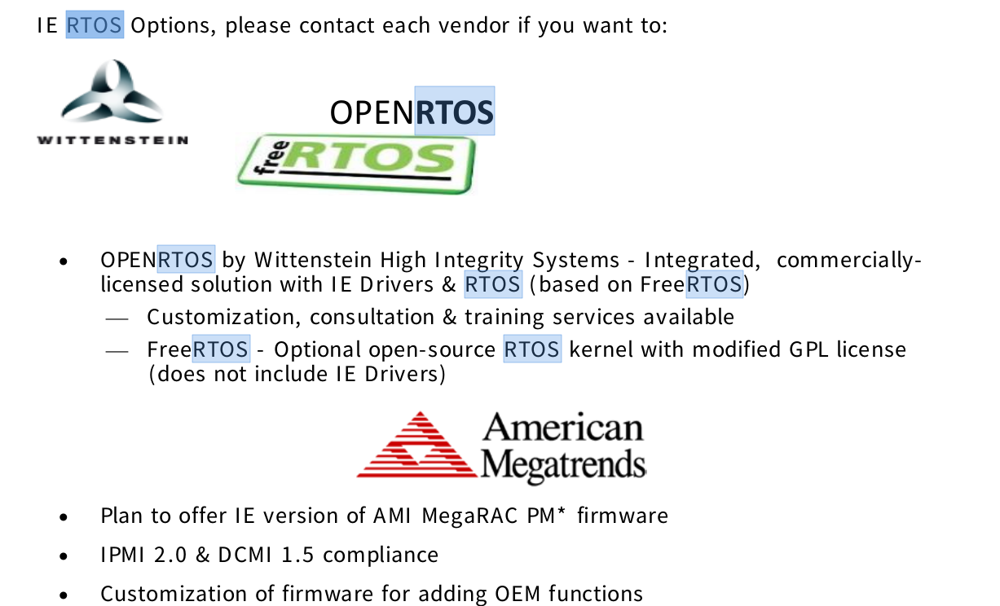

# Platform and Firmware

[TOC]

## Secure Boot

`AmiCryptoPkg/AmiCryptoPkg.sdl`
>
> - 提供加密功能以驗證數字簽名並執行標準加密操作：
>   - SHA哈希
>   - RSA加密
>   - 數字簽名編碼
>   - PKCS＃7
>   - PKCS＃1v2
>   - **AmiCryptoPkg_SUPPORT=1** (Enabled)

`AmiModulePkg/SecureBoot/SecureBoot.sdl`
>
> - 如何enable Secure Boot
>
- **SecureBoot_SUPPORT=1** (Enabled)
>
> - 如何設定default是enable Secure Boot
>
- **DEFAULT_SECURE_BOOT_ENABLE=1** (Enabled)
- **DEFAULT_PROVISION_SECURE_VARS=1** (Enabled)
>
> - **DEFAULT_SECURE_BOOT_MODE=0** (Standard)

`Keys/Variables/Variables.sdl`
>
> - PK - **PKVarFile**
> - KEK - **KEKVarFile**
> - db - **dbVarFile**
> - dbx - **dbxVarFile**
> - dbt - **dbtVarFile**
> - dbr - **dbrVarFile**

`AmiTsePkg/Core/em/AMITSE/Uefisetup.ini`
>
> - 在Manufacturing mode下，使**SecureBootSetup**這個UEFI variable不含**RT**屬性
>   - 在Aptio FW中，secure boot enable/disable由**SecureBootSetup**NVRAM variable控制
>   - 根據Spec要求，**SecureBootSetup**不應用於未經授權的software存取
>     - **SecureBootSetup**它不應存儲在Run Time時EFI變量中
>   - 為了符合Spec，DXE driver中添加了一種解決方法，以清除**RT**屬性
>   - 但是，在Manufacturing mode下，NVRAM driver將繞過NVRAM中的variable並返回default值（帶有RT屬性）
>   - 解決方案是將**SecureBootSetup**註冊進`UefiSetup.ini`文件中，並給予適當的default屬性

```bash
[Variable30]
guid =  7B59104A-C00D-4158-87FF-F04D6396A915
name =  SecureBootSetup
flags = 3  ; The flags = 3 represents NV+BS and if it is 7 then it represents NV+BS+RT.
extFlags =  1  ; no defaults
key = 65535
```

## Secure Flash

- 如何進行Capsule update
- Update後能否保留`SMBIOS`？
- 如何Sign BIOS
- Flash BIOS tool
- FIT交給客人sign的步驟？
- Fault Tolerant Updates
- Recover by usb？

## SMBIOS

- tools of rw smbios in linux/uefi
- 是否可以在secure boot enable情況下使用？

## TPM

- 如何切換dtpm/ftpm

## Driving

- 如何調整driving of SMBus？

## IE

- IE firmware如何跑FreeRTOS


