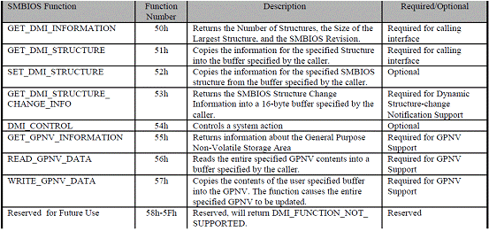
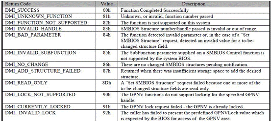
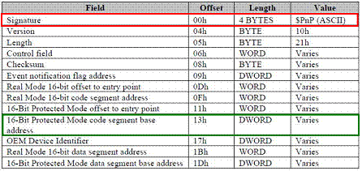
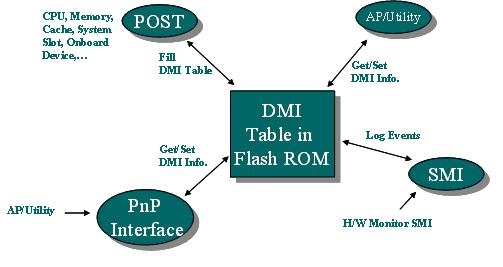
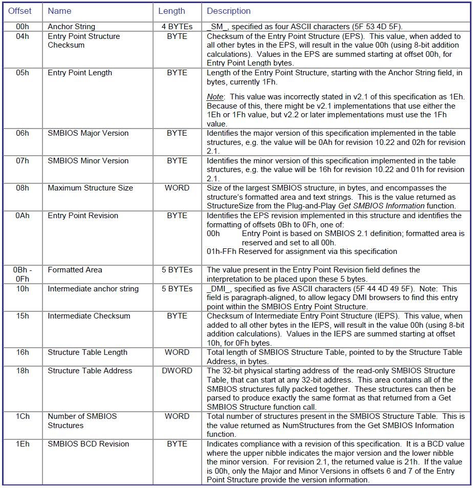
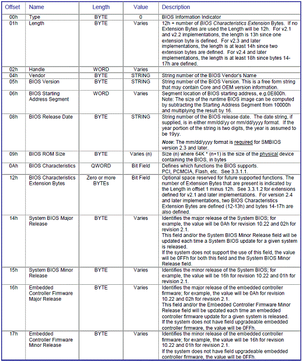

# SMBIOS (System Management BIOS)

[TOC]

## DMI

- `Desktop Management Interface`
- 搜集電腦系統訊息
- 位置:`Flash Rom`
- 由BIOS在POST過程中,將所偵測到的系統硬體資訊存在 `DMI Table` 中
- 若DMI Table不存在時，會根據系統建立此Table
  - 此Table並`不是每次更新`
  - 只要`BIOS`將此Table與目前系統上的元件做比對，只要有一個Byte不同就會`重寫DMI Table`
  - AP/Utility可直接或透過`PnP Interface`對DMI Table做存取的動作

## SMBIOS

- `SMBIOS` System Management BIOS -> 系统管理BIOS
- Spec2.0後DMI稱為SMBIOS
  - 是一個標準 由 DMTF所開發
  - 定出主機板及系統廠商如何以標準的格式顯示產品管理資訊的規格
  - SMBIOS 及 DMI(Desktop Management Interface)規格兩者皆是由 Desktop Management Task Force (DMTF) 所草擬的
  - 會在Memory的某個地方建立一個Table. 經由解析這個Table，它是可以存取電腦資訊和電腦屬性
  
- 通過訪問SMBIOS的結構獲得系統訊息，共有兩種辦法可以訪問
- 即插即用功能接口訪問SMBIOS結構，這個在SMBIOS2.0標准裏定義了，從SMBIOS2.1開始這個訪問方法不再被推薦使用
- 表結構的方法，表内容是tableentry point的數據，這個訪問方法從SMBIOS2.1以後開始被使用，從2.1開始，以後的版本都推薦使用這種訪問方式。在2.1版本中允許支援這兩種方法中的任意一種和兩種都支援，但在2.2已經以後的版本，必須支援方法2
- Linux可以用dmidecode 讀取
- SMBIOS 資料儲存在哪裡 -> BIOS 裏面
- DMI 與 SMBIOS 差別是 -> DMI 主要是搜集電腦系統訊息,SMBIOS 儲存資料的結構.

- 1.SMBIOS Entry Point Table的位置在Memory 0xF0000 和 0xFFFFF之間
- 2.找到後再向後16個字節，看後面5個BYTE是否是關鍵字“_DMI_”，如果是，EPS表即找到。
- 3.通過EPS表的12H和14H數據找到TYPE結構表，然後找到TYPE0的内存地址
- 4.由TYPE0結構區域中得出相應BIOS訊息是否存在（存在則是上面所述的 01H,02H,03H依次排布，不存在則是相應的位置上為00H）
- 5.如存在訊息，則從字符串區域中讀取對應BIOS訊息
  > TYPE0（BIOSinformation）格式區域如下
  > Entry point table structure

```c
 struct SMBIOSEntryPoint {
  char EntryPointString[4];    //This is _SM_
  uchar Checksum;              //This value summed with all the values of the table, should be 0 (overflow)
  uchar Length;                //Length of the Entry Point Table. Since version 2.1 of SMBIOS, this is 0x1F
  uchar MajorVersion;          //Major Version of SMBIOS
  uchar MinorVersion;          //Minor Version of SMBIOS
  ushort MaxStructureSize;     //Maximum size of a SMBIOS Structure (we will se later)
  uchar EntryPointRevision;    //...
  char FormattedArea[5];       //...
  char EntryPointString2[5];   //This is _DMI_
  uchar Checksum2;             //Checksum for values from EntryPointString2 to the end of table
  ushort TableLength;          //Length of the Table containing all the structures
  uint TableAddress;      //Address of the Table
  ushort NumberOfStructures;   //Number of structures in the table
  uchar BCDRevision;           //Unused
 };
```

## 存取 SMBIOS 的方式

- PnP function interface
- Table-base method

`2.1`兩種方法擇一選擇
`2.2`規定一定要提供table-based method
`2.3.2` 不建議使用 Plug-and-Play function interface
`2.7`只剩下 Table-base method 的方式做存取 SMBIOS 資料

### 1. Plug-and-Play function interface

- 現今較少使用PnP Function Call，但是若廠商要求使用，還是必須建置此功能
- PnP BIOS Spec中，定義了如何使用PnP Function Call
- PnP Function 能在Real mode和Protect mode底下使用
PnP function 0x52, Set SMBIOS Structure
PnP function 0x54
PnP function 0x55
PnP function 0x56, Set SMBIOS Structure.
PnP function 0x57, Set SMBIOS Structure.





- 記憶體F0000h到FFFFFh之間的範圍，搜尋$PnP字串，若能尋找成功，代表有支援PnP Function
  -

  
  
### 2. Table-base method



- BIOS會在開機時把 SMBIOS 的`Entry Point Structure(EPS)`寫到主記憶體`000F0000h`到`000FFFFFh`範圍之間
  - 從`000F0000h`到`000FFFFFh`範圍之間尋找關鍵字`_SM_`
  - 如果找到很多個`_SM_`,就再向後16個字節，看後面5個BYTE是否是關鍵字`_DMI_`，如果是，`EPS`表即找到
  - `18h`為Double Word型式的資料，代表`Structure Table Address`
  - `1Ch`為此系統目前有多少個`Structure`
  - 
- 一個完整的SMBIOS Structure Table，前4Bytes為固定欄位，後面欄位則是描述此系統的BIOS資訊。
                 例如: Offset 09h，表示BIOS ROM Size，其公式為64k * (n+1)
  - 

### 3. Utility Tool

- Phoenix SMBCFG : 可增加或修改SMBIOS Type的值，但某些重要Type的值無法修改，例如Type0 或 Type1的值
