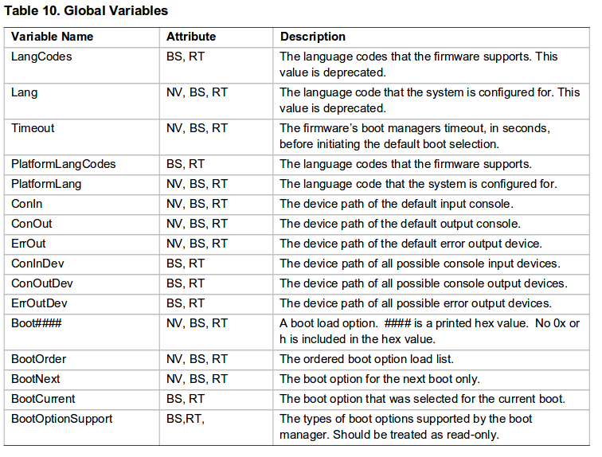

# TPM

[TOC]

## 0. 名詞對應

|縮寫|中文|英文|
| :-------- |:--------:|:---:|
| |　密封　|　seal　|
| EK    | 簽署金鑰| Endorsement key|
|SRK|存儲根密鑰|Storage Root Key|
| EK pub | EK 公開金鑰| |
| EK Priv    |   EK 私密金鑰 | |
| EK Cert    |   EK 憑證 |  |
| |   平台製造者名稱 |  Platform Credential　|
| |   檢驗者名稱 | Conformance Credential |
| |   元件驗證憑證 | Validation credential|
| AIK | 身份證明密鑰 | Attestation Identity Keys |
| PCR    |   平台設定暫存器 | Platform Configuration Registers　|
|  |一致性證書 | Conformance Credential　|
|SML||Store Measurement Log|
|CRTM|測量信任的核心根源|core root of trust for measurement|
|ECC|橢圓雙曲線加密演算法||
|AK||attestation key|
|KDF|密鑰推導函數|Key Derivation Function|
|TCG|可信計算機組織|Trusted Computing Group|
|DAA|直接匿名認証|Direct Anonymous Attestation|

## 1. TPM 歷史

### 1-1. 初衷

- 試圖為PC設計一個安全的操作環境
- 由TCG成員定義，但因為成本壓力，於是設計了簡單的TPM硬體
- 使用邏輯多半交給軟體去處理
- 硬體負責供PCR、RSA密鑰生成、授權、存取等基本功能
- 沒有保護字典攻擊的設計
- 不包含物理攻擊的抵禦能力
  - 這點交由製造商自行定義
- 製造商一開始會將private key嵌入到每個TPM中
  - public key將作為證書發布
  - 由TPM生成的簽名必須源於private key
- 由於每個TPM均有一對能唯一的 RSA 背書密鑰( endorsement key, EK)的話，很容易造成平台用戶的行為被跟踪, 導致隱私洩露
- 為了實現完全匿名的環境，決定讓所有TPM使用相同的private key
  - 所以它們是無法區分的，以確保用戶的隱私
  - 就算有CA機制，也只能證明Key來自TPM生成，不能證明是那一個TPM
- 但此天真的設計，使得整個認証系統變得過於脆弱
  - 一旦任一個TPM被抽取了Private Key，就可以偽裝成TPM
  - 整個認証體系會完全崩潰

### 1-2. TPM 1.1b

- 2003年定義
- 提出Privacy CA作為解決方案
- 設計原理：
  - 回到每個TPM均有一對唯一RSA EK的設計
  - 首先，TPM的製造商必須提供EK Public Key給Privacy CA知道
  - 每當server（驗證者）要求user提供TPM的資料（如PCRs）作為服務前提時，TPM就產生第2把RSA Key，稱為證明身份密鑰（AIK），並由EK簽名
  - 然後user這邊要把被EK簽名過的AIK送給Privacy CA檢查其有效性，並取得Privacy CA頒發的AIK證書
  - 拿到AIK證書後，TPM用AIK private key對PCRs簽章
  - 最後user將PCRs, AIK簽章, AIK證書一起送給server（驗證者）
- 好處：
  - 由於一次一簽，且每次都用不同的RSA AIK來簽章，所以server端無法分辨對方是否是同一個TPM，user也無法被跟蹤
  - Privacy CA如果確定某EK是不合法的，可以拒絕所有來自此EK的AIK認証
  - Privacy CA如果從某TPM收到太多次請求，可以拒收並加到黑名單
- 缺點：
  - Privacy CA要參與每個請求，大規模的話效率承受的住嘛？
  - Privacy CA權力這麼大，誰來當？
  - 如果那位server（驗證者）就是Privacy CA的成員，那TPM的匿名性不就失效？
- 當時不同TPM廠商提供的TPM軟體interface略有不同，Pin也不一致
  - 所以需要不同的 driver

#### 1-2-1. EK

- 儲存在該 TPM 自內部的NV內
- 每個 TPM 是唯一的
- 無法變更或移除

#### 1-2-2. AIK

- TPM在實際運作的時候不會直接拿**EK**來用
  - 因為同一把鑰匙用越多次越不安全
- 所以TPM會用EK產生**AIK**
  - 作為EK的alias
- AIK是用來證明TPM是合法的
  - 不是證明平台
  


#### 1-2-3. AIK credential

- 憑證記載著
      - 某特定TPM之AIK公開金鑰
      - TPM型號
      - 製造者名稱
      - 平台類別
      - 製造者名稱

### 1-3. TPM 1.2

- 2003同年，定義另一種方案：DAA (Direct Anonymous Attestation)
- 設計原理：
  - DAA協議基於三個角色：DAA Member(TPM 擁有者)、DAA Issuer(TPM製造商)、DAA Verifier(提供服務者、驗證者)
  - TPM首先產生一個EK，然後向DAA Issuer申請關於此**EK的DAA證明**
  - 以後TPM就用這個EK，對每次認證產生的AIK進行簽名
    - 該簽名也包含了**DAA證明的知識證明**
  - 主要是基於離散對數的原理，驗證者無法直接得到**EK的DAA證明**，只能透過**知識證明**得知確實有合法的DAA證明
  - **知識證明**每次產生都不同
- 好處：
  - 在DAA方案中，TPM只需向DAA Issuer申請一次DAA證書，以後每次認證均使用該證書，因而DAA Issuer不會成為影響效率的瓶頸
  - 在每次認證時，驗證者無法獲得能唯一對應被認證者的值，從而實現了匿名性
  - 即使驗證者與發布者關聯，甚至兩者乾脆就是同一人，匿名性仍然可以保持
- EK的DAA證明要放在哪裡？ 所以加上了NVRAM(大約2KB)來存放
- 定義了軟體interface spec，與標準封裝的Pin腳位設計
- 有一個**亂數生成器**
- 使用**SPI**或**I2C**與CPU通訊

- 有保護字典攻擊的設計
- 首次初始化TPM時，要建立`TPM擁有者密碼`

## 2. Measured Boot

### 2-1. PCR 平台設定暫存器

- 是 TPM 中的一個記憶體位置
- PCR至少要有**24**個暫存器，每個**20 bytws**
- PCR最常見的用途是記錄系統初始化期間code的measurements/hash值
- PCR 0 到 7 在開機程序後 (已載入作業系統時) 會擁有一個明確定義的值
- 若要在 PCR 中儲存新的值，現有的值會以新值延伸

> `PCR新值 = HASH 演算法( PCR舊值 || 要合併的某些數據 )`


- 只能hardware reset
- 不能直接寫入(只能擴展)
- 有時TPM PCR 會被用來當作記錄事件的總和檢查碼
  - 當事件發生時，會在 TPM 中延伸記錄事件
  - 之後， 稽核員可以從這些記錄計算出預期的 PCR 值
  - 並將它們與 TPM 的 PCR 值做比較來驗證記錄
  - 即可確保記錄未經修改
  
- Microsoft使用PCR去unseal BitLocker key
  - 如果PCR沒有預期的值，磁盤加密密鑰將不會被解除密封
  - 如果用戶認為系統處於可信狀態，則可以輸入恢復密鑰
  - 這個過程是`脆弱的（brittle）` - 啟動的任何變化都需要user干預
  
### 2-2. Flow


- `Measured Boot`與`Secure Boot`都依賴於`Root of Trust`
  - `Root of Trust`大部份是UEFI BIOS
    - 因為BIOS通常被OEM sign或是OTP fuse保護

- `Secure Boot chain`
  - 在每個步驟啟動之前，檢查下一步的可執行文件上的`數位簽章`
  - BIOS檢查loader簽章
  - loader檢查kernel簽章
  - 如果則簽章不匹配BIOS內的public Keys，device將不會啟動成功
  - 每個部位是相對獨立的
  


- `Measured Boot chain`
  - 在啟動下一個object之前，當前運行的object`測量(measures)`下一個object的hash
  - 將hash存放在安全可靠的地方，如TPM PCR，以便稍候檢查
  - 從TPM的回報除了PCR的資訊外，還有TPM的數位簽章
    - 這份資料稱為`引用(Quote)`
  - 但hash的好壞並不會阻止平台的啟動
  - 因此對於Measured Boot檢查機制，可以更靈活的定義
    - 針對你感興趣的部份檢查就好


- `Secure Boot` 與 `Measured Boot`是可以並存的

## 3. TPM 2.0

- 從1.1b到1.2修改了很多，使得spec相當複雜
- 2.0基於SHA-1漸漸被取代的環境為出發點，整個重新改造設計架構
- TCG希望2.0是最後版本

### 3-1. Secure Key Storage

- TPM使用/管理許多Key，但存儲空間有限
- 於是將Key放在**Secure Key Storage**中（**EK**和**SRK**除外）
- **SRK**是管理這個區域的主Key群
  - 同EK，存在NVRAM內
- **Secure storage**可以是flash裝置或是FTP server
- **AIK**就存在這裡
- 每個Key對應一個Auth data（密碼）
- Key與Auth data被**SRK**加密後，變成blob存放於此
  


- **SRK**直接加密Key，叫作`包裝`或`連結(bind)`金鑰
  - 解密金鑰則稱為`拆封`
- **SRK**加密**Key與PCR state**，叫作`密封(seal)`
  - 可以將Key綁定至一組預期的**PCR**狀態
  - 確保只有當系統處於已知/可接受狀態時才能存取資料
  - `BitLocker`就是用Key加密disk，然後`密封(seal)`起來


### 3-2. SML

- TPM會將整個平台所有重要元件的hash都記錄下來，並且記錄在**SML（Store Measurement Log）**
- SML本身放在硬碟
  - 因為可能會有一大堆雜湊碼
- 但是**SML的雜湊**會被儲存於TPM的**PCR**
- 所以想要修改SML？別傻了

### 3-3. 硬體關係


### 3-1. 為什麼使用 TPM 2.0？

- TPM 1.2中
  - 需要EK來識別TPM
  - 使用相同的algorithms時，大家沒問題
  - 使用不同algorithms，TPM製造商面臨困難
    - 每一對key pair都佔一部份 NV memory
  - TPM vendor應該安裝多少key pair?

- TPM 2.0中
- 不採用EK，而是一個Primary Seed(很大的隨機數)
- 從中我們可以生成任意數量的非對稱或對稱密鑰
- 非對稱密鑰是通過使用Primary Seed和一組呼叫者提供的參數作為輸入而創建的
- 創建非對稱密鑰的過程是可重複的
  - 使用相同的參數時，會生成相同的密鑰
- 非對稱密鑰成為Primary Seed的`aliases`
- 製造商被允許注入Primary Seed
- 但出貨的TPM是沒有EK在裡面的
- User使用與TPM供應商相同的參數來創建EK
- User也可以將自己的Key留存在TPM NV內
- User將會有一個EK，而TPM供應商可以幫忙認証(沒有強制規範)

- TPM產生的證明blob時，會加上一個`magic`值來表明是TPM建立的資料，然後再用TPM的Key簽章


- TPM 1.2 規格僅允許使用 RSA 與 SHA-1 雜湊演算法。
  - SHA1顯示出疲軟的跡象，正在被棄用
  - 基於安全性考量，某些機構已不使用 SHA-1
  - 值得注意的是，自 2014 年開始 NIST 已要求許多聯邦單位改用 SHA-256
  - 而科技龍頭 (包括Microsoft 與 Google) 已經宣布將於 2017 年移除 SHA-1 式簽署或憑證的支援
  - 不同的地區正在選擇不同的選擇，沒有人相信別人的算法
  - 不對稱密碼學從RSA轉換到ECC
- TPM 2.0 支援 SHA-256 以及 ECC
  - 後者在磁碟簽署和金鑰產生效能方面很重要
  
- TPM 2.0 已達成 ISO 標準化 (ISO/IEC 11889:2015)
  - 使用 TPM 2.0 可能有助於排除 OEM 需求，以針對特定國家和地區的標準設定做出例外狀況  

- 在TPM 1.2中，所有的控制的是以 `owner` 角色來操作
  - 如果TPM未啟用，激活並擁有; 用它做不了多少
  - 擁有 owner 即可對 security/ privacy 功能進行存取
  - 主要原因是當初 TPM 1.2 設計對象是 PC 上的使用者
  - 但隨著 cyber security 的議題逐漸被重視, 許多嵌入式平台/ 產品也會將 TPM 設計在裡面以達到保護平台以及資料的目的

- 所以說 TPM 2.0 將這些存取控制分成三個獨立的域：
  - Security - 提供使用者安全保護
  - Privacy - 用來確認平台/ 使用者身份的功能
  - Platform - 用來確認平台/ 軔體的完整性
  - 每一個種類都有對應的權限控制, 互不影響

- 每個域都有自己的資源和控制
  - Security - ownerAuth,，storage hierarchy，hierarchy enable（shEnable）
  - Privacy - endorsementAuth,，endorsement hierarchy，ehEnable
  - Platform - platformAuth,，platform hierarchy,，phEnable

- TPM 1.2 階層關係並不存在(一階關係)
  - Storage hierarchy - for platform user
  - 這意味著單個用戶或實體可以控制加密功能（簽名，加密）

- TPM 2.0 階層關係存在，而且有3種類型
  - Storage hierarchy - for platform user
  - Endorsement hierarchy - for platform administrator
  - Platform hierarchy - for platform firmware
  - null hierarchies
  - 每個hierarchy都有自己獨特的`owner`
  


- TPM 1.2 組件通常是鉛焊在主機板上的個別晶片元件
- TPM 2.0 可同時做為系統的主要 SoC 上受信任的執行環境 (TEE) 中執行的特定 (dTPM) 晶片元件與韌體 (fTPM) 型元件
  - 在 Intel 晶片上，為 Intel 管理引擎 (ME) 或交集安全性引擎CSE (TXE)
  - 若是 AMD 晶片，為 AMD 安全性處理器
  - 若是 ARM 晶片，為 Trustzone 受信任的應用程式 (TA)。
  - 在傳統 Windows 系統的韌體 TPM 情況中，晶片廠商會將韌體 TPM 實作以及其他晶片韌體提供給 OEM。

### 3-2. Security Storage

- Security域於TPM 1.2中由ownerAuth控制
- TPM 2.0 中 ownerAuth可以用來
  - 分配nvram資源
  - 初始化TPM - TPM2_Clear（）
  - 可用於關閉 - shEnable
  - 更改ownerAuth並設置ownerPolicy
- 同1.2的SRK  
- ownerAuth無法控制endorsement hierarchy
- 當shEnable關閉時，storage hierarchy中的事物被禁用
- Keys and NV memory
- 每次啟動系統時，shEnable都會打開

- ownerpass
  - nvdefine
  - nvwrite
  - nvread
  - nvrelease

> NV存儲是TPM中的一個安全內存，可用於存儲任何類型的數據，如X509證書

### 3-3. Privacy

- 同1.2的EK
  - TPM 2.0從seed生成key pairs
  - TPM供應商可以生成由TPM生成的EK的證書，並售出沒有安裝任何EK的TPM
  - 決定是否創建EK是privacy administrator，而不是security administrator

- attestation認證
  - 術語“attestation”是指，使用TPM密鑰來簽署TPM中的值
    - Firmware revision
    - Reset and restart counters
    - Quote PCR
    - nvram indexes
    - Sign audit logs
    - Timestamp
    - 證明其他keys

- 用TPM來簽章的流程
  - TPM2_Create（） - 創建一個密鑰
  - TPM2_ActivateCredential（） - 驗證密鑰
  - TPM2_Load（） - 將密鑰加載到TPM中
  - TPM2_Commit（） - 提交密鑰的“新”版本
  - TPM2_Sign（） - 用提交的密鑰簽名

- endorsepass
  - createprimary - create Primary Object and objectpass
    - load
    - create - create sub Object and subobjectpass
      - rsaencrypt
      - rsadecrypt
      - sign

### 3-4. Platform

- platform boots時，將啟用platform hierarchy，並將platformAuth設置為新值
  - 允許使用TPM來確保firmware的完整性
  - 這不是一個應該由user控制的能力
- platformAuth可以用來
  - 分配nvram資源
  - 初始化TPM
  - 控制其他hierarchies的啟用

> 不賦予platform使用其他hierarchies的能力，只是拒絕使用其他hierarchies的能力

- 在平台固件將系統的控制權轉移到OS之前，phEnable可以被關閉
- platformAuth將被放置在secure location（SMM），以便只有 platform firmware才能夠訪問它

- 通過platform boot選擇shEnable和ehEnable的設置
- PC可以選擇default啟用shEnable，但ehEnable關閉
- Mobile Phone可能會選擇default啟用shEnable和ehEnable
- 即使所有enables都關閉，TPM仍會繼續運行
  - 這只是control access相關資源，但不阻止commands運行
  - 但TPM就變成像是OS裡的一個純軟體service
  
### 3-5. PCR Banks

- TPM 2.0規範允許TPM擁有多個PCR Banks
- 在Banks內部，所有PCR都使用相同的hash演算進行擴展
- Banks不必有相同數量的PCR
- 可以單獨擴展PCR

### 3-6. Policy

- 正如我們在TPM 1.2中學到的，基於PCR的Policy使得Policy`脆弱（brittle）`
  - PCR的任何改變都會打破Policy，即使改變是良性的
- TPM2_PolicyAuthorize()允許Policy具有`權威(authority)`，證明此Policy是正確的，而不是將某Policy硬套著用
  - 範例：
      1. 首先OEM確認某一組PCRs是OK的，並產生policyHash
      2. OEM對policyHash簽章，並與BIOS update一起核發
      3. User可以create一個Policy叫作：如果OEM批准這組policyHash，那麼我也認可
      4. 於是OEM透過TPM2_PolicyPCR()將policyHash設置為PCR的當前值
      5. 然後使用TPM2_PolicyAuthorize（）將OEM的批准蓋章應用於PCR

### 3-7. Objects

- TPM 2.0 Object就相當於一把/組Key，所以有分為4種Object:
  - RSA object
  - ECC object
  - Symmetric object
  - 被bind的data
- 有兩個部份
  - public - index,屬性,policy
  - private
- 可掛在任何hierarchy下
- 建立Objects時的輸入的Policy之後不能更改
- 每個Object的屬性有3個:
  - Restricted - 此Object只能對用來處理`TPM產生`/`TPM加密`的資料
  - Sign - 此Object可用來簽章
  - Decrypt - 此Object可用來加解密


### 3-8. Objects的Hierarchy

- 一切都是從Primary Seed來構建一個Hierarchy
- 種子只是一串長長的隨機數
- 種子被用作KDF的input
- KDF是確定性的，如果你輸入相同的參數，你會得到相同的密鑰

- 最初產生的Keys，被視為Primary Seed的`別名(aliases)`
  - 也被稱為Primary Keys/Objects
  - 不可以離開TPM，除非存成context blob的格式

- 第2層的Object是由第1層的Object當seed來產生的
- 如果第2層的Object要放到TPM chip外面，需要第1層的Object加密後才行

- 如果parent不在TPM chip內，則child也無法被load進TPM內

- 複製Object的時候，會連根拔起


### 3-9. 執行環境

- 模擬器
  - Microsoft模擬器
- 可以與TPM通訊的軟體有2個:`TSS 2.0` 和 `TSS.net`
- TSS(TPM2 Software Stack) 2.0
  - Windows與Linux都有
  - 除了Java層以外都是C
  - TPM 2.0 API 將不往前相容 TPM 上一版(1.2)的標準
    - 之前常使用的 trousers, tpm-tools 等等都無法在 TPM 2.0的 chip 上面使用
  - 由5,6層組成:
    - Feature API JAVA - 執行C與JAVA的轉換
    - Feature API - 大多數AP實作這層來與TPM溝通
    - 增強系統API(ESAPI) - 加解密運算
    - 系統API(SAPI) - 所有TPM 2.0功能的接口
    -


- 要使用 TPM 2.0 的功能, 除了要使用 TPM 2.0 晶片外, 也要搭配 kernel 以及  userspace的套件
  - kernel
    - [kernel 4.0 即有加入 TPM 2.0 的功能](images/https://git.kernel.org/cgit/linux/kernel/git/torvalds/linux.git/commit) 但較完整的 subsystem 則是 [kernel 4.4](images/https://www.linux.com/news/tpm-20-support-continues-maturing-linux-44)
  - userspace
    - 需要 software stack 以及 tools 兩個套件
    - 而 Intel 跟 IBM 分別都有發表開源軟體

- intel tss 2.0 and tools

```bash
sudo apt update
sudo apt install tree git autoconf-archive libcmocka0 libcmocka-dev build-essential git pkg-config gcc g++ m4 libtool automake liburiparser-dev autoconf libssl-dev libcurl4-gnutls-dev libdbus-1-dev libglib2.0-dev 
git clone https://github.com/tpm2-software/tpm2-tss.git
git clone https://github.com/tpm2-software/tpm2-abrmd.git
git clone https://github.com/tpm2-software/tpm2-tools.git
cd tpm2-tss
./bootstrap
./configure
make -j$(nproc)
sudo make install
sudo ldconfig
cd ../tpm2-tools
./bootstrap
./configure
make
sudo make install
cd ../tpm2-abrmd
./bootstrap
./configure --with-dbuspolicydir=/etc/dbus-1/system.d
make
sudo make install
sudo pkill -HUP dbus-daemon
sudo tpm2-abrmd --allow-root
```

### 3-10. NV (nonvolatile memory)

- 由TPM定義的data structure
- 由用戶定義的非特定結構資料
- 比Object更彈性(屬性更少)
- 可掛在任何hierarchy下
- 建立NV index時的輸入的Policy之後不能更改
- 有兩個部份
  - public - index,屬性,policy
  - private
  
### 3-11. Command

NV tools

| Tool      |     Description |
| :-------- | --------:|
| tpm2_nvdefine    |   給定授權值定義一個NV index |
| tpm2_nvrelease    |   釋放先前使用tpm2_nvdefine定義的NV index|
|tpm2_nvread|讀取存儲NV index中的Data|
|tpm2_nvlist|以YAML格式顯示所有NV index|
|tpm2_nvreadlock|鎖定NV index之後的讀取，重新開機時釋放|
|tpm2_nvwrite|將FILE的data寫入NV index，如果未指定FILE，則Default為stdin|

驗證tools

| Tool      |     Description |
| :-------- | :--------|  
| tpm2_getpubek |產生符合TCG配置文件的endorsement密鑰（endorsement hierarchy primary object），使其持久化並返回public EK|
| tpm2_getpubak | 產生endorsement hierarchy下的AK並持久化|
| tpm2_getmanufec |  load未受保護object到TPM中|
| tpm2_makecredential|使用TPM public key來保護用來加密的AK的證書|
| tpm2_activatecredential |  驗證Object是否被特定的key進行保護|
| tpm2_listpcrs |  |
| tpm2_quote |  |
| tpm2_listpersistent |  |

### 3-10. 定義

- entity
  - 永久性entity
    - 不能被create/delete
    - 有永久性hander
    - PCR  (1.2)
    - owner (1.2)
    - Platform hierarchy - 持久
    - Storage hierarchy - 持久
    - Endorsement hierarchy - 持久
    - Null hierarchy -  非持久（斷電後清空）
    - 字典攻擊鎖定 - 輸入錯誤5次鎖定24小時
    - 口令session - 進行明文口令用
    - Platform NV enable - Platform hierarchy的NV 不像 Storage hierarchy的NV可以自由存取，需要Platform NV enable後才能，NV才能被Platform hierarchy存取
  - 持久性entity
    - NV index
    - 一個Object被hierarchy owner要求斷電後依然保留
    - 與永久性entity不同，hierarchy owner可以決定是否清除
  - 非持久性entity
    - Session

- Handle - 相當於智能指標，標示佔用TPM memory的TPM資源的Index
- Entire Name (2.0)
  - 是Entire的唯一標誌
  - 永久性entity的Handle是永不變的，所以Name就是Handle
  - 其他Entire(NV index,load Object)的name是public資料的hash值
- 授權 - 存取TPM entity的權利
  - HMAC授權 - HMAC private key來進行授權
  - Policy授權 - 授予對Object的操作
  - Session

## Appendix 1: Hash

- 安全Hash：
  - 簡單的Hash用於快速查詢用，稍微高級的Hash應用拿來做修改驗和
  - 但密碼學所用的Hash比普通更複雜，能接收任意長度的資料並壓成固定長度Hash
    - SHA-256即是256 bits
  - 在應用中又被稱為`指紋（fingerprint）`、`摘要（digest）`
  - **正向快速**：給定明文和 hash 算法，在有限時間和有限資源內能計算出 hash 值
  - **逆向困難**：給定（若干） hash 值，在有限時間內很難（基本不可能）逆推出明文
  - **輸入敏感**：原始輸入資料修改一點點，產生的 hash 值都有很大不同
  - **衝突避免**：很難找到兩段內容不同的明文，使得它們的 hash 值一致（發生衝突）
- HMAC：
  - 是一種加密Hash
  - 將Data與一個HMAC key一起Hash
  - 只有知道HMAC key的那一方能計算出結果
  - 這種方式稱為訊息HMAC化
  - 常用的方式是使用對稱式加密後，用HMAC hash
    - 所以有兩把Key，對稱式密鑰與HMAC key

## Appendix 2: KDF

- TPM 2.0希望TPM可以支持
  - 多種加密演算法
  - 多種不同長度的密鑰
  - 有時又會用HMAC
  - 有時又會用一個Key來加密另一個Key
- TPM空間有限，怎麼辦呢？
- 為了降低成本，TPM使用單一密鑰種子
- 透過密鑰種子生成不同演算密鑰的方式，就是密鑰推導函數（KDF)



