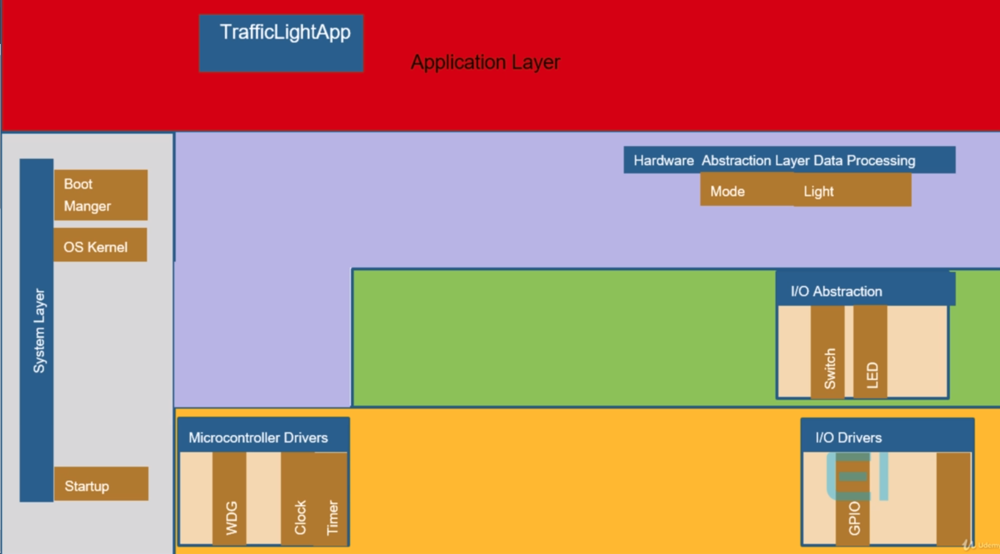

# MCU

[TOC]

## Architecture

### Hardware Architecture

| Processor (CPU) | MCU000 |
| :--------: | :--------:|
|   |   |

- **Processor core**
  - ALU
  - Decoder
  - Registers
  - Pipe line engine
  - Hardware multiplication/division engine
  - Address generation unit

- **MCU**
  - 建議至少512kB Flash Memory
  - 建議至少128 KB SRAM
  - 一般在內部都有RC震盪器

| 主板      |     如果需要VCP，可以買dongle或跳線 |
| :--------: | :--------:|
|     |   

### Software Architecture

- **Application Layer**
  - 例如
    - TrafficLightApp
  - BSP是指**HAL**+**Driver**+**System Layer**
  - DSP是指**Driver**+**System Layer**
  - AP要存取硬體，可以選擇call **HAL API**(板端) 或是**Driver API**(MCU端)
- **Processing Layer**
  - 例如
    - Light
    - Mode
- **Hardware Abstraction Layer**
  - 例如
    - Light
    - Mode
  - Board層
  - 如果你是要使用某顆MCU來製作自己的電路板，你需要親自完成這一層的Code
    - 也就是說，不同的Board有不同的HAL層
    - 比方說，Board A跟Board B有相同的MCU(GPIO Port 1~5)
    - Borad A將GPIO Port A接到LED
      - `#define LED GPIO(1)`
    - Borad B將GPIO Port A接到Button
      - `#define BUTTON GPIO(1)`
  - 這一層的Code有幾個已經規範好的Framework
    - 如果有Framework，那麼HAL以上的Code都不需要更改，只需要抽換HAL library
    - 如ARM Cortex™ Microcontroller Software Interface Standard - `CMSIS`
      - 是 Cortex-M Processor系列的與供應商無關的HAL
      - 使用CMSIS，可以為Processor和外設實現一致且簡單的Software Interface

- **Microcontroller Abstraction Layer**
  - MCU層
  - 比較多硬體協定
  - 通常稱為Driver層
  - 如果你是要使用某顆MCU來製作自己的電路板，你需要至少這一層的Code
    - 也就是說，不同的Board但MCU是相同的，這一層的Code就可以一樣
  - 但是如果你打算使用相同的Processor(ARM Cotex-M4)製作自己的MCU，你需要親自完成這一層的Code
    - Clock
    - Timer
    - GPIO
    - IWDG
- **System Layer**
  - Startup
  - BootManager
  - Kernel

| 整體架構      |     範例 |
| :--------: | :--------:|
|   |  |

### IDE

- Windows
  - **Keil**
- Linux & Mac
  - **Eclipse** + **OpensSTM32**(ST系列MCU) / **AVR**(ATMEL AVR系列MCU)

### BSP

- ST系列MCU或開發板
  - STM32 CubeMx

### Code - ATmega328p

```bash
sudo apt install gcc-avr     # Cross Compiler
sudo apt install avr-libc # ATmega系列MCU的Microcontroller Abstraction Layer Library
sudo apt install avrdude     # 透過Virtual Com Port與ATmega系列MCU內的Bootloader合作，燒錄Bootloader以外的hex檔到MCU用的Software
```

- 設定avrdude使用的Port：`/dev/ttyACM0`
- 設定燒入時的Baudrate：`115200`
- 設定AVR target MCU：`ATmega328P`
- 設定AVR target MCU Clock：`16000000`(使用外部RC震盪器)
- **Hardware Abstggraction Layer** - `GPIO PortB Pin 5`接到`Digital 13 & LED`

| Arduino Uno      |     Schematic |
| :--------: | :--------:|
|  |   |

- **Microcontroller Abstraction Layer** - 將`GPIO PortB Pin 5`

```cpp
#define F_CPU 8000000UL
#include <avr/io.h>
#include <util/delay.h>

int main(void)
{
 // DDRB => *(volatile uint8_t *)0x24
 // PORTB => *(volatile uint8_t *)0x25
 // 
 //   (volatile uint8_t *)0x24  => 將Address 0x24強制轉化為uint8_t型指針
 //   
    //   *(volatile uint8_t *)0x24 |= (1 << PB5) => 對地址為0x24賦值
    // 
 DDRB |= (1 << PB5); /* set PB0 to output */
 while (1)
 {
  PORTB &= ~(1 << PB5); /* LED on */
  _delay_ms(500);
  PORTB |= 1 << PB5; /* LED off */
  _delay_ms(500);
 }
 return 0;
}
```

| ATmega328p Datasheet|  
| :--------: |
| |  
||

### Code - STM8S105C6

- **Application Layer** - `TrafficLightApp.c`

```cpp

static u8 RunningModeTask(void) {...}

static u8 PauseModeTask(void) {...}

void InitTrafficLightApp(void) 
{
 InitLight();
}

u8 TrafficLightMainTask(void) 
{
 if(GetMode() == RUNNING)    RunningModeTask(); 
 else                        PauseModeTask();
}

void TrafficLightMainTask_Activate(void)
{
 EI_krnl_SetTaskExecutionCycle(TrafficLightMainTask_id,EI_DELAY_500MS,EI_PERIOD_10MS);
}
```

- **Processing Layer** - `Light.c`

```cpp
void InitLight(void) 
{
  InitLED(); 
}
```

- **Hardware Abstraction Layer** - `LED.c`

```cpp
#define LED_PORT          GPIOC

#define RED_LED_PIN       GPIO_PIN_3
#define YELLOW_LED_PIN    GPIO_PIN_4
#define GREEN_LED_PIN     GPIO_PIN_5

void InitLED(void) 
{
 GPIO_DeInit(LED_PORT);
 GPIO_Init(LED_PORT, RED_LED_PIN, GPIO_MODE_OUT_PP_LOW_FAST);
 GPIO_Init(LED_PORT, YELLOW_LED_PIN, GPIO_MODE_OUT_PP_LOW_FAST);
 GPIO_Init(LED_PORT, GREEN_LED_PIN, GPIO_MODE_OUT_PP_LOW_FAST);
}
```

- **Microcontroller Abstraction Layer** - `stm8s_gpio.c`

```cpp
typedef enum
{
  GPIO_PIN_0    = ((uint8_t)0x01),  /*!< Pin 0 selected */
  GPIO_PIN_1    = ((uint8_t)0x02),  /*!< Pin 1 selected */
  GPIO_PIN_2    = ((uint8_t)0x04),  /*!< Pin 2 selected */
  GPIO_PIN_3    = ((uint8_t)0x08),  /*!< Pin 3 selected */
  GPIO_PIN_4    = ((uint8_t)0x10),  /*!< Pin 4 selected */
  GPIO_PIN_5    = ((uint8_t)0x20),  /*!< Pin 5 selected */
  GPIO_PIN_6    = ((uint8_t)0x40),  /*!< Pin 6 selected */
  GPIO_PIN_7    = ((uint8_t)0x80),  /*!< Pin 7 selected */
  GPIO_PIN_LNIB = ((uint8_t)0x0F),  /*!< Low nibble pins selected */
  GPIO_PIN_HNIB = ((uint8_t)0xF0),  /*!< High nibble pins selected */
  GPIO_PIN_ALL  = ((uint8_t)0xFF)   /*!< All pins selected */
}GPIO_Pin_TypeDef;

void GPIO_Init(GPIO_TypeDef* GPIOx, GPIO_Pin_TypeDef GPIO_Pin, GPIO_Mode_TypeDef GPIO_Mode)
{
  ...
  GPIOx->CR2 &= (uint8_t)(~(GPIO_Pin));
  ...
}
```

- **SystemLayer/BootManager** -`stm8s.h`

```
#define     __I     volatile const   /*!< defines 'read only' permissions     */
#define     __O     volatile         /*!< defines 'write only' permissions    */
#define     __IO    volatile         /*!< defines 'read / write' permissions  */

typedef struct GPIO_struct
{
  __IO uint8_t ODR; /*!< Output Data Register */
  __IO uint8_t IDR; /*!< Input Data Register */
  __IO uint8_t DDR; /*!< Data Direction Register */
  __IO uint8_t CR1; /*!< Configuration Register 1 */
  __IO uint8_t CR2; /*!< Configuration Register 2 */
}GPIO_TypeDef;

#define GPIOC_BaseAddress       0x500A
#define GPIOC ((GPIO_TypeDef *) GPIOC_BaseAddress)
```


- **SystemLayer/Kernel** -`ei_krnl_initmodules_cfg.c`

```cpp
void EI_krnl_ActivateTasks(void)
{
 TrafficLightMainTask_Activate();
}

void EI_krnl_initmodules(void)
{
 InitTrafficLightApp();
 JudgeModeTask_Activate();
}
```

- **SystemLayer/Kernel** - `ei_krnl_start.c`

```cpp
void EI_krnl_Start (void)
{
  ...
  
  /*initialize Modules*/
  EI_krnl_initmodules();
  
  /* Activate Tasks  */
  EI_krnl_ActivateTasks();
  ...
  
  INFINITE_LOOP
  { /*Execute the Tasks in queue3 inside infinite loop*/
 ei_krnl_Task_Id = EI_krnl_Queue3TaskExecuter (ei_krnl_Task_Id);
  }
}
```

- **SystemLayer/BootManager** - `Startup.s`

```c
...

  call   _EI_boot_manager
  call   _EI_krnl_Start        ; Start kernel
_exit:

...
```

- **SystemLayer/Kernel** -`ei_krnl_schdlr_cfg.c`

```cpp
typedef enum
{
  TrafficLightMainTask_id
  EI_KRNL_NUMBER_OF_TASK
}ei_krnl_Taskid;

#define DeclareTask(t)          extern void t(void)
DeclareTask(TrafficLightMainTask);

typedef void ei_krnl_Task_t (void);
ei_krnl_Task_t *const u8_ei_krnl_TasksFunctionPointer[EI_KRNL_NUMBER_OF_TASK] =
{
 TrafficLightMainTask
};
```

- **SystemLayer/Kernel** - `ei_krnl_schdlr.c`

```cpp
void EI_krnl_SetTaskExecutionCycle(u8 ID, u8 increment, u8 cycle) 
{
   /*Disable timer interrupt before updating cycle and increment */
   EI_krnl_DisableTimerInterrupt();
   /*Update the Task execution period and the delay before starting
    task execution */
   u8_ei_krnl_TaskPeriod[ID] = cycle;
   u8_ei_krnl_TaskPeriodCounter[ID] = increment;
   /*Enable the timer interrupt */
   EI_krnl_EnableTimerInterrupt();
}

u8 EI_krnl_Queue1TaskExecuter(u8 ei_krnl_Task_Id) 
{
    ...
   if (ei_krnl_Task_Id != EI_KRNL_EMPTY_TASK) 
   {
    (*(u8_ei_krnl_TasksFunctionPointer[ei_krnl_Task_Id]))();
   }
 ...
}
```

- **SystemLayer/Kernel** - `ei_krnl_timer.c`

```cpp
/*
 @都是非標準C語法，跟Compiler有關
 @far使用3個字節表示地址，尋址地址範圍0x000000~0xFFFFFF
 @interrupt告訴編譯器和鏈接器，這個是一個中斷服務函數。在編譯和連接時，做相應的中斷服務處理
*/

#ifdef _COSMIC_
 #define FAR  @far
 ...
#elif defined (_RAISONANCE_) /* __RCST7__ */
 #define FAR  far
 ...
#else /*_IAR_*/
 #define FAR  __far
 ...
#endif /* __CSMC__ */

@svlreg @far @interrupt void EI_krnl_Timer_Ovf_interrupt(void)
{
 ...
 /*Execute the task in Queue2*/
 EI_krnl_Queue1TaskExecuter(ei_krnl_Task_Id);
 ...
}
```

## Startup file

- 某些步驟可以自行決定是否跳過
  - Initialize the stacks.
  - Disable all interrupts.
  - Initialize interrupt vector table
  - Copy any initialized data from ROM to RAM
  - Zero the uninitialized data area.
  - Allocate space for the stack. and initialize it
  - Enable interrupts
  - Initialize the heap
  - Initialize the .bss section to zero
  - RAM error check
  - ROM error check
  - Call main.

## BootManager

- 任務
  - 執行startup Code
  - 初始化clock
  - 初始化watch dog timer
- Copy data from flash to ram
- Memory map
  - `.text` Code( Read Only)
  - `.rodata` const & string (Read Only)
  - `.data` initialized global & static variables
  - `.bss` uninitialized global & static variables
  - `stack` local variables & return address
  - `Heap` dynamic memory (calloc & malloc)
- 這些定義在linker script，而linker script又是定義在compiler中不同的mcu內
  - Startup File 通常也是compiler自動產生，但允許修改
