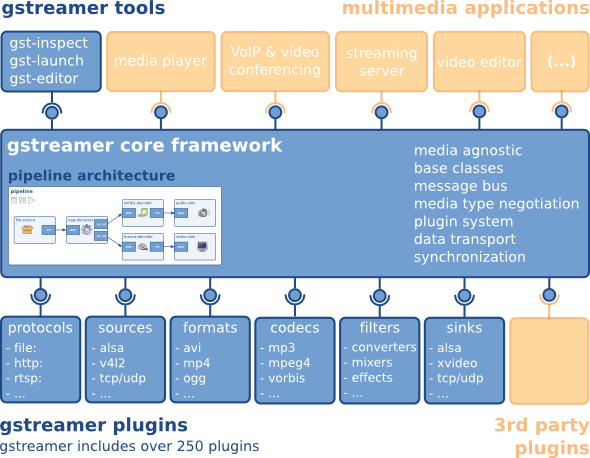
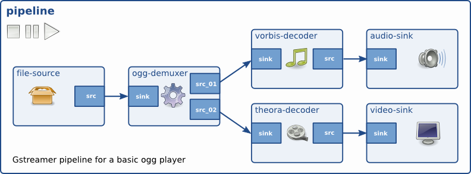
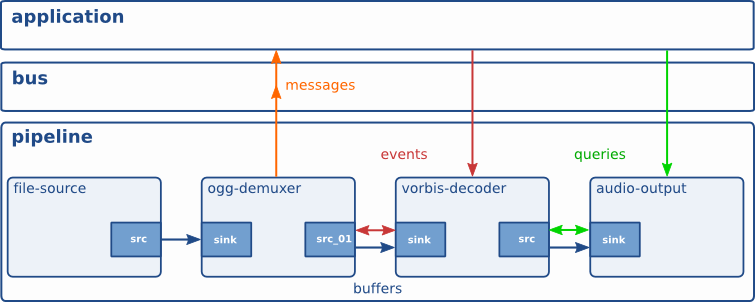

# GStreamer

[TOC]

## 前言

pipeline
Bins
elements
 source pads
 sink pads
GstBuffer  from sources to sinks ((downstream)
GstEvent upstream and downstream , 可以從application to element

queries
messages







## code

$(CC) --silent --tag=CC --mode=link  -o $@ -lrt  -ldl

```bash
  gst_init (&argc, &argv);
  gst_version (&major, &minor, &micro, &nano);
 GST_VERSION_MAJOR
 GST_VERSION_MINOR
 GST_VERSION_MICRO
GstElement *element;
element = gst_element_factory_make ("fakesrc", "source");
 gst_object_unref (GST_OBJECT (element));
 
  gchar *name;
  g_object_get (G_OBJECT (element), "name", &name, NULL);
  g_free (name);

gst_pipeline_new 
gst_pipeline_get_bus
gst_bus_add_watch
g_main_loop_new 
g_main_loop_run
  
gst_pipeline_new
bus/message pipeline
 message handler - mainloop

      gchar  *debug;
      GError *error;

      gst_message_parse_error (msg, &error, &debug);
      g_free (debug);

      g_printerr ("Error: %s\n", error->message);
      g_error_free (error);

End-of-stream 
Error
Tags
State-changes
Buffering
Element messages
Application-specific messages

 gst_bin_add_many
 gst_element_link 
 gst_element_link_many 
 g_warning
 
bus = gst_pipeline_get_bus (GST_PIPELINE (pipeline);
gst_bus_add_signal_watch (bus);
g_signal_connect (bus, "message::error", G_CALLBACK (cb_message_error), NULL);
g_signal_connect (bus, "message::eos", G_CALLBACK (cb_message_eos), NULL);


gst_element_get_static_pad (decoder, "sink");

  gst_pad_link (pad, sinkpad);

pad = always  sometimes未知來源 ,on request聚合器 ＆Tee elements（複製）


  gst_element_link (source, demuxer);
  gst_element_link_many (decoder, conv, sink, NULL);
  g_signal_connect (demuxer, "pad-added", G_CALLBACK (on_pad_added), decoder);


  pad = gst_element_get_request_pad (tee, "src%d");
name = gst_pad_get_name (pad);

gst_element_get_pad_list()
調用gst_pad_get_parent()可以獲得指定襯墊所屬的元件，該函數的返回值是一個指向GstElement的指針。

gst_element_get_compatible_pad (mux, tolink_pad);
  gst_pad_link (tolinkpad, pad);

  gst_element_set_state
  GST_STATE_NULL
  GST_STATE_READY
  GST_STATE_PAUSED
  GST_STATE_PLAYING

Capabilities
目標
Autoplugging
Compatibility detection
Metadata
Filtering ：audioconvert, audioresample, ffmpegcolorspace or videoscale

  const GstStructure *str;
  str = gst_caps_get_structure (caps, 0);
  if (!gst_structure_get_int (str, "width", &width) ||
      !gst_structure_get_int (str, "height", &height)) {
    g_print ("No width/height available\n");
    return;
  }
gst_element_link_filtered (demuxer, decoder, caps);

struct _GstCaps {
  gchar *name; /* the name of this caps */
  guint16 id; /* type id (major type) */
  guint refcount; /* caps are refcounted */
  GstProps *properties; /* properties for this capability */
  GstCaps *next; /* caps can be chained together */
};

  gst_caps_get_name (cap),
  gst_caps_get_mime (cap));
在GStreamer應用程序中使用的箱櫃主要有兩種類型：

    GstPipeline管道是最常用到的容器，對於一個GStreamer應用程序來講，其頂層箱櫃必須是一條管道。
    GstThread線程的作用在於能夠提供同步處理能力，如果GStreamer應用程序需要進行嚴格的音視頻同步，一般都需要用到這種類型的箱櫃。
    
GstElement *thread, *pipeline;
//創建線程對象，同時為其指定唯一的名稱。
thread = gst_element_factory_make ("thread", NULL);
//根據給出的名稱，創建一個特定的管道對象。
pipeline = gst_pipeline_new ("pipeline_name");
箱櫃（bin）是GStreamer框架中的容器元件，它通常被用來容納其它的元件對象，但由於其自身也是一個GstElement對象

而要從箱櫃中找到特定的元件也很容易，可以藉助gst_bin_get_by_name()函數實現： 
GstElement *element;
element = gst_bin_get_by_name (GST_BIN (bin), "decoder");
gst_bin_remove()
由於GStreamer框架中的一個箱櫃能夠添加到另一個箱櫃之中，因此有可能會出現箱櫃嵌套的情況

具有精靈襯墊的箱櫃在行為上與元件是完全相同的，所有元件具有的屬性它都具有，所有針對元件能夠進行的操作也同樣能夠針對箱櫃進行，因此在GStreamer應用程序中能夠像使用元件一樣使用這類箱櫃。下面的代碼示範瞭如何為箱櫃添加一個精靈襯墊：

GstElement *bin;
GstElement *element;
element = gst_element_factory_create ("mad", "decoder");
bin = gst_bin_new ("bin_name");
gst_bin_add (GST_BIN (bin), element);
gst_element_add_ghost_pad (bin, gst_element_get_pad (element, "sink"), "sink");
示範瞭如何將兩個元件通過襯墊連接起來
//連接
gst_pad_link (srcpad, sinkpad);
//斷開
gst_pad_unlink (srcpad, sinkpad);

  
 

別：初級

肖文鵬,自由軟件愛好者

2004年6月01日

    GStreamer是GNOME桌面環境下用來構建流媒體應用的編程框架（framework），其目標是要簡化音/視頻應用程序的開發，目前已經能夠被用來處理像MP3、Ogg、MPEG1、MPEG2、AVI、 Quicktime等多種格式的多媒體數據。

一、基本概念

GStreamer作為GNOME桌面環境推薦的流媒體應用框架，採用了基於插件（plugin）和管道（pipeline）的體系結構，框架中的所有的功能模塊都被實現成可以插拔的組件（component），並且在需要的時候能夠很方便地安裝到任意一個管道上，由於所有插件都通過管道機制進行統一的數據交換，因此很容易利用已有的各種插件“組裝”出一個功能完善的多媒體應用程序。

1.1元件處理

對於需要應用GStreamer框架的程序員來講，GstElement是一個必須理解的概念，因為它是組成管道的基本構件，也是框架中所有可用組件的基礎，這也難怪GStreamer框架中的大部分函數都會涉及到對GstElement對象的操作。從GStreamer自身的觀點來看，GstElement可以描述為一個具有特定屬性的黑盒子，它通過連接點（link point）與外界進行交互，向框架中的其餘部分錶徵自己的特性或者功能。

按照各自功能上的差異，GStreamer又將GstElement細分成如下幾類：

    Source Element數據源元件只有輸出端，它僅能用來產生供管道消費的數據，而不能對數據做任何處理。一個典型的數據源元件的例子是音頻捕獲單元，它負責從聲卡讀取原始的音頻數據，然後作為數據源提供給其它模塊使用。
    Filter Element過濾器元件既有輸入端又有輸出端，它從輸入端獲得相應的數據，並在經過特殊處理之後傳遞給輸出端。一個典型的過濾器元件的例子是音頻編碼單元，它首先從外界獲得音頻數據，然後根據特定的壓縮算法對其進行編碼，最後再將編碼後的結果提供給其它模塊使用。
    Sink Element接收器元件只有輸入端，它僅具有消費數據的能力，是整條媒體管道的終端。一個典型的接收器元件的例子是音頻回放單元，它負責將接收到的數據寫到聲卡上，通常這也是音頻處理過程中的最後一個環節。

圖1將有助於你更好地理解數據源元件、過濾器元件和接收器元件三者的區別，同時也不難看出它們是如何相互配合形成管道的：

圖1

需要注意的是，過濾器元件的具體形式是非常靈活的，GStreamer並沒有嚴格規定輸入端和輸出端的數目，事實上它們都可以是一個或者多個。圖2是一個AVI分離器的基本結構，它能夠將輸入數據分離成單獨的音頻信息和視頻信息，用於實現該功能的過濾器元件很明顯只具有一個輸入端，但卻需要有兩個輸出端。

圖2

要想在應用程序中創建GstElement對象，唯一的辦法是藉助於工廠對象GstElementFactory。由於GStreamer框架提供了多種類型的GstElement對象，因此對應地提供了多種類型的GstElementFactory對象，它們是通過特定的工廠名稱來進行區分的。例如，下面的代碼通過gst_element_factory_find()函數獲得了一個名為mad的工廠對象，它之後可以用來創建與之對應的MP3解碼器元件：

 GstElementFactory *factory;
factory = gst_element_factory_find ("mad");


成功獲得工廠對象之後，接下來就可以通過gst_element_factory_create()函數來創建特定的GstElement對象了，該函數在調用時有兩個參數，分別是需要用到的工廠對象，以及即將創建的元件名稱。元件名稱可以用查詢的辦法獲得，也可以通過傳入空指針（NULL）來生成工廠對象的默認元件。下面的代碼示範瞭如何利用已經獲得的工廠對象，來創建名為decoder的MP3解碼器元件：

GstElement *element;
element = gst_element_factory_create (factory, "decoder");


當創建的GstElement不再使用的時候，還必須調用gst_element_unref()函數釋放其占用的內存資源：

gst_element_unref (element);


GStreamer使用了與GObject相同的機制來對屬性（property）進行管理，包括查詢（query）、設置（set）和讀取（get）等。所有的GstElement對像都需要從其父對象GstObject那裡繼承名稱（name）這一最基本的屬性，這是因為像gst_element_factory_make()和gst_element_factory_create()這樣的函數在創建工廠對象和元件對象時都會用到名稱屬性，通過調用gst_object_set_name()和gst_object_get_name()函數可以設置和讀取GstElement對象的名稱屬性。

1.2襯墊處理

襯墊（pad）是GStreamer框架引入的另外一個基本概念，它指的是元件（element）與外界的連接通道，對於框架中的某個特定元件來說，其能夠處理的媒體類型正是通過襯墊暴露給其它元件的。成功創建GstElement對象之後，可以通過gst_element_get_pad()獲得該元件的指定襯墊。例如，下面的代碼將返回element元件中名為src的襯墊：

GstPad *srcpad;
srcpad = gst_element_get_pad (element, "src");


如果需要的話也可以通過gst_element_get_pad_list()函數，來查詢指定元件中的所有襯墊。例如，下面的代碼將輸出element元件中所有襯墊的名稱：

GList *pads;
pads = gst_element_get_pad_list (element);
while (pads) {
  GstPad *pad = GST_PAD (pads->data);
  g_print ("pad name is: %s\n", gst_pad_get_name (pad));
  pads = g_list_next (pads);
}


與元件一樣，襯墊的名稱也能夠動態設置或者讀取，這是通過調用gst_pad_get_name ()和gst_pad_set_name()函數來完成的。所有元件的襯墊都可以細分成輸入襯墊和輸出襯墊兩種，其中輸入襯墊只能接收數據但不能產生數據，而輸出襯墊則正好相反，只能產生數據但不能接收數據，利用函數gst_pad_get_direction()可以獲得指定襯墊的類型。 GStreamer框架中的所有襯墊都必然依附於某個元件之上，調用gst_pad_get_parent()可以獲得指定襯墊所屬的元件，該函數的返回值是一個指向GstElement的指針。襯墊從某種程度上可以看成是元件的代言人，因為它要負責向外界描述該元件所具有的能力。 GStreamer框架提供了統一的機制來讓襯墊描述元件所具有的能力（capability），這是藉助數據結構_GstCaps來實現的：

struct _GstCaps {
  gchar *name; /* the name of this caps */
  guint16 id; /* type id (major type) */
  guint refcount; /* caps are refcounted */
  GstProps *properties; /* properties for this capability */
  GstCaps *next; /* caps can be chained together */
};


以下是對mad元件的能力描述，不難看出該元件中實際包含sink和src兩個襯墊，並且每個襯墊都帶有特定的功能信息。名為sink的襯墊是mad元件的輸入端，它能夠接受MIME類型為audio/mp3的媒體數據，此外還具有layer、bitrate和framed三種屬性。名為src的襯墊是mad元件的輸出端，它負責產生MIME類型為audio/raw媒體數據，此外還具有format、depth、rate和channels等多種屬性。

Pads:
  SINK template: ’sink’
    Availability: Always
    Capabilities:
    ’mad_sink’:
      MIME type: ’audio/mp3’:
  SRC template: ’src’
    Availability: Always
    Capabilities:
      ’mad_src’:
        MIME type: ’audio/raw’:
        format: String: int
        endianness: Integer: 1234
        width: Integer: 16
        depth: Integer: 16
        channels: Integer range: 1 - 2
        law: Integer: 0
        signed: Boolean: TRUE
        rate: Integer range: 11025 - 48000


準確地說，GStreamer框架中的每個襯墊都可能對應於多個能力描述，它們能夠通過函數gst_pad_get_caps()來獲得。例如，下面的代碼將輸出pad襯墊中所有能力描述的名稱及其MIME類型：

GstCaps *caps;
caps = gst_pad_get_caps (pad);
g_print ("pad name is: %s\n", gst_pad_get_name (pad));
while (caps) {
  g_print (" Capability name is %s, MIME type is %s\n",
  gst_caps_get_name (cap),
  gst_caps_get_mime (cap));
  caps = caps->next;
}


1.3箱櫃

箱櫃（bin）是GStreamer框架中的容器元件，它通常被用來容納其它的元件對象，但由於其自身也是一個GstElement對象，因此實際上也能夠被用來容納其它的箱櫃對象。利用箱櫃可以將需要處理的多個元件組合成一個邏輯元件，由於不再需要對箱櫃中的元件逐個進行操作，因此能夠很容易地利用它來構造更加複雜的管道。在GStreamer框架中使用箱櫃還有另外一個優點，那就是它會試著對數據流進行優化，這對於多媒體應用來講是很具吸引力的。

圖3描述了箱櫃在GStreamer框架中的典型結構：

圖3

在GStreamer應用程序中使用的箱櫃主要有兩種類型：

    GstPipeline管道是最常用到的容器，對於一個GStreamer應用程序來講，其頂層箱櫃必須是一條管道。
    GstThread線程的作用在於能夠提供同步處理能力，如果GStreamer應用程序需要進行嚴格的音視頻同步，一般都需要用到這種類型的箱櫃。

GStreamer框架提供了兩種方法來創建箱櫃：一種是藉助工廠方法，另一種則是使用特定的函數。下面的代碼示範瞭如何使用工廠方法創建線程對象，以及如何使用特定函數來創建管道對象：

GstElement *thread, *pipeline;
//創建線程對象，同時為其指定唯一的名稱。
thread = gst_element_factory_make ("thread", NULL);
//根據給出的名稱，創建一個特定的管道對象。
pipeline = gst_pipeline_new ("pipeline_name");


箱櫃成功創建之後，就可以調用gst_bin_add()函數將已經存在的元件添加到其中來了：

GstElement *element;
GstElement *bin;
bin = gst_bin_new ("bin_name");
element = gst_element_factory_make ("mpg123", "decoder");
gst_bin_add (GST_BIN (bin), element);


而要從箱櫃中找到特定的元件也很容易，可以藉助gst_bin_get_by_name()函數實現：

GstElement *element;
element = gst_bin_get_by_name (GST_BIN (bin), "decoder");


由於GStreamer框架中的一個箱櫃能夠添加到另一個箱櫃之中，因此有可能會出現箱櫃嵌套的情況，gst_bin_get_by_name()函數在查找元件時會對嵌套的箱櫃作遞歸查找。元件有添加到箱櫃之中以後，在需要的時候還可以從中移出，這是通過調用gst_bin_remove()函數來完成的：

GstElement *element;
gst_bin_remove (GST_BIN (bin), element);


如果仔細研究一下圖3中描述的箱櫃，會發現它沒有屬於自己的輸入襯墊和輸出襯墊，因此顯然是無法作為一個邏輯整體與其它元件交互的。為了解決這一問題，GStreamer引入了精靈襯墊（ghost pad）的概念，它是從箱櫃裡面所有元件的襯墊中推舉出來的，通常來講會同時選出輸入襯墊和輸出襯墊，如圖4所示：

圖4

具有精靈襯墊的箱櫃在行為上與元件是完全相同的，所有元件具有的屬性它都具有，所有針對元件能夠進行的操作也同樣能夠針對箱櫃進行，因此在GStreamer應用程序中能夠像使用元件一樣使用這類箱櫃。下面的代碼示範瞭如何為箱櫃添加一個精靈襯墊：

GstElement *bin;
GstElement *element;
element = gst_element_factory_create ("mad", "decoder");
bin = gst_bin_new ("bin_name");
gst_bin_add (GST_BIN (bin), element);
gst_element_add_ghost_pad (bin, gst_element_get_pad (element, "sink"), "sink");


 回頁首


二、元件連接

在引入了元件和襯墊的概念之後，GStreamer對多媒體數據的處理過程就變得非常清晰了：通過將不同元件的襯墊依次連接起來構成一條媒體處理管道，使數據在流經管道的過程能夠被各個元件正常處理，最終實現特定的多媒體功能。

圖１就描述了一條很簡單的管道，它由三個基本元件構成：數據源元件只負責產生數據，它的輸出襯墊與過濾器元件的輸入襯墊相連；過濾器元件負責從自己的輸入襯墊中獲取數據，並在經過特定的處理之後，將結果通過輸出襯墊傳給與之相連的接收器元件；接收器元件只負責接收數據，它的輸入襯墊與過濾器元件的輸出襯墊相連，負責對最終結果進行相應的處理。

GStreamer框架中的元件是通過各自的襯墊連接起來的，下面的代碼示範瞭如何將兩個元件通過襯墊連接起來，以及如何在需要的時候斷開它們之間的連接：

GstPad *srcpad, *sinkpad;
srcpad = gst_element_get_pad (element1, "src");
sinpad = gst_element_get_pad (element2, "sink");
//連接
gst_pad_link (srcpad, sinkpad);
//斷開
gst_pad_unlink (srcpad, sinkpad);


如果需要建立起連接的元件都只有一個輸入襯墊和一個輸出襯墊，那麼更簡單的做法是調用gst_element_link()函數直接在它們之間建立起連接，或者調用gst_element_unlink()函數斷開它們之間的連接：

//連接
gst_element_link (element1, element2);
//斷開
gst_element_unlink (element1, element2);


    NULL這是所有元件的默認狀態，表明它剛剛創建，還沒有開始做任何事情。
    READY表明元件已經做好準備，隨時可以開始處理流程。
    PAUSED表明元件因某種原因暫時停止處理數據。
    PLAYING表明元件正在進行數據處理。

所有的元件都從NULL狀態開始，依次經歷NULL、READY、PAUSED、PLAYING等狀態間的轉換。元件當前所處的狀態可以通過調用gst_element_set_state()函數進行切換：
GstElement *bin;
/*創建元件，並將其連接成箱櫃bin */
gst_element_set_state (bin, GST_STATE_PLAYING);

默認情況下，管道及其包含的所有元件在創建之後將處於NULL狀態，此時它們不會進行任何操作。當管道使用完畢之後，不要忘記重新將管道的狀態切換回NULL狀態，讓其中包含的所有元件能夠有機會釋放它們正在佔用的資源。

管道真正的處理流程是從第一次將其切換到READY狀態時開始的，此時管道及其包含的所有元件將做好相應的初始化工作，來為即將執行的數據處理過程做好準備。對於一個典型的元件來講，處於READY狀態時需要執行的操作包括打開媒體文件和音頻設備等，或者試圖與位於遠端的媒體服務器建立起連接。

處於READY狀態的管道一旦切換到PLAYING狀態，需要處理的多媒體數據就開始在整個管道中流動，並依次被管道中包含的各個元件進行處理，從而最終實現管道預先定義好的某種多媒體功能。
GStreamer框架也允許將管道直接從NULL狀態切換到PLAYING狀態，而不必經過中間的READY狀態。

正處於播放狀態的管道能夠隨時切換到PAUSED狀態，暫時停止管道中所有數據的流動，並能夠在需要的時候再次切換回PLAYING狀態。如果需要插入或者更改管道中的某個元件，必須先將其切換到PAUSED或者NULL狀態，元件在處於PAUSED狀態時並不會釋放其占用的資源。

由於沒有用到線程，因此必須通過不斷調用gst_bin_iterate()函數的辦法，來判斷管道的處理過程會在何時結束：

while (gst_bin_iterate (GST_BIN (pipeline)));
只要管道內還會繼續有新的事件產生，gst_bin_iterate()函數就會一直返回TRUE，只有當整個處理過程都結束的時候，該函數才會返回FALSE，此時就該終止管道並釋放佔用的資源了： 

Manually adding or removing data from/to a pipeline
 synchronization, thread-safety and other things
fakesink fakesrc - old version
appsrc appsink - new version

cap:is-live  min-latency  max-latency format = GST_FORMAT_TIME
    non-live format = GST_FORMAT_TIME or GST_FORMAT_BYTES
event : SEGMENT (appsrc will push) 計算接收了多少時間用
gst_app_src_push_buffer
"max-bytes" property “enough-data” signal
 “need-data” signal
```

錄wav
gst-launch alsasrc  ! audioconvert ! audio/x-raw-int,channel
s=1,depth=16,width=16,rate=16000 !audioresample ! wavenc ! filesink location=mic
.wav

測試播放
gst-launch audiotestsrc ! audioconvert ! audioresample ! alsasink

播放檔案
gst-launch filesrc location=toto.ogg ! decodebin ! audioconvert ! audioresample ! alsasink

即時播放錄音
gst-launch -v alsasrc ! alsasink sync=FALSE

播放mp3
gst-launch-0.10 -v filesrc location=/response.mp3 ! flump3dec ! alsasink

播放url
gst-launch-0.10 playbin2 uri=<http://kiis-fm.akacast.akamaistream.net/7/572/19773/v1/auth.akacast.akamaistream.net/kiis-fm>

null->ready->pause->playing
playing->pause>ready->null

Sources : filesrc | alsasrc | appsrc
Sink: filesink | alsasink | appsink
Encoder:
Decnoder: decodebin
Converter:
Bin: playbin

Gobject <- Element <- Bin <- Pipeline
