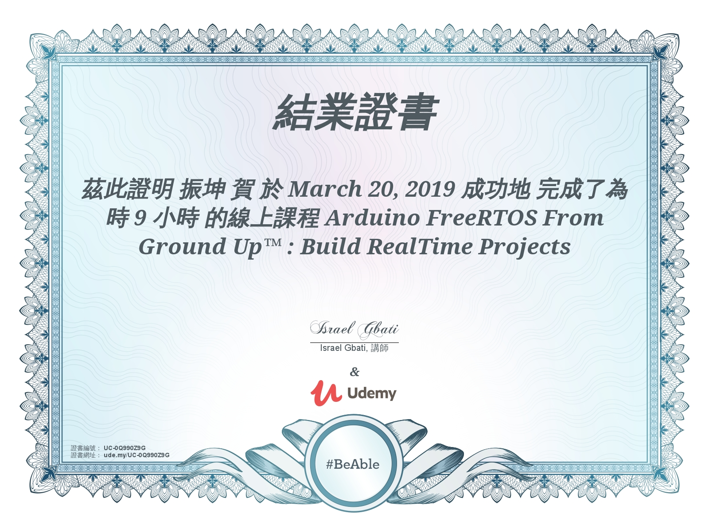

# 資源

[TOC]

## 文章

- [ ] [Jserv](http://wiki.csie.ncku.edu.tw/embedded/schedule)
- [ ] [ACPI 電腦的七種的運作狀況](https://www.coolaler.com/threads/acpi.247076/)
- [ ] [ACPI與UEFI](https://www.getit01.com/p2018012525893464/)
- [ ] [Jserv's blog: 深入理解 Linux 2.6 的 initramfs 機制 (上)](http://blog.linux.org.tw/~jserv/archives/001954.html)
- [ ] [單片機ISP、IAP、ICP、JTAG、SWD編程技術介紹](https://kknews.cc/zh-tw/tech/5axnjy6.html)
- [ ] [What is the sequence loading linux kernel module on startup? How priority is set to them?](https://unix.stackexchange.com/questions/90027/what-is-the-sequence-loading-linux-kernel-module-on-startup-how-priority-is-set)
- [ ] [How does Linux determine the order of module init calls?](https://stackoverflow.com/questions/10368837/how-does-linux-determine-the-order-of-module-init-calls)
- [ ] [Linux kernel features](https://en.wikipedia.org/wiki/Category:Linux_kernel_features)
- [ ] [使用 SysRq 鍵讓當機的 Linux 安全地重新開機](https://blog.gtwang.org/linux/safe-reboot-of-linux-using-magic-sysrq-key/)
- [ ] [USB模块中的控制器和PHY](https://blog.csdn.net/kris_fei/article/details/80893535)
- [ ] [使用RW讀寫Smbus device](http://white5168.blogspot.com/2012/09/rwsmbus-device.html#.XITuZIgzaUk)
- [ ] [linux/OTG – Gateworks](http://trac.gateworks.com/wiki/linux/OTG#g_multi)
- [ ] [OpenWrt Project: USB Guest configuration](https://openwrt.org/docs/guide-user/hardware/usb_gadget)
- [ ] [usb網絡驅動](https://zhiwei.li/text/2016/07/03/usb%E7%BD%91%E7%BB%9C%E9%A9%B1%E5%8A%A8/)
- [ ] [Host communication · inversepath/usbarmory Wiki](https://github.com/inversepath/usbarmory/wiki/Host-communication)

## Course

- [ ]  [Embedded Systems Programming on ARM Cortex-M3](https://www.udemy.com/embedded-system-programming-on-arm-cortex-m3m4/learn/v4/overview)
  - [ ]  690分

- [ ]  [Mastering Microcontroller with Embedded Driver](https://www.udemy.com/mastering-microcontroller-with-peripheral-driver-development/learn/v4/overview)
  - [ ]  1110分

- [ ] [Embedded Linux Step by Step using Beaglebone Black](https://www.udemy.com/embedded-linux-step-by-step-using-beaglebone/learn/v4/overview)

- [ ] [Mastering Microcontroller : TIMERS, PWM, CAN, RTC,LOW POWER](https://www.udemy.com/microcontroller-programming-stm32-timers-pwm-can-bus-protocol/learn/v4/overview)

- [ ] [ARM Raspberry Pi Assembly Language From Ground Up™](https://www.udemy.com/arm-raspberry-pi-assembly-programming-from-ground-uptm/learn/v4/overview)

- [x] [An RTOS Based Software Development for Embedded Systems](https://www.udemy.com/an-rtos-based-software-development-for-embedded-systems/learn/v4/overview)

- [x] [Arduino FreeRTOS From Ground Up™ : Build RealTime Projects](https://www.udemy.com/arduino-freertos/learn/v4/overview)
