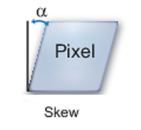

# 相機校準和3D重建

[TOC]

## 1. Camera 成像原理

- 漫射

- 針孔攝像頭
  - 若孔洞越大，通過的光線越多則成像就越模糊
  - 需要較長的曝光時間

| 投影      |    關係 | 等效  |
| :--------: | :--------:| :--: |
|   |  |     |

## 2. 線性代數

### 內積

$$\vec A \cdot \vec B = \sum_{i=1}^{n}a_ib_i$$

- 在$R^n(n \leq 3)$v下，可以理解為
$$\vec A \cdot \vec B = \left \|  \vec A\right \|\left \|  \vec B\right \| cos \theta$$

> **證明:**
> $$\vec C = \vec A - \vec B$$
> $$\left \|  \vec C\right \|^2= \left \|  \vec A\right \|^2 + \left \|  \vec B\right \|^2 - 2 \left \|  \vec A\right \| \left \|  \vec B\right \|cos\theta$$
> $$\vec C \cdot \vec C= \vec A \cdot \vec A + \vec B \cdot \vec B - 2 \left \|  \vec A\right \| \left \|  \vec B\right \|cos\theta$$
> 同時$$\vec C \cdot \vec C= (\vec A - \vec B) \cdot (\vec A - \vec B) $$
> $$= \vec A \cdot \vec A + \vec B \cdot \vec B - 2 (\vec A \cdot \vec B)$$

> **補充：餘弦定理**
$$ c = acos(\beta) + bcos(\alpha) $$
$$ c^2 = ac \cos(\beta) + bc \cos(\alpha) $$
$$ a^2 = ac \cos(\beta) + ab \cos(\gamma) $$
$$ b^2 = bc \cos(\alpha) + ab \cos(\gamma) $$
$$ a^2 + b^2 = ac \cos(\beta) + ab \cos(\gamma) +  bc \cos(\alpha) + ab \cos(\gamma)  $$
$$ a^2 + b^2 = [ac \cos(\beta)  +  bc \cos(\alpha)] + [ab \cos(\gamma) +ab \cos(\gamma)] $$
$$ a^2 + b^2 = c^2 + 2ab \cos(\gamma) $$
$$ c^2 = a^2 + b^2 - 2ab \cos(\gamma) $$

### 外積

$$\vec u=(u_1,u_2,u_3)$$
$$\vec v=(v_1,v_2,v_3)$$
$$\vec u\times \vec v=(u_2v_3 - u_3v_2,  u_3v_1-u_1v_3 , u_1v_2 - u_2v_1) $$
$$
=\begin{bmatrix}u_2v_3 - u_3v_2\\ u_3v_1-u_1v_3\\ u_1v_2 - u_2v_1\end{bmatrix} =
\begin{bmatrix}0 & -u_3 & u_2 \\ u_3 &  0 & -u1\\ -u_2 & u_1 & 0\end{bmatrix}
\begin{bmatrix}v1\\ v2\\ v3\end{bmatrix} =
[u]_\times \vec v
$$

### 投影

$$Proj_{\vec b}(\vec a) = \frac{\vec a \cdot \vec @(Pegatron)b}{\vec b \cdot \vec b}\vec b$$

### Gram-Schmidt正交化

$$\vec \beta_1 = \vec v_1$$
$$\vec \beta_2 = \vec v_2 - \frac{\vec v_2 \cdot \vec \beta_1}{\vec \beta_1 \cdot \vec \beta_1}\vec \beta_1$$
$$\vec \beta_3 = \vec v_3 - \frac{\vec v_3 \cdot \vec \beta_1}{\vec \beta_1 \cdot \vec \beta_1}\vec \beta_1 - \frac{\vec v_3 \cdot \vec \beta_2}{\vec \beta_2 \cdot \vec \beta_2}\vec \beta_2$$
$$\begin{matrix}.\\ .\\ .\end{matrix}$$
$$\vec \beta_n = \vec v_n - \sum_{i=1}^{n-1} proj_{\vec \beta_i}\vec v_n$$

### QR分解

- 移項
$$\vec v_1 = \vec \beta_1$$
$$\vec v_2 = \vec \beta_2 + \frac{\vec v_2 \cdot \vec \beta_1}{\vec \beta_1 \cdot \vec \beta_1}\vec \beta_1$$
$$\vec v_3 = \vec \beta_3 + \frac{\vec v_3 \cdot \vec \beta_1}{\vec \beta_1 \cdot \vec \beta_1}\vec \beta_1 + \frac{\vec v_3 \cdot \vec \beta_2}{\vec \beta_2 \cdot \vec \beta_2}\vec \beta_2$$
$$\begin{matrix}.\\ .\\ .\end{matrix}$$
$$\vec v_n = \vec \beta_n + \sum_{i=1}^{n-1} proj_{\vec \beta_i}\vec v_n$$

- 寫成矩陣

$$
\begin{bmatrix}\vec v_1 & \vec v_2 & \vec v_3 & ... & \vec v_n\end{bmatrix} =
\begin{bmatrix}\vec \beta_1 & \vec \beta_2 & \vec \beta_3 & ... & \vec \beta_n\end{bmatrix}
\begin{bmatrix}
1 &  \frac{\vec v_2 \cdot \vec \beta_1}{\vec \beta_1 \cdot \vec \beta_1}&  \frac{\vec v_3 \cdot \vec \beta_1}{\vec \beta_1 \cdot \vec \beta_1} & ... & 1\\
 0 &  1 &  \frac{\vec v_3 \cdot \vec \beta_2}{\vec \beta_2 \cdot \vec \beta_2} & ... & 1\\
 0 & 0 & 1 & ... & 1\\
 ... & ... & ... & ... & 1\\
 0 & 0 & 0 & 0 & 1
 \end{bmatrix}
$$
$$
\begin{bmatrix}\vec v_1 & \vec v_2 & \vec v_3 & ... & \vec v_n\end{bmatrix} =
\begin{bmatrix}
\frac{\vec \beta_1}{\left \|  \vec \beta_1\right \|} &
\frac{\vec \beta_2}{\left \|  \vec \beta_2\right \|} &
\frac{\vec \beta_3}{\left \|  \vec \beta_3\right \|} &
... &
\frac{\vec \beta_n}{\left \|  \vec \beta_n\right \|}
\end{bmatrix}
\begin{bmatrix}
\left \|  \vec \beta_1\right \| &
\frac{\vec v_2 \cdot \vec \beta_1}{\vec \beta_1 \cdot \vec \beta_1}\left \|  \vec \beta_1\right \|&
\frac{\vec v_3 \cdot \vec \beta_1}{\vec \beta_1 \cdot \vec \beta_1}\left \|  \vec \beta_1\right \| &
... & 1
\\
0 & \left \|  \vec \beta_2\right \| &
\frac{\vec v_3 \cdot \vec \beta_2}{\vec \beta_2 \cdot \vec \beta_2}\left \|  \vec \beta_2\right \|  &
... & 1
\\
0 & 0 & \left \|  \vec \beta_3\right \|  & ... & 1\\
 ... & ... & ... & ... & 1\\
 0 & 0 & 0 & 0 & \left \|  \vec \beta_n\right \|
 \end{bmatrix}
$$
$$
\begin{bmatrix}\vec v_1 & \vec v_2 & \vec v_3 & ... & \vec v_n\end{bmatrix} =
\begin{bmatrix}
\vec u_1 & \vec u_2 & \vec u_3 & ... & \vec u_n
\end{bmatrix}
\begin{bmatrix}
\left \|  \vec \beta_1\right \| &
\vec v_2 \cdot \vec u_1&
\vec v_3 \cdot \vec u_1 &
... & 1
\\
0 & \left \|  \vec \beta_2\right \| &
\vec v_3 \cdot \vec u_2  &
... & 1
\\
0 & 0 & \left \|  \vec \beta_3\right \|  & ... & 1\\
 ... & ... & ... & ... & 1\\
 0 & 0 & 0 & 0 & \left \|  \vec \beta_n\right \|
 \end{bmatrix}
$$

### 線性關係

- 廣義
  - 某數學函數或數量關係的函數圖形呈現為一條直線或線段則為線性關係
  - 即是可以表示為$ L ( x ) = k x + b$的形式
  - $y_1 = 3 x$， $y_2 = \frac 1 3x$和 $y_3 = 3 x + 1$都屬於這種意義下的線性函數
- 狹義(數學)
  - 可加性： $L ( x + t ) = L ( x ) + L ( t )$
  - 一次齊次性： $L ( m x ) = m L ( x )$
  - $y_1 = 3 x$， $y_2 = \frac 1 3x$都屬於這種意義下的線性函數
  - 但$y_3 = 3 x + 1$不是

### 線性映射 & 變換矩陣

- 線性變換=線性映射
- 線性算子=從向量空間A內的向量映射到同一個空間A內(自同態)的線性映射
- 保持向量加法和純量乘法
- 變換前是直線的，變換後依然是直線
- 直線比例保持不變
- 變換前是原點的，變換後依然是原點
- T是一個把$R^n$映射到$R^m$的線性變換，且$x$是一個具有$n$個元素的列向量
$$T(\vec x) = A \vec x$$
- 我們把$m×n$的矩陣$A$，稱為$T$的變換矩陣

#### 旋轉

- 逆時針旋轉θ度

$$
\begin{bmatrix}x'\\ y'\end{bmatrix} =
\begin{bmatrix}cosθ & -sinθ\\ sinθ & cosθ\end{bmatrix}
\begin{bmatrix}x\\ y\end{bmatrix}
$$

> 證明：
>
> 1. 令 $r2 = x2 + y2$，且 $r > 0$，則：
> $x = r cos(α),  \quad y = rsin(α)$
> $x' = rcos(α + θ), \quad y' = rsin(α + θ)$

> 2. 根據合角公式：
> $sin(α+θ) = sin(α)cos(θ) + cos(α)sin(θ)$
> $cos(α+θ) = cos(α)cos(θ) - sin(α)sin(θ)$
> 得到 $x'$ 及 $y'$：
> $x' = r(cos(α)cos(θ) - sin(α)sin(θ)) = rcos(α)cos(θ) - rsin(α)sin(θ)$
> $y' = r(sin(α)cos(θ) + cos(α)sin(θ)) = rcos(α)sin(θ) + rsin(α)cos(θ)$

> 3. 將 $x = rcos(α), \quad y = rsin(α)$ 代入，可以得到 $(x, y)$ 與 $(x', y')$之間的關係：
> $x' = cos(θ)x - sin(θ)y$
> $y' = sin(θ)x + cos(θ)y$

#### 切變

- 錯切 or 推移
- 平行於y軸的切變$y ′ = y + k x$

$$
\begin{bmatrix}x'\\ y'\end{bmatrix} =
\begin{bmatrix}1 & 0\\ k & 1\end{bmatrix}
\begin{bmatrix}x\\ y\end{bmatrix}
$$

| 平行於y軸的切變      |     平行於x軸的切變 |
| :-------- | :--------:|
|     |    |

### 仿射變換

- 向量空間進行一次線性變換並接上一個平移
$$T(\vec x) = A \vec x + \vec b$$
- 在齊次座標上，等價於下面的式子

$$
\begin{bmatrix} \vec y\\ 1\end{bmatrix} =
\begin{bmatrix}A & \vec b\\ 0,...,0 & 1\end{bmatrix}
\begin{bmatrix} \vec x\\ 1\end{bmatrix}
$$

- 在碎形的研究裡，收縮平移仿射映射可以製造製具有自相似性的碎形

#### 平移

- 在三維空間，使用齊次坐標
  - 將仿射變換轉為線性變換
  - 低維平移->高維推移

$$
\begin{bmatrix}x'\\ y' \\ z'  \\ 1\end{bmatrix} =
\begin{bmatrix}1 & 0 & 0 & x\\ 0 & 1 & 0 & y \\ 0 & 0 & 1 & z \\ 0 & 0 & 0 & 1\end{bmatrix}
\begin{bmatrix}x\\ y \\ z \\ 1\end{bmatrix}
$$

| 平移      |     平移計算 |   高維推移   |
| :--------: | :--------:| :------: |
|     |    |    |

## 3. 相機校正 (Camera Calibration)

- 相機參數包括
  - 內部參數(intrinsic parameters)
  - 外部參數(extrinsic parameters)
  - 失真系數(Distortion Coefficients)

- Camera Calibration 最主要的目的是為了求得相機的**內部參數**及**Distortion Coefficients**

- 相機內部參數有關的參數為：
  - 相機焦距在成像平面 x, y 軸方向的距離(以像素為單位)
  - 相機焦距與成像平面的 z 軸相交點的位置
  - 成像平面上 x, y 軸的夾角

- 相機外部參數
  - 由相機相對於世界座標原點的移動及旋轉組成
  - 或者是相機不動，由物體相對於世界座標原點的移動及旋轉組成

- 失真系數
  - 跟相機鏡頭的透鏡有關，相關情況為：
    - 光線經過透鏡時的所產生的彎曲情況及透鏡與成像平面是否為平行。

### 內部參數矩陣(intrinsic parameters)

- 英文intrinsic parameter matrix，又稱camera matrix
- 在三維空間中一點 $(x, y, z)$ 投影到影像上一點 $(u, v)$ 時遵守方程式

|   方程式    |     矩陣 |
| :--------: | :--------:|
| $$ u=f\frac{x}{z}, \quad v=f\frac{y}{z} $$     |   $$ z\begin{bmatrix}u\\ v\\ 1\end{bmatrix} = \begin{bmatrix}f & 0 & 0 \\ 0 &  f& 0\\ 0 & 0  & 1\end{bmatrix}\begin{bmatrix}x\\ y\\ z\end{bmatrix}$$ |

- 因為組裝上的誤差, 整個 image sensor 的中心不會準確落在 principal center
  - 與 Z 軸所相交的點，並非 原點$(0, 0)$
  - 因此加入 $(t_u,t_v)$ 代表影像中心座標，也就是光軸穿過影像平面的座標

|   方程式    |     矩陣 |
| :--------: | :--------:|
| $$ u=f\frac{x}{z} + t_u, \quad v=f\frac{y}{z} + t_v$$     |   $$z\begin{bmatrix}u\\ v\\ 1\end{bmatrix}=\begin{bmatrix}f & 0 & t_u \\ 0 &  f& t_v\\ 0 & 0  & 1\end{bmatrix}\begin{bmatrix}x\\ y\\ z\end{bmatrix}$$ |  

- 為了將u, v 的單位為長度單位 (這邊以 "吋 (inch)" 作舉例說明)轉為 pixel 座標來表示位置
  - 我們需要知道相機的解析度
  - 進而得知每吋有幾個像素點 (pixels per inch)
  - **每個像素點的長度**為幾吋$s$

|   方程式    |     矩陣 |
| :--------: | :--------:|
| $$ u=\frac{f}{s}\frac{x}{z} + \frac{t_u}{s}, \quad v=\frac{f}{s}\frac{y}{z} + \frac{t_v}{s}$$     |   $z\begin{bmatrix}u\\ v\\ 1\end{bmatrix} =\begin{bmatrix}\frac{f}{s} & 0 & \frac{t_u}{s} \\ 0 &  \frac{f}{s}& \frac{t_v}{s}\\ 0 & 0  & 1\end{bmatrix}\begin{bmatrix}x\\ y\\ z\end{bmatrix}$ |  

- 但像素對應的實體感光元件在編排上不一定是正矩形，導致像素長寬比 (aspect ratio) 有可能不是 1
  - 也就是說像素在水平和垂直的間距不同，像素是矩形而不是正方形
  - 因此，雙軸對於**每個像素點的長度**為幾吋不同$s_u,s_v$

|   方程式    |     矩陣 |
| :--------: | :--------:|
| $$ u=\frac{f}{s_u}\frac{x}{z} + \frac{t_u}{s_u}, quad v=\frac{f}{s_v}\frac{y}{z} + \frac{t_v}{s_v}$     |   $$z\begin{bmatrix}u\\ v\\ 1\end{bmatrix} =\begin{bmatrix}\frac{f}{s_u} & 0 & \frac{t_u}{s_u} \\ 0 &  \frac{f}{s_v}& \frac{t_v}{s_v}\\ 0 & 0  & 1\end{bmatrix}\begin{bmatrix}x\\ y\\ z\end{bmatrix}$$ |  

- 整理後，這四個變數 $(f_u,f_v,u_c,v_c)$ 稱做相機或鏡頭的**內部參數(intrinsic parameters)**
  - $f_u$ 為焦距在 u 軸方向的 pixel 個數
  - $f_v$ 為焦距在 v 軸方向的 pixel 個數
  - $u_c$, $v_c$ 分別是原點在 u, v 軸方向的位移 pixel 個數

|   方程式    |     矩陣 |
| :--------: | :--------:|
| $$ u=f_u\frac{x}{z} + u_c, \quad v=f_v\frac{y}{z} + v_c$$     |   $$z\begin{bmatrix}u\\ v\\ 1\end{bmatrix} =\begin{bmatrix}f_u & 0 & u_c \\ 0 & f_v& v_c\\ 0 & 0  & 1\end{bmatrix}\begin{bmatrix}x\\ y\\ z\end{bmatrix}$$ |  

- 有時矩陣 $K$ 還會增加一個參數 (skew parameter) $-s$，這個參數是在影像座標的 $u$ 軸 跟 $v$ 軸沒有垂直的情況下，用來調整像素在成像座標平面中的位置
  - **投影等價符號~**與**相機內部參數矩陣K**
    - $K$為上三角且對角非0矩陣，因此存在反矩陣$K^{-1}$

$$\begin{bmatrix}u\\ v\\ 1\end{bmatrix}\sim
z\begin{bmatrix}u\\ v\\ 1\end{bmatrix} =
\begin{bmatrix}f_u & s & u_c \\ 0 & f_v& v_c\\ 0 & 0  & 1\end{bmatrix}
\begin{bmatrix}x\\ y\\ z\end{bmatrix} =
K\begin{bmatrix}x\\ y\\ z\end{bmatrix}$$

### 外部參數矩陣(extrinsic parameters)
- 世界座標轉換到相機座標，可以用剛體運動(旋轉+平移)來描述

| 方程式      |     矩陣 |  
| :--------: | :--------:|
| $${\vec V'}_c=R_{cw}(\vec V_w-\vec C_w)$$    |  $$\begin{bmatrix}x\\ y\\ z\end{bmatrix}=\begin{bmatrix}r_{11} & r_{12} & r_{13} \\ r_{21} & r_{22}& r_{23}\\ r_{31} & r_{32}  & r_{33}\end{bmatrix}\begin{bmatrix}U - c_x\\ V - c_y\\ W - c_z\end{bmatrix} =\begin{bmatrix}r_{11} & r_{12} & r_{13} & 0 \\ r_{21} & r_{22}& r_{23} & 0\\ r_{31} & r_{32}  & r_{33} & 0 \end{bmatrix}\begin{bmatrix}1 & 0 & 0 & -c_x \\ 0 & 1& 0 & -c_y\\0 & 0  & 1 & -c_z \\ 0 & 0 & 0 & 1\end{bmatrix}\begin{bmatrix}U\\ V \\ W \\ 1\end{bmatrix}$$ |
| $$=R_{cw}\vec V_w-R_{cw}\vec C_w$$    |   $$ =\begin{bmatrix}r_{11} & r_{12} & r_{13} & -r_{11}c_x-r_{12}c_y-r_{13}c_z \\ r_{21} & r_{22}& r_{23} &  -r_{21}c_x-r_{22}c_y-r_{23}c_z\\ r_{31} & r_{32}  & r_{33} &  -r_{31}c_x-r_{32}c_y-r_{33}c_z \end{bmatrix}\begin{bmatrix}U\\ V \\ W \\ 1\end{bmatrix}$$ |
| $$=R_{cw}\vec V_w+R_{cw}\vec T_w$$    |  $$ =\begin{bmatrix}r_{11} & r_{12} & r_{13} & r_{11}t_x + r_{12}t_y + r_{13}t_z \\ r_{21} & r_{22}& r_{23} &  r_{21}t_x + r_{22}t_y + r_{23}t_z\\ r_{31} & r_{32}  & r_{33} &  r_{31}t_x + r_{32}t_y + r_{33}t_z \end{bmatrix}\begin{bmatrix}U\\ V \\ W \\ 1\end{bmatrix}$$ |
| $$=R_{cw}\vec V_w + \vec T_c$$    |    $$=\begin{bmatrix}r_{11} & r_{12} & r_{13} & t_1\\ r_{21} & r_{22}& r_{23} & t_2\\ r_{31} & r_{32}  & r_{33} & t_3\end{bmatrix}\begin{bmatrix}U\\ V\\ W \\ 1\end{bmatrix}$$ |
| $$=\vec V_c + \vec T_c$$    |    |

### 小結
$$\begin{bmatrix}u\\ v\\ 1\end{bmatrix}\sim
z\begin{bmatrix}u\\ v\\ 1\end{bmatrix} =
\begin{bmatrix}f_u & s & u_c \\ 0 & f_v& v_c\\ 0 & 0  & 1\end{bmatrix}\begin{bmatrix}r_{11} & r_{12} & r_{13} & t_1\\ r_{21} & r_{22}& r_{23} & t_2\\ r_{31} & r_{32}  & r_{33} & t_3\end{bmatrix}\begin{bmatrix}U\\ V\\ W \\ 1\end{bmatrix}$$
$$=
K\begin{bmatrix}R \mid t\end{bmatrix}\begin{bmatrix}U\\ V\\ W \\ 1\end{bmatrix}=
\begin{bmatrix}KR \mid Kt\end{bmatrix}\begin{bmatrix}U\\ V\\ W \\ 1\end{bmatrix}=
H\vec P
$$
$$(U, V, W)為 3維點的世界座標(單位:自訂長度)$$
$$(X, Y, Z) 為 3維點的相機座標(單位:自訂長度)$$
$$(f_u, f_v) :焦距距離(單位:pixel)$$
$$(u_c, v_c):影像的正中心點座標(單位:pixel)$$
$$(u, v) 為影像座標(單位:pixel)$$

- 令$M = KR$
  - 共有 12 個未知數
  - 作 QR 分解，即可分別求得 K(內部參數矩陣) 及 R(外部參數矩陣)
- 令$H = \begin{bmatrix}\vec r_1\\ \vec r_2\\ \vec r_3\end{bmatrix} ,\quad u=\frac{zu}{z}=\frac{r_1P}{r_3P} ,\quad v=\frac{zv}{z}=\frac{r_2P}{r_3P}$
  - 則有$ur_3P-r_1P=0 ,\quad vr_3P-r_2P=0$
  - 每個世界座標的3維點對映到影像座標，都可以產生兩個方程式
  - 而方程式中，共有 12 個未知數，所以最佳情況下，只要有 12 個方程式，也就是 6 組世界座標的3維點對映到影像座標，即可求得 C 矩陣的解

### [失真](http://www.close-range.com/docs/Camera_Calibration_And_Accuracy_Evaluation_92_Weng-Cohen-Herniou.pdf)

- 兩種主要的失真是**徑向失真(radial distortion)**和**切向失真(tangential distortion)**

#### 徑向失真(radial distortion)

- 直線會出現彎曲
- 原因是由於 lens 的形狀，當光線經過透鏡的邊緣時，其彎曲的程度比在透鏡的中心大
- 在透鏡愈小時愈明顯
- 可歸類為**桶形失真(Barrel)**與**枕形失真(Pincushion)**   
  - *桶形失真* 
    - 圖像放大率隨著距光軸的距離而減小
    - 半球形視圖的魚眼鏡頭利用這種失真，將無限寬物體平面映射到有限圖像區域
  - *枕形失真* 
    - 圖像放大率隨著距光軸的距離而增加
- Radial Distortion Coefficients 為徑向失真對相機座標影像的影響強度
$$x_{distorted} = x(1 + k_1r^2 + k_2r^4 + k_3r^6)$$
$$y_{distorted} = y(1 + k_1r^2 + k_2r^4 + k_3r^6)$$
$$r^2：x^2 + y^2$$
$$x, y：經過相機外部參數矩陣處理後，所得到的相機座標$$
$$x_{distorted}, y_{distorted}：經過 distortion 後的相機座標$$
$$k_1, k_2, k_3：Radial \quad Distortion \quad Coefficients$$

- 一般來說，求 $k1, k2$ 已經可以滿足大部分作 calibration 的需求
  - 除非失真的情況很嚴重，才需要求到$k3$

#### 切向失真(tangential distortion)

- 圖像中的某些區域可能看起來比預期的更近
- 原因為鏡頭未與成像平面平行
  - 組裝的誤差造成

| 成像平面 & 感光sensor 1      |    成像平面 & 感光sensor 2 |  
| :--------: | :--------:|
|     |    |

- Tangential Distortion Coefficients 為切向失真對相機座標影像的影響強度
$$x_{distorted} = x + [2p_1xy + p_2(r^2 + 2x^2)]$$
$$y_{distorted} = y + [p_1(r^2 + 2y^2) + 2p_2xy]$$
$$r^2：x^2 + y^2$$
$$x, y：經過相機外部參數矩陣處理後，所得到的相機座標$$
$$x_{distorted}, y_{distorted}：經過 distortion 後的相機座標$$
$$p1, p2：Tangential \quad Distortion \quad Coefficients $$

#### 薄棱鏡失真(Thin prism distortion)

- 一般只有radial distortion與tangential distortion

- 來自於透鏡相對於圖像傳感器陣列的傾斜
  - 組裝的誤差造成
  - 引起額外的徑向和切向失真
- Thin prism Coefficients 為切向失真對相機座標影像的影響強度
$$x_{distorted} = x + s_1r^2 + s_2r^4$$
$$y_{distorted} = y + s_1r^2 + s_2r^4$$
$$r^2：x^2 + y^2$$
$$x, y：經過相機外部參數矩陣處理後，所得到的相機座標$$
$$x_{distorted}, y_{distorted}：經過 distortion 後的相機座標$$
$$s1, s2：Prism \quad Distortion \quad Coefficients $$

### 總結

- 相機外部矩陣用來將物體的三維世界座標轉換成相對於相機的三維相機座標
- 三維相機座標再經過相機內部矩陣轉換為影像座標
- 如果是變焦鏡頭，焦距改變時，要重新計算內部參數矩陣
- 拍攝場景改變
  - Distortion coefficients不變
  - 相機內部參數不變
  - 相機外部參數改變
- 影像解析度由 320 x 240 修改為 640 x 480
  - Distortion coefficients不變
  - 相機外部參數不變
  - 相機內部參數改變
- 公式

$$\begin{bmatrix}u\\ v\\ 1\end{bmatrix}\sim
z\begin{bmatrix}u\\ v\\ 1\end{bmatrix} =\begin{bmatrix}f_u & s & u_c \\ 0 & f_v& v_c\\ 0 & 0  & 1\end{bmatrix}
\begin{bmatrix}r_{11} & r_{12} & r_{13} & t_1\\ r_{21} & r_{22}& r_{23} & t_2\\ r_{31} & r_{32}  & r_{33} & t_3\end{bmatrix}\begin{bmatrix}U\\ V\\ W \\ 1\end{bmatrix}=\begin{bmatrix}f_u & s & u_c \\ 0 & f_v& v_c\\ 0 & 0  & 1\end{bmatrix}
\begin{bmatrix}X\\ Y\\ Z \end{bmatrix}
$$
$$
\begin{bmatrix}u\\ v\\ 1\end{bmatrix}=
\begin{bmatrix}f_u & s & u_c \\ 0 & f_v& v_c\\ 0 & 0  & 1\end{bmatrix}
\begin{bmatrix}\frac{X}{Z}\\ \frac{Y}{Z}\\ 1 \end{bmatrix} =
\begin{bmatrix}f_u & s & u_c \\ 0 & f_v& v_c\\ 0 & 0  & 1\end{bmatrix}
\begin{bmatrix}X'\\ Y'\\ 1 \end{bmatrix}
$$

- 考慮誤差
$$x_{Rdist} = x(1 + k_1r^2 + k_2r^4 + k_3r^6) ,\quad y_{Rdist} = y(1 + k_1r^2 + k_2r^4 + k_3r^6)$$
$$x_{Tdist} = x + [2p_1xy + p_2(r^2 + 2x^2)] ,\quad y_{Tdist} = y + [p_1(r^2 + 2y^2) + 2p_2xy]$$
$$x_{Sdist} = x + s_1r^2 + s_2r^4 ,\quad y_{Sdist} = y + s_1r^2 + s_2r^4$$
$$r^2：x^2 + y^2$$
$$x, y：經過相機外部參數矩陣處理後，所得到的相機座標$$
$$p1, p2：Tangential \quad Distortion \quad Coefficients $$
$$k_1, k_2, k_3：Radial \quad Distortion \quad Coefficients$$
$$s1, s2：Prism \quad Distortion \quad Coefficients $$

- 修改公式

$$
\begin{bmatrix}u\\ v\\ 1\end{bmatrix}=
\begin{bmatrix}f_u & s & u_c \\ 0 & f_v& v_c\\ 0 & 0  & 1\end{bmatrix}
\begin{bmatrix}X' \frac{1+k_1r^2+k_2r^4+k_3r^6}{1+k_4r^2+k_5r^4+k_6r^6}+2p_1X'Y'+p_2(r^2+2X'^2) + s_1r^2 + s_2r^4\\
Y' \frac{1+k_1r^2+k_2r^4+k_3r^6}{1+k_4r^2+k_5r^4+k_6r^6}+p_1(r^2+2Y'^2)+2p_2X'Y' + s_1r^2 + s_2r^4\\
1
\end{bmatrix}
$$
$$(U, V, W)為 3維點的世界座標(單位:自訂長度)$$
$$(X, Y, Z) 為 3維點的相機座標(單位:自訂長度)$$
$$(f_u, f_v) :焦距距離(單位:pixel)$$
$$(u_c, v_c):影像的正中心點座標(單位:pixel)$$
$$(u, v) 為影像座標(單位:pixel)$$
$$Distortion \quad coefficients=(k_1,k_2,p_1,p_2,[k_3,[k_4, k_5, k_6],[s_1,s_2,s_3,s_4]])$$

### OpenCV

- calibrateCamera
  - 從多個校準影像中找相機的內部和外部參數
  - 失真係數最初都設置為0
  - 如果給定內部參數則呼叫solvePnP()來找出R、T
  - 使用global Levenberg-Marquardt optimization algorithm 來最小化reprojection error，即觀察到的特徵點imagePoints與投影（使用當前估計的相機參數和姿勢）objectPoints之間的平方距離的總和。同時作為回傳值
  - projectPoints()
- calibrationMatrixValues
  - 根據先前估計的相機矩陣計算各種有用的相機特性。
- composeRT
  - 結合兩個旋轉和移位矩陣
  - 在stereoCalibrate中使用
- computeCorrespondEpilines
  - For points in an image of a stereo pair, computes the corresponding epilines in the other image.
- convertPointsToHomogeneous
  - Converts points from Euclidean to homogeneous space.
- convertPointsFromHomogeneous
  - Converts points from homogeneous to Euclidean space.
- convertPointsHomogeneous
  - Converts points to/from homogeneous coordinates.
- correctMatches
  - Refines coordinates of corresponding points.
- decomposeProjectionMatrix
  - Decomposes a projection matrix into a rotation matrix and a camera matrix.
- drawChessboardCorners
  - 渲染檢測到的棋盤角
- findChessboardCorners
  - 找到棋盤內角的位置
- findCirclesGrid
  - 在圓形棋盤中查找中心點
- solvePnP
  - 從3D-2D點對應中查找R與T
  - input為objectPoints、imagePoints、cameraMatrix、distCoeffs
- solvePnPRansac
  - Finds an object pose from 3D-2D point correspondences using the RANSAC scheme.
- findFundamentalMat
  - Calculates a fundamental matrix from the corresponding points in two images.

objectPoints: 所拍攝chessboard 的 Corner 實體座標點
imagePoints: 所拍攝的每張影像裡的每個 Corner 的影像座標
imageSize: 所拍攝影像的長、寬

cameraMatrix: 相機內部參數矩陣
distCoeffs: distortion coefficients, (k1, k2, p1, p2[, k3[, k4, k5, k6]])
rvecs: 所預估每張 frame 的旋轉矩陣 (rotation)
tvecs: 所預估每張 frame 的的位移矩陣 (translation)
flags: 設定 flag，不同的 flag 有不同的函意
criteria: 停止遞迴演算法的條件

- 為了獲得更好的結果，我們需要至少10個測試樣本。
- 我們可以說棋盤在XY平面上保持靜止（因此Z = 0）
  - 我們可以簡單地將點傳遞為（0,0），（1,0），（2,0），...表示點的位置。 在這種情況下，我們得到的結果將是棋盤方塊的大小
  - 但是如果我們知道方形尺寸（比如說30毫米），我們可以將值傳遞給（0,0），（30,0），（60,0），......，我們得到的結果是mm
- 要在棋盤中找到測試樣本，我們使用函數cv2.findChessboardCorners()
  - 我們還需要傳遞我們正在尋找的樣本大小，如8x8網格，5x5網格等
  - 它返回角點和retval，如果獲得pattern，它將為True。這些角落將按順序放置（從左到右，從上到下）

可能無法在所有圖像中找到所需的測試樣本
獲得試樣本後，找到角並將其存儲在列表中
在讀取下一幀之前還提供一些間隔，以便我們可以在不同的方向上調整我們的棋盤
我們可以使用一些圓形網格代替棋盤，但是使用函數cv2.findCirclesGrid（）來查找模式
 > 據說當使用圓形網格時，較少數量的圖像就足夠了。
一旦我們找到了角落，我們就可以使用cv2.cornerSubPix（）來提高它們的準確性
我們也可以使用cv2.drawChessboardCorners（）繪製測試樣本

## 4. 極線幾何

### 基礎矩陣

#### 推導

- 假設我們有兩台相機，相機矩陣分別為 $K$ 與 $K′$
- 兩台相機的座標系統分別為 $\vec X$ 與 $\vec X′$
- 投影成像後的影像座標分別為 $\vec x$ 與 $\vec {x'}$
$$\vec x\sim K\vec X$$
$$\vec {x'}\sim K'\vec {X'}$$

- 而兩台相機之間的座標系統轉換可以由一個旋轉矩陣(座標變換矩陣) $R$ 和一個位移向量 $\vec t_{x'}$ 描述
$$\vec {X'}=R\vec X+\vec t_{x'}$$

- 代入後可知
$$\vec {x'}\sim K'[R\vec X+\vec t_{x'}]$$

- 同乘反矩陣$K'^{-1}$
$$K'^{-1}\vec {x'}\sim R\vec X+\vec t_{x'}$$

- 同時與 $\vec t_{x'}$ 外積,也就是同時乘上$[t_{x'}]_\times$
$$[t_{x'}]_\times K'^{-1}\vec {x'}\sim [t_{x'}]_\times R\vec X+[t_{x'}]_\times \vec t_{x'}$$

- 由於$\vec t_{x'}$ 和自己的外積為 $\vec 0$ ( $ t_{x'} \times t_{x'} = [t_{x'}]_\times \vec t_{x'} = \vec 0$ )，所以上式簡化為
$$[t_{x'}]_\times K'^{-1}\vec {x'}\sim [t_{x'}]_\times R\vec X$$

- 外積結果與自己內積為$\vec 0$，因此令$\vec a=K'^{-1}\vec {x'}$則
$$\vec a \cdot [t_{x'}]_\times \vec a\sim \vec a \cdot [t_{x'}]_\times R\vec X = \vec 0$$
$$\vec a^\mathrm{T} [t_{x'}]_\times \vec a\sim \vec a^\mathrm{T} [t_{x'}]_\times R\vec X  = \vec 0$$
- 展開
$$(K'^{-1}\vec {x'})^\mathrm{T}  [t_{x'}]_\times R\vec X  = \vec 0$$
$$\vec {x'}^\mathrm{T}K'^\mathrm{-T}  [t_{x'}]_\times R\vec X  = \vec 0$$

- 代入$\vec X \sim K^{-1}\vec x$
$$\vec {x'}^\mathrm{T}K'^\mathrm{-T}  [t_{x'}]_\times RK^{-1}\vec x  = \vec 0$$

- 令 $F =K'^\mathrm{-T}  [t_{x'}]_\times RK^{-1}$ 就是著名的對極約束式(epipolar constraint)
$$\vec {x'}^\mathrm{T} F \vec x  = \vec 0$$

- 矩陣 $F$ 也就是基礎矩陣

#### 幾何意義

$$\vec {x'}^\mathrm{T}K'^\mathrm{-T}  [t_{x'}]_\times RK^{-1}\vec x  = \vec 0$$

- $K^{-1}\vec x$是從相機中心倒投射出一射線，穿過影像平面上的點 x
- $RK^{-1}\vec x$是一條從第二相機中心點射出,方向同(但座標系統不同)$K^{-1}\vec x$之射線

## 附錄

## 極線幾何(epipolar geometry)

- 如果我們僅使用左側相機，則無法找到與圖像中的點x對應的3D點
  - 因為線OX上的每個點都投影到圖像平面上的相同點
  - 但考慮右側的成象，現在OX線上的不同點投射到右平面中的不同點（x'）
  - 因此，使用這兩個圖像，我們可以對正確的3D點進行三角測量

- **epiline**
  - OX上不同點的投影在右平面（線l'）上形成一條線
  - 我們稱它為對應於點x的epiline
  - 這意味著，要在右側圖像上找到點x，請沿著此epiline搜索
  - 它應該在這一行的某個地方
  - 這稱為**極線約束(Epipolar Constraint)**
  - 類似地，所有點將在另一圖像中具有其對應的epilines
  - 平面XOO'稱為**極線平面(Epipolar Plane)**

- **epipole极点**
  - O和O'是攝像機中心
  - 右側攝像機O'的投影在該點的左側圖像上看到
  - 它被稱為epipole
  - Epipole是通過攝像機中心和圖像平面的線的交叉點
  - 類似地，e'是左相機的epipole
  - 在某些情況下，您將無法在圖像中找到epipole，它們可能位於圖像之外（這意味著，一台攝像機看不到另一台攝像機）。

- 所有的epilines都通過它的epipole
- 因此，為了找到epipole的位置，我們可以找到許多epilines並找到它們的交點。

- 尋找epiline和epipoles
- 要找到它們，我們需要另外兩種成分:**Fundamental Matrix (F)** and **Essential Matrix (E)**
  - Essential Matrix包含有關平移和旋轉的信息
  - 它們描述第二個攝像機相對於全局坐標中第一個攝像機的位置
  - Fundamental Matrix包含與Essential Matrix (E)相同的信息以及有關兩個相機的內在函數信息
  - 以便我們可以以像素坐標關聯兩個相機
    - 如果我們使用經過校正的圖像並通過除以焦距來標準化該點，則F = E

- 簡單來說，Fundamental Matrix F將一個圖像中的一個點，映射到另一個圖像中的一條線（epiline）
  - 這是根據兩個圖像的匹配點計算的
  - 找到基本矩陣至少需要8個這樣的點（使用8點算法時）。
  - 更多的點是首選，並使用RANSAC獲得更強大的結果。
  - 首先，我們需要在兩個圖像之間找到盡可能多的匹配，以找到基本矩陣
  - 為此，我們使用SIFT描述符和基於FLANN的匹配器和比率測試。

极点：极点:右相机坐标原点在左像平面上的像；极点:左相机坐标原点在右像平面上的像

极平面：由两个相机坐标原点、和物点P组成的平面

级线：极平面与两个像平面的交线，即和

级线约束：两极线上点的对应关系

1. 找到物点P在左像平面上的像点；

2. 画出极线；

3. 找到极平面与右像平面的交线，即得极线；

4. 像点的对应点一定在极线上。

知道这一点就行了。这些对应点之间的存在的对应关系：基础矩阵。
