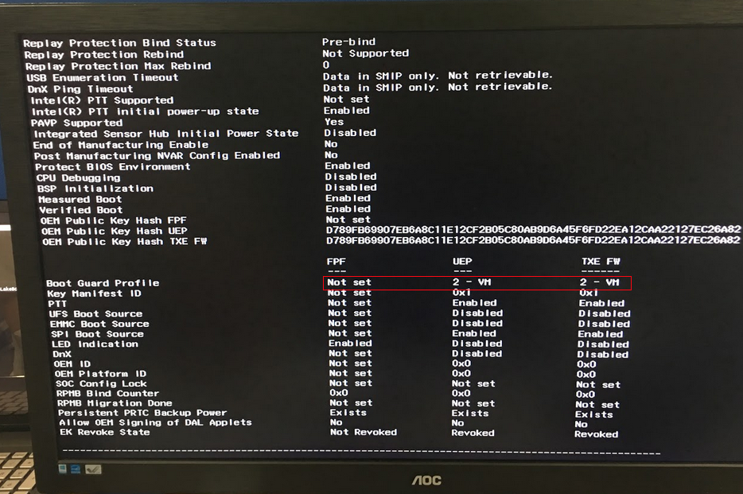

# Bios update

[TOC]

## 1. Update BIOS using FPT.efi tool

- Put `shell.efi` to your USB and plug in the device.
- Choose **Boot From File** from your BIOS menu,and choose `shell.efi` signed by Amazon to boot.


- Copy `Fpt.efi` and `fparts.txt` from USB to EFI partition of device.

> EX: **FS0(USB)** -> **FS1(EFI partition)**
>
> ```bash
> cp fs0:\Fpt.efi fs1:\.
> cp fs0:\fparts.txt fs1:\.
> cp fs0:\APL.1.0.0.bin fs1:\.
> ```


- Update Bios to 1.0.0

```bash
Fpt.efi -f APL.1.0.0.bin
```

- Press power button to shut down the device.

## 2. Check BIOS version and TXE profile with TXEInfo.efi tool

- Choose **Boot From File** from your BIOS menu,and choose `shell.efi` signed by Amazon to boot.
- Use `TXEInfo.efi` to check BIOS version.

- Check Boot Guard Profile.

