# Check secure boot, BIOS lock and TCO lock

[TOC]

## 1. Check secure boot enabled

- Open the BIOS menu and select `Boot from file > <Unsigned.efi>`. If the secure boot has been enabled, it will show the message below.
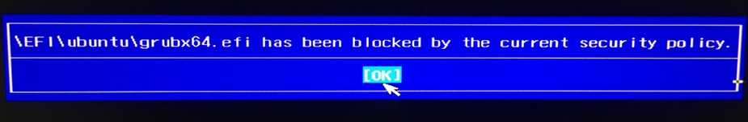

## 2. Check BIOS Lock enable bits

- Open the BIOS menu and select `Boot from file > RU_signed_amazon_new.efi`

- Press <kbd>F6</kbd> and select `PCI bus 0, device 13, Function 2`.
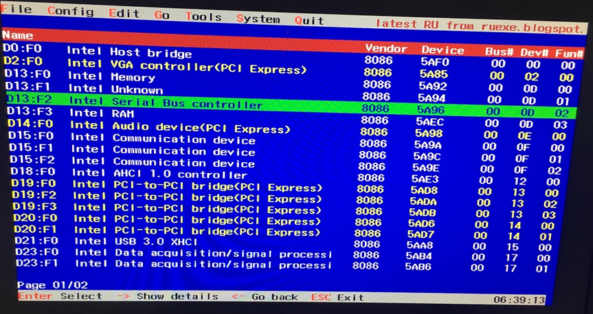

- Press <kbd>F7</kbd> twice to switch the display from byte to word.

- Locate the address to offset **0xDC**, `InSMM.STS[5]` and `Lock Enable[1]` have been set.

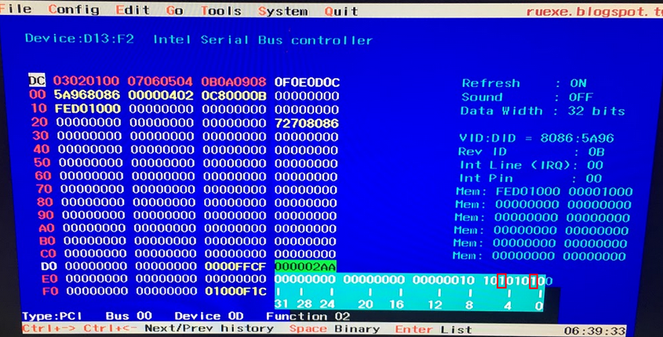

> Reference
>
> - **Intel Apollo Lake Platform Secure Configuration Specification**
>   - Document Number: **567596**
> 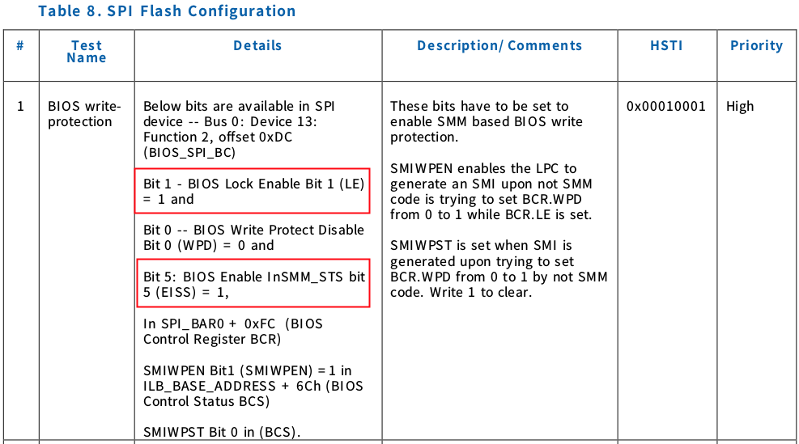
> - **Intel® Pentium® and Celeron® Processor N- and J- Series External Design Specification Volume 3 of 3**
>   - Document Number: **557557**
>
>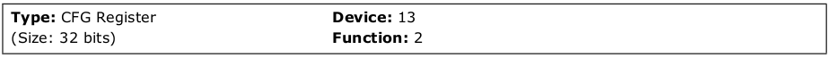
>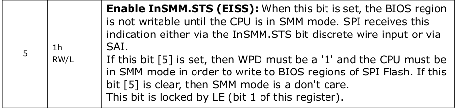
>

## 3. Check TCO SMI enabled and locked

- Open the BIOS menu and select `Boot from file > RU_signed_amazon_new.efi`

- Press <kbd>Alt</kbd>+<kbd>4</kbd> and type `0400` to AcpiBase.
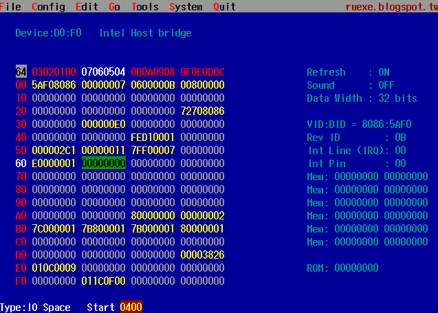

- Locate the address to offset **0x40**, `GBL_SMI_EN[0]` and `TCO_EN[13]` have been set.

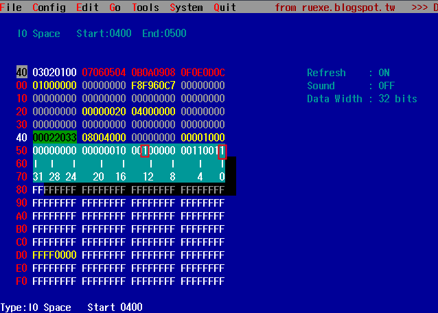

- Locate the address to offset **0x68**, `TCO_LOCK[12]` has been set.
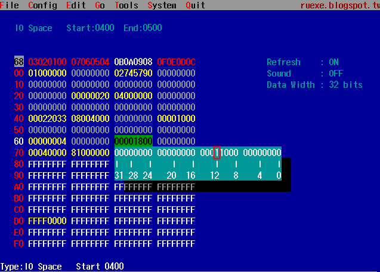

- Press <kbd>Alt</kbd>+<kbd>7</kbd> and type `FE043024` to GEN_PMCON2.
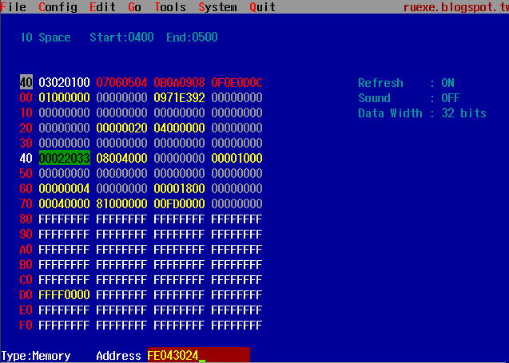

- Locate the address to offset **0x00**, `SMI_LOCK[4]` has been set.
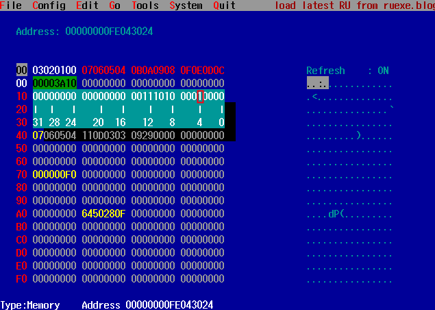

> Reference
>
> - **Intel Apollo Lake Platform Secure Configuration Specification**
>   - Document Number: **567596**
> 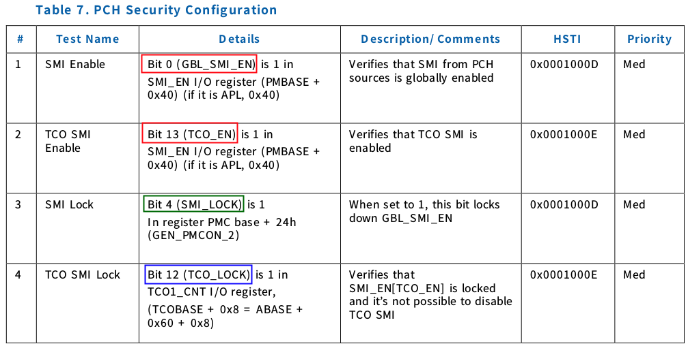

> - PMC **(B0:D13:F1)** base address locate memory **FE042000**  from BAR 1(offset **0x10**)
>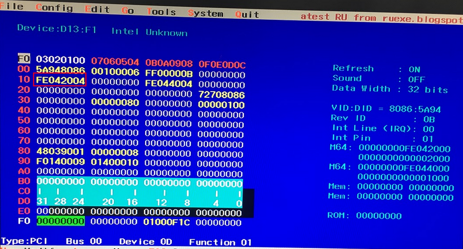

> - **Intel Apollo Lake SoC External Design Specification (EDS) Volume 2 of 3**
>   - Document Number: **557556**
> 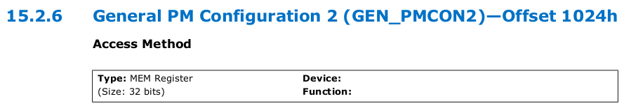
> 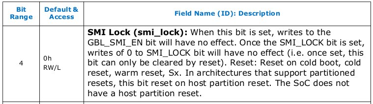

## 4. Check DCI mode is disabled

- Open the BIOS menu and select `Boot from file > RU_signed_amazon_new.efi`

- Press <kbd>Alt</kbd>+<kbd>7</kbd> and type `D0A80004` to ECTRL.
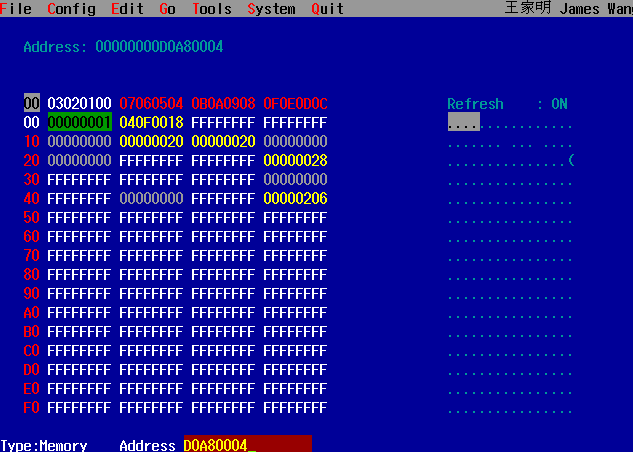

- Locate the address to offset **0x00**, `HOST_EXI_EN[4]` has been set and `HOST_EXI_EN_LOCK[0]` has been clean.
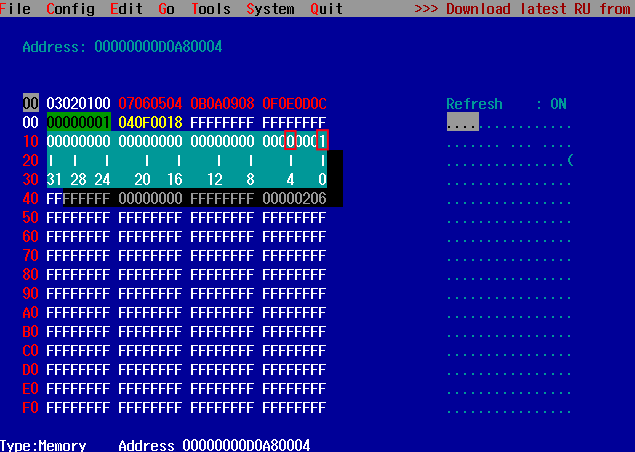

> Reference
>
> - **Intel® Pentium® and Celeron® Processor N- and J- Series (Formerly Apollo Lake) Intel Architecture Firmware Specification (Volume 2 of 2)**
>   - Document Number: **559811**
> 
> 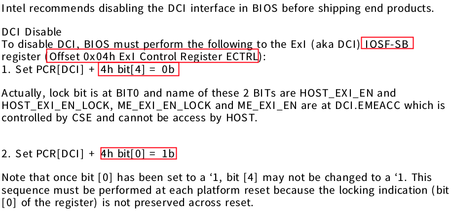
> - **Intel® Pentium® and Celeron® Processor N- and J- Series External Design Specification Volume 3 of 3**
>   - Document Number: **557557**
>
>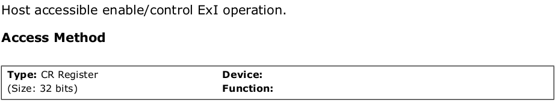
>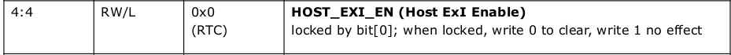
>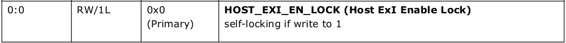
> - IOSF-SB  **(B0:D13:F0)** base address locate memory **D0000000**  from BAR 1(offset **0x10**)
>   - EXI port ID **0xA8**
>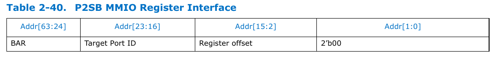
>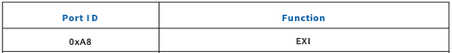
>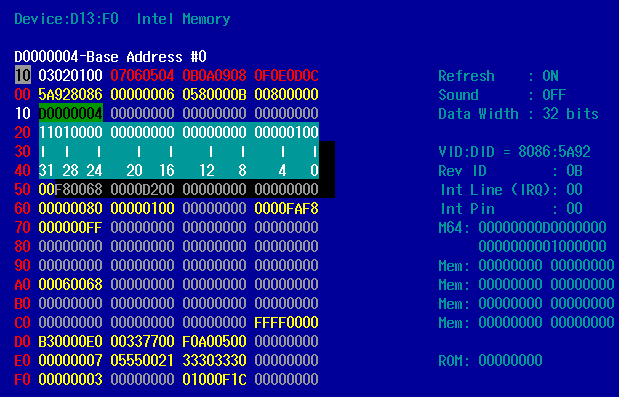

## 5. Check xDCI is disabled

- Open the BIOS menu and select `Boot from file > RU_signed_amazon_new.efi`

- Press <kbd>F6</kbd> and check `PCI bus 0, device 21, Function 1` is **not** exist.
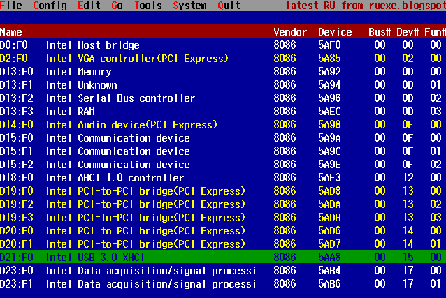

> - `PCI bus 0, device 21, Function 1` is exist when xDCI is enabled.
> 
