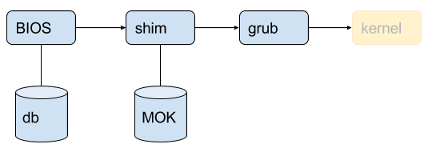

# Developer guild

[TOC]

## 1. Partitions

- 100MB:`efi`
- 15.9GB:`ext4 /`

## 2. Reliability testing

- `sudo apt install openssh-server ldtp python-ldtp sshpass stress fio`

```bash
`../testsuite/campaign_yocto/campaign_yocto.xml`
`campaign_deepcam_reliability.xml`
`/config/yocto_execution.config`
loop_folder_prefix = "campaign"

`-execution_main_list = '../testsuite/campaign_yocto/campaign_yocto.xml'`
`+execution_main_list = '../testsuite/campaign_yocto/campaign_deepcam_reliability.xml'`
log_path = '../execute/logs'
loops = 1
```

## 3. Kernel patch

- `tar zxvf install_deepcam_debug_package-5234.tar.gz`
- `sudo ./install.sh`
- install DLDT and Amazon software : `sudo ./deep_cam_install.sh`

### 3-1.Get Code

- login <https://gerrit.ibbprof.com/gerrit2/#/settings/ssh-keys>

> - Add your .ssh public keys to the gerrit first.
> - If you are inside a firewall, you need to specify a proxy in `.ssh/config`

```bash
host gerrit.ibbprof.com
HostName gerrit.ibbprof.com
IdentityFile ~/.ssh/id_rsa
User alexhoh
```

```bash
curl https://storage.googleapis.com/git-repo-downloads/repo > ~/bin/repo
chmod a+x ~/bin/repo
repo init -u ssh://<user name>@gerrit.ibbprof.com:29418/manifests -b ubuntu/xenial_ext
repo sync
```

### 3-2.Build

- Build instructions:

```bash
source build/envsetup.sh
target deepcam (or target benson )
make EXTERNAL_RELEASE=true JOBS=$(nproc) BUILD_NUMBER=<lsb2_release>
```

- Build kernel module

```bash
make -C /home/gray/dev/project/deepcam/kernel_repo/kernel M=/home/gray/dev/project/deepcam/bios/InsydeH2OSDE_x86_LINUX64_100.00.07.15/H2OSDE/driver modules
```

- Build Kernel header

```bash
fakeroot make-kpkg kernel-headers
```

- need to modified

```bash
cd {kernel source root path}
touch REPORTING-BUGS
```

- final the header file path on target :
`linux-headers-4.10.17+_4.10.17+-10.00.Custom_amd64.deb`
`/usr/src/linux-headers-4.10.17+/`

### 3-3. Kernel commit rules

- Please file 1 JIRA for 1 patch
- Set Verified `+1` after you validated patch PASS on latest BKC branch
- DONt use `//` but use `/* */` in code
- Fix all compile warning message
- loop `Denny Yang` and `Chiou, Cooper` for default reviewer, Denny has right `+2`
- Start a repo branch:`repo start name`
- Make your change
`git add –A`
`git commit –s`
- Write detailed commit message
- Upload to gerrit-:`repo upload`

### 3-4. Kernel from Canonical [Deepcam/DLRC]

- [Download Path](https://kernel.ubuntu.com/~kamal/.tmp.YHVifJ3BND/deeplens-4.15/)
- The kernel binary packages

| Canonical recommend| included in BKC| img package name      |     version |   suffix   |
| :--------:| :--------: | :--------: | :--------:| :------: |
| Must| Yes|linux-image-4.15.0-1005-deeplens    |  4.15.0-1005.5  | amd64.deb   |
| Must| Yes|linux-modules-4.15.0-1005-deeplens    |  4.15.0-1005.5  |  amd64.deb  |
| Must| Yes|linux-headers-4.15.0-1005-deeplens    |  4.15.0-1005.5  |  amd64.deb  |
| Must| Yes|linux-deeplens-headers-4.15.0-1005    |  4.15.0-1005.5  |  all.deb  |
| Option| No|  linux-buildinfo-4.15.0-1005-deeplens   | 4.15.0-1005.5   |  amd64.deb  |
| Option| No|  linux-cloud-tools-4.15.0-1005-deeplens   |  4.15.0-1005.5  |  amd64.deb  |
| Option| No|  linux-deeplens-cloud-tools-4.15.0-1005   |  4.15.0-1005.5  |  amd64.deb  |
| Option| No|  linux-deeplens-tools-4.15.0-1005   |  4.15.0-1005.5  |  amd64.deb  |
| Option| Yes|  linux-modules-extra-4.15.0-1005-deeplens   |  4.15.0-1005.5  |  amd64.deb  |
| Option| No|  linux-tools-4.15.0-1005-deeplens   |  4.15.0-1005.5  |  amd64.deb  |
| None| Yes|  linux-base   |  4.5ubuntu1~16.04.1  |  all.deb  |

- The kernel meta packages

| Canonical recommend| included in BKC| img package name      |     version |   suffix   |
| :--------:| :--------: | :--------: | :--------:| :------: |
| Must| Yes|  linux-deeplens   |  4.15.0-1005.5  |  amd64.deb  |
| Must| Yes|  linux-image-deeplens   |  4.15.0-1005.5  |  amd64.deb  |
| Must| Yes|  linux-headers-deeplens   |  4.15.0-1005.5  |  amd64.deb  |
| Option| No|  linux-cloud-tools-deeplens   |  4.15.0-1005.5  |  amd64.deb  |
| Option| Yes|  linux-modules-extra-deeplens   |  4.15.0-1005.5  |  amd64.deb  |
| Option| No|  linux-tools-deeplens   |  4.15.0-1005.5  |  amd64.deb  |

### 3-5. Kernel from yocto [Snowball]

- [Download Path](https://www.yoctoproject.org/software-overview/layers/bsps/sumo-25-harcuvar/)

## 4. Wifi

- pcie8897_1.0.0_amd64.deb
- netIFname.deb
- `nmcli networking show`
- `nmcli networking off`
- `nmcli networking on`

## 5. Serial console

- `/dev/ttyS6`
- 產測驗證Console時需要先停止ttyS6 service:
`sudo systemctl stop ttyS6.service`

## 6. BIOS

- Capsule update on linux
  - fwupdate_9-1_amd64.deb
  - fwupdate-signed_1.13+9-1_amd64.deb
  - libefiboot1_30-1ubuntu1_amd64.deb
  - libefivar1_30-1ubuntu1_amd64.deb
  - libfwup1_9-1_amd64.deb
  - libsmbios2v5_2.3.1-0ubuntu2_amd64.deb
  
``` bash
guid=$(fwupdate -l | grep {.*} -o)
fwupdate -a ${guid:1:$((${#guid}-2))} deepcamflash.bin
```

- Package to **.deb** file

```bash
dpkg -b deepcam-fw-release-0.0.20
```

## 7. GPIO

- `gpio434`=NORTH=GPIO_0
- `gpio357`=NORTHWEST=GPIO_187

## 8. Customer Package

- [Deepcam](https://s3.console.aws.amazon.com/s3/buckets/deeplens-pegatron/?region=us-east-1)
- [DLRC](https://s3.console.aws.amazon.com/s3/buckets/silverstone-pegatron/?region=us-east-1&tab=overview)
帳號：`ivan_lee@pegatroncorp.com`
密碼：`pega#1234`

## 9.產測相關

### 9-1. Smbios

- Get related smbios value from sys folder

```bash
cat /sys/class/dmi/id/product_serial
cat /sys/class/dmi/id/product_uuid
```

- Build insyde tool (RWSmbios) module

```bash
tar zxvf InsydeH2OSDE_x86_LINUX64_100.00.07.15.tar.gz
cd InsydeH2OSDE_x86_LINUX64_100.00.07.15/H2OSDE/
make -C <kernel source> M=`pwd`/driver/ modules
cp driver/phy_alloc.ko .
```

> note : need to put **phy_alloc.ko** to the same folder with "h2osde-lx64"

- Help about h2osde-lx64
`sudo ./h2osde-lx64 -h`
- Get system **serial number** by h2osde-lx64
`sudo ./h2osde-lx64 -SS`
- Replace system serial number
`sudo ./h2osde-lx64 -SS "aabbccdd`
- you can check from below command to verify immediately
`sudo ./h2osde-lx64 -SS`
- You need to reboot and it just can enable from /sys/class/dmi/id/product_serial
`cat /sys/class/dmi/id/product_serial`

- Smbios related type
  - wireless ssid -> chassis_serial
  - wireless password -> chassis_asset_tag

### 9-2.Create image

```bash
sudo umount /dev/mmcblk1p2
sudo dd if=/dev/mmcblk1 of=/media/ubuntu/VOLUME/shippingW40B.bin bs=1M status=progress
```

### 9-3.確認版本方式

- `uname -v`
- `strings vmlinuz | grep Ubuntu`
- `lsb2_release -b`
- `cat /etc/lsb-release`

### 9-4.Firewall

- `sudo ufw status`
- `sudo service ufw stop`

### 9-5.Dmic

- Record

```bash
arecord -Dhw:0,2 -f s16 -c 2 -r 48000 -d 9999 deepcam_2ch.wav
```

- Mix

```bash
echo "Configure audio DSP LPE routing"
amixer -c 0 cset name='codec1_out mo media0_in mi Switch' 1
echo "Configure TI audio codec headset playback routing"
amixer -c 0 cset name='Headphone Switch' 1
amixer -c 0 cset name='HP Left Switch' 1
amixer -c 0 cset name='HP Right Switch' 1
amixer -c 0 cset name='Output Left From Left DAC' 1
amixer -c 0 cset name='Output Right From Right DAC' 1
amixer -c 0 cset name='HP Driver Playback Switch' 1
amixer -c 0 cset name='DAC Playback Volume' 131 131
amixer -c 0 cset name='HP Analog Playback Volume' 95 95
amixer -c 0 cset name='HP Driver Playback Volume' 4 4
aplay -Dhw:0,0 -r 48000 -c 2 -f s16_LE 1k_sine_-6dBFS_48k.wav
```

### 9-6. Camera

- Load firmware

```bash
echo deepcam | sudo -S /opt/DeepCam/gc6500-8.6.0/installed/bin/mxcam boot /opt/DeepCam/gc6500-8.6.0/fw/mgapp.clocks-frag_mmu_x1-soc.img /opt/DeepCam/gc6500-8.6.0/fw/app_2ch.json /opt/DeepCam/gc6500-8.6.0/fw/sensor_ov4689_intelAI_le.bin`
```

- format:2M H264
  - capture video

 ```bash
/opt/DeepCam/gc6500-8.6.0/installed/bin/mxuvc stream --vout1 video.h264 --time $SEC
 ```

- preview

 ```bash
/opt/DeepCam/gc6500-8.6.0/installed/bin/mxuvc stream --vout1 /dev/stdout | mplayer - -demuxer h264es -benchmark
 ```

- format:4M MJPET
  - capture video

 ```bash
/opt/DeepCam/gc6500-8.6.0/installed/bin/mxuvc stream --vout2 video.mjpeg --time $SEC
 ```

- preview:

 ```bash
/opt/DeepCam/gc6500-8.6.0/installed/bin/mxuvc stream --vout2 /dev/stdout | mplayer - -demuxer lavf -lavfdopts format=mjpeg
 ```

- format: dual mode
  - capture video

 ```bash
/opt/DeepCam/gc6500-8.6.0/installed/bin/mxuvc stream --vout1 video.h264 --vout2 video.mjpeg --time $SEC
 ```

- preview

 ```bash
mkfifo /tmp/vch1 /tmp/vch2
/opt/DeepCam/gc6500-8.6.0/installed/bin/mxuvc stream --vout1 /tmp/vch1 --vout2 /tmp/vch2 &
mplayer -demuxer h264es /tmp/vch1 &
mplayer -demuxer lavf -lavfdopts format=mjpeg:probesize=32 /tmp/vch2 &
 ```

- status

```bash
/opt/DeepCam/gc6500-8.6.0/installed/bin/mxuvc stream --vout1 /dev/null --vout2 /dev/null --stats
```

- take picture

```bash
/opt/DeepCam/gc6500-8.6.0/installed/bin/mxuvc stream --vout2 jpeg_loop/$i.jpg --time 1
```

### 9-7. Image Server Path

- DLRC-`\\172.30.3.68\usr\image\DLRC\Image\release`

- DEEPCAM-`\\172.30.3.66\usr\image\DeepCam\Image\release`

## 10. How to build .deb package

- Sample In DeepCam repo

```bash
./device/deepcam/config-1.0/
./vendor/intel/camera/geocamera-1.0
```

- directory name must be xx-version

``` bash
$ dh_make --indep --createorig -e=<email> -y
## Example
$ dh_make --indep --createorig -e=cooper.chiou@intel.com -y
```

- create this file and modify for install location

``` bash
$ vi debian/install
## <src file name to copy>  <target desination directory>
```

- copyright

- clean rule

```bash
debian/rules clean
```

- build debian package

```bash
debuild -us -uc
```

- HOST install tools

```bash
sudo apt-get install dh_make devscripts
```

### 10-1. Canonical Debian Package Installation

If you know the package name on Ubuntu for your domain or work, you can simply download and install to your target using DeepCam build environment.

1. Add your package name into `./package/ubuntu_16.04/download_package.sh`
2. Run the script.

```bash
cd ./package/ubuntu_16.04
./download_package.sh
```

It'll download debian package .deb file and all of essential dependency files to current location.
All of deb packages will be added to target through built output.

3. Add your package name into `./build/install.sh under canonial_install_package_list.`
4. Merge your changes
5. Make sure your downloaded packages are installed to your target completely.

## 11. DLDT end to end testing procedure

```bash
cd /opt/DeepCam/gc6500-8.6.0
sudo ./camera.sh
```

This should boot the camera and start a dummy stream to test fps. After 30 sec the 1s column should read 30 fps for channel 1 and 15 fps for channel 2.

Ignore all debug info, and close the terminal. Ignore the terminal warning you that a process is ongoing.

- Open a new terminal

```bash
cd /opt/DeepCam/test
sudo ./test.sh`
```

This will test the model optimizer, end to end inference on squeezenet_v1.1, vgg16, and vgg19

In all cases the test will display pass or fail. The inference test will also display the frames so that the lens can be evaluated for cleanliness.

Could you run mxuvc and forward the two output pipe file to /opt/DeepCam/out/ before you run the test.sh?

Two pipe file path:

```bash
/opt/DeepCam/out/ch1_out.h264
/opt/DeepCam/out/ch2_out.mjpeg
```

Camera test Step:

1. Remove camera module

1. sudo dpkg -r GEO-camera  #Remove camera package

2. `./load_FW.sh`   #load camera FW in BKC, only JSON config use local
file.Because BKC WW38 camera config will upside down.

3. wait 5sec

4. `/test/CAM_jpeg_loop.sh 1` #take 1 picture

## 12. Secure boot

- db預設有microsoft的public key
- shim預設有ubuntu的public key
- shim預設是被microsoft sign
- grub預設是被ubuntu sign
- BIOS在檢查時, 只會拿db裡的public key
- shim在檢查時, 會拿db和MOK裡的public key



### 12-1. MOK

- Add Key to MOK

```bash
openssl req -new -x509 -newkey rsa:2048 -keyout MOK.key -out MOK.crt -nodes -days 3650 -subj "/CN=Your Name/"
openssl x509 -in MOK.crt -out MOK.cer -outform DER
sudo mokutil --import MOK.cer
sudo mokutil --list-new
sudo reboot now
sudo mokutil --list-enroll
```

- remove key from MOK

```bash
sudo mokutil --delete MOK.cer
sudo mokutil --list-delete
sudo reboot now
sudo mokutili --list-enroll
```

### 12-2. DB

- Create Key

``` bash
openssl req -new -x509 -newkey rsa:2048 -subj "/CN=platform key/" -keyout PK.key -out PK.crt -days 3650 -nodes -sha256

openssl req -new -x509 -newkey rsa:2048 -subj "/CN=key-exchange-key/" -keyout KEK.key -out KEK.crt -days 3650 -nodes -sha256

openssl req -new -x509 -newkey rsa:2048 -subj "/CN=db key/" -keyout db.key -out db.crt -days 3650 -nodes -sha256

openssl x509 -outform DER -in PK.crt -out PK.cer
openssl x509 -outform DER -in KEK.crt -out KEK.cer
openssl x509 -outform DER -in db.crt -out db.cer

uuidgen > PK.uuid
cert-to-efi-sig-list -g "$(< PK.uuid)" PK.crt PK.esl
sign-efi-sig-list -k PK.key -c PK.crt PK PK.esl PK.auth

uuidgen > KEK.uuid
cert-to-efi-sig-list -g "$(< KEK.uuid)" KEK.crt KEK.esl
sign-efi-sig-list -a -k PK.key -c PK.crt KEK KEK.esl KEK.auth

uuidgen > db.uuid
cert-to-efi-sig-list -g "$(< db.uuid)" db.crt db.esl
sign-efi-sig-list -a -k KEK.key -c KEK.crt db db.esl db.auth
```

- add key to DB
`cp -r key_path /boot/efi`
  - Entry to bios and add DB
`efi-readvar -v db`
- remove key to DB
  - Entry to bios and add DB
`efi-readvar -v db`

### 12-3. EFI

- 確認unsigned efi image

```bash
sbverify --no-verify <efi_image>
sbverify --verbose <efi_image>
```

- remove signature from signed image

```bash
sbattach --remove <signed_efi_image>
```

- signed efi image

```bash
sbsign --key <.key path> --cert <.crt path> --output <signed_efi_image> <unsigned_efi_image>
```

## 13 TXE

### 13-1 Create OEM Key ManifestBasic Flow

- Initial MEU

```bash
meu.exe -gen meu_config
```

- Create OEM Key

```bash
openssl.exe genrsa -out privkey-OEM-KM.pem 2048
openssl.exe genrsa -out privkey-OEM-ingr.pem 2048
```

- Create OEM public key hash

```bash
meu.exe -keyhash .\publickey_hash-OEM-ingr -key .\privkey-OEM-ingr.pem
meu.exe -keyhash .\publickey_hash-OEM-KM -key .\privkey-OEM-KM.pem
```

- Create OEM Key Manifest

```bash
meu.exe -gen OEMKeyManifest
```

``` xml
  <KeyManifestEntries>
        <KeyManifestEntry>
            <Usage value="BootPolicyManifest | IfwiManifest" value_list=" … " />
            <HashBinary value="publickey_hash-OEM-ingr.bin" help_text="Path to binary file containing Public Key Hash (Must be 32 bytes)" />
        </KeyManifestEntry>
    </KeyManifestEntries>
```

- Sign  OEM Key Manifest

```bash
meu.exe -f OEMKeyManifest.xml -o .\OEMKeyManifest.bin -key .\privkey-OEM-KM.pem
```

- Create BIOS Manifest

```bash
meu.exe -gen bios
```

- Sign  BIOS Manifest

```bash
meu.exe -f bios.xml -o bios.bin -key .\privkey-OEM-ingr.pem
```

### 13-2 Configure FIT

- **Platform Protection** > **Platform Integrity** > **SMIP Signing Key** : `privkey-OEM-ingr.pem`
- **Platform Protection** > **Platform Integrity** >  **OEM Public Key Hash** -> `publickey_hash-OEM-KM.txt` (FPF)
- **Platform Protection** > **Platform Integrity** >  **OEM Key Manifest Binary** :  `OEMKeyManifest.bin`
- **Flash Layout** > **IAFW/BIOS Sub-Partition** > **IAFW/BIOS Binary File** : `bios.bin`
