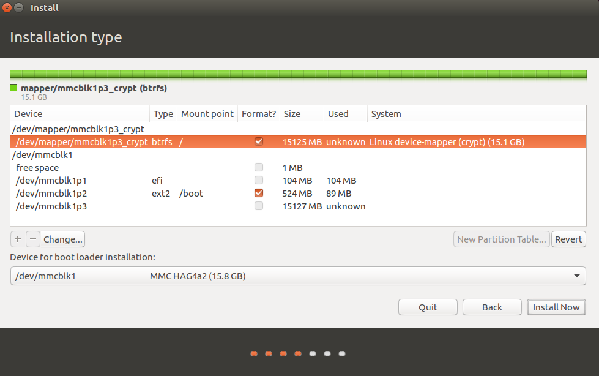
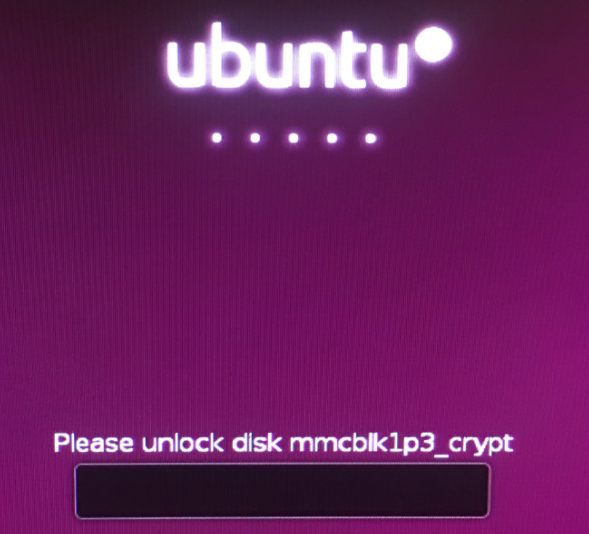
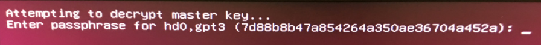
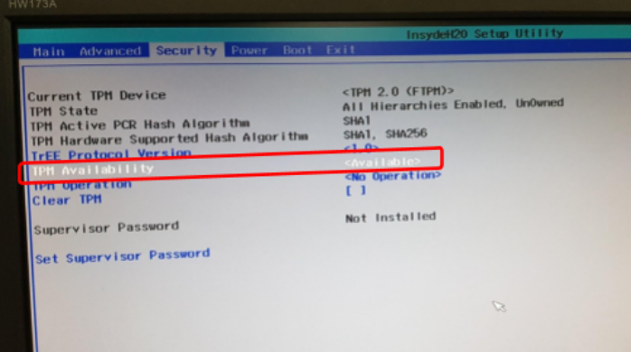
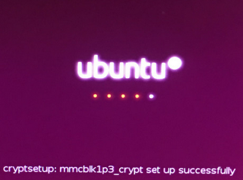
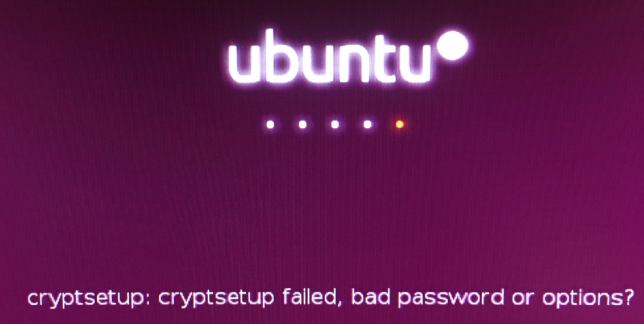

# Encrypt Rootfs with TPM2

[TOC]

## 1. Install Ubuntu with encrypted rootfs

- Boot from Ubuntu 16.04 install disk
- Connect to the Internet and run `sudo apt update && sudo apt upgrade` to update the installer components
- Use fdisk to create 3 partitions:
  - A GPT partition table
  - A 100MB partition that we will use for the EFI System Partition
  - A 500MB partition that we will use as our unencrypted `/boot`
  - An encrypted partition that uses the rest of the space

``` bash
$ sudo fdisk /dev/mmcblk1

Command (m for help): g
Created a new GPT disklabel (GUID: 4782045C-4FB8-4563-9646-2154E86EC6DB).

Command (m for help): n
Partition number (1-128, default 1): 
First sector (2048-30777310, default 2048): 
Last sector, +sectors or +size{K,M,G,T,P} (2048-30777310, default 30777310): +100M

Created a new partition 1 of type 'Linux filesystem' and of size 100 MiB.

Command (m for help): n
Partition number (2-128, default 2): 
First sector (206848-30777310, default 206848): 
Last sector, +sectors or +size{K,M,G,T,P} (206848-30777310, default 30777310): +500M

Created a new partition 2 of type 'Linux filesystem' and of size 500 MiB.

Command (m for help): n
Partition number (3-128, default 3): 
First sector (1230848-30777310, default 1230848): 
Last sector, +sectors or +size{K,M,G,T,P} (1230848-30777310, default 30777310): 

Created a new partition 3 of type 'Linux filesystem' and of size 14.1 GiB.

Command (m for help): t
Partition number (1-3, default 3): 1
Hex code (type L to list all codes): 1

Changed type of partition 'Linux filesystem' to 'EFI System'.

Command (m for help): p
Disk /dev/mmcblk1: 14.7 GiB, 15758000128 bytes, 30777344 sectors
Units: sectors of 1 * 512 = 512 bytes
Sector size (logical/physical): 512 bytes / 512 bytes
I/O size (minimum/optimal): 512 bytes / 512 bytes
Disklabel type: gpt
Disk identifier: 4782045C-4FB8-4563-9646-2154E86EC6DB

Device           Start      End  Sectors  Size Type
/dev/mmcblk1p1    2048   206847   204800  100M EFI System
/dev/mmcblk1p2  206848  1230847  1024000  500M Linux filesystem
/dev/mmcblk1p3 1230848 30777310 29546463 14.1G Linux filesystem

Command (m for help): w
The partition table has been altered.
Calling ioctl() to re-read partition table.
Syncing disks.
```

- Prepare the encrypted partition

 ```bash
 sudo cryptsetup luksFormat /dev/mmcblk1p3
 sudo cryptsetup luksOpen --allow-discards /dev/mmcblk1p3 mmcblk1p3_crypt
 ```

- Format the partition

 ```bash
 sudo mkfs.fat -F32 /dev/mmcblk1p1
 sudo mkfs.btrfs /dev/mapper/mmcblk1p3_crypt
 ```

- Install Ubuntu
  - Choose `Something else` when asked about installation type.
  - Configure `/dev/mmcblk1p1` as `EFI System Partition`
  - Configure `/dev/mmcblk1p2` as `ext2`, formatted, with mount point of `/boot`
  - Configure `/dev/mapper/mmcblk1p3_crypt` as `btrfs` with mount point of `/`
  - Continue with the installation.
  - After it finishes, choose `Continue Testing` to stay in the live system (no reboot).



- Mount and do a `chroot`

 ```bash
 sudo mount -o subvol=@ /dev/mapper/mmcblk1p3_crypt /target
 sudo mount /dev/mmcblk1p2 /target/boot
 sudo mount /dev/mmcblk1p1 /target/boot/efi
 sudo mount --bind /dev /target/dev
 sudo mount --bind /proc /target/proc
 sudo mount --bind /sys /target/sys
 sudo chroot /target
 ```

- Add line to `/etc/crypttab`

 ```bash
 mmcblk1p3_crypt UUID=<UUID of /dev/mmcblk1p3> none luks,discard
 ```

>Use `blkid` to check UUID of partition.

- Generate a new `grub.cfg`, and prepare `initrd`.

```bash
sudo grub-mkconfig -o /boot/grub/grub.cfg
sudo update-initramfs -c -k all
```

- Exit chroot and reboot into your new system

 ```bash
 exit
 sudo umount /target/boot/efi
 sudo umount /target/boot
 sudo umount /target/dev
 sudo umount /target/proc
 sudo umount /target/sys
 sudo umount /target
 sudo reboot
 ```

- After choosing Ubuntu you'll be asked for your password.


### Appendix：Encrypted Boot

- After install finish, don't mount `/dev/mmcblk1p2` to `/target/boot`.
  Copy the contents of `/boot`.

 ```bash
 sudo mount /dev/mmcblk1p2 /mnt
 sudo rsync -aXAH /mnt/ /target/boot/
 sudo chroot /target
 ```

- The step is same as before, but the additional steps is to add a line to `/etc/default/grub`

 ```bash
 GRUB_ENABLE_CRYPTODISK=y
 ```

- Edit `/etc/fstab` and delete the line for `/boot`.
  The other entries are correct.

- Install grub to the **EFI System Partition**, generate a new `grub.cfg`, and prepare `initrd`.

```bash
sudo grub-install --target=x86_64-efi --efi-directory /boot/efi --bootloader=ubuntu --boot-directory=/boot/efi/EFI/ubuntu --recheck
sudo grub-mkconfig -o /boot/efi/EFI/ubuntu/grub/grub.cfg
sudo update-initramfs -c -k all
```

- You should see grub asking your for your password.


- Then you'll get the boot menu.
  After choosing Ubuntu you'll be asked for your password again.
  Then you'll be in your system.


## 2. Enable TPM option

- TPM is already enable by BIOS.


## 3. Generate a key and store to TPM2

- Install tpm2 tools and key generate tool

 ```bash
 sudo apt update && sudo apt install pwgen tpm2-tools
 ```

- Generate key and store to TPM2

 ```bash
 pwgen 32 1 | xargs -i printf {} > nv.data
 tpm2_nvdefine -x 0x1500016 -a 0x40000001 -s 32 -t 0x2000A
 tpm2_nvwrite -x 0x1500016 -a 0x40000001 -f nv.data
 ```

## 4. Add the key to LUKS

```bash
cryptsetup luksAddKey --key-slot 2 /dev/mmcblk1p3 nv.data
```

## 5. Auto login to rootfs with TPM2

- Save your password so you only need to enter it once into grub. You need to create a script to return the password like `/root/key_script.sh`

 ```bash
 #!/bin/sh
 key=`tpm2_nvread -x 0x1500016 -a 0x40000001 -s 32 -o 0 | tail -n 1`
 key=`echo $key | perl -ne 's/([0-9a-f]{2})/print chr hex $1/gie'`
 printf $key
 ```

- Ensure the script is executable and accessable by root.

 ```bash
 sudo chmod +x /root/key_script.sh
 ```

- Edit `/etc/crypttab` and add the following

 ```bash
 mmcblk1p3_crypt UUID=<UUID of /dev/mmcblk1p3> none luks,keyscript=/root/key_script.sh
 ```

- Edit `/etc/initramfs-tools/modules` and add the following to mount **tpm0** at initramfs.

 ```bash
 tpm_crb
 ```

- Create a file at `/etc/initramfs-tools/hooks/tpm2` and add the following.
It will copy binary of tool you have to use in initramfs when update initramfs.

```bash
#!/bin/sh

set -e

PREREQ="cryptroot"

prereqs()
{
 echo "$PREREQ"
}

case $1 in
prereqs)
 prereqs
 exit 0
 ;;
esac

. /usr/share/initramfs-tools/hook-functions

copy_exec /lib/x86_64-linux-gnu/libgcc_s.so.1
copy_exec /usr/sbin/resourcemgr 
copy_exec /usr/sbin/tpm2_nvread 
copy_exec /usr/sbin/tpm2_nvwrite 
copy_exec /usr/sbin/tpm2_takeownership 
copy_exec /usr/bin/perl

exit 0
```

- Create a file at `/etc/initramfs-tools/scripts/init_premount/a_enable_loopback` and add the following to start the TPM2 daemon when initial initramfs.

```bash
#!/bin/sh

set -e

PREREQ=""

prereqs () {
 echo "${PREREQ}"
}

case "${1}" in
 prereqs)
  prereqs
  exit 0
  ;;
esac


. /scripts/functions

log_begin_msg "Start network"
ifconfig lo up

log_begin_msg "Start resourcemgr"
resourcemgr &
```

- Copy the initramfs for recovery

 ```bash
 sudo cp /boot/initrd.img-4.10.0.28-generic /boot/initrd.img-4.10.0.28-generic.safe
 ```

- Update initramfs

 ```bash
 sudo update-initramfs -u
 ```

- Reboot and you will see the login successfully message.

- If the password is not correct,it will show the bad password message.

