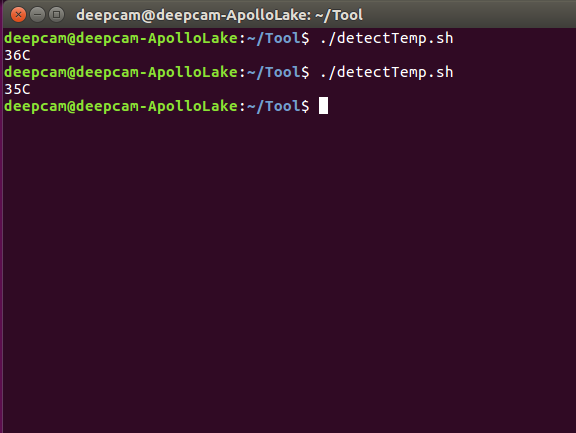

# GPIO Test tool

[TOC]

## 0. OS user and password

User:`deepcam`
Password:`deepcam`

## 1. H2 Test GPIO - LED

1. Log in to the operating system and click the upper left corner `Search your computer`

2. Enter `terminal` then select the icon

3. Type `cd Tool` to change location and `ls` to show the documents.

4. Type `sudo ./led_control.sh 1`and press enter key after key in the password `deepcam`.

5. Then you will see the LED lit.

6. Type `sudo ./led_control.sh 0`,

7. You can see the led light off.

8. Type `sudo ./led_control.sh 2`, then you can see the led lights blinking in turn.
    Util you press `ctrl + C` to exit the test script.

## 2. H2 Test GPIO - Button

1. After step 1-3, run the button test script by typing`./btn_monitor.sh`

2. If you do not press the button,then you can see the output `1`,otherwise you will see output `0`.

## 3. H2 monitor package temperatures

1. After step 1-3, run the test script by typing`./detectTemp.sh`

