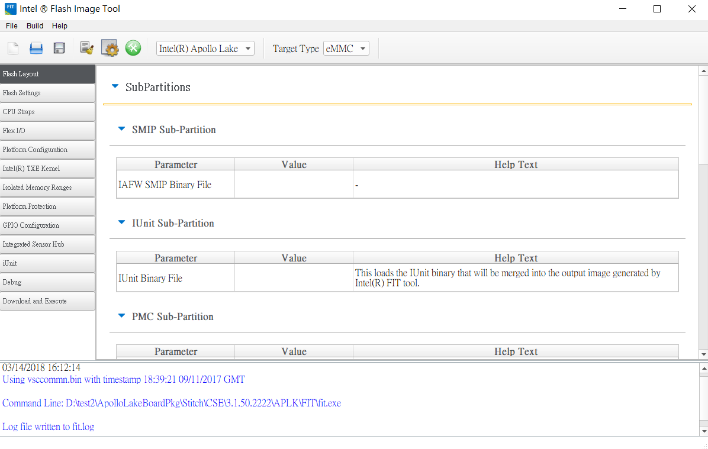
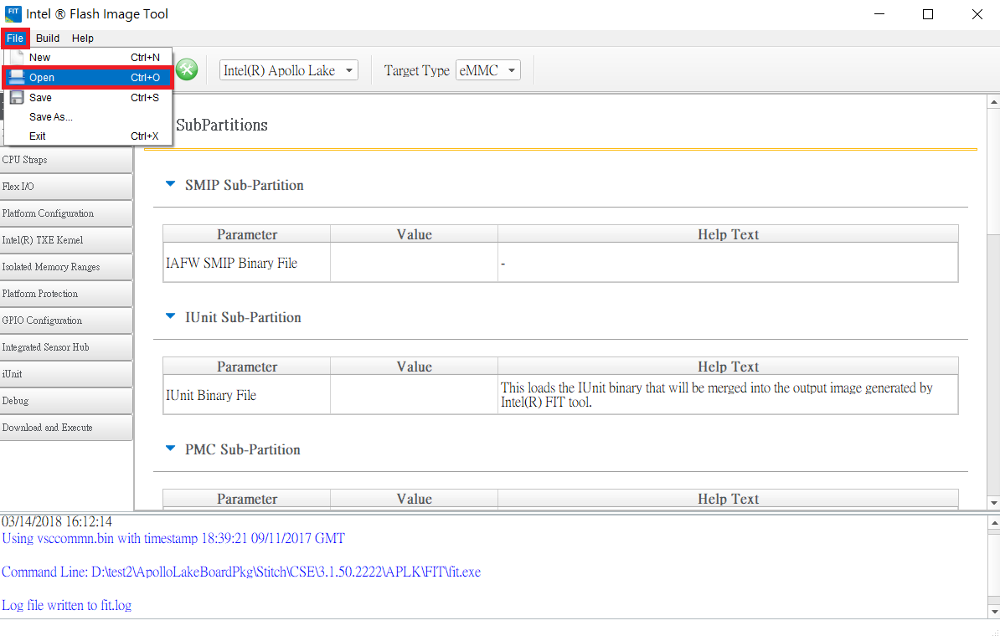
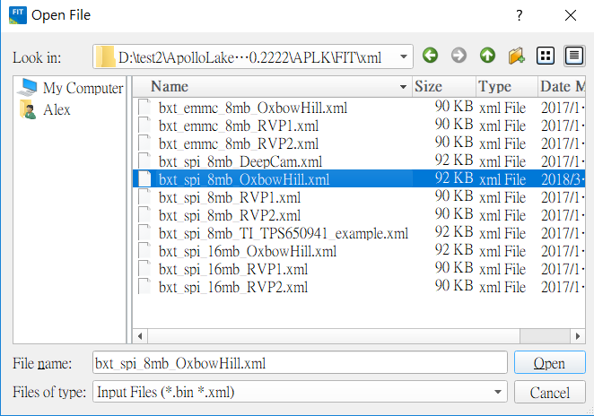
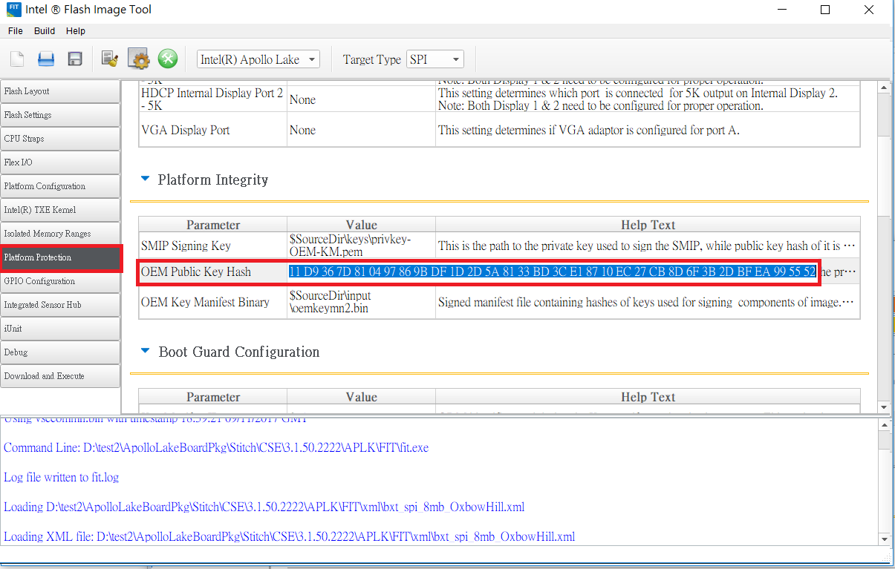
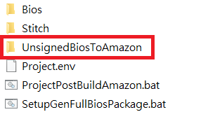
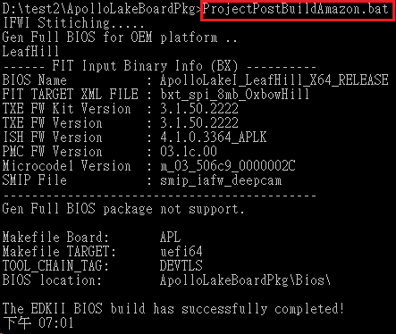
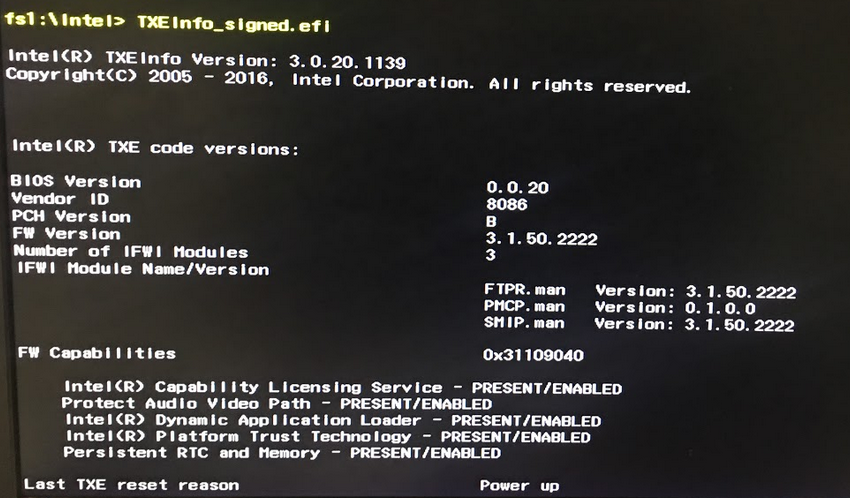
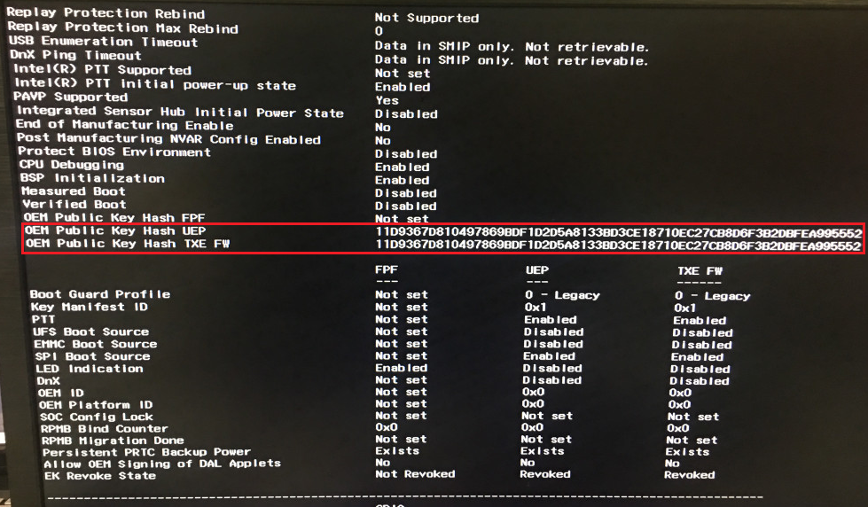

# Generate key and sign Bios regions

[TOC]

## 1. Generate Key

- Using `openssl` to generate your key pair.

``` bash
$ cd <ROOT_OF_OPENSSL>\OpenSSL\bin
$ .\openssl.exe genrsa -out privkey-OEM-KM.pem 2048
# Output file : 
#    privkey-OEM-KM.pem
```

- Copy the key to `Intel MEU` tool folder :
  `<ROOT_OF_BIOS>\ApolloLakeBoardPkg\Stitch\CSE\3.1.50.2222\APLK\MEU`
- Using `Intel MEU` to generate your public key hash.

``` bash
$ cd <ROOT_OF_BIOS>\ApolloLakeBoardPkg\Stitch\CSE\3.1.50.2222\APLK\MEU
$ .\meu.exe -keyhash .\publickey_hash-OEM-KM -key .\privkey-OEM-KM.pem

# Output file : 
#    publickey_hash-OEM-KM.bin
#    publickey_hash-OEM-KM.txt
```

- Copy **privkey-OEM-KM.pem** and **publickey_hash-OEM-KM.bin** to
`<ROOT_OF_BIOS>\ApolloLakeBoardPkg\Stitch\CSE\3.1.50.2222\APLK\MEU\keys` and overwrite origin.

- Copy **privkey-OEM-KM.pem** to
`<ROOT_OF_BIOS>\ApolloLakeBoardPkg\Stitch\CSE\3.1.50.2222\APLK\FIT\keys` and overwrite origin.

- Double click to open `Intel FIT` tool :
`<ROOT_OF_BIOS>\ApolloLakeBoardPkg\Stitch\CSE\3.1.50.2222\APLK\FIT\fit.exe`



- File  > Open


- Choose `xml\bxt_spi_8mb_OxbowHill.xml` and open.


- Copy the hash from `publickey_hash-OEM-KM.txt` into the `OEM Public Key Hash` field in `Platform Protection` tab and save it <kbd>Ctrl</kbd>+<kbd>S</kbd>.




## 2. Sign BIOS

- Pegatron will supply Amazon with `UnsignedBiosToAmazon`, copy the folder to `<ROOT_OF_BIOS>\ApolloLakeBoardPkg\`

- Open terminal and run `ProjectPostBuildAmazon.bat`

- The output Bios is located `<ROOT_OF_BIOS>\ApolloLakeBoardPkg\Bios\BIOS_Full\bxt_spi_8mb_OxbowHill\BX\ApolloLakeI_LeafHill_X64_RELEASE.bin`
- Flash the binary to your device.

## 3. Use TXE tool to check public key hash

- Use `bios.key` and `bios.crt` to sign `TXEInfo.efi` and put in your USB.

```bash
sbsign --key key/bios.key --cert key/bios.crt TXEInfo.efi.efi --output TXEInfo_signed.efi
```

- Boot device to UEFI shell.
- Run `TXEInfo` tool you just signed.

- Check the public key hash has been changed.

