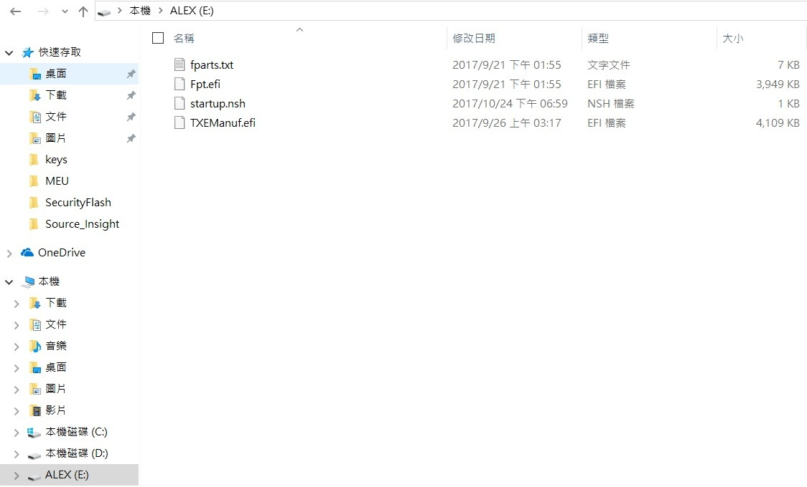
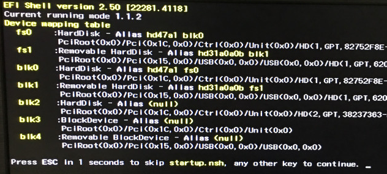
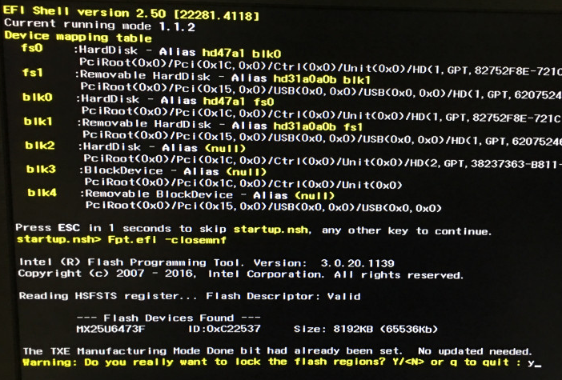
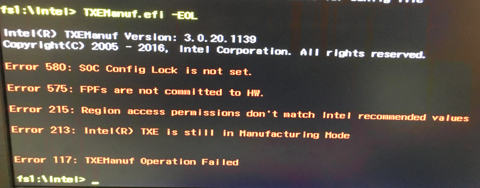
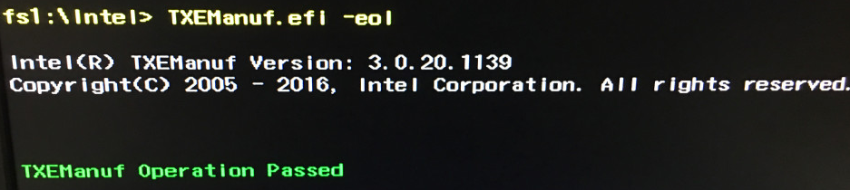

# Lock BIOS guide

[TOC]

## Lock BIOS

1. Put all tools on root of USB device.

2. Plugin the USB to device.

3. Boot to `efi shell`

4. Wait for 5 seconds or press any key.

5. Enter  `y` and press `Enter`

6. It will reboot and login OS if success.

## Appendix A. Check lock success or not

- Before lock BIOS,`TXEManuf.efi -eol` will show an error message.

- After lock BIOS,`TXEManuf.efi -eol` will show an pass message.

