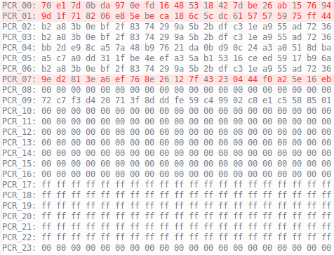
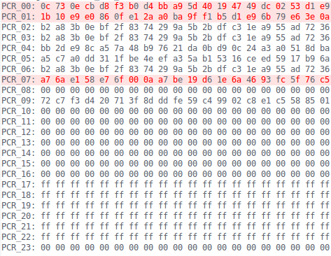
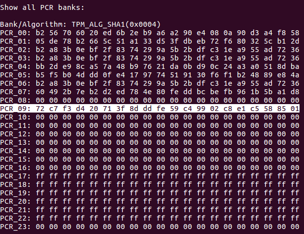
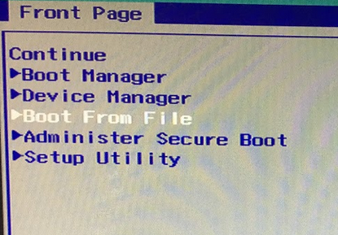
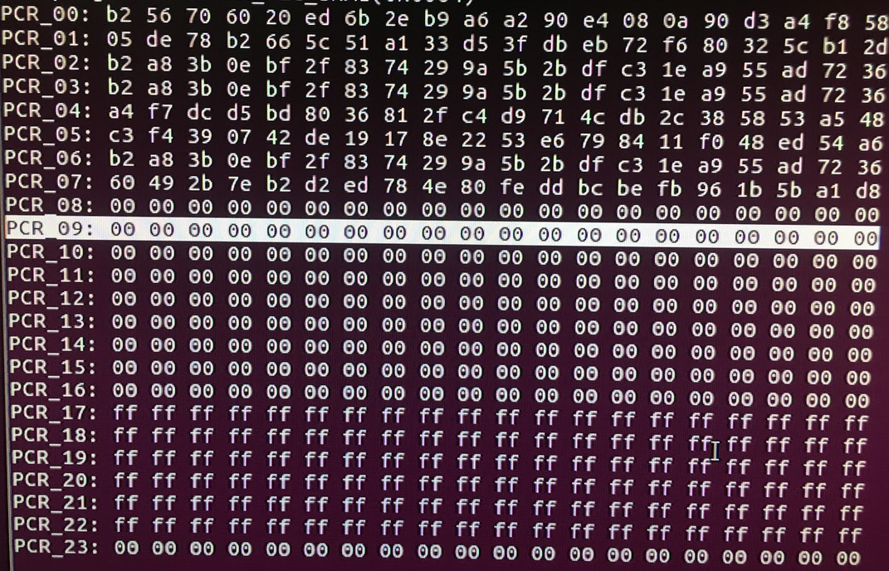
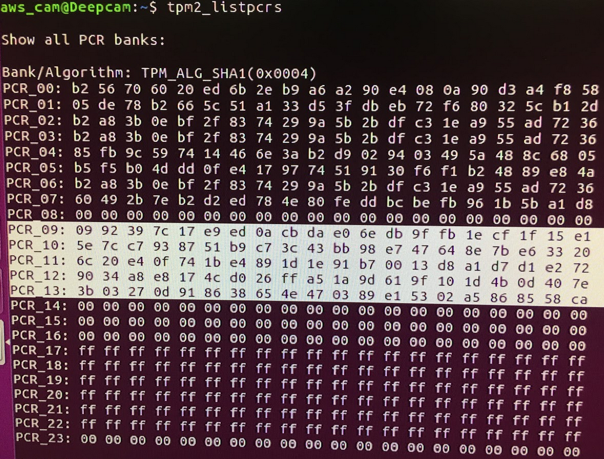

# Measured Boot

[TOC]

## 1. BIOS

- PCR 0 - BIOS
- PCR 1 - BIOS configure
- PCR 2 - Option ROM
- PCR 3 - Option ROM configure
- PCR 4 - MBR
- PCR 5 - MBR configure
- PCR 6 - status and wake up event
- PCR 7 - platform configure
- PCR 14 - shim MOK

| BIOS 19 | BIOS 20 |
| :--------: | :--------:|
|  ||

## 2. Shim

- [The Shim code measure the second-stage bootloader into PCR 9.](https://mjg59.dreamwidth.org/37656.html  )
- Shim currently used in deepcam measure the second-stage bootloader into `PCR 9`.

| Date      |     PCR  | Branch | Commit   |
| :-------- | :--------:|:--------:|:--|
| 2015/09/22     |   Add PCR 9,14 |master|<https://goo.gl/imC8UN>|
| 2017/05/23     |   Add PCR 7     |master|<https://goo.gl/VbWQPa>|
| 2017/07/13     |   Change PCR 9 to PCR 4|master|<https://goo.gl/Qgtnqq>|

- Shim measure the bootloader into `PCR 9`.


- If you close the secure boot and choose `Boot From File` from your BIOS menu, select `/EFI/ubuntu/grubx64.efi` to **boot from grub** directly.

- The value of `PCR 9` is none.


## 3. Grub

- The version of grub currently used in deepcam is `grub-2.02-beta2`.

| Date      | PCR | Branch | Commit   |
| :-------- | :--------:|:--:|:--|
| 2013/12/25     |   No use | grub-2.02-beta2 |<https://goo.gl/FZ6Fhr>|
| 2016/01/06     |   Add PCR 9-13 |master |<https://goo.gl/FDfCdE>|
| 2016/03/24     |   Remove PCR 10-13 | master |<https://goo.gl/ny9hdd> |

- You can clone, checkout to `2016/01/06 - d4bc2b` , build and install by following command.

```bash
sudo apt install bison flex autoconf
./linguas.sh
./autogen.sh
./configure --disable-werror --platform=efi
make
sudo make install
cd /usr/local/sbin
sudo -s
./grub-install
mv /boot/efi/EFI/ubuntu/grubx64.efi /boot/efi/EFI/ubuntu/grubx64.efi.safe
cp /boot/efi/EFI/grub/grubx64.efi /boot/efi/EFI/ubuntu
reboot
```

- Use command of `tpm2-tool` to check the PCR 9-13.

