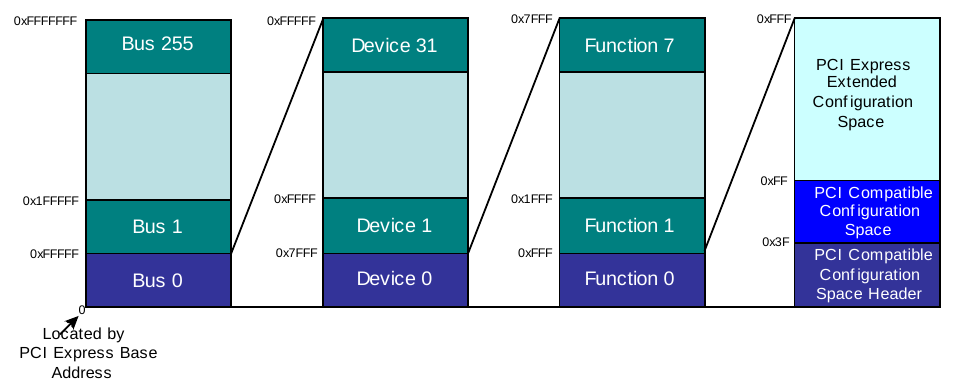

# Platform and Firmware

[TOC]

## 0. 名詞解釋

| 縮寫      |     全名 |  說明   |
| :------|:------: | ------: |
|  TXE    |   Trusted Execution Engine |
|  TXE RBE   |   ROM Boot Extension |
|  CSE   |  同TXE  |
|  ACPI   |  Advanced Configuration Power Interface   |
|  PMC   |   Power Management Controller |
|  LPE   |   Low Power Engine  |
|  fTPM   |  Firmware TPM  |
|  FOTA   |  Firmware upgrade Over The Air   |
|  DPTF   |  Dynamic Power and Thermal framework  |
|  GOP   |   Graphics Output Protocol  |
|  PMIC   |  Power Management Integrated Circuit |
|  IFWI   |  Integrated Firmware Image   |
|  RTD3   |  Runtime D3  |
|  ISP   |   Image Signal Processor  |
|  ESP   |   EFI System Partition |
|  PCI   |   Peripheral Component Interconnect  |
|  CAR   |   Cache As RAM |
|  SPI   |   Serial Peripheral Interface  |
|  PEI   |   Pre EFI initialization stage |
|  PUNIT   | Power Management Unit for North Cluster    |
|  DXE   |  Driver Execution Environment  |
|  eMMC   |  Electronic Multi Media Card GOP: Graphics Output protocol  |
|  CHV   |   Cherryview IHV: Independent Hardware Vendor  |
|  RTOS   |  Real Time Operating System   |
|  DES   |   Data Encryption Standard |
|  PEP   |   Power Engine Plug-in driver  |
|  AES   |   Advanced Encryption Standard |
|  UEFI   |  Unified extensible Firmware Interface   |
|  OpROMs   |  Operation ROMs  |
| OSPM    |  Operating system power management  |
|  SMIP   |  Signed Master Image Profile  |
|  IPC   |  Inter process communication   |
|  IPU   |  Image Processing Unit  |
|  LTR   |  Latency Tolerance Reporting  |
|  BPDT   | Boot Partition Descriptor Table   |
|  S-BPDT   |  Secondary Boot Partition Descriptor Table  |
|  FPF   |  Field Programmable Fuse | FPF是`one time programmable`的HW保險絲，並`locked at EoM` |
|  EOM   |  End of Manufacturing variable  |
|  FIT   |  Firmware Interface Table  |  |
|  iUnit   |    |Processing Subsystem (PS), which is an advanced Image Signal processor (ISP), and the Input Subsystem (IS), which contains the MIPI CSI2 controllers.|
|  IA FW stages   |    | IBB(IBBL/IBBM/IBBR) + OBB|
|  IBB   |  Initial BIOS boot block  |
|  IBBL   |  Initial Boot Block Loader  |
|  BPM   |  Boot Policy Manifest   |
|  PTT   |  Platform Trust Technology (Intel® PTT)  |
|  UEFI Variable Service   |    | Secure storage with TXE assist.Runtime service with SMI + TXE assist (TXE FW +HECI driver) |
|  DnX   |  Download and Execute   | |

## 1. 架構

### 1-1. SOC

- 工業級的`SOC`代號`Apollo lake-I`
- 總共推出3款型號（E3900系列），分別為`E3950`，`E3940`，`E3930`


### 1-2. Firmware Components


## 2. Boot Flow


1. TXE透過HW線路選擇FW Boot Media (eMMC/SPI)
2. TXE將128KB的TXE SRAM設置為shared SRAM，且開放read-only的權限給Host CPU在4GB以下的address space
3. TXE從FW Boot Media選擇並獲取正確的microcode patch和認証的IBBL到shared SRAM
4. TXE在shared SRAM中構建FIT，並啟動north clusterBefore CPU Out of Reset

5. Host CPU透過FIT來使用microcode patch，並將控制權傳給IBBL
6. 從shared SRAM開始執行IBBL， IBBL將CPU cache設置為RAM（CAR）並將其自身複製到CAR，並從CAR恢復執行，IBBL也複製shared SRAM中的FIT表
7. IBBL請求TXE將IBB從FW Boot Media中load到shared SRAM


8. TXE從FW Boot Media中獲取和驗證IBB，並將其複製到shared SRAM，大小為128KB / 64KB / 32KB。 然後終於到CAR區。

9. 整個IBB被複製到CAR之後，IBBL向TXE發送消息:IBB複製過程結束，並將控制權傳給IBB

10. 當TXE接收到IBBL已經拿起IBB的最後一個chuck的訊息時，將SMIP放到shared SRAM

11. IBB配置RAM並開始從RAM執行

12. TXE關閉host CPU存取shared SRAM的權限

13. IBB與TXE握手，以獲得FW Boot Media的所有權

14. IBB從FW Boot Media獲取並驗證OBB，並放入DRAM

15. IBB給予OBB控制權限，並且啟動OS boot loader


## 3. System Address Map

### 3-1. Memory Address Space

- SoC使用**39 address bits**，提供**512 GB**的可尋址存儲空間供CPU和設備使用
- Address大於**512GB**的位置對於SoC來說是不能理解且錯誤的

### 3-2. I/O Space

- **64k**的I/O address space，從0x0000到0xFFFF
- I/O space 由CPU使用`IN/OUT`指令存取

### 3-3. PCI Config Space

- **PCI Config Space**用於存取**SoC內部的PCI裝置**以及**SoC外部的PCI / PCIe裝置**
- PCI controller 底下的Device 可以再接一個PCI Device(整體樹狀結構可以透過`lspci -t`察看)


#### 3-3-1.  空間大小

- 一個**PCI Config Space**大小為**256 bytes** - `0x00 ~ 0xFF`
- 一個**PCI Express Extended Config Space**大小為**4 KB** - `0x000 ~ 0xFFF`
- 前**64 bytes**為**Configuration Space Header** - `0x00 ~ 0x3F`


#### 3-3-2. 存取方法

- **Standard PCI Configuration Mechanism** - 透過IO ports `0xCF8`與`0xCFC`存取1 word(4 bytes/32 bits)的資料
  - 只能存取PCI Config Space (256 bytes)


- **PCI Express Enhanced Configuration Mechanism**  - 透過MMIO
  - 可以存取PCIE Config Space (4 KB)
  - 缺點要先取得PCI的Base Address



## 4. SPI firmware

- 從SPI storage來Boot用
- **8MB~16MB**
- 分配給IFWI的區域分為兩半，稱為**Logical Boot Partition 1（LBP1）**和**Logical Boot Partition 2**（LBP2）**
- **Boot Partition Descriptor Table (BPDT)**描述了Boot Partition的組成
- 對系統啟動至關重要的組件稱為**critical sub-partitions**
- Critical sub-partitions以外的部份由**Secondary BPDT（S-BPDT）**描述其組成
- Apollo Lake的SPI存儲介質不支援DnX


- Flash Descriptor (APL SoC)


> FPT是用於TXE FW使用的Flash Partition Table

### 4-1. Critical region

- **IBB**的組成為:
  - IBBL(Loader)
  - IBBM(MRC)
  - IBBR(Recovery)
  
- **SMIP(Signed Master Image Profile)** - platform特定資料，由FIT Tool產生


- **PMC FW**
  - south devices的Active/idle電源管理
  - 參與SoC boot（cold boot/S4/S5 and warm rese

- **PUNIT FW**
  - north devices的Active/idle電源管理

**TXE-BUP** - TXE的boot code

- **SOC uCode** - MCU + Punit microcode patches

### 4-2. Non-Critical region

- **OBB**可以看做Stage 2 BIOS (OEM Boot Block)，組成為:
  - Publish UEFI Services
  - Initialize GOP Graphics device
  - Initialize Storage devices
  - Publish ACPI tables
  - Logo display
  - OS selection
  - OEM specific/customized features
  - SMM Init
  - USB, Network, Storage...
  - SMBIOS, TCG
  - Windows* feature support
  
- **TXE-Main** - TXE boot code

- **ISH** - ISH code binary

- **iUnit Bootloader**

### 4-3. Device Expansion

- **Logical Data Partition (LDP)**是Device Expansion的一部份，包含系統中非揮發的資料（由TXE管理），如**UEFI varible**和**BIOS data**
- SPI Flash中的Device Expansion Region(NVM)，相當於eMMC中相當於RPMB
- NVM services不需要知道NVM在eMMC或是SPI中，這部份由TXE搞定

### 4-4. DnX (Download and Execute)

- DnX是通過USB從主機系統下載FW modules的TXE功能，可以在目標系統上驗證和執行module
- 不支援IFWI使用DnX對SPI進行Programming


### 4-5. FW Update and Recovery


#### 4-5-1. Secondary Image Based Recovery

- IFWI critical sections的副本被視為secondary image，作為還原使用
- TXE將檢查BP1和BP2的完整性，並使用有效critical sections的BP


#### 4-5-2. UEFI Capsule Update

- firmware分為兩種：
  - System firmware - 是在Platform的critical boot path，並提供系統runtime services。如IAFW，Intel ME / TXE FW，Intel®ISS FW，EC FW等
  - Device Firmware - 指non-system critical firmware，例如Touch Controller FW，Proximity Sensor FW等
- Capsule通常是指更新System firmware
- **Capsule** = IFWI + EFI驅動程序code
- Platform必須支持**air firmware更新**和**Local更新**機制。
- IAFW應提供Capsule API（使用UEFI API - UpdateCapsule（））
- 必須確保firmware在更新之前進行身份驗證
- Platform FW必須確保僅在UEFI內部進行IFWI Update
- 更新應具有通用的UX interface，以向user提供狀態
- **Capsule on Disk**- UEFI capsule 通過OS level application/driver放置在UEFI system partition，
  - 在boot結束時，IA FW檢查UEFI system partition是否有UEFI Capsule，並相應地運行UEFI Capsule程序
- **Capsule in Memory** - UEFI capsule放置在RAM中，UpdateCapsule()由OS level application/driver調用
  - IA FW將產生warm rese，以便RAM內容完好無損，並在下次啟動時處理Capsule
  - 請注意，基於warm rese的Capsule Update仍在S審核過程中
  - 請注意，Apollo Lake不支援基於S3 reset的capsule updates


- Update方式有兩種:
  - OEM server update
  - **Windows update** server update - 更新過程類似於更新驅動程式


#### 4-5-3. Fault Tolerant Updates

- 確保即使更新失敗，IA FW仍然成功啟動
- 有Duplicate Critical Partitions

- 沒Duplicate Critical Partitions


### 4-6. Lock IFWI

- SPI Flash Region Lock
- 從Development轉向Production模式
- 設置End of Manufacturing (EoM) variable，使得un-programmed Field Programmable Fuse（FPF）的值產生變化
- FPFs可以控制system boot source
- 通過在EoM流程期間lock FPF，使得不能更改FPF值，從而保持系統更加安全
- `FPT -closemnf`
  
## 5. GPIO

- GPIO被劃分為**Pad**,**Family**和**Community**
  - Pad是最低級別，如edge detection logic
  - Family由一組通常具有相同protocol的Pad組成，如eMMC, SDIO, I2C。並包一些shared registers在Pads之間使用
  - Communities是物理上彼此相鄰的Family group，Apollo Lake有4個communities，共245 GPIO
  - BIOS ACPI 可以將GPIO控制器列舉到OS
  - BIOS定義GPIO的ACPI event handlers

- 每個GPIO Community中的GPIO register均可通過IOSF-SB存取


- 有兩種GPIO引起Interrupt的方法
  - Shared IRQ (GPIO Driver Mode)：

1. 由status和enable registers控制：`GPI_INT_STS`，`GPI_INT_EN`
2. 在IRQ `14/15`上發送Assert

- Direct IRQ (GPIO-to-IOxAPIC)：

1. 每個pad有不同的IRQ number，IRQ number在0x19-0xBA之間
2. BIOS需要設定GPIO register來Enable GPIO-to-IOxAPIC


- 建議所有的GPIO Community都使用普通的Shared IRQ Interrupt，GPIO driver應該為每個Community讀取`GP_INT_STS`register來確定中斷源

- 所有的pad muxing控制和GPIO modes是通過GPIO register完成的


- `/proc/interrupts` 檔案會根據每個 CPU 及每個 I/O 裝置，列出插斷的數目
  - 它會顯示 IRQ 編號、每個 CPU 核心處理的插斷數目、以及以逗號隔開的驅動程式清單（這驅動程式清單已註冊以收到該插斷）
  - 詳情請參閱 pro(5) 的 man page，指令為：`man 5 proc`
- IRQ 有一組相關的「關聯」屬性：smp_affinity
- 這會定義允許為該 IRQ 執行 ISR 的 CPU 核心
- 這屬性可以透過指定插斷關聯與應用程式的執行續關聯，至一或多個指定的 CPU 核心，進而改善應用程式效能
- 這允許在特定的插斷與應用程式執行續之間，共享快取線
- 特定 IRQ 編號的插斷關聯值儲存在相關的 `/proc/irq/IRQ_NUMBER/smp_affinity` 檔案裡
- root 使用者可以加以檢視、修改。儲存在這檔案中的值是十進位的位元遮罩，表示系統上的所有 CPU 核心
 使用 IRQ 編號，找出正確的 smp_affinity 檔案：

```bash
$ cat /proc/irq/32/smp_affinity 
f
```

- smp_affinity 的預設值為 f，表示 IRQ 可以接受系統上任何 CPU 的服務。設定這個值為 1（如下所示）表示只有 CPU 0 可以服務此插斷：

```bash
$ echo 1 >/proc/irq/32/smp_affinity
$ cat /proc/irq/32/smp_affinity
1
```

 逗號可以用來加在多個 smp_affinity 的值之間，以分開 32 位元的群組。這在擁有超過 32 核心的系統上是必要的。例如以下範例就顯示，一台 64 核心系統上的所有核心都為 IRQ 40 提供服務：

```bash
$ cat /proc/irq/40/smp_affinity
ffffffff,ffffffff
```

要只用 64 核心系統的前 32 個核心服務 IRQ 40，請使用以下指令：

```bash
$ echo 0xffffffff,00000000 > /proc/irq/40/smp_affinity
$ cat /proc/irq/40/smp_affinity
ffffffff,00000000
```

> - 修改 IRQ 的 smp_affinity 會設定硬體，讓使用特定 CPU 來服務插斷的決定會在硬體等級上決定，不需要 kernel 干預

- Interrupt有分好幾種mode，可以分成Edge Trigger以及Level Trigger
  - Edge Trigger包括了Rising and Falling Edge Trigger
  - Level Trigger可以分成High and Low Level


> Note
>
> 1. Rising
> 2. Falling
> 3. High
> 4. Low
>
> - Interrupt不只是只能用GPIO來做，有些CPU會直接規定某些CPU PIN腳就是Interrupt，而有些為了省PIN腳會跟GPIO共用。這都要看CPU的spec.而定。

## 6. UEFI Variable Service


## 7. Stitching Ingredients

- 要創建一個可以直接燒錄到SPI Flash的final image,需要進行拼接處理
- 拼接處理文件BlStitch.bat在Intel®FSP發行套件中提供
- 以下簡要介紹每種成分的功能

### 7-1. Intel® Trusted Execution Engine (Intel® TXE)

- 又稱Converged Security Engine (CSE)
- 是嵌入式微控制器(MCU)
- TXE firmware由Intel signed且經過Intel®TXE認證，然後才能執行
- TXE即使在沒有OS的情況下也提供功能
- 透過multi-function PCI device的方式暴露裡面的設定值
  - HECI1:D15:F0
  - HECI2:D15:F1
  - HECI3:D15:F2
- Host Firmware Status Register (HECI1_HFS) Definition (Offset 40h)
  - `HECI1_CSE_FS_MFGMODE` (Bit 4) - 0為`HECI1_CSE_FS_MFGMODE_DISABLED`
- Hash
  - TXE Amazon New Hash
`F6 12 AB 20 68 81 D7 33 4B 4E CF A5 81 3E 54 CE 34 0F 38 BB 28 F9 D4 04 77 58 92 25 C3 73 40 2F`
  - TXE Amazon Old Hash
`725B4F09AA1F1254A91F4FDE2D4CF39105BC5ECDEC1313FF8DB868FC9AAE3152`
  - TXE Pega Hash
`D789FB69907EB6A8C11E12CF2B05C80AB9D6A45F6FD22EA12CAA22127EC26A82`

### 7-2. Integrated Sensor Hub (ISH)

- ISH連接了許多platform上的sensors
- 它可以獨立運行在platform低功率的時候

### 7-3. I-Unit (The Image Processing Unit (IPU))

- camera module中的CMOS image sensors interfaces
- 處理靜像和video frames

### 7-4. Power Management Controller (PMC)

- 負責系統管理控制，包括reset,on/off,sleep state

### 7-5. Microcode

- Microcode通常需要load處理器中，以提供糾正特定錯誤

### 7-6. OEM SMIP

- 16KB的OEM-signed critical sub-partition
- 用於firmware和software在產生特定platform行為時可能需要的platform特定data
- 類似於SPI Soft straps（write-protected），SMIP是簽名保護
- SMIP從SMIP Descriptor Table（SDT）開始，描述其大小和偏移量
- 透過Intel ® BMP (Binary Modification Program) tool修改


- 最後input到FIT去建立最後的IFWI


### 7-7. Signing Key

- 簽署和驗證IBBL，IBB和SMIP binary，需要RSA公私密鑰，PEM格式

### 7-8. Boot Loader Images

- Apollo Lake firmware image 至少需要三個組件 - IBBL，IBB和OBB
- IBBL不得大於32 KB
- IBB不得大於352 KB
- OBB不得大於2208 KB

## 8. IOSF-SB Bus

- 為低速周邊裝置的控制器

- 可經由PCI`0/13/0`取得PCI Configuration Space


- 透過PCI Configuration Space中`0x10-0x13`的4 Bytes，取得IOSF-SB MMIO 的`BAR`(Base address register)


- 目前設定為`0xD0000000`


### 8-1. 如何讀寫IOSF-SB下的Device registers?

- 透過`P2SB`(Primary to Sideband Bridge)對IOSF-SB下達`CRRd & CRWr` opcodes
- P2SB有兩種使用方式，僅講解第1種:`MMIO`
- 算法如下

- 以`USB2`為例

- 到Memory `0xD0A74100` ，即可看到`USB2_PER_PORT_PP0` register值


### 8-2. 所有IOSF-SB下Device Port


## 9. USB


## 10. System Management Mode(SMM)

- SMM是處理器的**high priority**模式
- 當處理器收到**System Management Interrupt (SMI)**時，切換SMM
- 它會寫入處理器的當前狀態（processor’s context）到memory，並開始執行IA FW負責處理某SMI的code

## 11. Dmic

- DMIC Codec Function Driver
- children of the Offload Engine driver
- PDM (DMIC) Microphone

### 11-1. PCM

- PCM方式得到的就已經是幅值相關的數字分量
- 等間隔採樣方法，將每次採樣的模擬分量幅度表示為N bits
- 需要用到數據時鐘，採樣時鐘和數據信號三根信號線

### 11-2. PDM

- PDM則使用遠高於PCM採樣率的時鐘採樣調製模擬分量，只有1bit輸出
- 時鐘和數據


## 12. DPTF

- Please note that OEM/ODM will need to supply a `TRT` in a legacy thermal zone in your `BIOS` if the OEM/ODM intends to support `Linux` on this platform `since DPTF will not be running`, the thermal parameters in the PSVT will not take effect.

- DPTF `does not` use any `ACPI` methods on `Linux` based system

- DPTF `does not support thermal interrupt` on `Linux` based system so far.

- The `charger driver` is up streamed on `Linux` based system. The Power Supply SYSFS items are provided for DPTF on Linux based system.

- The `WIFI` and `WIGIG` is not supported on `Linux` based system.

- `TAT` will take few seconds to launch first time when `DPTF` is enabled because TAT will `launch DPTF services` in `background` to `fetch the data`

- `DPTF` component can be configured using `DPTF_KeyValue.xml` file available at install location. Do not add space or new line while editing. All the values are in HEX.

## 13. BSP Test

- BSP Basic Acceptance Test
  - Connect to Monitor via u

- Power & Performance KPI
  - Power KPI
  - Performance KPI

|  Function |Pgram|
|---|---|
|Intel SOC|chipsec|
|memory|memtester|
| i2c|i2cdetect |
| wifi|insmod & rmmod  & wpa_supplicant & ipeer |
| Power Up & Power Down |  |
| eMMC | (mmc-util)mmc_cmds -> open & ioctl |
| SDcard | (mmc-util)mmc_cmds -> open & ioctl |
| Thermal | Intel PTU & Intel TAT & lm-sensors & pmic or sensor vender |
|Security| TXE & emmc rpsb|
|FW/OS upgrade| ibv and intel |
|USB Camera|dmesg & grep & picture capture -> vendor|
|USB HID|libhid|
|USB Speed|usbtop|
|Audio|alsamixer & arecord & aplay ->  |
|HDMI|xrandr|
|other|stress-ng & phoronix-test-suite|

## 14. Thermal

- 雖然熱設計功耗很低，但散熱解決方案設計依舊非常重要

> - 典型的智能係統由於無風扇操作而具有熱挑戰性

## 15. Media SDK

- A software development library that exposes the media acceleration capabilities of Intel platforms for decoding, encoding, and video preprocessing.

- A combination of driver, library, and graphics stack components requiring specific hardware, Linux* distributions, kernel levels, etc. as described here.

## 16. LPDDR4

- LPDDR RAM是「低功耗雙倍數據速率內存」的縮寫
- 面向移動平台的LPDDR4，其能夠在帶來等效的性能(速度)的同時，兼顧更少的能源消耗
- 3200MB/s的雙倍數據速率
- 16bit雙通道(總位寬32bit)
- 總線位寬要更小
- 1.1V
- `SPD`（Serial Presence Detect）是燒錄在 EEPROM 內的碼，裡面記載著記憶體模組的一些相關資訊，包含：記憶體顆粒的種類、容量、速度、所需電壓、製造廠商……等。
  - 過去電腦在開機時 BIOS 必須偵測記憶體，但有了 SPD 時，系統就不必再去執行偵測的動作，而由 BIOS 直接去讀取 SPD 值，並取得記憶體的相關資料，並將所使用的記憶體模組的存取時序設定在最佳狀態，以確保系統能正常穩定的運作。


圖片右上角紅框處：這就是儲存 SPD 值的 EEPROM，通常容量都是2MB


BIOS 畫面可看到 SPD 的相關參數

## 17. WIFI

- `ad hoc`
  - 可利用單播(Unicast)外，必要時也可使用群播(Multicast)方式來傳送一般數據或即時的資料
  - 獨立型基本服務集(Independent BSS, IBSS): 工作站(Station, STA) 之間能彼此直接通訊，而不須透過基地台的協助
  - 雙方可能不在彼此的通訊範圍之內，需要其他工作站中繼(Relay)封包。
  - 如何尋找路由路徑(Routing path)，使中繼節點能把封包快速有效的傳往目的地，是相當基本且關鍵的任務
  - 路由路徑的過程，稱為路由探索(Route discovery)
  - 在路由探索的過程中，節點利用廣播(Broadcast)路由請求(Route request, RREQ)來獲得路由路徑
  - 另一種民用方式是公共安全。在發生災害（洪水，風暴，地震，火災等）的時候，需要快速，即時的無線通信網絡
  - 有`Software AP`功能的網卡
    - 1.`linux-firmware`（無線網卡的韌體）
    - 2.`wireless-tools`（iwconfig、iwlist等工具）
    - 3.`hostapd`（無線AP服務）
    - 4.`iptables`（Linux 的NetFilter，我們需要它來做 NAT）
- `Wi-Fi Direct`( like `Miracast`)

### 17-1. iwconfig

- 是Linux Wireless Extensions(LWE)的用戶層配置工具之一
- LWE是Linux下對無線網路配置的工具
- 很多無線網卡都支援LWE

## 18. Kernel

- `vmlinux`  编译出来的最原始的内核elf文件，未压缩
- `zImage`   是vmlinux经过objcopy gzip压缩后的文件， objcopy实现由vmlinux的elf文件拷贝成纯二进制数据文件
- `bzImage`  bz表示`big zImage`，不是用bzip2压缩的。两者的不同之处在于，zImage解压缩内核到低端内存(第一个640K)，bzImage解压缩内核到高端内存(1M以上)如果内核比较小，那么采用zImage或bzImage都行，如果比较大应该用bzImage
- `uImage`   U-boot专用的映像文件，它是在zImage之前加上一个长度为0x40的tag
- `vmlinuz`  是bzImage/zImage文件的拷贝或指向bzImage/zImage的链接

### 18-1. Linux Kobject

- 硬件设备的数量、种类是非常多的，这就决定了Kernel中将会有大量的有关设备模型的数据结构。这些数据结构一定有一些共同的功能，需要抽象出来统一实现，否则就会不可避免的产生冗余代码。这就是Kobject诞生的背景
- 通过parent指针，可以将所有Kobject以层次结构的形式组合起来。
- 使用一个引用计数（reference count），来记录Kobject被引用的次数，并在引用次数变为0时把它释放（这是Kobject诞生时的唯一功能）
- Kobject是面向对象的思想在Linux kernel中的极致体现，但C语言的优势却不在这里，所以Linux kernel需要用比较巧妙（也很啰嗦）的手段去实现，

> 注1：在Linux中，Kobject几乎不会单独存在。它的主要功能，就是内嵌在一个大型的数据结构中，为这个数据结构提供一些底层的功能实现。
> 注2：Linux driver开发者，很少会直接使用Kobject以及它提供的接口，而是使用构建在Kobject之上的设备模型接口。

``` c
 1: /* Kobject: include/linux/kobject.h line 60 */

 2: struct kobject {

 3:     const char *name;

 4:     struct list_head    entry;

 5:     struct kobject      *parent;

 6:     struct kset     *kset;

 7:     struct kobj_type    *ktype;

 8:     struct sysfs_dirent *sd;

 9:     struct kref     kref;

 10:    unsigned int state_initialized:1;

 11:    unsigned int state_in_sysfs:1;

 12:    unsigned int state_add_uevent_sent:1;

 13:    unsigned int state_remove_uevent_sent:1;

 14:    unsigned int uevent_suppress:1;

 15: };
```

### 18-2. Linux设备模型 - Uevent

- Uevent是Kobject的一部分
- 用于在Kobject状态发生改变时，例如增加、移除等，通知用户空间程序
- 用户空间程序收到这样的事件后，会做相应的处理
- 该机制通常是用来支持热拔插设备的，例如U盘插入后，USB相关的驱动软件会动态创建用于表示该U盘的device结构（相应的也包括其中的kobject），并告知用户空间程序，为该U盘动态的创建/dev/目录下的设备节点
- 更进一步，可以通知其它的应用程序，将该U盘设备mount到系统中，从而动态的支持该设备
- 通过两个途径把事件上报到用户空间：一种是通过`kmod模块`，直接调用用户空间的可执行文件；另一种是通过`netlink通信机制`，将事件从内核空间传递给用户空间。
- 在利用Kmod向用户空间上报event事件时，会直接执行用户空间的可执行文件。而在Linux系统，可执行文件的执行，依赖于环境变量，因此kobj_uevent_env用于组织此次事件上报时的环境变量
- Uevent模块通过Kmod上报Uevent时，会通过call_usermodehelper函数，调用用户空间的可执行文件（或者脚本，简称uevent helper ）处理该event。而该uevent helper的路径保存在uevent_helper数组中。


### 18-3. Linux Driver Model

- Bus : CPU和一个或多个设备之间信息交互的通道
- Class : 抽象出一套可以在多个设备之间共用的数据结构和接口函数
- Device : 抽象系统中所有的硬件设备，描述它的名字、属性、从属的Bus、从属的Class等信息。
- Device Driver（驱动）：Linux设备模型用Driver抽象硬件设备的驱动程序，它包含设备初始化、电源管理相关的接口实现。而Linux内核中的驱动开发，基本都围绕该抽象进行（实现所规定的接口函数）。
- Device（struct device）和Device Driver（struct device_driver）两个数据结构，分别从“有什么用”和“怎么用”两个角度描述硬件设备
- 只要任何Device和Device Driver具有相同的名字，内核就会执行Device Driver结构中的初始化函数（probe），该函数会初始化设备，使其为可用状态
- 对大多数热拔插设备而言，它们的Device Driver一直存在内核中。当设备没有插入时，其Device结构不存在，因而其Driver也就不执行初始化操作。当设备插入时，内核会创建一个Device结构（名称和Driver相同），此时就会触发Driver的执行。这就是即插即用的概念。
- 通过"Bus-->Device”类型的树状结构（见2.1章节的图例）解决设备之间的依赖，而这种依赖在开关机、电源管理等过程中尤为重要。试想，一个设备挂载在一条总线上，要启动这个设备，必须先启动它所挂载的总线。
- 

## 19. Secure

- 不管是`Secure Boot`還是`Secure Flash`, 都有`Sign`和`Verify`的動作
- `Sign`都是由`signer tool`搭配`private key`來做
- `Verify`由`BIOS code`搭配`放入BIOS的public Key`來運作。
- `Sign by tool`:
  - 1.將要被sign的`program檔案`做`hash處理(SHA256)`
  - 2.用`private key`把`hash過的資料`做`編碼`的動作，這動作我們叫sign的動作，sign好的資料叫做`數位簽章`
  - 3.將`數位簽章附加到檔案`上
- `Verify by BIOS`:
  - 1.將sign過的program分離出`progarm原檔案`和`數位簽章`的資料
  - 2.用`public key`把`數位簽章`的資料`做解碼`的動作，產生資料A
  - 3.把`program原檔案做hash處理(SHA256)`，產生資料B.
  - 4.將資料A和資料B做`比對`，如果相等表示此Program是可執行的。
  
### 19-1. Secure Boot

- 需要UEFI 2.3.1之後版本的配合
- 用來防止未認證的`firmware`、`EFI Driver`/`Loader`、`OS`在開機過程的時候被執行
- 核心技術為數位簽章(Digital Signature)
- Secure Boot功能被Disable時
  - 所有的EFI Program不需要認證就可以被執行
- Secure Boot功能被Enable時
  - EFI Programs必須被Sign過才能被執行
  - 否則在開機時會發生認證失敗，而不允許開機
- 它認證的方式是，在BIOS裡會有一個`Database`，它存放著Public Keys
- 在開機的過程中，由公鑰來驗證EFI Program是否有數位簽章
- 如果驗證通過，該EFI Program就可以被執行
- 繼續開機驗證下一個EFI Program
- signer tool由`BIOS Vendor`、`OEM`或`OS廠商`提供
- 私鑰
  - 保留在`保留在OEM廠商`或是`OS廠商`
  - 用來`sign program`
  - OS的loader由`OS廠商來sign`
  - OEM的Program由`OEM廠商做sign`
- 公鑰
  - 提供給`ODM廠開發BIOS時，放入BIOS的DB中`
  - 用來`驗證program`是否有被sign過，以達到secure boot的功能
- `Secure boot database`裡主要有`PK`、`KEK`、`db`、`dbx`四個成員，它們的定義和用途如下
  - `PK`
    - 可以稱作`Platform Key`或是`System Master Key`
    - 它是一個`Key pair`, 一般是由`OEM`提供
    - 用途是`update KEK`.
  - `KEK`
    - `Key Enrollment Key database`
    - 一般是由`OEM`或是`OS Partner`提供
    - 用途是`update db`
  - `db`
    - signature database
    - db裡會存放許多**private keys**和**public keys**
    - private key用來`sign EFI program(Driver/Loader)`
    - public key用來verify EFI program是否有digital signature
    - 這些keys`由OEM`或`OS Partner`提供
  - `dbx`
    - revoked signatures database, 這和db正好相版
    - `類似黑名單`的功能
    - 在dbx裡所列的EFI program或loader是不被信任，也不能被執行的
- 有一些defaut key來自於Microsoft必須導入
  - **KEK_MSFTproductionKekCA.cer**
    - 允許一些`Microsft`的`Variable`可以用`Set Variable`的方式來`更新db和dbx`
  - **db_MSFTproductionUEFIsigningCA.cer**
    - 用來允許來自`3rd party的UEFI drivers`和`applications`能夠正常執行
  - **db_MSFTproductionWindowsSigningCA.cer**
    - 它用來通過`Win 8 OS loader`的驗證

### 19-2. Secure Flash

- Secure Flash就更為單純
- 在`BIOS flash tool`作`BIOS update`時，必須要使用`sign過的BIOS binary`才能做更新，否則不允許更新BIOS。
- 它一樣需要把`Secure Flash的Key`放`在BIOS中`
  - 這把Key是`由OEM提供`

### 19-3. 編碼方式

- der
  - 以 Binary 存放
  - 常用於憑證
- pem
  - ASCII(base64) 存放，第一行為 "---BEGIN"
  - ssh Private Key使用,加密方式為RSA的PKCS8
- ppk
  - PUTTY用，類似pem
- SSH Public Key Format (RFC 4716)
  - 僅SSH Public key使用

### 19-4. 副檔名

- .CER/.CRT
  - 兩種均常用於憑證 (不含私鑰)
  - 多以2進制形式存放(DER)
- .KEY: 常用於公鑰與私鑰
>
> - 憑證與公私鑰均可使用 DER/PEM 編碼

- RSA系列
  - PKCS#1~15
- X.509 : 常見通用的證書格式
- Certificate PEM 轉 DER

```bash
openssl x509 -in cert.pem -outform der -out cert.der
```

- Certificate DER 轉 PEM

```bash
openssl x509 -inform der -in cert.der -outform der -out cert.pem
```

## 20. Command

- 查詢size of a block device

```bash
awk '/sd[a-z]$/{printf "%s %8.2f GiB\n", $NF, $(NF-1) / 1024 / 1024}' /proc/partition
```

## Appendix A. Check some items

### 1. Secure boot enabled

- Open the BIOS menu and select `Boot from file > <Unsigned.efi>`.
- If the secure boot has been enabled, it will show the message below.


### 2. BIOS Lock Enable bits

- Open the BIOS menu and select `Boot from file > RU_signed_amazon_new.efi`

- Press <kbd>F6</kbd> and select `PCI bus 0, device 13, Function 2`.


- Press <kbd>F7</kbd> twice to switch the display from byte to word.

- Locate the address to offset **0xDC**, `InSMM.STS[5]` and `Lock Enable[1]` have been set.


> - From Intel **Apollo Lake Platform Secure Configuration Specification**
>   - Document Number: **567596**
> 


## Appendix B. How to flash BIOS</span>
