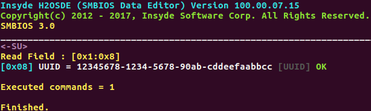
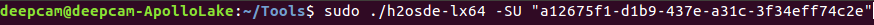
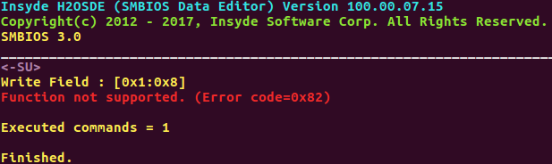
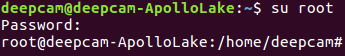
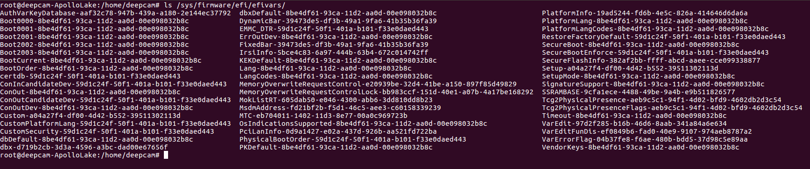
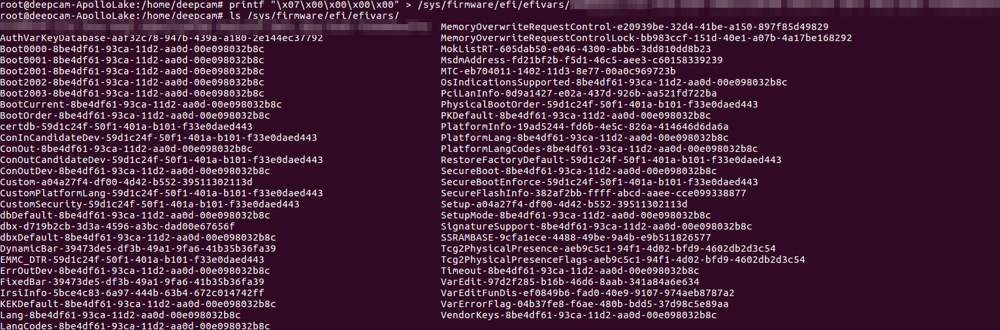
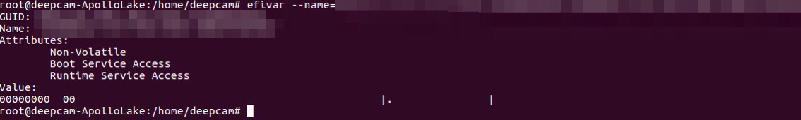
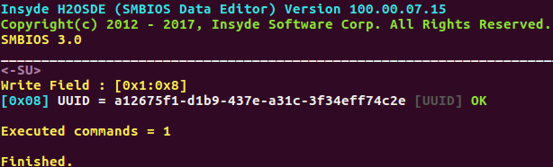
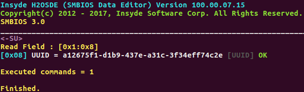
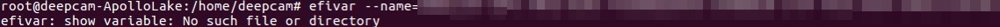

# SMBIOS - r/w guide

[TOC]

## 1. Try to read/write UUID from/to SMBIOS

### 1.1. Read UUID

- `sudo ./h2osde-lx64 -SU`

>

- You can see the UUID

> 

### 1.2. Write UUID

- `sudo ./h2osde-lx64 -SU <<UUID>>`

> 

- Then got a write reject error message.

>

## 2. Close the write protect for SMBIOS

### 2.1. Switch to root

- `su root`

> 

### 2.2. Check the exist efi variables

- `ls /sys/firmware/efi/efivars/`

> 

### 2.3. Add the special efi variable and check

- `printf "\x07\x00\x00\x00\x00" > /sys/firmware/efi/efivars/<variable>`

> 

- You can also check it by using `efivar` tool.
- `efivar --name=<GUID>-<Name>`

> 

## 3. Try to write UUID to SMBIOS again

### 3.1. Write UUID

- `sudo ./h2osde-lx64 -SU <UUID>`

> 

- Got the write success message

> 

### 3.2. Read UUID just for check

- `sudo ./h2osde-lx64 -SU`

> 

- Got the new UUID

> 

## 4. Open the write protect for SMBIOS

### 4.1. Remove the special efi variable

- `chattr -i /sys/firmware/efi/efivars/<variable>`
- `rm /sys/firmware/efi/efivars/<variable>`

> 

### 4.2. Check the variable not exist

- `efivar --name=<GUID>-<Name>`

> 

## 5. Write UUID for check SMBIOS be protected again

- `sudo ./h2osde-lx64 -SU <UUID>`

> 

- Then got a write reject error message.

> 

## Appendix

### A. read/write Serial number / UUID / SSID / Password
>
> - **Serial number** using:`-SS`
>EX:`./h2osde-lx64 -SS <Serial number>`
> - **UUID** using:`-SU`
>EX:`./h2osde-lx64 -SU <UUID>`
> - **SSID** using:`-CS`
>EX:`./h2osde-lx64 -CS <SSID>`
> - **password** using:`-CA`
>EX:`./h2osde-lx64 -CA <Password>`

### B. SMBIOS mapping table

**Type 1: System Serial Number**
Serial number:`echo /sys/class/dmi/id/product_serial`

**Type 1:System UUID**
UUID:`echo /sys/class/dmi/id/product_uuid`

**Type 3:Chassis Serial Number**
SSID:`echo /sys/class/dmi/id/chassis_serial`

**Type 3:Chassis Tag**
Password:`echo /sys/class/dmi/id/shassis_asse`

