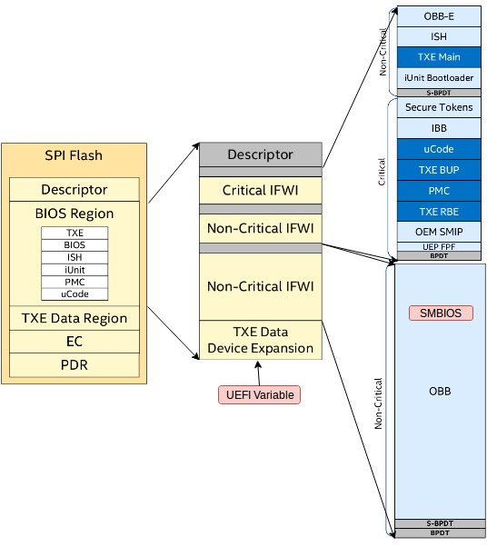
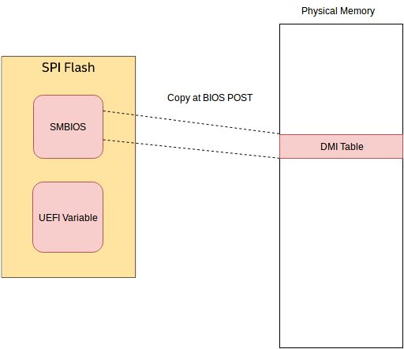
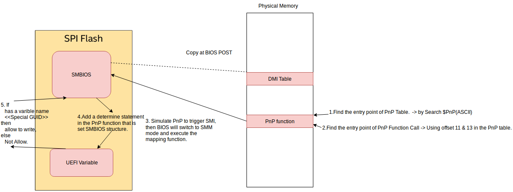

# SMBIOS R/W Flow V1.0

[TOC]

## 1. SMBIOS and UEFI variable location (Apollo lake)

- Store on `SPI Flash Rom`
  

## 2. Read from SMBIOS working flow

- BIOS will copy `SMBIOS data on SPI flash` to `DMI Table on memory` when `Power-On Self Test (POST)` step

## 3. Write to SMBIOS working flow

- Use `PnP function` to set SMBIOS structure.
>
> - It's the `only way` to set SMBIOS at Apollo lake.
> - You can find the info about PnP function at `SMBIOS spec v2.1`.

- In PnP function,it will check `if exist a special variable in UEFI variable`.
- It `is rejected to write SMBIO at default` in the function call because there is `no special variable in SPI Flash`.

1. We create the `special UEFI variable` in Linux before we want to write the SMBIOS.
1. Using the PnP function call.
1. PnP function call will check if exist the special UEFI variable or not.
1. Write data to SMBIOS.
1. Remove the sepcial UEFI variable in Linux after write success.

> NOTE - Modify the DMI table in physical memory is useless, because it will `recover when next boot`.
