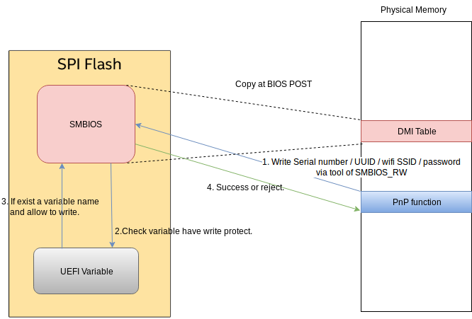

# SMBIOS R/W Flow V1.1

[TOC]

## Read/Write from SMBIOS working flow

- BIOS will copy SMBIOS data on SPI flash to DMI Table on memory when Power-On Self Test (POST) step.

- Use SMBIOS_RW tool to write SMBIOS data in the factory.

### Step 1 - We need to create the special UEFI variable in Linux

### Step 2 - Use the SMBIOS_RW tool to write SMBIOS

### Step 3 - BIOS will check the special UEFI variable exist or not

### Step 4 - Remove the UEFI variable after write success

### Step 5 - Reboot
>
> NOTE - We can't see any information about the special UEFI variable with `/sys/firmware/efi/efivars`.
