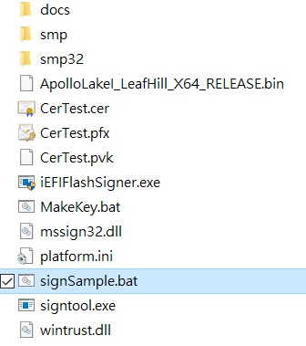

# Secure boot sign flow

[TOC]

## 1. Enable secure boot option

- Boot, entry BIOS Menu, and select `Administer Secure Boot`

- Enable Secure Boot and save

- Press `F10` : "Save and Exit"

> If you can not select `Enforce Secure Boot` option, you need to restore it first.

- Select Option of `Erase all Secure Boot Settings` to `Enabled`
- Select Option of `Restore Secure Boot to Factory Settings` to `Enabled`
- Press `F10` : "Save and Exit"

> 

## 2. Enable kernel module check

- Modify `/boot/grub.cfg` file. Add `module.sig_enforce=1`kernel parameter on your login item.

```bash
        linux   /vmlinuz-4.10.0-28-generic.efi.signed root=UUID=86485143-7912-44e4-b9e4-32d2a660620f ro rootflags=subvol=@  quiet splash $vt_handoff module.sig_enforce=1
        initrd  /initrd.img-4.10.0-28-generic
```

## 3. How to use private key to sign BIOS

- Put BIOS binary into SecurityFlash Folder and check the name is `ApolloLakeI_LeafHill_X64_RELEASE.bin`

- Double click `signSample.bat`

- The signed BIOS binary would be generated and the file name is `isflash.bin`

## 4. How to use private key to sign linux bootloader

- Copy `grubx64.efi` for recovery

 ```bash
 cp /boot/efi/EFI/ubuntu/grubx64.efi /boot/efi/EFI/ubuntu/grubx64.efi.safe
 ```

- Remove signature from signed image

 ```bash
 sbattach --remove /boot/efi/EFI/ubuntu/grubx64.efi
 ```

- Sign image using your private key

 ```bash
 sbsign --key CerTest.key --cert CerTest.crt /boot/efi/EFI/ubuntu/grubx64.efi
 ```

- Verify

 ```bash
 sbverify --verbose /boot/efi/EFI/ubuntu/grubx64.efi.signed
 ```

## 5. How to use private key to sign linux Kernel

- Copy `vmlinuz-4.10.0-28-generic.efi.signed` for recovery

 ```bash
 cp /boot/vmlinuz-4.10.0-28-generic.efi.signed /boot/vmlinuz-4.10.0-28-generic.efi.signed.safe
 ```

- Sign image using your private key.

 ```bash
 sbsign --key CerTest.key --cert CerTest.crt /boot/vmlinuz-4.10.0-28-generic
 ```

- Verify:

 ```bash
 sbverify --verbose /boot/vmlinuz-4.10.0-28-generic.signed
 ```

## 6. How to use private key to sign Kernel Module

- To sign kernel modules, we can use the `kmodsign` command

 ```bash
 kmodsign sha512 CerTest.key CerTest.cer phy_alloc.ko
 ```

- Verify:

 ```bash
 $ hexdump -Cv phy_alloc.ko | tail -n 5
 000023d0  d1 b4 89 d0 a7 99 99 fd  7e 89 8a 95 ff b5 3b d0  |........~.....;.|
 000023e0  5c e7 00 00 02 00 00 00  00 00 00 00 01 a2 7e 4d  |\.............~M|
 000023f0  6f 64 75 6c 65 20 73 69  67 6e 61 74 75 72 65 20  |odule signature |
 00002400  61 70 70 65 6e 64 65 64  7e 0a                    |appended~.|
 0000240a
 ```
