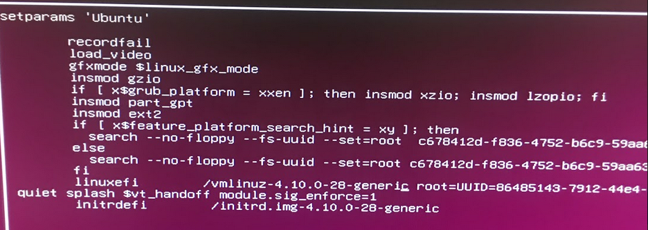

# Secure boot test flow

[TOC]

## 1. Bootloader

- Choose `Boot From File` from your BIOS menu,and choose the unsigned bootloader `/EFI/ubuntu/grubx64.efi` to boot.

- You will get an error message.

- Choose `Boot From File` from your BIOS menu again,and choose the signed bootloader `/EFI/ubuntu/grubx64.efi.signed`.
- Then you can launch bootloader success.


## 2. Kernel

- Boot to grub configure menu from shim.

- When enter the grub configure menu, press `e` to set the lunch kernel configure.
- Modify the `linux` to `linuxefi`and modify`/vmlinuz-<version>.efi.sign` to `/vmlinuz-<version>`.

- Press `F10` and you will got an error message. Because unsigned kernel is invalid. If you modify the `/vmlinuz-<version>.efi.sign` to the kernel signed by your private key, then you can login to user space.


## 3. Kernel Module

- Check your kernel module have not been signed.

```bash
$ hexdump -Cv phy_alloc.ko | tail -n 5
00002200  09 00 00 00 03 00 00 00  00 00 00 00 00 00 00 00  |................|
00002210  00 00 00 00 00 00 00 00  88 10 00 00 00 00 00 00  |................|
00002220  bd 02 00 00 00 00 00 00  00 00 00 00 00 00 00 00  |................|
00002230  01 00 00 00 00 00 00 00  00 00 00 00 00 00 00 00  |................|
00002240
```

- Use the `kmodsign` command to sign kernel modules.

```bash

kmodsign sha512 CerTest.key CerTest.cer phy_alloc.ko phy_alloc.ko.sign
```

- Check your module `phy_alloc.ko.sign` have been signed.

```bash
$ hexdump -Cv phy_alloc.ko.sign | tail -n 5
000023d0  d1 b4 89 d0 a7 99 99 fd  7e 89 8a 95 ff b5 3b d0  |........~.....;.|
000023e0  5c e7 00 00 02 00 00 00  00 00 00 00 01 a2 7e 4d  |\.............~M|
000023f0  6f 64 75 6c 65 20 73 69  67 6e 61 74 75 72 65 20  |odule signature |
00002400  61 70 70 65 6e 64 65 64  7e 0a                    |appended~.|
0000240a
```

- Load the unsigned module, you will get an error message.

```bash
$ sudo insmod phy_alloc.ko
insmod: ERROR: could not insert module phy_alloc.ko: Required key not available
```

- Load the signed module and check it is be loaded on your kernel.

```bash
$ sudo insmod phy_alloc.ko.sign

$ lsmod | grep phy_alloc
phy_alloc              16384  0
```
