# SoC MMIO guide

[TOC]

## 1. IOSF-SB Private CR Space

### 1-1. IOSF-SB是什麼？

- `BIOS Spec`[^BIOS]提到，IOSF-SB為低速周邊裝置的控制器
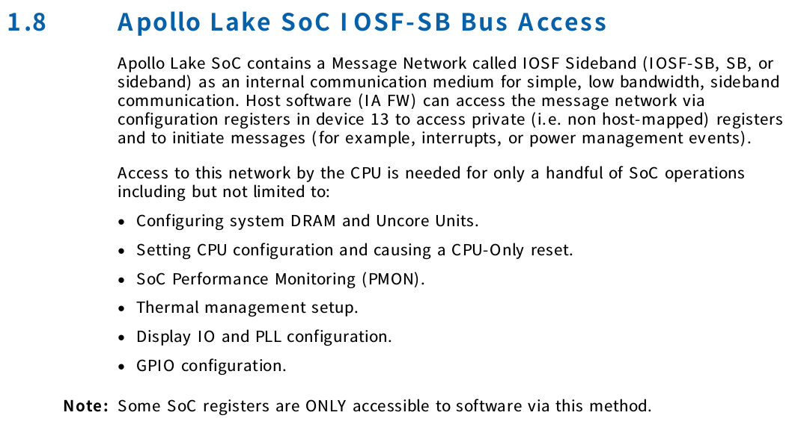[^BIOS]

- 可經由PCI`0/13/0`取得PCI Configuration Space
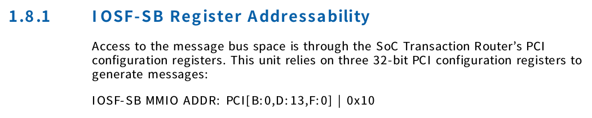[^BIOS]
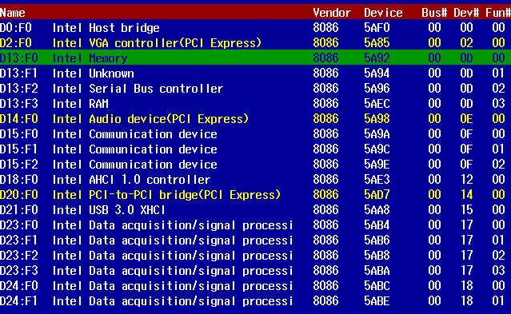

- 透過PCI Configuration Space中`0x10-0x13`的4 Bytes，取得IOSF-SB MMIO 的`BAR`(Base address register)
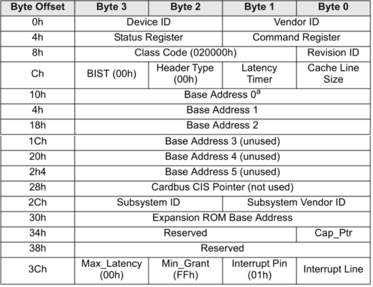

- 目前設定為`0xD0000004`
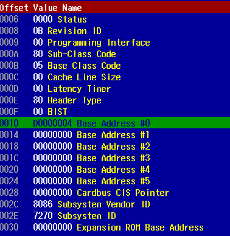

### 1-2. 如何讀寫IOSF-SB下的Device registers?

- EDS 2-7節[^EDS]提到,可透過`P2SB`(Primary to Sideband Bridge )對IOSF-SB下達`CRRd & CRWr` opcodes.
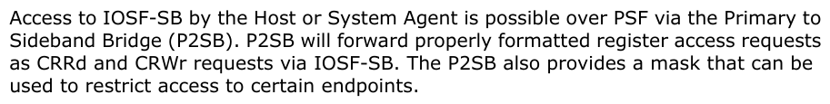[^EDS]
- P2SB有兩種使用方式，僅講解第1種:`MMIO`
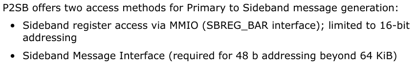[^EDS]
- 算法如下
[^EDS]
- 以`USB2`為例
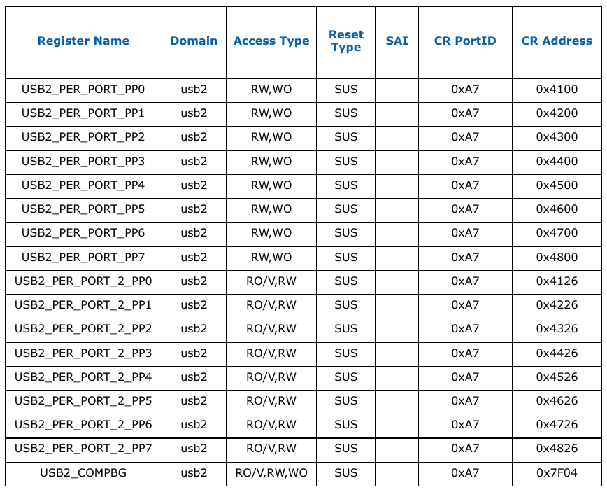[^EDS]
- 到Memory `0xD0A74100` ，即可看到`USB2_PER_PORT_PP0` register值
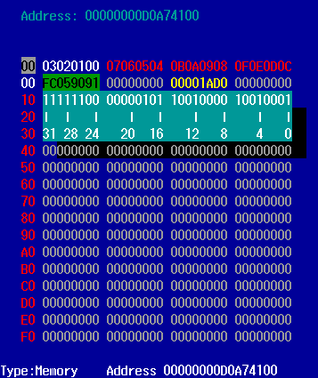

### 1-3. 所有IOSF-SB下Device Port

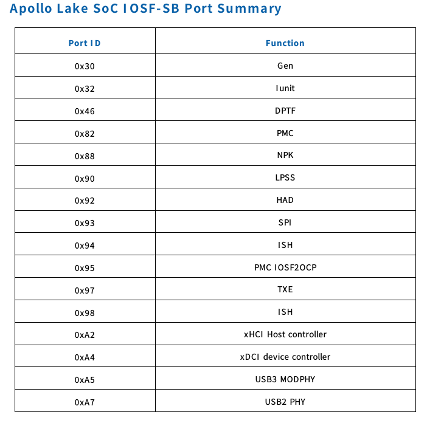[^BIOS]
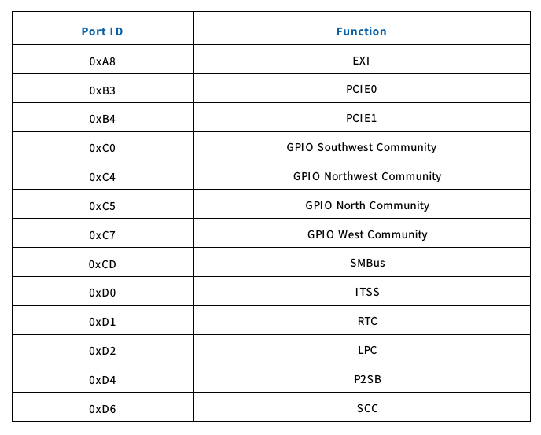[^BIOS]

## Appendix A. 參考文獻

[^BIOS]: `Intel Pentium and Celeron Processor N- and J- Series Formerly Apollo Lake Intel Architecture Firmware Specification Volume 1 of 2 BIOS Specification Revision 2.0` (559810)

[^EDS]: `Apollo Lake SoC External Design Specification Volume 2 of 4` (557556)
