# Stress test tools using guide V1.0

[TOC]

## 0. Open console

1. Log in to the operating system and click the upper left corner `Search your computer`
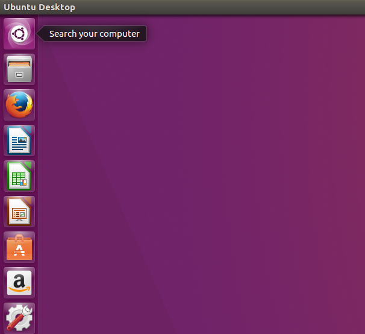

2. Enter `terminal` then select the icon
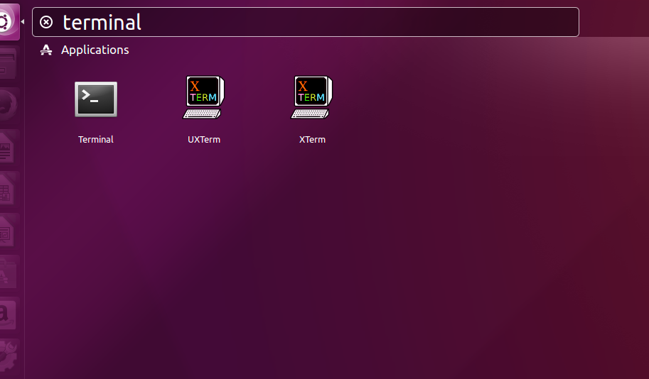

> - If any command notify you to enter the root password,enter `deepcam`
> - Example: `sudo`
> 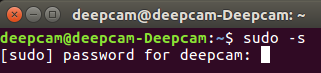

## 1. Memory

1. Click the icon on Desktop
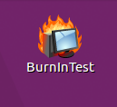
2. Click `OK` to ignore the error message.
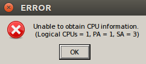
3. Click the icon
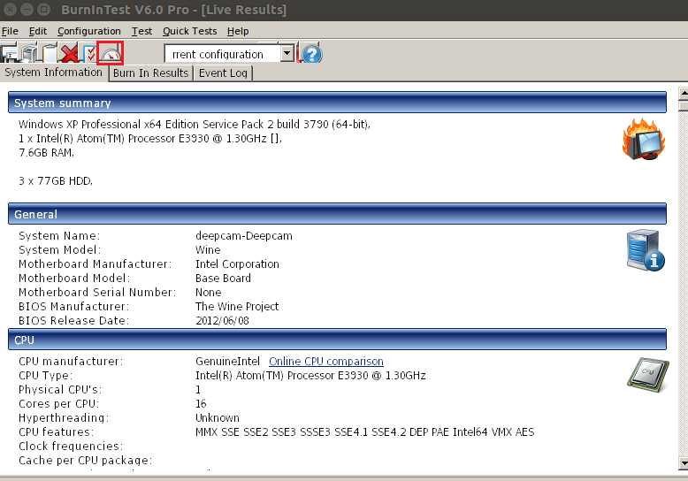
4. Check `RAM` then click OK.
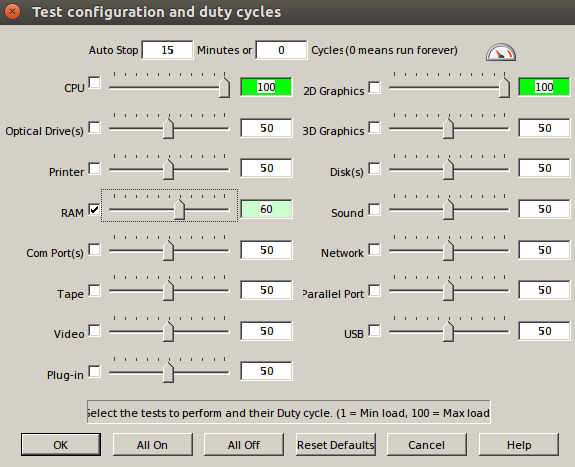

5. Running by click the icon that hidden the block.
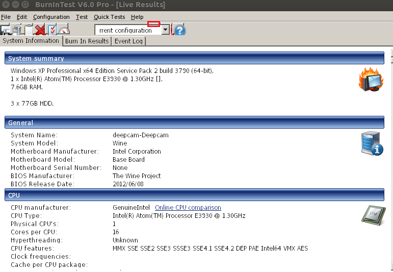

6. Click OK
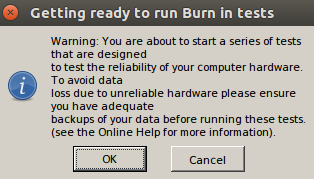

7. Click Stop if you want.

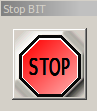

## 2. CPU

1. Enter `stress --cpu 5`  on the console that you open in Step 0.
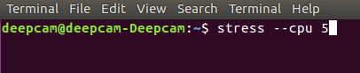
2. Open a new console and enter `top`,you can see the stress process filled the CPU.
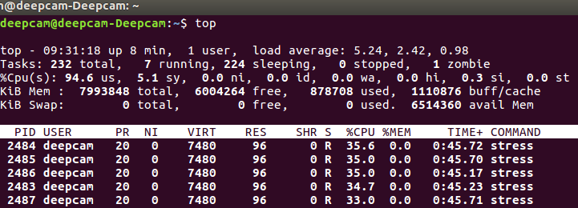
3. Type `Ctrl+C` to close `top` and `stress --cpu 5` if you want to stop.

## 3. Camera

1.Enter `/home/deepcam/camera/CAM_dual_mode_preview_1.sh` first to open h264 codec video stream.

2. Open a new console and enter`/home/deepcam/camera/CAM_dual_mode_preview_2.sh`to open mjpeg codec video stream.
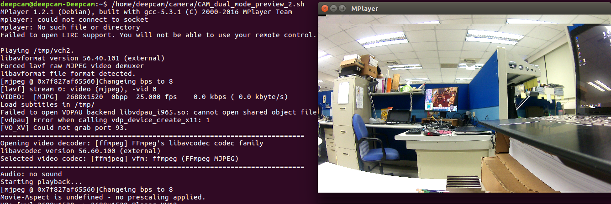

## 4. Audio Play

- Just click the `Notify.wav` on the Desktop

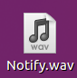
