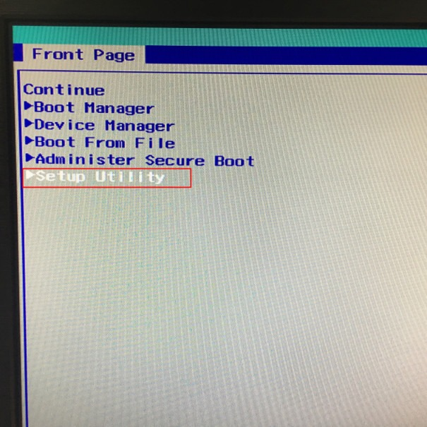
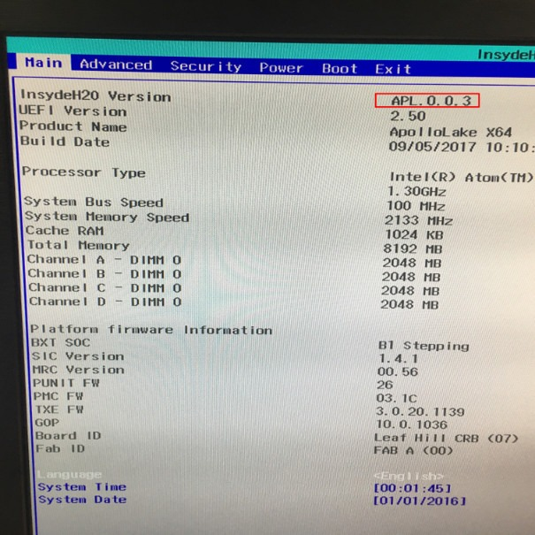
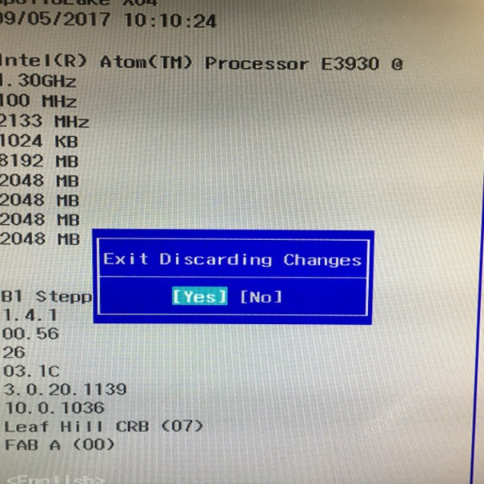
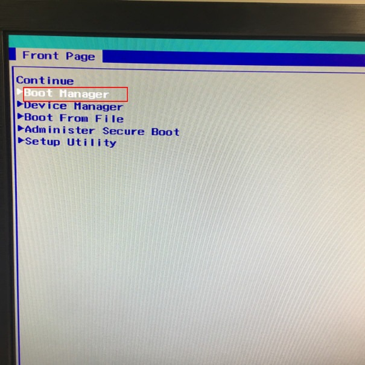
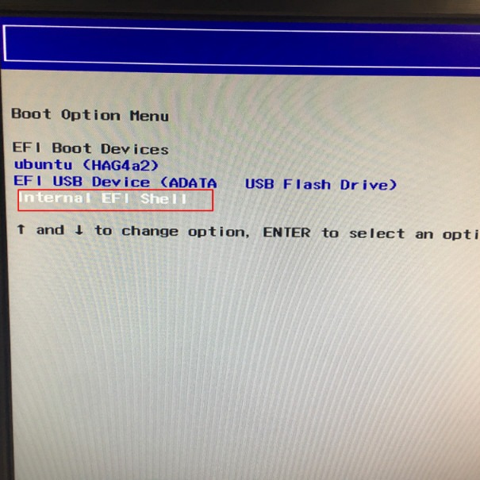
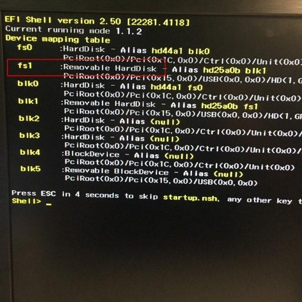
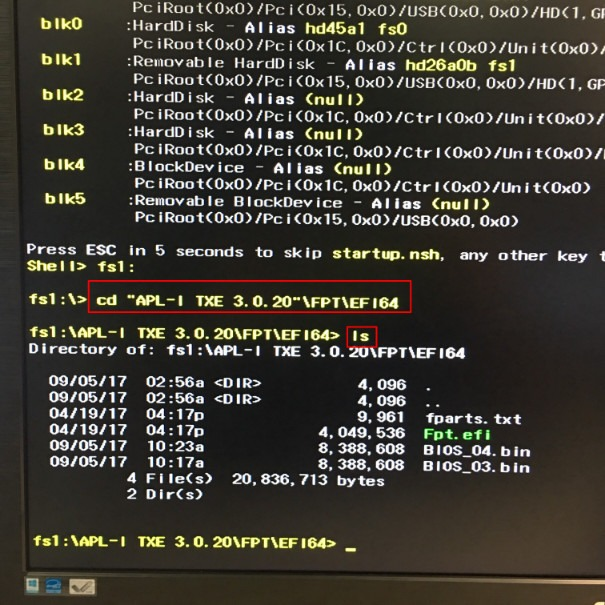
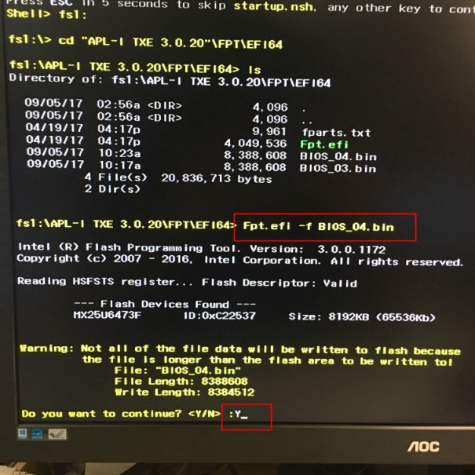
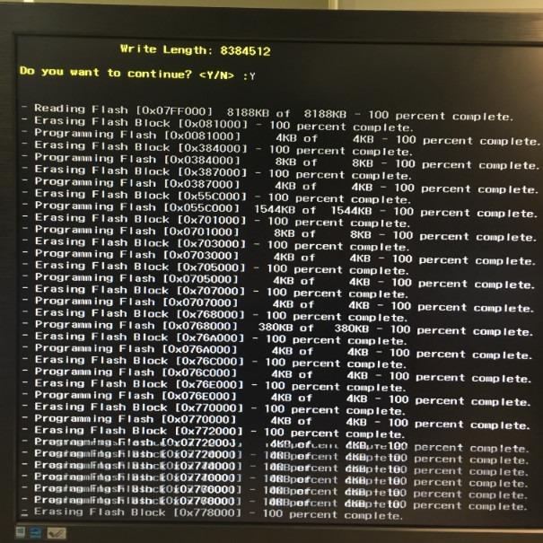
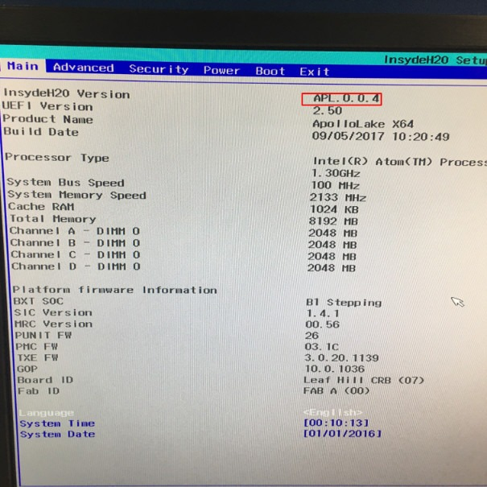

# Update guide

[TOC]

## Update 8M on UEFI

1. Prepare the USB that contain the binary of `BIOS` and `Tool` folder.

> You can put binary of  BIOS to `Tool/FPT/`

2. Plug in the USB and power on , then press `ESC` key for entry to`BIOS setup menu`

3. Select `Setup Utility`to check BIOS version.

4. Press `ESC` and choice `Yes` for go back.

5. Select `Boot Manager`and press enter key

6. Select `Internal EFI Shell` and press enter key

7. Search the device name of `Removable HardDisk`, that's your USB device.
    Type `<Your USB device name>:`and press enter key

> For example: `fs1:`

8. Change the location to flash tool folder.

> For example , `cd Tool\FPT`and press enter key.
> You can type `ls` for check the files in this folder.

9. Type `Fpt.efi -f <Binary of BIOS>` ,then enter `Y`.

10. Wait for update **complete**.

11. Power **off**

12. Power **on** and **wait for a while at first time**.

13. Press `ESC` key for entry to`BIOS setup menu`.

14. Select `Setup Utility`to check changed BIOS version.

