# RTOS

[TOC]

## RTOS

- OS就是一種**Resource Manager**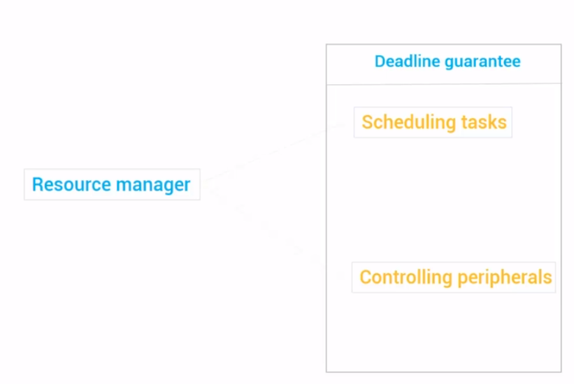
- 如果這個OS是循序loop地執行task，那麼你很難**預估每個task真正開始被執行的時間**
  - 尤其是不確定前面的task何時執行完畢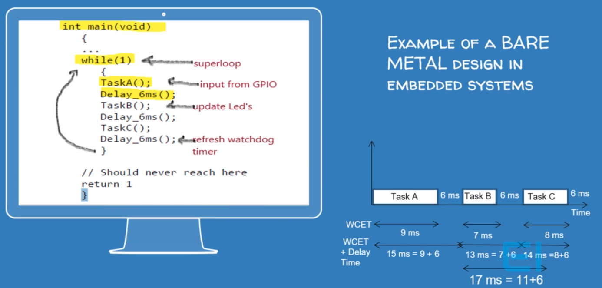
  - 較好的方式是輪流執行一定的時間量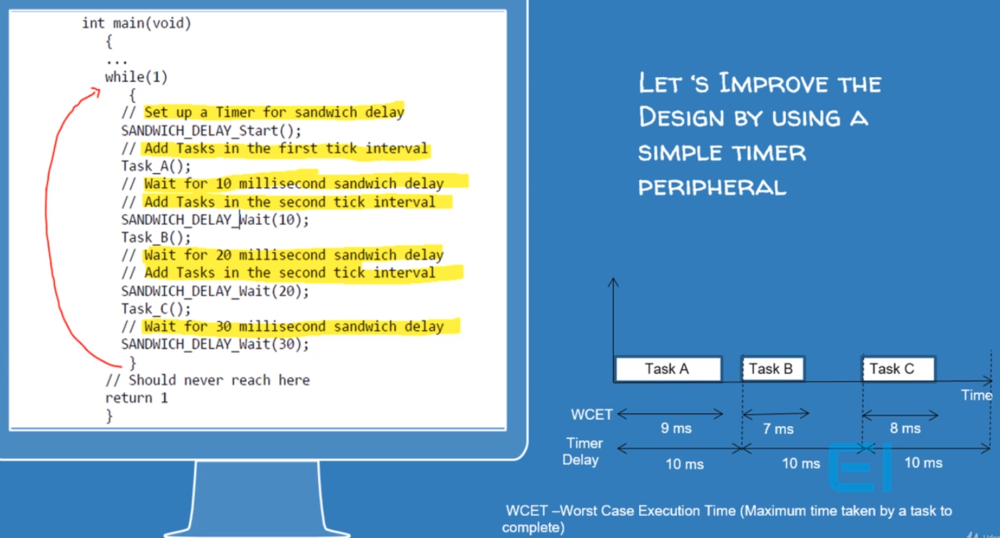
  - 讓每個task就像是有一個thread在負責一樣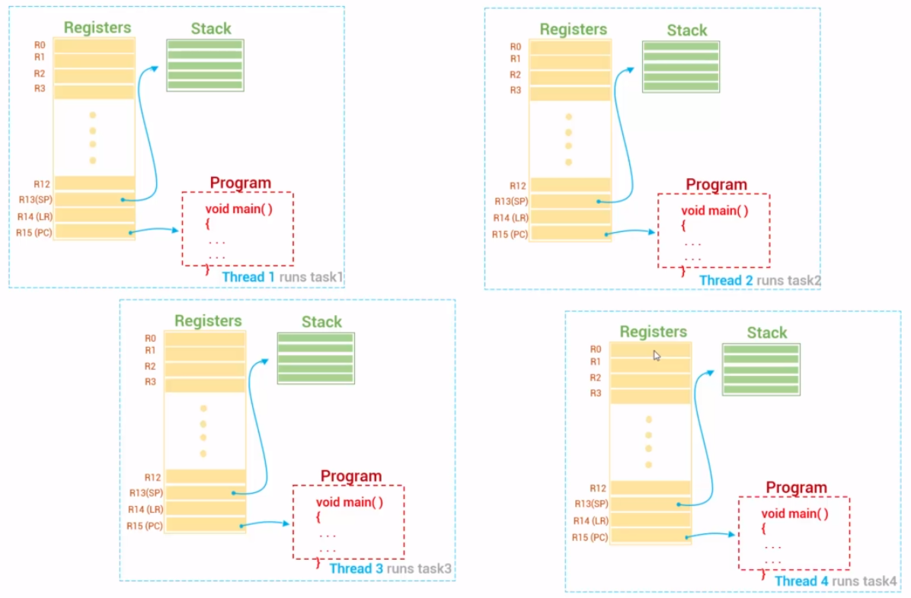
    - 但實際上只有一個CPU
      - 也就是只有一組register，一次負責一個process
    - 只是透過排程的方式，每個task(或稱function)輪流執行
- Real-Time代表在有限的等待時間內，保證被執行（不保證執行完）
  - `Hard real time` - 不允許Delay
  - `Firm real time` - 允許Delay，但品質下降
  - `Soft real time` - 允許Delay，一般priority bases都是這種
- Kernel可以大概分成三種
  - `Monolithic kernel`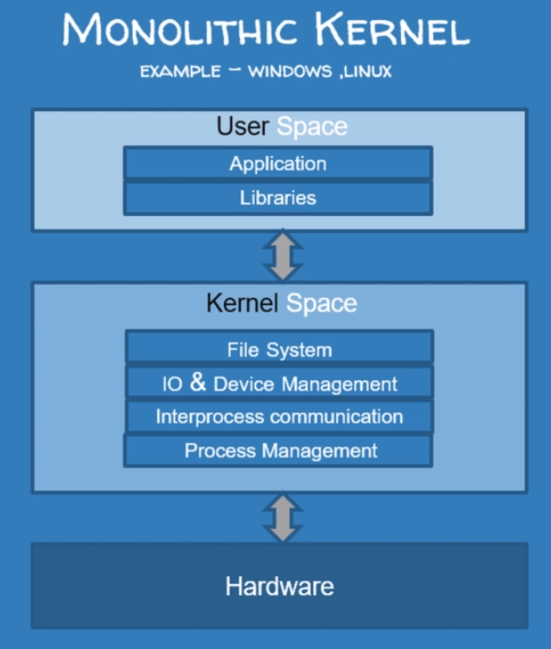
  - `microkernel`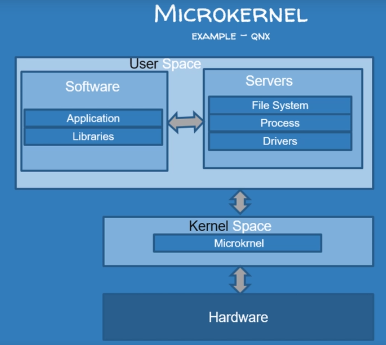
  - `Exokernel`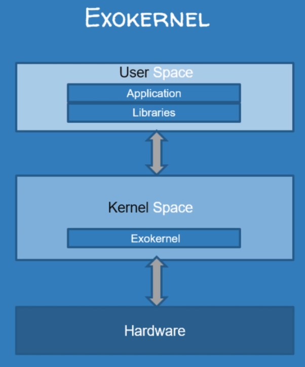

### Scheduler

- co-operative scheduler<br>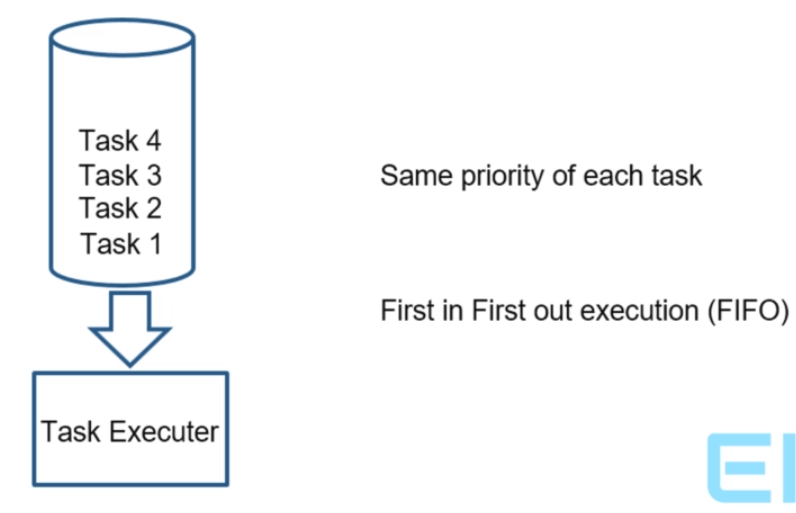
- pre-emptive<br>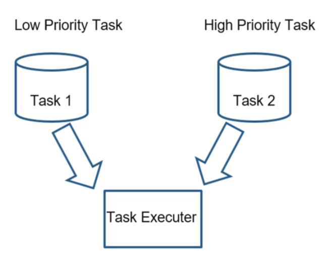
- hybird scheduler<br>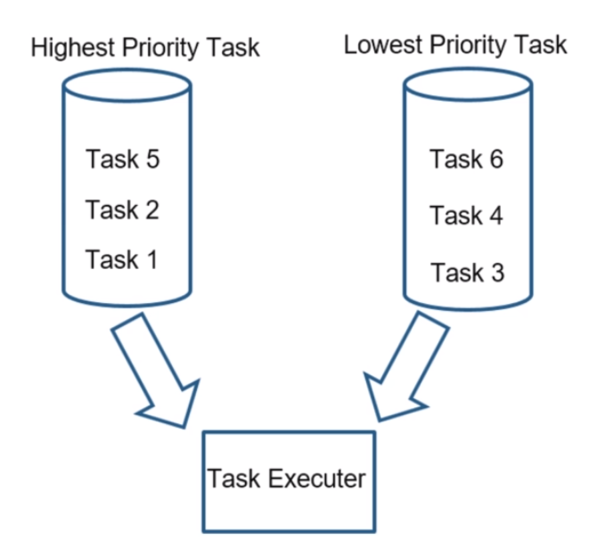

#### Non-Preemptive & Preemptive

- **Non-Preemptive**
  - CPU被分配給task，**直到task終止**或**task自行切換到等待狀態**
    - 一般task都會跑在`while(1)`，所以變成只有一個task執行
- **Preemptive**
  - CPU在**有限時間**內被分配給task
    - 因此，**Preemptive**需要interrupts
  - 如果高優先級task經常到達就緒隊列，低優先級的task必須等待很長時間，甚至可能**餓死**
  - 必須保持共用資料的完整性(`mutex`)
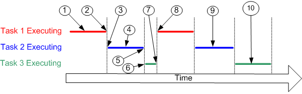
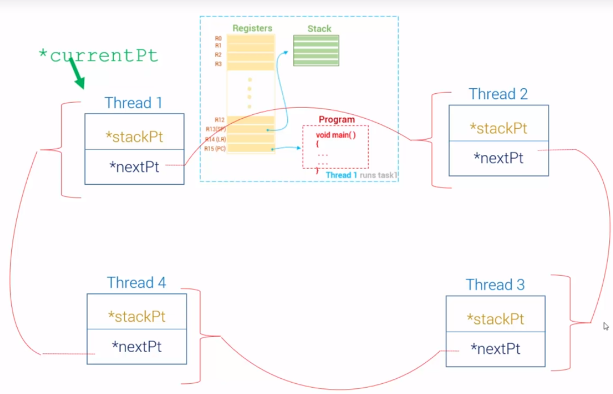
- 優先級高的先執行
- 優先級一樣的的話，先來的task先執行
- 沒有**硬體TIMER**的**中斷**支援，RTOS根本無法做到Preemption

#### Static & Dynamic

- **Static** - 執行task前就決定task的priority，且**不可改變**
- **Dynamic** - 執行task前就決定task的priority，但**可run time改變**
- 所以可以區分以下4種type的Scheduler algorithms
  - **Static Preemptive**
  - **Dynamic Preemptive**
  - **Static Non-Preemptive**
  - **Dynamic Non-Preemptive**

#### Scheduler criteria

- Arrival time
- Burst time
- Service time
- Wait time - Service time-Arrival time
- **Turnaround time**(愈小愈好) - Burst time + Wait time
- **Throughput**(愈大愈好) - 完成任務數/單位時間
- **CPU Utilization**(愈大愈好)  - $\sum_{i=1}^{n} \frac{C_i}{T_i}$
  - C = 每個task最大執行時間
  - T = 每個task所用的Period
  - n = Task數
  - 例子：
    - CPU speed = 80 Million cycles/second = 80MGz
    - CPU Utilization = 45 Million cycles/second = 45MGz
    - CPU Utilization Rate = $\frac{45}{80}$ = 56.25%

#### Algorithm

- 大部份的排程演算的好壞，跟一些參數有關
  - Task數
  - Arrival time
  - Burst time
  - Context switch time
  - interrupt Service延遲
  - Process sync delay

##### First Come First Serve (FCFS) Scheduler

- 先來的task先執行
- **Non-Preemptive**
- 原理就是一個FIFO queue
- 平均wait time很高
  - performance很差

|說明| 圖左      |     圖右 |
|:-:| :--------: | :--------:|
|已知| 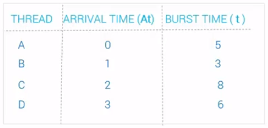  |   |
|結果|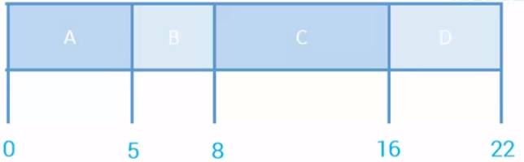 |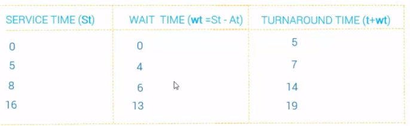|
|效能|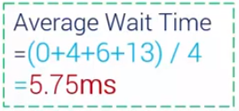|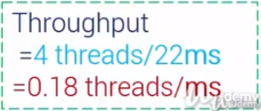|

##### Round Robin (RR) Scheduler

- **Preemptive**
- 每個task執行一個timeslice(Quanta)
  - Quanta極大，則**RR=FCFS**
  - Quanta極小，則**RR=True processor sharing**
  - Quanta小 = Context Switching 多
  - Quanta不應該比Context-Switch time高

|說明| 圖左      |     圖右 |
|:-:| :--------: | :--------:|
|已知| 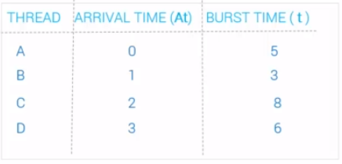  |  |
|結果|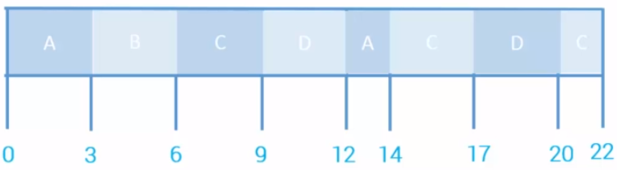 |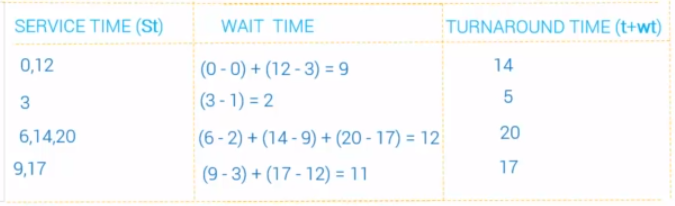|
|效能|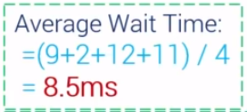|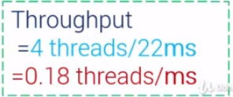|

##### Weighted Round Robin (WRR) Scheduler

- 同RR，只是每個Task有不同的weight
- 為了滿足較高的weight應獲得較多的資源，有兩種實作方式
| Varying Quanta      |     Varying Frequency |
|:-:| :-: |
| Task Quanta = Quanta * Weight |  增加task在Ready Queue的數量 |
| 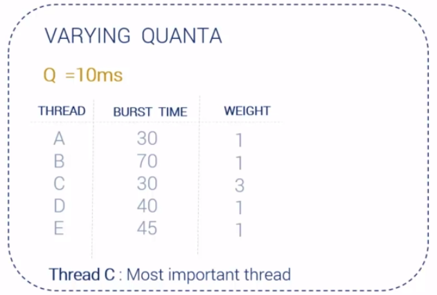 |   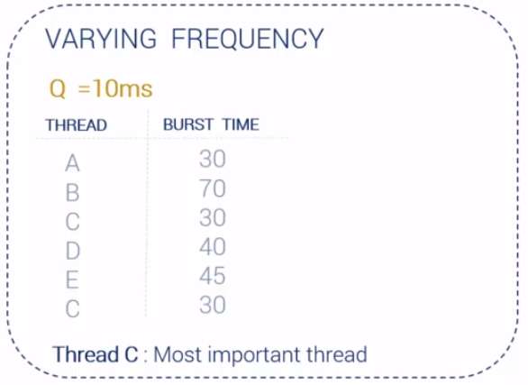

##### Rate Monotonic (RM) Scheduler

##### Shortest Job First (SJF) Scheduler

### 極簡範例

```cpp
void Task1(){}
void Task2(){}
void Task3(){}
void Task4(){}

void (*TaskFunctionPointerArray[4])() ={Task1, Task2, Task3, Task4};

void main()
{
 int Taskld;
 while (1)
 {
  for (Taskld = 0; Taskld < 4; Taskld++)
  {
   (*TaskFunctionPointerArray[Taskld])();
  }
 }
}
```

### 錯誤觀念

- RTOS must be fast
  - 是因為有即時需求
- RTOS demands huge processing power from CPU
  - 要看你需要的演算，調整計時周期
- All RTOS's are same
  - 有很多種實作，如FreeRTOS,QNX,eCos

## FreeRTOS

### 原始碼

- `tasks.c`：主要掌管 task 的檔案
- `queue.c`：管理 task 間 communication (message queue 的概念)
- `timer.c`
- `event_groups.c`
- 與硬體相關的檔案
  - `portmacro.h`：定義了與硬體相關的變數，如資料型態定義，以及與硬體相關的函式呼叫名稱定義(以 portXXXXX 命名)等，統一各平臺的函式呼叫
  - `port.c`：定義了包含與硬體相關的程式碼實作
  - `FreeRTOSConfig.h`：包含 clock speed, heap size, mutexes 等等都在此定義(需自行建立)

### 資料型態及命名規則

#### 變數

- `char` 類型：以 `c` 為字首
- `short` 類型：以 `s` 為字首
- `long` 類型：以 `l` 為字首
- `float` 類型：以 `f` 為字首
- `double` 類型：以 `d` 為字首
- `Enum` 變數：以 e 為字首
- `portBASE_TYPE` 或其他（如 struct）：以 `x` 為字首
- `pointer` 有一個額外的字首 `p` , 例如 short 類型的 pointer 字首為 ps
- `unsigned` 類型的變數有一個額外的字首 `u` , 例如 unsigned short 類型的變數字首為 us
- `portTickType` : 用以儲存tick的計數值，可以用來判斷block次數
- `portBASE_TYPE` : 定義為架構基礎的變數，隨各不同硬體來應用，如在32-bit架構上，其為32-bit型態，最常用以儲存極限值或布林數。

#### 函式

- 以回傳值型態與所在檔案名稱為開頭(prefix)
  - `vTaskPriority()` 是 `task.c` 中回傳值型態為 `void` 的函式
  - `xQueueReceive()` 是 `queue.c` 中回傳值型態為 `portBASE_TYPE` 的函式
- 只能在該檔案中使用的 (scope is limited in file) 函式，以 `prv` 為開頭 (private)

#### 巨集名稱

- 巨集在FreeRTOS裡皆為**大寫**字母定義，名稱前小寫字母為巨集定義的地方
  - `portMAX_DELAY` : portable.h
  - `configUSE_PREEMPTION` : FreeRTOSConfig.h
- 一般巨集回傳值
  - `pdTRUE` 及 `pdPASS`為1
  - `pdFALSE` 及 `pdFAIL` 為0

### Task

- Ready：準備好要執行的狀態
- Running：正在由 CPU 執行的狀態
- Blocked：等待中的狀態(通常是在等待某個事件)
- Suspended：等待中的狀態(透過 API 來要求退出排程)
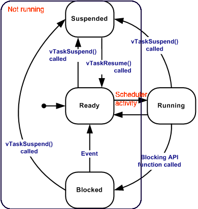

#### Blocked & Suspended

- Blocked
  - 如果有個 task 將要等待某個目前無法取得的資源(被其他 task 佔用中)，則會被設為 blocked 狀態
  - 是被動的，OS 會呼叫 blocking API 來設定 task 進入 blocked queue
- Suspended
  - task 主動呼叫 API 來要求讓自己進入暫停狀態的

#### 範例1

- `TaskHandle_t`
- `xTaskCreate`
- `vTaskPrioritySet`
  - 參數NULL則為當前task
- `uxTaskPriorityGet`
  - 參數NULL則為當前task

```cpp
#include <Arduino_FreeRTOS.h>

#define RED     6
#define YELLOW  7
#define BLUE    8

const uint16_t *blueLed =(uint16_t *) BLUE; 
const uint16_t *redLed  =(uint16_t *)RED;
const uint16_t *yellowLed = (uint16_t)YELLOW;

TaskHandle_t blue_Handle, red_Handle,yellow_Handle;

void setup() 
{
  Serial.begin(9600);
  red_Handle = xTaskCreate(ledControllerTask,"RED LED Task",100,(void *)redLed ,1,NULL);
  blue_Handle = xTaskCreate(ledControllerTask, "BLUE LED Task", 100,(void *)blueLed,1,NULL);
  yellow_Handle = xTaskCreate(ledControllerTask,"YELLOW LED Task", 100, (void *)yellowLed,1,NULL);
}

void ledControllerTask(void *pvParameters)
{ 
  pinMode(RED,OUTPUT);
  pinMode(BLUE,OUTPUT);
  pinMode(YELLOW,OUTPUT);
 
  while(1)
  {
    digitalWrite(pvParameters,digitalRead(pvParameters)^1);
    vTaskPrioritySet(NULL,uxTaskPriorityGet(NULL)+1);
  }
}
void loop() {}
```

#### 範例2

- `vTaskSuspend`
  - 參數NULL則為當前task
- `vTaskResume`
  - 參數NULL則為當前task
- `vTaskDelay`

```cpp
#include <Arduino_FreeRTOS.h>

#define RED    6
#define YELLOW 7
#define BLUE   8

typedef int TaskProfiler;

TaskProfiler RedLEDProfiler, YellowLEDProfiler, BlueLEDProfiler;
TaskHandle_t blue_Handle, red_Handle, yellow_Handle;

uint32_t suspend_monitor, resume_monitor;
bool _suspended = false;
const TickType_t _50ms = pdMS_TO_TICKS(50);

void setup()
{
 Serial.begin(9600);
 xTaskCreate(redLedControllerTask, "Red LED Task", 100, NULL, 1, &red_Handle);
 xTaskCreate(blueLedControllerTask, "Blue LED Task", 100, NULL, 1, &blue_Handle);
 xTaskCreate(yellowLedControllerTask, "Yellow LED Task", 100, NULL, 1, &yellow_Handle);
}

void redLedControllerTask(void *pvParameters)
{
 pinMode(RED, OUTPUT);

 while (1)
 {
  digitalWrite(RED, digitalRead(RED) ^ 1);
  RedLEDProfiler++;
  Serial.print("RED Run Time : ");
  Serial.println(RedLEDProfiler);
  vTaskDelay(10);
 }
}

void blueLedControllerTask(void *pvParameters)
{
 pinMode(BLUE, OUTPUT);
 while (1)
 {
  digitalWrite(BLUE, digitalRead(BLUE) ^ 1);
  BlueLEDProfiler++;
  Serial.print("BLUE Run Time :");
  Serial.println(BlueLEDProfiler);
  suspend_monitor++;

  if ( suspend_monitor >= 30 )
  {
   _suspended = true;
   suspend_monitor = 0;

   vTaskSuspend (NULL);
  }
  vTaskDelay(_50ms);
 }
}

void yellowLedControllerTask(void *pvParameters)
{
 pinMode(YELLOW, OUTPUT);
 while (1)
 {
  digitalWrite(YELLOW, digitalRead(YELLOW) ^ 1);
  YellowLEDProfiler++;
  Serial.print("YELLOW Run Time : ");
  Serial.println(YellowLEDProfiler);
  Serial.println(" ");

  vTaskDelay(_50ms);
  if ( _suspended )
  {
   resume_monitor++;
   if ( resume_monitor >= 10 )
   {
    vTaskResume(blue_Handle);
    resume_monitor = 0;
    _suspended = false;
   }
  }
 }
}

void loop(){}
```

### Queue

- Task之間互相溝通用的結構
- 其實就是message queue

#### 範例1

- `QueueHandle_t`
- `xQueueCreate`
- `xQueueSend`
- `xQueueReceive`

```cpp
#include <Arduino_FreeRTOS.h>
#include "queue.h"

typedef int TaskProfiler;

TaskProfiler SenderProfiler;
TaskProfiler receiverProfiler;

typedef enum
{
 eSender1, eSender2,
} DataSource_t;

typedef struct
{
 uint8_t ucValue;
 DataSource_t eDataSource;
} Data_t;

static const Data_t xStructToSend[2] = { { 100, eSender1 }, { 50, eSender2 } };

QueueHandle_t xQueue;
void setup()
{
 Serial.begin(9600);
 xQueue = xQueueCreate(3, sizeof(Data_t));

 xTaskCreate(vSenderTask, "Sender Task 1", 100, &(xStructToSend[0]), 2, NULL);
 xTaskCreate(vSenderTask, "Sender Task 2", 100, &(xStructToSend[1]), 2, NULL);
 xTaskCreate(vReceiverTask, "Receiver Task", 100, NULL, 1, NULL);
}

void vSenderTask(void *pvParameters)
{
 BaseType_t xStatus;
 const TickType_t xTicksToWait = pdMS_TO_TICKS(100);
 while (1)
 {
  xStatus = xQueueSend(xQueue, pvParameters, xTicksToWait);
  if ( xStatus != pdPASS )
  {
   Serial.println("Could not send to the queue ");
  }
 }
}

void vReceiverTask(void *ovParameters)
{
 Data_t xReceivedStructure;
 BaseType_t xStatus;

 while (1)
 {
  xStatus = xQueueReceive(xQueue, &xReceivedStructure, 0);
  if ( xStatus == pdPASS )
  {
   if ( xReceivedStructure.eDataSource == eSender1 )
   {
    Serial.print("Thi is from sender 1  : ");
    Serial.println(xReceivedStructure.ucValue);
   }
   else
   {
    Serial.print("This is from sender 2 : ");
    Serial.println(xReceivedStructure.ucValue);
   }
  }
  else Serial.println("Could not receive data from the queue");
 }
}

void loop() {}
```

#### 範例2

- `QueueSetHandle_t`
- `xQueueCreateSet`

```cpp
#include <Arduino_FreeRTOS.h>
#include "queue.h"

#define   RED     6
#define   YELLOW  7
#define   BLUE    8

QueueHandle_t xQueue1, xQueue2;
QueueSetHandle_t xQueueSet;

void setup()
{
 pinMode(BLUE, OUTPUT);
 Serial.begin(9600);
 xQueue1 = xQueueCreate(1, sizeof(char *));
 xQueue2 = xQueueCreate(1, sizeof(char *));
 xQueueSet = xQueueCreateSet(1 * 2);

 xQueueAddToSet(xQueue1, xQueueSet);
 xQueueAddToSet(xQueue2, xQueueSet);

 xTaskCreate(vSenderTask1, "Sender Task 1 ", 100, NULL, 1, NULL);
 xTaskCreate(vSenderTask2, "Sender Task 2 ", 100, NULL, 1, NULL);
 xTaskCreate(vReceiverTask, "Receiver Task", 100, NULL, 2, NULL);
}

void vSenderTask1(void *pvParameters)
{
 const TickType_t xBlockTime = pdMS_TO_TICKS(100);
 const char * const messageToSend = " Message from Sender 1 ";

 while (1)
 {
  vTaskDelay(xBlockTime);
  xQueueSend(xQueue1, &messageToSend, 0);
 }
}

void vSenderTask2(void *pvParameters)
{
 const TickType_t xBlockTime = pdMS_TO_TICKS(200);
 const char * const messageToSend = "Hello from Sender 2 ";

 while (1)
 {
  vTaskDelay(xBlockTime);
  xQueueSend(xQueue2, &messageToSend, 0);
 }
}

void vReceiverTask(void *pvParameters)
{
 QueueHandle_t xQueueThatContainsData;
 char *pcReceivedString;

 while (1)
 {
  xQueueThatContainsData = (QueueHandle_t) xQueueSelectFromSet(xQueueSet, portMAX_DELAY);

  xQueueReceive(xQueueThatContainsData, &pcReceivedString, 0);
  Serial.println(pcReceivedString);
 }
}

void loop(){}
```

#### 範例3

- `vTaskDelayUntil`
- `xQueueReceiveFromISR`
- `xQueueSendToBackFromISR`

```cpp
#include <Arduino_FreeRTOS.h>
#include "queue.h"
#define   RED   6
#define   YELLOW    7
#define   BLUE      8

QueueHandle_t xIntegerQueue, xStringQueue;
int timer1_counter;

void setup()
{
 Serial.begin(9600);
 xTaskCreate(vIntegerGenerator, "Integer Generator", 100, NULL, 1, NULL);
 xTaskCreate(vStringPrinter, " String Printer", 100, NULL, 1, NULL);

 xIntegerQueue = xQueueCreate(5, sizeof(uint32_t));
 xStringQueue = xQueueCreate(5, sizeof(char *));

 InterruptInit();
}

void vIntegerGenerator(void *pvParameters)
{
 TickType_t xLastExecutionTime;
 const TickType_t xDelay200ms = pdMS_TO_TICKS(200);
 uint32_t vlaueToSend = 0;

 xLastExecutionTime = xTaskGetTickCount();

 while (1)
 {
  vTaskDelayUntil(&xLastExecutionTime, xDelay200ms);
  for (int i = 0; i < 5; i++)
  {
   xQueueSendToBack(xIntegerQueue, &vlaueToSend, 0);
   vlaueToSend++;
  }
 }
}

void vStringPrinter(void *pvParameters)
{
 char *pcString;
 while (1)
 {
  xQueueReceive(xStringQueue, &pcString, portMAX_DELAY);
  Serial.println(pcString);
 }
}

ISR(TIMER1_OVF_vect)
{
 TCNT1 = timer1_counter;
 uint32_t receivedNumber;
 static const char *pcStrings[] = { "Hello\r\n", "Hi\r\n", "I\r\n", "am\r\n", "here\r\n"};
 xQueueReceiveFromISR(xIntegerQueue,&receivedNumber,pdFALSE);
 receivedNumber &= 0x03;
 xQueueSendToBackFromISR(xStringQueue,&pcStrings[receivedNumber],pdFALSE);
}

void loop() {}

void InterruptInit()
{
 noInterrupts();
 TCCR1A = 0;
 TCCR1B = 0;

 timer1_counter = 34286;

 TCNT1 = timer1_counter;
 TCCR1B |= (1 << CS12);
 TIMSK1 |= (1 << TOIE1);
 interrupts();
}
```

### Timer

- 有分**one shot**跟**auto reload**兩種call back timer

#### 範例1

- `TimerHandle_t`
- `xTimerCreate`
- `xTimerStart`
- `xTaskGetTickCount`

```cpp
#include <Arduino_FreeRTOS.h>
#include "timers.h"

#define ONE_SHOT_TIMER_PERIOD     (pdMS_TO_TICKS(500))
#define AUTO_RELOAD_TIMER_PERIOD  (pdMS_TO_TICKS(300))

TimerHandle_t xTimer1, xTimer2;
BaseType_t xTimer1Started, xTimer2Started;

void setup()
{
 Serial.begin(9600);
 xTimer1 = xTimerCreate("One Shot",ONE_SHOT_TIMER_PERIOD, pdFALSE, 0, prvOneShotTimerCallback);

 xTimer2 = xTimerCreate("Auto-Reload",AUTO_RELOAD_TIMER_PERIOD, pdTRUE, 0, prvAutoReloadCallback);

 if ( (xTimer1 != NULL) && (xTimer2 != NULL) )
 {
  xTimer1Started = xTimerStart(xTimer1, 0);
  xTimer2Started = xTimerStart(xTimer2, 0);
 }

 while ((xTimer1Started != pdPASS) && (xTimer2Started != pdPASS))
 {
 }

}

void prvOneShotTimerCallback(TimerHandle_t xTimer)
{
 static TickType_t xTimeNow;
 xTimeNow = xTaskGetTickCount();
 Serial.print(" One-shot timer callback execution  : ");
 Serial.println(xTimeNow);
}

void prvAutoReloadCallback(TimerHandle_t xTimer)
{
 static TickType_t xTimeNow;
 xTimeNow = xTaskGetTickCount();
 Serial.print("Auto-reload timer callback execution : ");
 Serial.println(xTimeNow);
}

void loop() {}
```

### Semaphore

#### Priority Inversion

- 優先級較高的task被優先級較低的task持有的`mutex`卡住
- 解決方式1：優先級繼承
  - 較低優先級的任務繼承其`mutex`上待處理的較高優先級任務的優先級
- 解決方式2：優先級上限
  - 分配給持有`mutex`的task的優先級是其最高優先級task的優先級加1
- 一旦任務完成資源，其優先級將恢復正常。
- 解決方式都是透過修改OS裡 `mutex` 的實作而減少Priority Inversion的發生

#### Deadlock

- 形成Deadlock的4大條件
  - Mutual exclusion(互斥)
  - Hold & wait(持有並等待)
  - No preemption(不可強取豪奪)
  - Circular waiting(循環等待)
- 一句話版本：複數tasks不強奪且循環等待互相等待對方的`mutex`

#### Mutexes & Semaphores

- `mutex`
  - 只能讓一個 thread 進入 critical section
  - 只能由上鎖的 thread 解鎖
  - 如咖啡廳設有一間浴室和一把浴室鑰匙
    - 但如果有兩個相同的浴室，則不適合使用`mutex`，而是`semaphore`
    - 設計雙浴室咖啡店的最佳方式是為**不同的浴室**提供**各自的鑰匙**，類似於使用兩種不同的`mutex`
  - 主要目的是幫助多個thread序列化地存取global resource
  - `mutex`中多半採用了一些機制來防止 `Priority Inversion`

```cpp
/* Task 1 */
   mutexWait(mutex_mens_room);
   // Safely use shared resource
   mutexRelease(mutex_mens_room);

/* Task 2 */
   mutexWait(mutex_mens_room);
   // Safely use shared resource
   mutexRelease(mutex_mens_room);
```

- `semaphore`
  - Semaphore 沒有這個限制，可以由原本的 thread 或是另外一個 thread 解開
  - 同一個 thread 不會先後進行 signal 與 wait
    - 也就是說，thread 要嘛當 producer，要嘛當 consumer，不能兩者都是
  - 主要目的是為了thread執行的同步性
  - 也可於從中斷服務常式（ISR）向task發出signal
  - 可以設定要讓幾個 thread 進入critical section
  - 沒有辦法避免`Priority Inversion`

```cpp
/* Task 1 - Producer */
    semPost(sem_power_btn);   // Send the signal

/* Task 2 - Consumer */
    semPend(sem_power_btn);  // Wait for signal
```

- `binary semaphores`與`mutex`相同，只是`mutex`在其API中實作了一些解決`Priority Inversion`的方法
  - 例如：優先級繼承協議
- 因此，`binary semaphores`不應該用於確保滿足任務期限所需的`RTOS`

#### 範例1

- `SemaphoreHandle_t`
- `xSemaphoreCreateBinary`
- `xSemaphoreTake`
- `xSemaphoreGive`

```c
#include <Arduino_FreeRTOS.h>
#include "semphr.h"

#define  RED      6
#define  YELLOW   7
#define  BLUE     8

typedef int TaskProfiler;

TaskProfiler RedTaskProfiler, BlueTaskProfiler, YellowTaskProfiler
SemaphoreHandle_t xBinarySemaphore;

void setup()
{
 Serial.begin(9600);

 xBinarySemaphore = xSemaphoreCreateBinary();

 xTaskCreate(redLedControllerTask, "Red Led Task", 100, NULL, 1, NULL);
 xTaskCreate(blueLedControllerTask, "Blue Led Task", 100, NULL, 1, NULL);
 xTaskCreate(yellowLedControllerTask, "Yellow Led Task", 100, NULL, 1, NULL);
 
 xSemaphoreGive(xBinarySemaphore);
}

void redLedControllerTask(void *pvParameters)
{
 pinMode(RED, OUTPUT);
 while (1)
 {
  xSemaphoreTake(xBinarySemaphore, portMAX_DELAY);
  Serial.println("This is RED Task");
  xSemaphoreGive(xBinarySemaphore);
  vTaskDelay(1);
 }
}
void blueLedControllerTask(void *pvParameters)
{
 pinMode(BLUE, OUTPUT);
 while (1)
 {
  xSemaphoreTake(xBinarySemaphore, portMAX_DELAY);
  Serial.println("This is BLUE Task");
  xSemaphoreGive(xBinarySemaphore);
  vTaskDelay(1);
 }
}
void yellowLedControllerTask(void *pvParameters)
{
 pinMode(YELLOW, OUTPUT);
 while (1)
 {
  xSemaphoreTake(xBinarySemaphore, portMAX_DELAY);
  Serial.println("This is YELLOW Task");
  xSemaphoreGive(xBinarySemaphore);
  vTaskDelay(1);
 }
}

void loop() {}
```

#### 範例2

- `SemaphoreHandle_t`
- `xSemaphoreCreateMutex`

```cpp
#include <Arduino_FreeRTOS.h>
#include "semphr.h"

SemaphoreHandle_t xMutex;

void setup()
{
 Serial.begin(9600);
 xMutex = xSemaphoreCreateMutex();

 xTaskCreate(OutputTask, "Printer Task 1", 100, "Task 1 #####################Task1 \r\n", 1, NULL);
 xTaskCreate(OutputTask, "Printer Task 2", 100, "Task 2 ---------------------Task2 \r\n", 2, NULL);

}

void OutputTask(void *pvParameters)
{
 char *pcStringToPrint;
 pcStringToPrint = (char *) pvParameters;
 while (1)
 {
  printer(pcStringToPrint);
  vTaskDelay(pdMS_TO_TICKS(100));
 }
}

void printer(const char* pcString)
{
 xSemaphoreTake(xMutex, portMAX_DELAY);
 Serial.println(pcString);
 xSemaphoreGive(xMutex);
}

void loop() {}
```

#### 範例3

- Critical region可以用以上`mutex`的方式完成，或者將某個資源(`print`)的操作委派給某一個task

```cpp
#include <Arduino_FreeRTOS.h>
#include"semphr.h"

static const char *pcStringToPrint[] = 
{ 
 "Task 1 ############################## Task1 \r\n", 
 "Task 2 ------------------------------ Task2 \r\n"
};

QueueHandle_t xPrintQueue;
void setup()
{
 Serial.begin(9600);
 xPrintQueue = xQueueCreate(5, sizeof(char *));

 xTaskCreate(OutputTask, "Printer 1", 100, (void *) 0, 1, NULL);
 xTaskCreate(OutputTask, "Printer 2", 100, (void *) 1, 2, NULL);
 xTaskCreate(GateKeeperTask, "GateKeeper", 100, NULL, 0, NULL);
}

void OutputTask(void *pvParameters)
{
 int indexToString;
 indexToString = (int) pvParameters;

 while (1)
 {
  xQueueSend(xPrintQueue, &(pcStringToPrint[indexToString]), portMAX_DELAY);
  vTaskDelay(pdMS_TO_TICKS(100));
 }
}

void GateKeeperTask(void *pvParameters)
{
 char *pcMessageToPrint;
 while (1)
 {
  xQueueReceive(xPrintQueue, &pcMessageToPrint, portMAX_DELAY);
  Serial.println(pcMessageToPrint);
 }
}

void loop() {}
```

#### 範例4

- `xSemaphoreGiveFromISR`

```cpp
#include <Arduino_FreeRTOS.h>
#include "semphr.h"

#define   RED    6
#define   YELLOW  7
#define   BLUE   8

SemaphoreHandle_t xBinarySemaphore;
int timer1_counter;

void setup()
{
 Serial.begin(9600);
 pinMode(RED, OUTPUT);
 pinMode(BLUE, OUTPUT);
 pinMode(YELLOW, OUTPUT);

 xBinarySemaphore = xSemaphoreCreateBinary();
 xTaskCreate(vHandlerTask, "Handler ", 100, NULL, 3, NULL);

 InterruptInit();
}

void vHandlerTask(void *pvParameters)
{
 while (1)
 {
  xSemaphoreTake(xBinarySemaphore, portMAX_DELAY);
  digitalWrite(BLUE, digitalRead(BLUE) ^ 1);
 }
}

void loop() {}

void InterruptInit(void)
{
 noInterrupts();
 TCCR1A = 0;
 TCCR1B = 0;
 timer1_counter = 34286;

 TCNT1 = timer1_counter;
 TCCR1B |= (1 << CS12);
 TIMSK1 |= (1 << TOIE1);
 interrupts();
}

ISR(TIMER1_OVF_vect)
{
 TCNT1 = timer1_counter;
 xSemaphoreGiveFromISR(xBinarySemaphore,pdFALSE);
}
```

### Event Groups

#### 範例1

- `EventGroupHandle_t`
- `EventBits_t`
- `xEventGroupCreate`
- `xEventGroupSetBits`
- `xEventGroupWaitBits`

```cpp
#include <Arduino_FreeRTOS.h>
#include "event_groups.h"

#define   RED      6
#define   YELLOW   7
#define   BLUE     8

#define TASK1_BIT 0x1
#define TASK2_BIT 0x2
#define TASK3_BIT 0x4

EventGroupHandle_t  xEventGroup;
const TickType_t xDelay500ms =  pdMS_TO_TICKS(500);

void setup()
{
   xEventGroup  =  xEventGroupCreate();

   xTaskCreate(InputTask1, "Input Task 1", 100,NULL,1,NULL);
   xTaskCreate(InputTask2, "Input Task 2", 100, NULL, 1, NULL );
   xTaskCreate(InputTask3, "Input Task 3", 100, NULL, 1,NULL);
   xTaskCreate(OutputTask, "Output Task", 100, NULL, 1, NULL);
}

void InputTask1(void *pvParameters)
{
  while(1)
  {
     xEventGroupSetBits(xEventGroup, TASK1_BIT);
     vTaskDelay(xDelay500ms);
  }
}

void InputTask2(void *pvParameters)
{
  while(1)
  {
    xEventGroupSetBits(xEventGroup, TASK2_BIT);
    vTaskDelay(xDelay500ms);
  }
}

void InputTask3(void *pvParameters)
{
  while(1)
  {
    xEventGroupSetBits(xEventGroup,TASK3_BIT);
    vTaskDelay(xDelay500ms);
  }
}

void OutputTask(void *pvParameters)
{ 
  pinMode(RED,OUTPUT);
  pinMode(BLUE,OUTPUT);
  pinMode(YELLOW,OUTPUT);
  
  const EventBits_t xBitsToWaitFor  = (TASK1_BIT | TASK2_BIT | TASK3_BIT);
  EventBits_t xEventGroupValue;
  while(1)
  {
    xEventGroupValue  = xEventGroupWaitBits(xEventGroup,
                                            xBitsToWaitFor,
                                            pdTRUE,
                                            pdTRUE,
                                            portMAX_DELAY
                                            );
   if((xEventGroupValue & TASK1_BIT) !=0)    digitalWrite(RED,digitalRead(RED)^1);
   if((xEventGroupValue & TASK2_BIT !=0))    digitalWrite(YELLOW, digitalRead(YELLOW) ^ 1);
   if((xEventGroupValue & TASK3_BIT !=0))    digitalWrite(BLUE,digitalRead(BLUE)^1);
  }
}
void loop() {}
```

#### 範例2

- 透過EventGroup可以sync event
- `EventGroupHandle_t`

```cpp
#include <Arduino_FreeRTOS.h>
#include "event_groups.h"

#define  RED     6
#define  YELLOW  7
#define  BLUE    8

#define TASK1_BIT 0x1
#define TASK2_BIT 0x2
#define TASK3_BIT 0x4

EventGroupHandle_t  xEventGroup;
EventBits_t allSyncBits  = (TASKA_BIT | TASKB_BIT | TASKC_BIT);

void setup()
{
  pinMode(RED,OUTPUT);
  pinMode(YELLOW,OUTPUT);
  pinMode(BLUE,OUTPUT);

  xEventGroup  =  xEventGroupCreate();

  xTaskCreate(TaskA, "Task A", 100, NULL, 1,NULL);
  xTaskCreate(TaskB, "Task B", 100, NULL, 1,NULL);
  xTaskCreate(TaskC, "Task C", 100, NULL, 1, NULL);
}

void TaskA(void *pvParameters)
{
  EventBits_t uxReturn;
  while(1)
  {
    uxReturn =  xEventGroupSync(xEventGroup,
                              TASKA_BIT,
                              allSyncBits,
                              portMAX_DELAY);
    if((uxReturn & allSyncBits) == allSyncBits)
    {
      digitalWrite(RED,digitalRead(RED)^1);
      vTaskDelay(pdMS_TO_TICKS(50));
    }
  }
}

void TaskB(void *pvParameters)
{
  EventBits_t uxReturn;
  while(1)
  {
    uxReturn = xEventGroupSync(xEventGroup,
                               TASKB_BIT,
                               allSyncBits,
                               portMAX_DELAY);
    if((uxReturn & allSyncBits) == allSyncBits)
    {
        digitalWrite(YELLOW,digitalRead(YELLOW)^1);
        vTaskDelay(pdMS_TO_TICKS(50));
    }
  }
}

void TaskC(void *pvParameters)
{
  EventBits_t uxReturn;
  while(1)
  {
    uxReturn =  xEventGroupSync(xEventGroup,
                                TASKC_BIT,
                                allSyncBits,
                                portMAX_DELAY);
    if ( (uxReturn & allSyncBits) == allSyncBits )
    {
      digitalWrite(BLUE,digitalRead(BLUE)^1);
      vTaskDelay(pdMS_TO_TICKS(50));
    }
  }
}

void loop(){}
```
