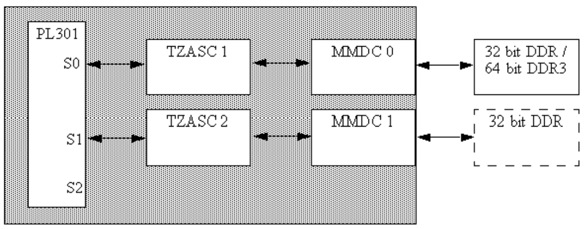
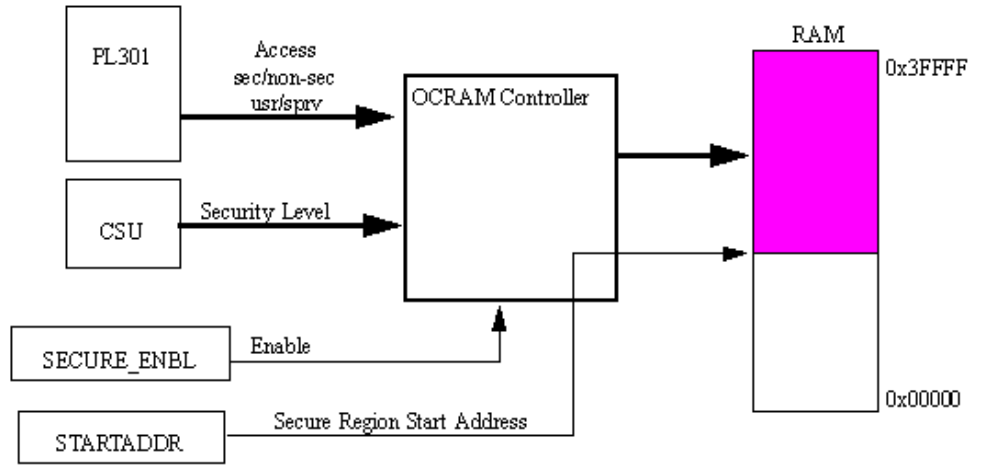
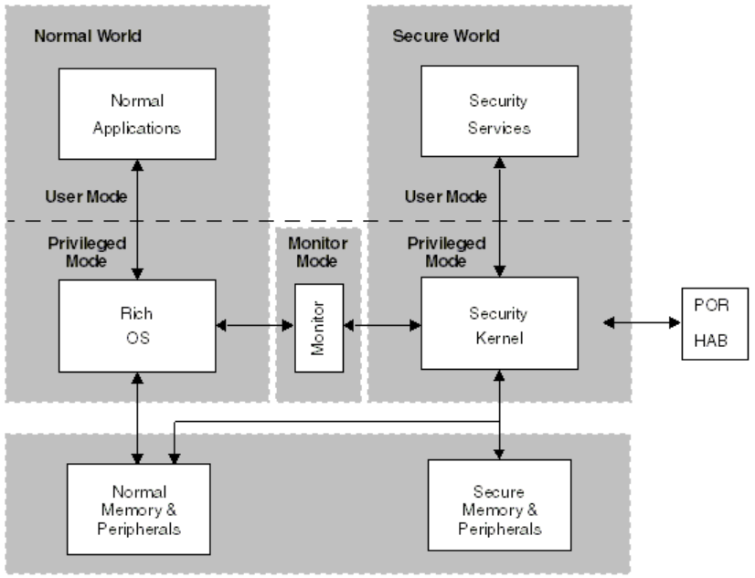
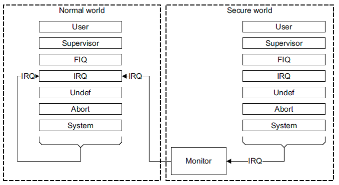
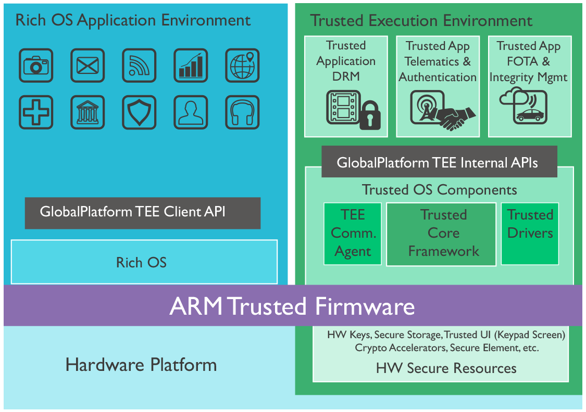

# Trust zone

[TOC]

## 0. 名詞

| 縮寫      |     全名 |
| :--------: | :--------:|
| TZ    |   ARM TrustZone |

## 1 .Security

- TrustZone Address Space Controller使用兩個TZASC,每個TZASC獨立運作連接到各自個DDR

- 有一個選項可以僅限TrustZone是可存取的區域

## 2. TZ

- 提供可信任的軟體執行環境
- Hardware保護安全機制
- Hardware firewalls
- 提供可信任的軟體(應用程序，服務，驅動程序甚至OS)執行環境
- 防止惡意的中斷
- `TrustZone Watchdog Timer(TZ WDOG)`
  - 防止Normal World的程式中，有試圖去阻止切到Secure World的現象，使得Secure World的Service產生starving
  - 一但TZ WDOG啟動，Secure World的service必須定期得到運算資源，否則TZ WDOG會發出secure interrupt，強迫從Normal World切回Secure World
  - 若Secure World service依然沒取得資源，會向CSU發出安全違規信號，然後進入SNVS
  - 不能被Normal World下programmed或Disable
- Power on reset (POR)後，則只剩Secure World（代表你不需要可信的執行環境，則無需切換到Normal World）
- CSU，CAAM，Secure RAM則用來控制Secure and Normal World下，Kernel mode對memory的存取權限

##

- 由於內存中的代碼和數據都是明文，容易被同處於內存中的其它應用偷窺
- 因此出現了擴展的安全模塊，應用將加密數據送往安全模塊，由安全模塊處理完後再返回結果給相應的應用。
- TrustZone在概念上將SoC的硬件和軟件資源劃分為安全（Secure World）和非安全（Normal World）兩個世界
  - 所有需要保密的操作在安全世界執行（如指紋識別，密碼處理，數據加解密， 安全認證等）
  - 其餘操作在非安全世界執行（如用戶操作系統，各種應用程序等）
  - 安全世界和非安全世界通過一個名為Monitor Mode的模式進行轉換
  - 軟件在Monitor Mode下先保存當前世界的狀態，然後恢復下一個世界的狀態
  - 操作完成後以從異常返回的方式開始運行下一個世界的代碼。

- `TZASC-PL380(TrustZone Address Space Controller)`
  - 對內存進行安全和非安全區域劃分和保護
  - 在外部DDR memory space上隔離出Secure World與Normal World
  - 提供security address region控制功能
  - 安全世界和非安全世界都有自己的虛擬MMU，各自管理物理地址的映射
  - 實際上只是兩個世界都有一份TTBR0、TTBR1、TTBCR寄存器，因此就會對應兩個MMU表
  - 儘管MMU有兩套，但TBL緩存硬件上只有一套，因此TBL對於兩個世界來說是共享的
  - 其通過NS位來標誌其每一項具體屬於哪一個世界
  - 這樣在兩個世界間進行切換時不再需要重新刷新TLB，提高執行效率
  - 硬件上兩個世界共享一套Cache，具體的Cache數據屬於哪一個世界也由其NS位指定
  - 在世界間切換也不需要刷新Cache。
- `OCRAM(On-chip RAM)控制器`
  - 在內部memory spaces上隔離出Secure World與Normal World
- TrustZone將每個物理核虛擬為兩個核
  - 一個非安全核（Non-secure Core，NS Core），運行非安全世界的代碼
  - 另一個安全核（Secure Core），運行安全世界的代碼
  - 各自有不同的MMU與caches
  - ARM core在fetch時，會根據當前world來隔離出不同的page tables與對應的cache
- DMA Controller
- `GIC(Generic Interrupt Controller)`
  - 可以動態設定中斷屬於Secure World或Normal World
  - IRQ作為非安全世界的中斷源，FIQ作為安全世界的中斷源
- 安全系統的OS
  - 安全應用TA(Trusted Application)
  - AMBA3 AXI總線
    - 安全機制的基礎設施
    - 系統總線上針對每一個信道的讀寫增加了一個額外的控制信號位
    - 這個控制位叫做Non-Secure或者NS位
