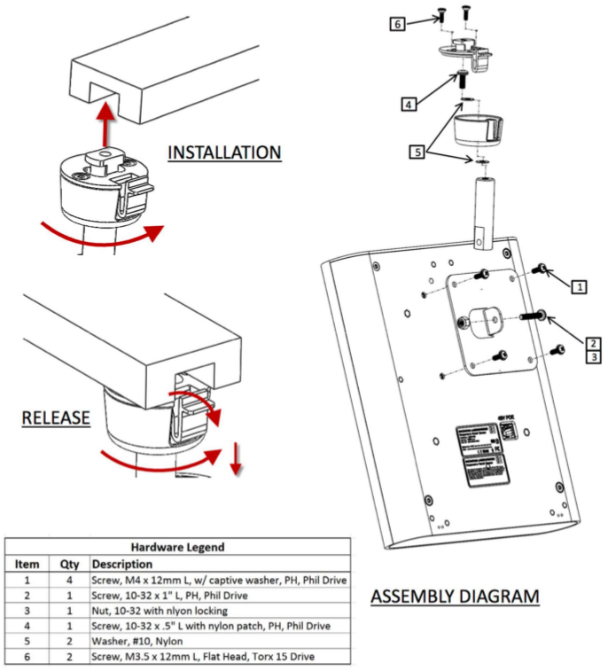

# Overall

[TOC]

## 1. NXP - i.MX6DL/Quad

### 1-1. Introduction


|6DualLite|6Quad|
|:-:|:-:|
|`1080p30`|`1080p60`|
|[OV5642 driver 不支援`1080p30`](https://goo.gl/E1HE42)||
|[OV5642 driver 支援`720p30`](https://goo.gl/HMURZY)||
|[`Two Parallel OV5642` sensors on different is work](https://community.nxp.com/thread/313467)||
|[``One Parallel OV5642` and `one MIPI OV5640` sensors is work I2C bus](https://community.nxp.com/thread/313467)||
|Boundary Devices說:不知為何只能limited在`15fps`||
|[支援`Two` `parallel`,`CSI-2 lans`](https://goo.gl/9FbU2w)||

> `1Gbps`可以支援`720p30`: [1 Gbps > 891Mbps = 750(line) * 1650(pixel) * 30 * 8(bit) * 3(R/G/B)](https://goo.gl/emVJK9)

### 1-2. SoC


### 1-3. 公板

|Front|Back|
|:-:|:-:|
|||

- [Windows UART Drive](http://ftdichip.com/FTDrivers.htm)
- Power Flow

| 1      |     2 |   3   | 4   |
| :-------- | --------:| :------: |:------: |
| OFF    |   boot |  standby  |resume|
|     |    |  software shutdown menu  |
|     |    |  (> 5 sec.) hardware shutdown

### 1-4. Security

| 縮寫      |     全名 |
| :-------- | --------:|
| TZ    |   ARM TrustZone |
| HAB | High-Assurance Boot|
| SNVS    |   Secure Non-Volatile Storage |
| CAAM    |   Cryptographic Acceleration and Assurance Module |
| CSU  |   Central Security Unit |
| DTCP  |  Digital Transmission Content Protection |
| HDCP  |   High-bandwidth Digital Content Protection |
| SJC  |   System JTAG controller |
| SDMA  |   Smart Direct Memory Access controller |
| OCOTP_CTRL  |   On-chip One-time Programmable Element Controller |
| SJC  |   System JTAG controller |


- TrustZone Address Space Controller使用兩個TZASC,每個TZASC獨立運作連接到各自個DDR


- 有一個選項可以僅限TrustZone是可存取的區域


- NXP 提供 CST (Code Signing Tool) 用於生成密鑰與憑證


#### 1-4-1. TZ

- 提供可信任的軟體執行環境
- Hardware保護安全機制
- Hardware firewalls
- 提供可信任的軟體(應用程序，服務，驅動程序甚至OS)執行環境
- 防止惡意的中斷
- 分為兩種world，各自有不同的MMU與caches
- ARM core在fetch時，會根據當前world來隔離出不同的page tables與對應的cache

- `TZASC-PL380(TrustZone Address Space Controller)`在外部DDR memory space上隔離出Secure World與Normal World，並提供security address region控制功能
- `OCRAM(On-chip RAM)控制器`在內部memory spaces上隔離出Secure World與Normal World
- `GIC(Generic Interrupt Controller)`可以動態設定中斷屬於Secure World或Normal World
- `TrustZone Watchdog Timer(TZ WDOG)`
  - 防止Normal World的程式中，有試圖去阻止切到Secure World的現象，使得Secure World的Service產生starving
  - 一但TZ WDOG啟動，Secure World的service必須定期得到運算資源，否則TZ WDOG會發出secure interrupt，強迫從Normal World切回Secure World
  - 若Secure World service依然沒取得資源，會向CSU發出安全違規信號，然後進入SNVS
  - 不能被Normal World下programmed或Disable
- Power on reset (POR)後，則只剩Secure World（代表你不需要可信的執行環境，則無需切換到Normal World）
- CSU，CAAM，Secure RAM則用來控制Secure and Normal World下，Kernel mode對memory的存取權限

#### 1-4-2. HAB

- Security library on-chip ROM
- 防止攻擊者將可programmable memory中的code或data修改使其表現不正確,確保這些危險code不被執行.
- 透過含數位簽章的boot防止不信任的SW
- 加密的boot會透過HAB解密後放到RAM執行，保護boot程式的機密性
- HAB與SNVS互動，確保系統安全狀態符合預期
- HAB使用CAAM hardware block來加速SHA-256 hash algorithm
- HAB初始化CSU
- HAB初始化SNVS安全監視器狀態機
- 在硬件加速器不能使用的情況下，HAB還包括SHA-256的SW實現,支援到RSA金鑰長度到4096 bit
- 憑證支援 X.509v3
- Root public key是OEM寫在on-chip fuses上的
- HAB讀取on-chip fuses上的Root public key
- HAB在TrustZone Secure World中執行


#### 1-4-3. SNVS

- low power part (SNVS_LP)
  - 包括Secure RTC Counters
  - 總是上電

- high power part (SNVS_HP)
  - 存取SNVS_LP registers的介面

#### 1-4-4. CAAM

- Secure memory的控制器和介面
- Hardware加密加速器 AES-128, AES-256,DES / 3DES, ARC4
- hash函數 SHA-1/224/256, MD-5
- 運行時完整性檢查器
- T/F隨機產生器（NIST認證)
- 16KB secure RAM
- 保護一些商業認証資料防止被修改，如Digital rights management (DRM)，生物特徵參考數據，root certificates等等

#### 1-4-5. CSU

- 負責在i.MX內設置全面的安全策略
- 將會在引導期間通過eFUSEs配置，並確定安全級別操作模式以及TZ策略。

#### 1-4-6. SJC

- for secure debug
n

#### 1-4-7. SDMA

使周邊I / O設備和內部/外部 memories的資料傳輸效能最大化的軟體

#### 1-4-8. OCOTP_CTRL

- on-chip electrical fuse arrays  (OTP Memory)
- Total of 3840-bit e-fuses
- 加密密鑰
- Security configuration
- 允許設置Boot Modes, Security Levels, Security Keys和許多其他系統參數
- 提供reading，programming, and/or overriding的interface和控information stored in on-chip fuse elements.
- 提供了一組volatile software-accessible signals

### 1-5. Boot

1. Power On Reset強制使ARM core執行on-chip boot ROM
2. Boot ROM code的裝置來源選擇是透過register BOOT_MODE[1:0]以及各種eFUSEs的設定決定的

3. Boot From Fuses mode忽略GPIO boot override pins，而是採用eFUSE settings。其餘同Internal Boot mode
 如果有任何錯誤發生在Internal Boot mode時，boot code改透過Serial Downloader尋找

 

## 2. Product

### 2-1. Intel® Responsive Retail Platform(RRP)

- 多個零售Sensor Platforms
- 一個RFID Gateway  - 用於控制和組織

|     |    |
| -------- | --------|
|     |    |

- Cloud Application Server  - 資料存取，分析和遠端管理

- [MeschCentral(Intel® remote management system)](http://meshcentral.com)


### 2-2. HW簡介

- 三者有相同的PCBA
- 三者共同構成`Intel® Responsive Retail Platform(RRP)`
- 三者通過TD設備支持NFC
- M.2 socket - ~~如果選擇了`RealSense`攝像頭，則可以省略,~~該socket可用於將來的VPU模塊
- 包括EPC Gen 2 UHF RFID (reader).
- 3D加速計
- 磁力計
- 溫濕度計
- Impinj的R2000 UHF EPC Gen 2 RFID reader
- 黑色和白色
- 安全符合IEC 60950-1
- 時間同步NTP
- 評級IP-50
- RF認證FCC Part 15.247 C，ETSI EN 302208-1
- MQTT
- JSON RPC 2.0

|OFF|綠|青藍|白閃爍|紫色|紫閃爍|黃|藍|藍閃爍|紅閃爍|
|:-:|:-:|:-:|:-:|:-:|:-:|:-:|:-:|:-:|:-:|
|Disable|Power On|已進入OS,App還沒啟動|搜尋RFID Gateway|等待讀取安全標籤|安全標籤讀取成功，閃5s|閒置|傳輸中(還沒接收)|傳輸中(正在接收)|故障|

|H4000|H3000|H1000|
|:-:|:-:|:-:|
|RSP-9003|RSP-9003|RSP-9800|
|安裝在天花板或牆面隱藏起來|安裝在天花板或牆面隱藏起來|安裝在桌子下，牆上或櫃子上，隱藏起來|
| 最高規的SKU |   與H4000相同的機箱和MB |  不同的機箱ID，打算使用相同的MB  |
| 紅外探測器 |   紅外探測器 |  USB type-A connector  |
| Internal RFID Antenna |   Internal RFID Antenna|  External RFID Antenna - 4 R-SMA ports|
| 目前團隊的主要的設計焦點 |只移除web cam/ WiFi BT/ Ranging |  需要INTEL發布更多細節，但期望與上面有相同的時間表  |
|  |   H3000 會少了下面圓弧的那塊 |    |

### 2-2. SW簡介

Discover Gateway

1. 上電
2. RSP sensor就會通過DHCP自動取得IP address並發現RSP gateway
3. 與MeshCentral Server(proxy by Gateway)同步
4. 與Gateway進行身份驗證

RFID Gateway

- 將大量標籤分成幾個較小的標籤

``` bash
root@RSP-123456:~# service rfid-rsp stop
Stopping service rfid-rsp...
root@RSP-123456:~# cd /opt/rfid-rsp/
root@RSP-123456:/opt/rfid-rsp#
root@RSP-123456:/opt/rfid-rsp# ./bin/rfid-rsp console
--
-- Retail Sensor
-- Version 1.2.3 built at 05/18/2017 16:28:56
--
-- Starting...
--
Retail Sensor Console Session
<tab> to view available commands
'clear' to clear the screen/console
'quit' to end
rfid-rsp>
```

### 2-2. 線路圖


### 2-3. FTP

| User      |     Password |   Note   |
| :-------- | --------:| :------: |
| FTP_VendorD005_F     |   EzTbEh131 |  For PEGA members only  |
| FTP_VendorD005_R    |   Vxvir55G& |    |
| FTP_VendorD005_RW    |  3^ZSq@x@3 |   |

### 2-4. 名詞

| 縮寫      |     全名 |
| :-------- | --------:|
| RFQ     |   Request for Quote |  
| PRD    |   Product Requirements Document |
| SOW    |   Statement of work |
| SABRE    |   Smart Application Blueprint for Rapid Engineering board |
| PDT    |    Product Development Team |

## 3. Yocto

### 3-1. 下載

```bash
$ sudo apt-get install gawk wget git-core diffstat unzip texinfo gcc-multilib \
build-essential chrpath socat libsdl1.2-dev
$ mkdir fsl-release-bsp
$ cd fsl-release-bsp

===================公板請用===================

$ repo init -u git://git.freescale.com/imx/fsl-arm-yocto-bsp.git -b imx-morty -m imx-4.9.11-1.0.0-$ iotg-demo.xml

===================或===================

$ repo init -u git://git.freescale.com/imx/fsl-arm-yocto-bsp.git -b imx-morty -m 
default.xml

===================RRS===================

$ repo init -u git@github.impcloud.net:Retail-Sensor-Platform/encinitas-bsp-platform.git -b master

===================或===================

$ repo init -u ssh://git2@10.255.68.68/scm/RRS/encinitas-bsp-platform.git -b master -m pega-test-image.xml

$ repo sync
```

- 包括U-Boot，Linux kernel和公板的具體細節

### 3-2. Layers

- 在公板上
  - **meta-freescale** : `u-boot`,`firmware-imx`,`imx-lib`,`openssl`,`gtk+`,`imx-gpu-viv`,`libsdl2`,`linux-imx-4.9.11`提供基本和i.MX ARM®參考板的支持
  - **meta-freescale-3rdparty** : `u-boot`,`machine`,`linux-firmware`為第三方和合作夥伴提供支持
  - **meta-freescale-distro** : `gstreamer`,`imx-gpu-sdk`額外的項目，以幫助開發和實踐
  - **meta-fsl-bsp-release** : i.MX BSP Release的附加層,包含poky和meta-openembedded圖層的更新
  - **meta-qt5** : Qt5
  - **meta-browser** : several browsers
  - **meta-fsl-community-base** : 經常改名為base。 為FSL Community BSP提供基本配置。
- 在RRS上
  - **meta-encinitas** : 發行版訊息和非特定於版本的內容
  - **meta-encinitas-arm** : `u-boot`,`machine`,`linux-encinitas-4.9`,`imx-gpu-viv`
  - **meta-encinitas-rsp** : `images`
- **poky** : 基本的Yocto項目
- **meta-openembedded** : OE-core世界的圖層集合
- layer是透過`<build-dir>/conf`目錄中的`bblayer.conf`來增加的
- layer必須具有描述圖層名稱的`conf/layer.conf`文件

> Systemd disable :`sources/meta-fsl-bsp-release/imx/meta-sdk/conf/distro/include/fsl-imx-preferred-env.inc`

### 3-3. 環境設置

**公板用**

``` bash
DISTRO=fsl-imx-x11 MACHINE=imx6qsabresd source ./fsl-setup-release.sh -b bld-x11
```

**RRS用**

``` bash
DISTRO=encinitas-x11 MACHINE=encinitascreek source ./setup-environment build
DISTRO=encinitas-min MACHINE=hx000 source ./setup-environment build
```

如果已經建制好Build directory,且shell重開以後，則使用:

``` bash
DISTRO=fsl-imx-x11 MACHINE=imx6qsabresd source ./setup-environment bld-x11
```
>
> - 16.04 -`local.conf` 兩行需要加上`#`
`#PACKAGECONFIG_append_pn-qemu-native = " sdl"`
`#PACKAGECONFIG_append_pn-nativesdk-qemu = " sdl"`

### 3-4. Build

#### 3-4-1. Build All

**公板用**

```
bitbake fsl-image-qt5
```
>
> - `fsl-image-gui` - full image with demos and tests used for testing with graphics, no QT.
> - `fsl-image-qt5` - fsl-image-gui with QT 5.8.

**RRS用**

```bash
$ bitbake encinitas-image-rrs
===================或===================
$ bitbake encinitas-image-pega-test
```

#### 3-4-2. Build SDK

1. 環境建制

```bash
DISTRO=fsl-imx-x11 MACHINE=imx6qsabresd bitbake core-image-minimal -c populate_sdk
```

2. 執行`<build folder>/tmp/deploy/sdk/<machine>.sh`

> default location:`/opt/<machine>`

#### 3-4-3. Build Bootloader by SDK

- 位於:`./sources/poky/meta/recipes-bsp/u-boot/u-boot.inc`
- 位於:`./sources/meta-fsl-bsp-release/imx/meta-bsp/recipes-bsp/u-boot/u-boot-imx_2017.03.bb`

- `cp sources/meta-freescale/conf/machine/imx6qsabresd.conf <new layer>/conf/machine/<custom_name>.conf`
- `vim conf/machine/imx6qsabresd.conf`調整Device tree`UBOOT_CONFIG`
- `vim conf/local.conf`調整U-Boot version`PREFERRED_PROVIDER_virtual/bootloader_<custom_name> = "u-boot-imx"`
- `$ MACHINE=<custom_name> bitbake u-boot-imx`
- 輸出於`<build-dir>/tmp/work/<custom_name>-poky-linux-gnueabi/u-boot-imx/<version>`
- Boot在`<build-dir>/tmp/deploy/images/<custom_name>`

```bash
$ source /opt/fsl-imx-x11/4.9.11-1.0.0/environment-setup-cortexa9hf-neon-poky-linux-gnueabi
$ git clone http://git.freescale.com/git/cgit.cgi/imx/uboot-imx.git -b
imx_v2017.03_4.9.11_1.0.0_ga
$ cd uboot-imx
$ make clean
$ make mx6qsabresd_defconfig
$ make u-boot.imx
```

#### 3-4-4. Build Kernel by SDK

- `cp sources/meta-freescale/conf/machine/imx6qsabresd.conf <new layer>/conf/machine/<custom_name>.conf`
- `vim conf/machine/imx6qsabresd.conf`調整Device tree`KERNEL_DEVICETREE`
- `vim conf/local.conf`調整kernel version`PREFERRED_PROVIDER_virtual/kernel_<custom_name> = "linux-imx"`
- `$ MACHINE=<custom_name> bitbake linux-imx`
- 輸出於`<build-dir>/tmp/work/<custom_name>-poky-linux-gnueabi/linux-imx/<version>`
- Kernel在`<build-dir>/tmp/deploy/images/<custom_name>`

```bash
source /opt/fsl-imx-x11/4.9.11-1.0.0/environment-setup-cortexa9hf-neon-poky-linux-gnueabi
git clone http://git.freescale.com/git/cgit.cgi/imx/linux-imx.git -b imx_4.9.11_1.0.0-
cd linux-imx
make defconfig
make
```

### 3-5. Output

- `<build directory>/tmp/deploy/images`

| Type      |    File  |
| :-------- | --------:|
|  **U-Boot**     |   u-boot.imx |
| **Kernel**    |   zImage |
|  **rootfs**     |   fsl-image-qt5-imx6qsabresd.ext4 |
| **U-Boot + Kernel + rootfs**    |   fsl-image-qt5-imx6qsabresd.sdcard |
| **device tree file**     |   \*.dtb/*.dts  |

### 3-6. Flash

MFGTool - `$ bitbake fsl-image-mfgtool-initramfs`

**Flash All**
`$ sudo dd if=<image name>.sdcard of=/dev/sd<partition> bs=1M && sync`
**Flash Bootloader**
`$ sudo dd if=u-boot.imx of=/dev/sdx bs=512 seek=2 conv=fsync`
**Flash Kernel**
`sudo dd if=<zImageName> of=/dev/sdx bs=512 seek=20480 conv=fsync && sync`
**Flash Device Trees**
`sudo dd if=<DevicetreeName>.dtb of=/dev/sdx bs=512 seek=20480 conv=fsync`

### 3-7. Bitbake options

| Bitbake paramater      |     Description |
| :-------- | :--------:|
| -c fetch    |   Fetches if the downloads state is not marked as done. |
| -c cleanall    |   Cleans the entire component build directory. All the changes in the build directory are lost. The rootfs and state of the component are also cleared. The component is also removed from the download directory. |
| -c deploy    |   Deploys an image or component to the rootfs. |
| -c compile -f    |   It is not recommended that the source code under the tmp directory is changed directly, but if it is, the Yocto Project might not rebuild it unless this option is used. Use this option to force a recompile after the image is deployed. |
| -k    |   Continues building components even if a build break occurs. |
| -g    |   Lists a dependency tree for an image or component. |
| -DDD    |   Turns on debug 3 levels deep. Each D adds another level of debug. |  

### 3-8.  Local configuration - `local.conf`

- 共享Download與cache來提速

```bash
DL_DIR="/opt/freescale/yocto/imx/download"
SSTATE_DIR="/opt/freescale/yocto/imx/sstate-cache"
```
>
> - 下載到DL_DIR目錄中的每個package都標有`"package名稱".done`
> - 如果你的網路出現問題，您可以手動將備份版本的package複製到DL_DIR目錄
> - 再touch一個`"package名稱".done`文件
> - 然後執行bitbake "component"

- Component Version
  - `PREFERRED_VERSION_<component>_<soc family> = "<version>"`
  - 例:`PREFERRED_VERSION_imx-lib_mx6 = "6.0"`
- Preferred provider
  - `PREFERRED_PROVIDER_<component>_<soc family> = "<provider>"`
  - 例:`PREFERRED_PROVIDER_u-boot_mx6 = "u-boot-imx"`

## 4. Kernel

### 4-1. Device Tree

`<build dir>` = build

`<your-device-name>` = imx6q-encinitascreek

`<machine>` = encinitascreek-encinitas-linux-gnueabi

`<kernel-name>` = linux-encinitas

`<kernel-version>` = 4.9+gitAUTOINC+523eb99f53-r0

`<output_dtb>` = output.dtb

`<input_dts>`  = imx6q-encinitascreek.tmp.dts

1. 修改 ***.dts file**

``` bash
cd <build dir>/tmp/work-shared/encinitascreek/kernel-source/arch/arm/boot/dts
vim <your-device-name>.dts
```

2. 增加這幾行 & 存檔

``` c
337: MX6QDL_PAD_EIM_A16__GPIO2_IO22 0x80000000
338: MX6QDL_PAD_EIM_A17__GPIO2_IO21 0x80000000
339: MX6QDL_PAD_EIM_A18__GPIO2_IO20 0x80000000
340: MX6QDL_PAD_EIM_A19__GPIO2_IO19 0x80000000
341: MX6QDL_PAD_EIM_A20__GPIO2_IO18 0x80000000
342: MX6QDL_PAD_EIM_A21__GPIO2_IO17 0x80000000
343: MX6QDL_PAD_EIM_A22__GPIO2_IO16 0x80000000
344: MX6QDL_PAD_EIM_A23__GPIO6_IO06 0x80000000
345: MX6QDL_PAD_EIM_A24__GPIO5_IO04 0x80000000
```

3. 轉換成**dtc**可以編譯的格式

```bash
IDE=<your-device-name>
SRC=$IDE.dts
TMP=$IDE.tmp.dts
DST=$IDE.dtb

cpp -nostdinc -I include -undef -x assembler-with-cpp $SRC > $TMP
```

4. 透過**dtc**編譯**dts**成**dtb**

```bash
cd <build dir>/tmp/work/<machine>/<kernel-name>/<kernel-version>/build
./scripts/dtc/dtc -I dts -O dtb -o <output_dtb> <input_dts> 
```

- 把Platform Device架構中用來描述硬體資源的部份給抽出來,
- 因為Platform Device的檔案是用C code去描述的, 但概念上硬體資源的描述應和程式無關也與Linux版本無關. 用C 去描述很慘, 因為只要重新定義硬體資源都要重新編譯核心, 很浪費時間.
- 再來, 要去描述硬體資源,如果不熟悉C的語法, 也很難去寫 ,因為C語法不對會導致編譯失敗
- Device Tree架構,解決了上述這些問題,不用懂C也能定義硬體資源
- 如此硬體工程師也可以做了,因為pin 腳拉那根做什麼功能, 硬體工程師最清楚 ,不然做軟體,寫code的人就要自己去對線路圖 (也不是不行, 但如果有對的人做掉, 豈不更快!)
- 硬體資源: 包含 `SoC-level (.dtsi)`及 `board level (.dts)`
  - 描述CPU, RAM size
  - 描述 Memory-mapped 上的元件, PWM、UART、I2C、SPI等晶片內部元件的描述, 如暫存器位址及大小, 中斷號碼、DMA,, pinctrl
  - 描述外部連接裝置, 如裝置規格, 以flash來說,包含 page size, flash size等資訊, 通常寫device driver會從這裡取得裝置資訊. 外部裝置通常使用 device tree overlay (產生.dtbo)的方式而不要直接修改.dts.
- 不用重新 compile source code 即可以更改系統的 configuration
- 當硬體只有小小的更改，只需要 dts 檔小改, 然後再重新編譯出dtb即可。
- 可以重複使用已存在的 dts 檔在其他地方，也可以覆蓋過去定義的功能
- 移除 C code ，使得硬體的描述架構更清楚。
- 在Kernel中`arch/arm/boot/dts`
  - `imx6q-sabresd.dts`
  - `imx6q.dtsi`
- *hdcp.dtb用於啟用DHCP功能，因為pin conflict，這需要在build時配置


### 4-2.  Kernel Panic

### 4-2-1.  情況1 - No init found

**Q - 出現No init found,不用linuxrc行不行？**

```bash
root=/dev/mtdblock2
VFS: Cannot open root device "mtdblock2" or unknown-block(2,0)
Failed to execute /linuxrc. Attempting defaults...
Kernel panic - not syncing: No init found. Try passing init= option to kernel.
```

**A - 當然行！看看內核文件`init/main.c`，有如下字樣：**

```bash
run_init_process("/sbin/init");
run_init_process("/etc/init");
run_init_process("/bin/init");
run_init_process("/bin/sh");
panic("No init found. Try passing init= option to kernel.");
```

就是說，它會依次嘗試執行/sbin/init、/etc/init、/bin/init、/bin/sh這些文件，
都失敗後才列印出錯信息`No init found. Try passing init= option to kernel.`

### 4-3. /sbin/init

- 也稱為`init`
- 可管理剩下的開機過程和使用者環境的設定

1. 首先它會執行 `/etc/rc.d/rc.sysinit` script

- 這個 script 會設定環境路徑、啟動 swap、檢測檔案系統，和執行其它所有系統啟動所需的步驟

2. 如果有必須要初始化的特殊序列通訊埠程序，rc.sysinit 將會執行 `/etc/rc.serial` 檔案
3. 接著會處理 `/etc/event.d` 目錄中的工作

- 這列出了系統中每個 SysV init runlevel 的設定方式
- 執行層級（runlevel）屬於一個狀態或模式，由列於 SysV `/etc/rc.d/rc<x>.d/` 目錄中的服務所定義，`<x>` 代表 runlevel 的編號

4. 替系統設定資源功能函式庫 `/etc/rc.d/init.d/functions`

- 這可用來設定如何啟動、刪除以及決定一項程式的 PID

5. 尋找在 `/etc/inittab` 中被指定為預設的 runlevel，以啟動所有的背景程序

- 在啟動 runlevel 5 時，init 程式會在 `/etc/rc.d/rc5.d/` 目錄中尋找並判斷哪些程序應啟用或停止

6. 最後執行`/etc/rc.d/rc.local`

> `/etc/rc.d/rc5.d/` 目錄的範例清單：  

```bash
K05innd -> ../init.d/innd
K05saslauthd -> ../init.d/saslauthd
K10dc_server -> ../init.d/dc_server
K10psacct -> ../init.d/psacct
K10radiusd -> ../init.d/radiusd
K12dc_client -> ../init.d/dc_client
S06cpuspeed -> ../init.d/cpuspeed
S08ip6tables -> ../init.d/ip6tables
S08iptables -> ../init.d/iptables
S09isdn -> ../init.d/isdn
S10network -> ../init.d/network
...
```

>- `K`連結代表 runlevel 中被刪除（killed）的程序 - `/etc/rc.d/init.d/<command> stop`
>EX: `/etc/rc.d/init.d/httpd stop`
>- `S` 作為起始的名稱則代表已被啟用 - `/etc/rc.d/init.d/<command> start`

## 5. Boot up

```bash
setenv displayinfo 'video=mxcfb0:dev=hdmi,1920x1080M@60,if=RGB24'
setenv mmcargs 'setenv bootargs console=${console},${baudrate} ${smp} ${displayinfo} root=${mmcroot}'
run bootcmd
```

## 6. RFID

- RFID系統由兩個部分組成：`reader`和`transponder`


### 6-1. 碰撞 (標籤完全同時響應)

#### 6-1-1. 情況1

- 當一台Reader進行讀取時，有兩個或兩個以上Tag同時廣播回覆信號，造成信號的碰撞，而使Reader誤判
- 防範第一種碰撞的情形，當每台Reader開始要在自己的讀取範圍內讀取多個Tag時，Reader讓每個Tag隨機產生亂數，之後讓亂數倒數，先倒數為0的Tag，率先回傳確認碼回Reader，Reader確認無誤後，在通知Tag回傳其ID Code，所以利用分時多工的概念預防第一種碰撞情形
- Intel使用Dynamic-Q演算法來防止碰撞


#### 6-1-2. 情況2

- 同一Tag在兩台或兩台以上Reader的讀取範圍內，Tag同時收到多筆command，而使Tag產生誤判
- 利用「Session」概念，就是當每台Reader要在自己的讀取範圍內讀取多個Tag時，每台Reader給予自己獨取範圍內的Tag不同的session碼，使Tag藉以session碼區分要回覆哪一台Reader


## 7. 工廠

- [1至15多個SD / Micro SD驅動器存儲卡讀寫器複印機](https://www.amazon.com/Systor-Multiple-Memory-Reader-Duplicator/dp/B00DUIX4TI)

## 8. Test

```bash
$ bsp_info
uboot  = 2017.11.20180426053630
linux  = 4.9.11-fslc+g69ce841 #1 SMP PREEMPT Thu Apr 26 05:52:59 UTC 2018
```
