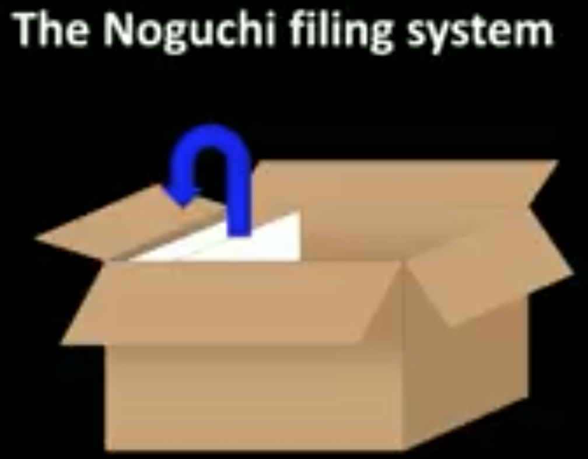

# TED
[TOC]
## 2018

### [為什麼在壓力下會表現失常以及如何避免](https://www.ted.com/talks/sian_leah_beilock_why_we_choke_under_pressure_and_how_to_avoid_it/transcript?language=zh-tw#t-901539)

- 注意力過度的現象， 我們稱之為「分析造成的癱瘓」
- 唱一首歌
- 把注意力放在小趾頭上
- 讓練習時的條件 符合實做時的條件
- 當成人對於他們自己的 數學能力感到焦慮， 也會影響他們的孩子， 且會影響到他們的表現 是失常或出色

### [做出更好決策的三種方式——採用跟電腦一樣的思考方式](https://www.ted.com/talks/tom_griffiths_3_ways_to_make_better_decisions_by_thinking_like_a_computer/transcript?language=zh-tw)

- 如果你想要把找到最佳選擇的機率提升到最高，你得要看過市場上 37% 的所有選擇的， 接著到下一個地方時， 就提出交易條件
    - 它會比你目前看過的所有選擇都更好
    - 如果你要花一個月來尋找， 就取那段時間的 37% —— 即 11 天
    - 試圖找住房 就是「最佳停止問題」的例子
    - 知道這一切，讓我在必須要做決策時能夠放輕鬆
- 「探索／利用的權衡」
    - 你得要做一個決策，決定你是否要嘗試新選項—— 去「探索」，收集一些未來 可能會用到的資訊
    - 或者你是否要選擇去你已經知道不錯的地方—— 「利用」你目前已經 收集到的資訊。
- 當你要試著決定該去哪一間餐廳時， 你應該先問你自己一個問題： 你還會待在鎮上多久？
    - 如果你只是短暫停留， 那麼你應該要「利用」。 收集資訊是沒有意義的。 直接去一個你已經知道不錯的地方吧。
    - 但如果你會待久一點， 就「探索」吧。 試試新選項，因為 你從中得到的資訊可能協助你在未來做更好的選擇。
    - 你越有可能用到一項資訊， 該資訊的價值就會增加。

- 應用「近期最少使用」原則來整理你的衣櫥

- 不可能把所有的選項都納入考量， 所以你得要冒險。
    - 即使你遵循最佳化策略， 也不能保證你會得到最完美的結果
    - 如果你遵循 37% 規則， 你能找到最棒的地方的機率是—— 很有趣……是 37%。
    - 大部分的時候，你會失敗。 但你能做到最好的就是這樣了。
- 最終，電腦科學會協助讓我們更能原諒自己的限制。
    - 你不能控制結果，只能控制過程。
    - 只要你已經用了最好的過程， 你就已經盡了全力。
    - 有時，最好的過程會需要冒點險—— 比如不去考量所有的選項，或是願意妥協，接受算是不錯的解決方案。
    - 這些並不是我們在無法理性時所做的讓步—— 它們就是理性的真締。

### [人工智慧如何能拯救人性](https://www.ted.com/talks/kai_fu_lee_how_ai_can_save_our_humanity/transcript?language=zh-tw)

- 人工智慧能夠做到最佳化，但不能創造。

- 我可以很確定地告訴各位， 人工智慧沒有愛。
    - 當 AlphaGo 打敗世界冠軍柯潔， 當柯潔在哭泣，他很愛圍棋比賽， AlphaGo 卻不會感到勝利的喜悅， 肯定也不會想要去擁抱愛人。

- 我們剛有談到「創意」這個軸， 那肯定是其中一種可能性， 現在，我們要再介紹一個新的軸， 我們可以稱之為同情心、愛，或是同理心。
    - 人工智慧會到來， 也會奪走例行性的工作，到時，我們會很感激。
    - 對有創意的人，人工智慧會變成很棒的工具， 讓科學家、藝術家、音樂家及作家都更有創意。
    - 人工智慧也會扮演分析工具的角色來和人類合作，對於高同情心的工作，人類可以將溫暖傾注其中。
    - 我們還有方式讓我們自己不同，就是通過參與需要獨特能力的工作，要有同情心又要有創意，充分利用和發揮我們無可替代的頭腦和内心

### [內在多樣性的力量](https://www.ted.com/talks/rebeca_hwang_the_power_of_diversity_within_yourself/transcript?language=zh-tw#t-558128)

- 我有一張圖，上面有所有在史丹佛拿到博士學位的研究生平均收入， 接著有所有史丹佛研究所 中輟生的平均收入。
    - 我必須要告訴各位—— 這張圖絕對因為 Google 的創辦人而很偏向一邊。
    - 但我媽媽看著那張圖， 她說： 「喔，你只管去追隨你的熱情吧。」
- 多樣性在他們的的人生中能夠為他們打開並創造許多扇門
- 我也希望他們會用他們獨一無二的組合， 價值觀、語言、文化和技能的組合， 來協助創造一個新世界
- 至於我的外婆， 從來就不是要回到韓國並埋葬在那裡。 重點是要在她的兒子身邊安息。

### [為何要熱愛粗鄙的科學](https://www.ted.com/talks/anna_rothschild_why_you_should_love_gross_science/transcript?language=zh-tw)

### [處理住房危機的遊戲式解決方案](https://www.ted.com/talks/sarah_murray_a_playful_solution_to_the_housing_crisis/transcript?language=zh-tw#t-629336)

- 製造和組裝的設計用的是輕鋼架結構， 運到現場組裝起來，這樣我們就能把 建設成本降低 20%， 把環境廢物減少 15%， 節省時間和金錢， 並為掩埋場減少數噸的廢物。
- 3D 列印讓人很興奮，且很理想， 它能讓成本降低 40%， 且幾乎不會產生廢物。
- 義大利已經發展出了一項用索雷爾水泥的技術
- 法國有一種流程，雖然還在實驗階段，但已經被管理機構核准，是用兩道平行的泡沫材料絕緣軌道， 把混凝土注入其中， 來創造出實心的石頭。
- 杜拜有兩座朱美拉阿聯酒店大樓坐落在沙漠當中， 象徵著未來建築的遠景。
    - 他們有個實驗性的未來辦公室， 用 3D 列印的混凝土建造， 列印是在中國進行的， 接著運送到杜拜，在當地組裝。
- 澳洲開闢了一項了不起的技術， 讓你能夠列印出蠟模具， 把混凝土注入到模具上， 就可以創造出具有複雜之美及成本效益的外觀， 下次你搭倫敦地鐵的時候 就可以親眼看到
- 貫穿所有這些東西的， 就是電腦輔助的設計
    
    
    

### [失去與哀悼的旅程](https://www.ted.com/talks/jason_b_rosenthal_the_journey_through_loss_and_grief/transcript?language=zh-tw)

- 不在這裡陪我，真是要我的命。 我活得很快樂，但我覺得很罪惡
- 不論是離婚、 失去你很努力在維持的工作， 或有親人突然過世， 或以緩慢痛苦的方式離世， 我都想要給予你我所得到的： 一張白紙
    - 當意識裡有個空白的空間， 你也會面對一個全新的開始， 那麼，你打算要做什麼？

### [如何建立和重建信任](https://www.ted.com/talks/frances_frei_how_to_build_and_rebuild_trust/transcript?language=zh-tw#t-891578)

- 任有三個重點：真實、邏輯、同理心
    - 如果你感覺到我很真實，你就非常有可能會相信我
    - 如果你感覺到我的邏輯很嚴謹，你更有可能會相信我
    - 如果你相信我同理的對象就是你，你更有可能會相信我
- 最常見的動搖，是同理心
    - 找出哪裡、何時，以及誰 會讓你想要分心
    - 那應該就非常能夠讓你追溯到 在哪裡、從何時，以及誰，讓你想擱置同理心
    - 當有手機在的時候， 非常難創造同理心和信任
- 邏輯的動搖有兩種形式：邏輯思維的品質、溝通交流邏輯的能力。而溝通的方式有兩種：
    1. 第一種是，你帶我們踏上一段旅程， 一段壯麗的旅程，有著許多轉折， 有著神秘性與戲劇性， 一直到最終的目的地為止， 世界上一些最棒的溝通就是用像這樣的方式進行的
        - 但如果你的邏輯是動搖的， 這就會變得非常危險
    2. 我反而要懇求各位， 一開始先用乾淨俐落的句子來講你的論點， 接著提出支持的證據
        - 同樣重要的是， 不要發生在說完之前就被打斷…
- 第三，對於真實性的動搖， 我覺得它是最讓人傷腦筋的
    - 我們人類只要一片刻， 真的就是一片刻， 就能嗅出一個人 是否呈現出真正的自己
    - 那就做自己
    - 穿讓你感覺很棒的服裝
    - 領導人， 你的義務是 要讓環境條件不僅讓我們能感到做真實的自己是安全的，同時也是受歡迎的

### [為什麼戲院對民主很重要](https://www.ted.com/talks/oskar_eustis_why_theater_is_essential_to_democracy/transcript?language=zh-tw#t-737548)

- 站在台上這裡， 我是單一的權威， 我在對你們說話，你們只是坐著，接收我要說的內容
    - 你們可能會不同意我說的， 可能會認為我是個惱人的傻子， 你們可能無聊到極點， 但那對話大部分都是 發生在你們自己的腦袋裡
- 如果改一下，我只要向左轉九十度， 我對台上的另一個人說話，會如何？
    - 一切都改變了， 因為在那時刻， 我就不是「真相擁有者」
    - 我只是個有意見的人，我是在跟別人說話，而那個「別人」也有他自己的意見
    - 這是戲劇，要有衝突，在兩種觀點之間有衝突存在
    - 「真相來自不同想法的碰撞」
    - 那麼做的論點在於， 唯一會有真相浮現的地方， 就是兩種不同觀點衝突的地方
    - 那就是民主的基本論點， 不同觀點的衝突會導出真相。
    - 如果你相信民主，你就會相信這點。 如果你不相信這點，你就是獨裁者， 只是在忍受民主。
- 當選而尚未就任的副總統彭斯來紐約看《漢密爾頓》。 當他進來時，一些紐約人對他發出噓聲
    - 他說了句很棒的話： 「那就是自由的聲音。」

### [外星人到哪兒去了？](https://www.ted.com/talks/stephen_webb_where_are_all_the_aliens?language=zh-tw)

- 我們是唯一清除了所有障礙的物種
- 學會帶著感激欣賞我們的星球有多特別、 照顧我們的家園並尋找其他的是多麼重要的事
- 所有那些不可思議的事， 我們幻想外星人 在過去可能做過的事， 都可能成為我們的未來。

### [如何開啟關於自殺的對談](https://www.ted.com/talks/jeremy_forbes_how_to_start_a_conversation_about_suicide/transcript?language=zh-tw#t-696037)

- 傾聽卻不評斷，可說是一種藝術
- 別開玩笑。如果有人 來找你談關於心理問題、 焦慮、憂鬱，及自殺想法的話題， 我們要表現出尊重
    - 他們信任我們會保守秘密， 不會告訴每個人
    - 我們得要做到那一點。

### [為什麼法西斯主義如此誘人？你的數據資料是如何助長它的？](https://www.ted.com/talks/yuval_noah_harari_why_fascism_is_so_tempting_and_how_your_data_could_power_it/transcript?language=zh-tw)

- 現代人使用「法西斯主義的」一詞 通常是指某種一般性目的的傷害
- 國家主義的溫和形式一直都是人類最仁慈的產物之一
    - 國家就是數百萬名陌生人 所組成的共同體， 這些人並不認識彼此
    - 比如，我並不認識另外八百萬名 擁有以色列公民身份的人。 但多虧了國家主義， 我們都在乎彼此，並能有效地合作。
- 法西斯主義和國家主義有什麼不同？
    - 嗯，國家主義告訴我， 我的國家是獨一無二的， 且我對於我的國家負有特殊的義務
    - 相對地，法西斯主義告訴我， 我的國家是優越的， 且我對於我國家的義務是唯一的。
- 法西斯主義是什麼
    - 通常人對於不同的群體會有 許多不同的身份和忠誠度
        - 比如，我可能是個愛國者， 對我的國家很忠誠
        - 同時，我也忠於我的家庭、 我的鄰里、我的職業、 全體人類、 真相以及美好
        - 當然，當我有 不同的身份和忠誠度時， 有時就會產生出衝突和複雜
        - 但，誰說人生是容易的呢？ 人生是複雜的。 想辦法處理它。
    - 法西斯主義之所以會發生， 就是因為人們試圖忽略複雜， 把他們自己的人生變得太輕鬆簡單
        - 法西斯主義否認 國家身份以外的所有身份， 並堅持我只對我的國家有義務
        - 我只需要在乎我的國家， 其他人事物都不重要
        - 如果我的國家需要我犧牲我的家人， 我就會犧牲我的家人
        - 如果國家需要我殺掉數百萬個人， 我就會殺掉數百萬個人
        - 如果我的國家需要我背叛真相和美好， 我就該背叛真相和美好
- 法西斯主義者要如何評鑑藝術？ 要如何決定一部電影的優劣？要如何決定在學校要教孩子什麼內容
    - 如果電影是為國家的利益著想， 它就是部好電影
    - 如果電影沒有為國家的利益著想， 它就是部爛電影
    - 不論你教孩子什麼， 只要對國家有利就對了，真相完全不重要
- 我們傾向會把法西斯主義 描繪成一隻可怕的怪獸， 而不會真正去解釋 它有什麼誘人之處
    - 這就有點像好萊塢電影描繪這些反派的方式—— 佛地魔、索倫，或達斯維德—— 醜陋、卑鄙，且殘酷
- 在真實生活中， 邪惡的外表不見得是醜陋的
    - 它可能看起來十分美好
    - 基督教就非常清楚知道這一點， 這就是為什麼基督教藝術和好萊塢相反， 撒旦通常被描繪成 英俊且性感的男人
    - 那就是為什麼要拒絕撒旦的誘惑是很困難的
    - 也是為什麼要拒絕 法西斯主義的誘惑也很困難。
- 法西斯主義讓人們能夠感受到他們自己隸屬於世界上最美好、 最重要的東西—— 國家
- 政治變成在努力控制資料流
    - 在古代的時候， 土地是世界上最重要的資產
    - 在近代，機器變得比土地更重要
    - 現在，資料數據取代了土地和機器， 成為最重要的資產
- 民主的最佳防衛
    - 想辦法來預防太多數據被集中在太少數人手中
    - 想辦法確保分散式資料處理至少要和集中式一樣有效益
    - 去了解我們自己的弱點，如果你真的了解你自己， 就不會落入 法西斯主義的諂媚奉承

### [如果我們用隨機選中的人來取代政治人物會怎樣？](https://www.ted.com/talks/brett_hennig_what_if_we_replaced_politicians_with_randomly_selected_people?language=zh-tw)

- 柏拉圖認為我們需要有仁心的守護者， 由他們來為每個人的更大利益做決策
    - 國王和皇后認為他們 能扮演那些守護者， 但在許多的革命中， 他們通常連頭都保不住
    - 希特勒的答案很殘忍、殘酷，且沒人性
    - 但有一個不同的答案， 一種不同的答案， 已經沉睡了大約兩千年， 這個答案在近期有了很深刻的成功。 當然，這個答案就是：民主
- 快速問兩個問題:
    - 第一個問題：有誰認為 生活在民主中是好事？ 誰喜歡民主？ 如果你能想出更好的體制， 請別舉手。 別擔心那些沒舉手的人， 我相信他們沒有惡意
    - 第二個問題： 誰認為我們的民主運作得非常好？
    - 第一個問題是關於民主的理想， 所有這些特性都非常吸引人
        - 但在實際上，是行不通的
    - 那就是第二個問題。我們的政治是破損的， 我們的政治人物不被信任
        - 政治體制被強大的既得利益給扭曲
- 有兩種方式能解決這種矛盾
    - 第一，放棄民主；它沒有用。
        - 咱們來選出一位民粹煽動家， 他會忽視民主的規範， 賤踏自由， 來把事情搞定
    - 另一個選擇就是 修復這個破損的體制， 讓現實跟理想更接近
        - 將社會的多元聲音 放入我們的國會中， 讓國會制定出深思熟慮、 以證據為基礎的法律， 為每個人的長遠利益著想
- 這就要談到我的頓悟，想法其實非常簡單：
    - 我們隨機選擇一些人， 把他們放到國會裡
- 我們可以做分層選擇， 來確保選出的人 符合這個國家的社會經濟 和人口統計特性， 確保這個樣本真的有代表性
    - 這群人當中有 50% 會是女性
    - 當中許多人是年輕人
    - 有一些老人
    - 有少數的富人
    - 但大部分會是和你我一樣的凡人
- 這會是社會的縮影
    - 這個縮影會模擬我們所有人的想法， 前提是我們有時間、有資訊， 且有一個好的流程， 針對政治決策能達到道德的癥結
    - 雖然你可能不是那群人其中之一， 有和你年齡相同的人、 和你性別相同的人、 和你所在相同的人、 和你背景相同的人， 在那個房間中。
    - 這些人所做的決策 會以群眾的智慧為基礎
    - 他們會產生一加一大於二的效果
    - 他們會成為批判性思想家， 有辦法接觸到專家， 有需要時專家都可以支援， 但他們不主導
    - 他們會證明在面臨廣大的 社會疑問和問題時， 多樣性能夠勝過能力
    - 這個政府不是民意投票選出的
    - 這個政府不是公投選出來的
    - 這些消息靈通、深思熟慮的人， 能夠跳脫民意， 做出公共判斷
    - 避免職業政治家的出現
- 當然，我非常清楚，要在國會中 進行這個方式是非常困難的
    - 試試看對你的朋友說： 「我認為我們應該安排 隨機選中的人入主國會。」
    - 「你在開玩笑嗎？ 如果我鄰居被選上怎麼辦？ 那個蠢蛋甚至不會 做資源回收分類。」
    - 但所有這些現代的例子， 都有驚人但具壓倒性說服力的證據， 證明它確實行得通
- 如果你給人責任， 他們就會負責地行事
    - 它不是萬靈丹，問題並不是：這會很完美嗎？ 當然不完美。 人本來就很容易犯錯， 失真扭曲的影響也將會一直存在。
    - 問題是：它會比較好嗎？ 這個問題的答案，至少對我而言， 很明顯是「會」
- 也許第一步是在國會中設置第二個會議廳，裡面都是隨機選中的人—— **公民參議員**，你若這麼說也行
- 在法國，有一項公民參議員的活動，在蘇格蘭也有
- 那就會有點像是把特洛依木馬直接送入政府中心
- 一旦無法修補目前體制的裂縫時， 我們必須站出來，用抽簽取代選舉。
- [Democracy In Practice](https://democracyinpractice.org/)
    - 導入玻利維亞學校
    - 選舉給出錯誤的一種公民教育
    - 選舉不正確教導年輕人，有一些天生的領導者，而對於其餘的民主只是意味著鑄造偶爾投票。
    - 我們不會使用一個人氣競賽來決定哪些學生可以學習數學和歷史，那麼為什麼我們用這樣來決定領導和公民教育？
    - 在學生的顧問會議上，當地當局陪同他們，慶祝他們的成就等，我們也可以直接與學校領導，教師和家長協調
- [newDemocracy Foundation](https://www.newdemocracy.com.au/)
    - 澳洲政策陪審團
    - 是一個獨立的，非黨派的研究和開發機構
    - 目標是發現，開發，示範和傳播將在公共決策恢復信任互補的替代品
    - 我們認為隨機選擇的人會互補
    - 愛爾蘭不得不通過抽籤選定常人的混合（作為陪審團）與政治家一起 - 三分之二/三分之一

- [Jefferson Center](https://jefferson-center.org/)
    - 美國公民陪審團
    - 聯手與非營利組織，大學，政府，以及其他設計和實施，以當今最棘手挑戰的創新，民主的解決方案，發動市民的力量
    - 民主的基礎上選舉產生的官員和公共機構開展了人民的意願的想法
    - 我們政府的政策活動包含有各種操縱性質和說客的巨大力量介入
    - 政治家和政策制定者往往自己的行為辯解為**人民的意願**，實際可能是完全不同的
    - 公民陪審團模式是我們全面參與過程
    - 與不同群體的同齡人一起學習有關的問題，商討和制定信息靈通的解決方案，以具有挑戰性的公共問題的機會
    - 公民陪審團召集公民的不同群體有機會深入研究問題
    - 讓決策者和公眾公眾的知情縮影聽到周到的輸入
    - 在問題上討論了不同的觀點，並建議採取行動或憑自己的方式解決這一問題
    - 市民的隨機選擇和人口統計學平衡面板符合三到五天仔細研究的公共意義的問題
    - 通常由15-24人組成，擔任大眾的一個縮影
    - 陪審員支付津貼，限制參與障礙，並確保多樣性
    - 他們從各種專家證人的聽取數據與問題，並能一起在這個問題上審議
    - 在他們的主持聽證會的最後一天，公民陪審團成員產生決策者和公眾的建議
    - 公民陪審團項目可以通過社區組織和廣泛的公眾宣傳，包括一個動態網站的存在和媒體報導來增強

- [Sortition Foundation](https://www.sortitionfoundation.org/)
    - 世界無黨派政治活動
    - 在常人的代表隨機樣本作出知情，協商，公平的環境決定競選
    - 利用隨機選擇的填充組件或填補政治立場
    - 使用的組件抽籤將組成的人就像你和我：這將是一個人代表隨機樣本，使得知情，公平和協商設置決定

### [喜悅躲在哪裡？如何找到它？](https://www.ted.com/talks/ingrid_fetell_lee_where_joy_hides_and_how_to_find_it?language=zh-tw)

- 圓形的東西
- 明亮的顏色
- 對稱的形狀
- 豐足和多樣性的感覺
- 很輕或是升起的感受
- 隨著我們長大， 太多顏色或太生氣勃勃， 會讓我們被人評斷
    
    
    
    
    
    
    
    
    
- 展現出真誠喜悅的成人， 通常會被看貶成幼稚， 或是太女性化， 或是不夠嚴肅， 或自我放縱，
- 們把人放到功能性 磁共振成像機器中， 讓他們看圖片， 圖片上是有角的物體和圓形的物體
- 結果發現，杏仁核，也就是 大腦中和恐懼與焦慮相關的部分， 在受試者看到有角的 物體時就會亮起來， 但看到圓形的物體時卻不會。
    - 他們推測，這是因為在大自然中，「角」通常和會造成 危險的物體有關聯， 我們無意識地演化出了 對於這類形狀的警覺心， 曲線則會讓我們比較放鬆。
        
        
        
    

### [我們要如何重建網際網路](https://www.ted.com/talks/jaron_lanier_how_we_need_to_remake_the_internet/transcript?language=zh-tw)

- 廣告一開始本來只是廣告， 現在真的不能再稱為廣告了。
    - 它轉變成了「行為修改」。 這就是諾伯特維納所擔心的。
    - 所以我已經無法再稱 這些東西為社交網路了。 我稱它們為「行為修改帝國」。
- 在大型科技公司中，其實只有兩間 仰賴行為修改和暗中監視 做為它們的事業計畫。
    - 就是 Google 和臉書
- 如果你把一隻動物放在籠子中， 你給牠的可能就是糖果和電擊
    - 在社交網路上， 有人會酸你或給你按讚 就像懲罰及獎賞一樣。
    - 我們都知道懲罰和獎賞的感受如何
    - 我們都知道懲罰和獎賞的感受如何。 你會有點興奮， 「有人喜歡我的東西， 且重複按讚。」
    - 或被懲罰，「喔，天啊，他們不喜歡我， 也許別人比較受歡迎，喔，天啊。」
    - 你會有這兩種很常見的感受， 就這樣一點一點地 把你困在這迴圈中。
- 傳統行為主義方法的學術研究 比較正面刺激是否比 負面刺激更有效之類的….
    - 結果，負面刺激比較便宜， 用負面刺激很划算。
    - 我這麼說的意思是 失去信任比建立信任容易。
    - 我們要花很長的時間才能建立「愛」。 但只要很短暫的時間就能毀了「愛」。
- 如今就像有一個全球的電腦系統， 在此系統中，每個人身上 時時刻刻都有一些裝置， 這些裝置會根據 他們的行為給出回饋， 而在系統裡的全部人， 都會受到某種程度的行為修正
    - 結果卻是協助造成了這社會上 充滿了負面情緒的人、怪胎、 偏執狂、 憤世嫉俗、對人生無望的人。 系統會放大的就是這些人。
- 替代方案就是 盡全力地讓時光倒流
    - 許多負擔得起這些東西的人 就真的得要為這些東西付錢。
    - 搜尋要錢、用社交網路要錢。
    - 你要如何付錢？也許是付訂閱費， 也許是在使用時支付極低的費用。
- 如果有些人打退堂鼓，在想： 「天啊，我絕不會為這些東西付錢。 你怎麼能要任何人付錢？」
    - 那麼我要提醒你一件剛發生的事。
    - 前 Google、臉書這些公司 在發想他們的免費想法時， 有許多網路文化也相信，在未來， 我們也會用同樣的方式 來製作電視和電影， 有點像維基百科。
    - 但，接著，像網飛、 亞馬遜、HBO 這類公司 比如：「你只要訂閱我們， 我們就給你很好的節目。」
    - 結果很有效！ 我們現在處在所謂的 「電視節目選擇超多」的時期，對吧？
    - 所以，有時為東西付錢反而是好事
- 我們可以想像一個 社交媒體超多的世界。 那會是什麼樣子？
    - 那意味著，當你上社交媒體， 你能得到非常有用、 有權威性的醫療建議， 而不是亂七八糟的垃圾。
    - 也可能意味著， 當你想要取得真實資訊時， 不會得到一堆怪異、 偏執的陰謀論。

### [如果我們付錢給醫生，讓他們保持人民的健康，聽起來如何？](https://www.ted.com/talks/matthias_mullenbeck_what_if_we_paid_doctors_to_keep_people_healthy?language=zh-tw#t-628359)

- 如果我們重新設計健康照護體制， 這個體制不會補助開業醫生 對於病人實際上執行的手術， 而是補助醫生、醫院、 藥廠，以及醫療器材公司， 每天每一個病人能保持健康無疾病， 就能得到補助？
- 我們可以 用公款來支付健康費給保險公司， 只要每天每一個人能保持健康無疾病， 或是不需要任何其他形式的 急性醫療干預就付款。
- 如果一個人生了病， 保險公司不會從治療這個人之疾病 所需要進行的醫療干預 收到任何進一步的金錢補助， 他們反而有義務要支付 讓客戶恢復健康的治療選擇， 只要有證據佐證治療的必要性。
- 一旦客戶再次恢復健康， 他們就會再次收到那個人的健康費。
- 從專注在提供獨立 且單一的治療選擇， 轉變成「全人視角」， 關注的是要做什麼 才能讓人保持健康和長壽。
- 我們所需要的技術大多已經存在了。 這不是個技術問題。 根本上，這是個遠見以及意願的問題
    - 健康檢查、 監控終身健康資料， 還有 DNA 定序、心血管代謝側寫， 以及成像相關的技術
    - 讓客戶配合健康教練和一般開業醫生 做出由科學所引導的最佳決策─包括飲食、用藥，以及 身體活動相關的決策── 以降低每個人得到 每種可辨視之高風險疾病的機率。
    - 以人工智慧為基礎的資料分析 以及感測器技術的微型化
    - 偵測你的血液中 有無血液循環腫瘤 DNA
- 需要政治意願， 將預算和政策轉向預防和健康教育， 來設計一組新的財務 和非財務獎勵方式。
- 這就需要創造一個規範的架構， 來收集、使用和分享個人健康資料， 既嚴格且合理的規範架構。
- 這需要醫生、醫院、保險業者、 藥廠，以及醫療器材公司 重新調整他們的方法
- 最重要的是， 得仰賴每個人都有意願和動機去改變他們的 生活方式，變得更永續， 把保持健康列為優先事項， 此外還要能開放地 經常分享健康資料。

### [就算你不是專家，也可以解決大問題](https://www.ted.com/talks/tapiwa_chiwewe_you_don_t_have_to_be_an_expert_to_solve_big_problems?language=zh-tw)

- 只是希望某個地方的某個人 會把事情處理好，會如何？
- 當你發現 你天生的某種好奇心被激起時， 且它和你在乎的事物有關， 且你有某種瘋狂或大膽的點子， 也許它超出了你的專業領域， 記得，問問自己這個問題： 為什麼不？ 為什麼不用你自己的方式， 盡你所能，放手一搏 去處理那個問題？

## 2017

### [量子物理如何強化加密](https://www.ted.com/talks/vikram_sharma_how_quantum_physics_can_make_encryption_stronger/transcript?language=zh-tw)

- 加密的三項重點:
    - 高品質金鑰
        - 金鑰的隨機數字它們不是真正隨機的
        - 目前，我們建立加密金鑰時， 用的是軟體所產生出來的一系列隨機數字
        - 它們是所謂的偽隨機數字。 用程式或是數學方法 所產生出來的數字， 會有一些也許很難捉摸的模式存在
        - 數字越不隨機， 或用科學的說法， 它們所含的熵越少， 就越容易被預測
        - 有人針對吃角子老虎機的輸出值做了一段時間的記錄， 接著做分析
        - 這讓網路罪犯得以逆向製造出轉輪背後的偽隨機數字產生器
        - 他們能預測轉輪的結果， 且正確率很高， 就能從中大撈一筆
        - 但量子世界是真正隨機的
        - 利用這種天生的隨機性是合理的做法
        - 能夠測量量子效應的裝置能快速產生出無限多的隨機數字
        - 現今它已微型化至 PCI 擴充卡中， 可以插入標準電腦
    - 安全的金鑰交換
        - 現今廣為使用的系統 RSA，它在 1977 年被發明出來， 當時估計需花上 40 萬億年 （1000 的五次方） 才能破解 426 位元的 RSA 金鑰
        - 1994 年，即 17 年後， 該密碼被破解了
        - 金鑰交換技術對付不了量子電腦
        - 量子解決方案叫做量子金鑰傳輸，簡稱 QKD
        - 它能充份發揮量子力學中 違背直覺的基礎特性： 探究量子粒子的動作會招來改變
        - 試圖攔截量子金鑰傳輸的時候，會留下指紋，讓對方和你可以偵測得到
        - 這麼一來，就可以廢除被攔劫的金鑰
        - 因為安全性的基礎是物理的基礎定律， 量子電腦，或是任何未來的超級電腦， 都無法破解它
    - 「加密演算法」用金鑰將文件編碼和解碼成隨機數字。
        - 如果用好的演算法來編碼， 沒有金鑰就會非常難 將文件恢復原狀

### [如何教導電腦理解我們的情緒](https://www.ted.com/talks/raphael_arar_how_we_can_teach_computers_to_make_sense_of_our_emotions?language=zh-tw)

- 社會學還有一整個分支， 就叫做談話分析， 試圖為不同類型的對談繪製出藍圖。 像客服、諮詢、教學和其他類型。
- 我們創造出了鄉愁分數， 它是這項裝置的核心。 做法是這樣的：這項裝置 會先請你分享一個故事， 接著，電腦會分析 這個故事中比較簡單的情緒， 它會檢查你是否傾向 用比較多過去式修辭， 也會尋找我們談鄉愁時 比較會用到的字眼， 比如「家」、「童年」，和「過去」。 接著，它就會算出鄉愁分數， 表示你的故事有多麼具有鄉愁。 ### [如何將一群陌生人變成一個團隊](https://www.ted.com/talks/amy_edmondson_how_to_turn_a_group_of_strangers_into_a_team?language=zh-tw)
- 看看你的左邊，看看你的右邊。 你能多快地在你的鄰居身上 找到獨特的才華、技能， 和希望
- 還有，你能多快地傳達出 你能帶給他們什麼？

### [為什麼科技需要人文](https://www.ted.com/talks/eric_berridge_why_tech_needs_the_humanities/transcript?language=zh-tw)

- 我國正在推行 以 STEM 為基礎的教育── STEM 代表科學、 科技、工程、數學── 推行得如火如荼， 全面性地推動。 這是個巨大的錯誤
- 就像是整支足球隊 都追著球跑到角落， 只因為球在角落。 我們不應該過度重視 STEM。
- 我們不應該把科學學科 看得比人文學科還重要。 原因有幾個
- 第一，現今的科技是極端直覺的。 我們之所以能從各學科領域招募人才 再轉為專業技能， 是因為現代的系統 不需要寫程式碼也可以操作。 它們就像樂高：容易組裝、 容易學，甚至容易寫程式， 前提是能取得大量的資訊 供學習之用。 是的，我們的勞動力 需要特殊化的技能， 但和過去相比，那技能不再需要 那麼嚴格和制式化的教育。
- 第二，這個直覺式的科技世界 必須有差異性的技能， 那些能協助人類團結合作的技能， 困難的是要預想出最終產品 以及其用處， 這就需要有真實世界的經驗、 判斷，以及歷史的情境。
- 拜託。 我開車經過的下一座橋， 或是我們進入的下一台電梯── 我們要確保它背後有個工程師。
- 若是陷入這種偏執， 認為我們未來的工作 將由 STEM 主導， 那就是太愚蠢了。 如果你有朋友、孩子、 親戚、孫子孫女， 或姪子姪女…… 鼓勵他們做他們想要做的。
- Google、蘋果、臉書， 它們的事求人中 有 65% 是非技術的工作： 行銷人員、設計師、 專案經理、項目經理、 產品經理、律師、人力資源專員、 訓練師、教練、銷售員、買家等等， 是他們要僱人來做的工作。
- 我們未來的勞動力 真需要什麼的話── 我想大家都能認同這點── 那就是多樣性。 但，多樣性不該只限於 性別或種族方面而已。 我們也需要有多樣的背景和技能， 有內向者也有外向者， 有領導者也有追隨者。

### [好或壞不是整個故事](https://www.ted.com/talks/heather_lanier_good_and_bad_are_incomplete_stories_we_tell_ourselves?language=zh-tw)

- 想到養育小孩， 我認為：好就是有超棒的孩子， 特別健康，沒有一點缺陷， 就像以後會披著超人的披肩飛向未來
- 就像被供給紅藥丸或藍藥丸來服用， 我能選擇視女兒的不同為不好， 能選擇努力去實現她的治療師聲稱的目標： 「妳永遠不會知道。」 他們認可自己對孩子的評論： 「你永遠不會知道他是 『遲緩』、『自閉』或是『不同』。」
- 一般文化並沒有 這種對殘疾的開放態度。 我們把先天性的差異稱為 「先天的缺陷」， 彷彿人類是工廠生產線上的物品
- 驚訝的是也有陰險的反面說法
    - 像是：他們來到世間是為了 要教我們一些神奇的東西， 或者他們天生像天使，總是很甜美
    - 你以前聽過這健全主義者的比喻： 唐氏症的男童是神特別的孩子
    - 使用助行器和通信器材的女孩是珍貴的小天使
- 我能選擇認可盡量消弭差異是好的方式；當然那會導致慘痛的結果， 因為我女兒的細胞有罕見的基因藍圖。
    - 她被設計成異於常人。 她將會過著罕見的生活。
- 因此，我有另一個選擇： 我能捨棄神經異常、 發展遲緩、殘障是不好的這種認知； 也就是棄捨原先認為 擁有健全身體的生命就比較好的這個想法。
- 我可以放掉決定生命是好是壞的文化偏見，而只專注在我女兒正展開開放和好奇的生命。
- 我看見、了解女兒正在展開生命：美麗、 複雜、 歡欣、困難。 換言之，就是人類經驗的另一種表達。
- 當我們把人貼標為可憐或可愛，壞或好，我們就剝奪了他們的人性，剝奪的不只是連同標籤的雜亂、複雜，還有權利和尊嚴
- 我的女兒不是生來教我，也不是來教其他任何人功課
    - 但她的確教了我，她讓我得以懷疑我的文化信仰， 什麼使生命美好， 什麼使生命不好。
- 我的孩子是人，僅僅如此。 那就夠了。

### [我的兒子是科倫拜高中槍擊案兇手。這是我的故事](https://www.ted.com/talks/sue_klebold_my_son_was_a_columbine_shooter_this_is_my_story?language=zh-tw)

- 她很確信 如果她死了，她的小孩會過得更好
- 對真相的感受會被痛苦扭曲， 並用痛苦的眼光看待現實
- 有些人很會隱藏這種狀態， 而且他們通常都有很好的理由這麼做
- 很多人都曾經有過自殺的念頭， 但是持續不斷的自殺念頭， 並且策劃死亡方法 ，是一種病徵
- 完美主義及獨立自主的個性， 而這些使他不太可能 尋求別人的幫助
- 如果愛足以讓某人打消自殺念頭， 不去傷害別人， 自殺就不容易發生了
    - 但是有愛還不夠， 而自殺也很普遍
    - 自殺是 10 歲到 34 歲的人 第二大死因
    - 15% 的美國青少年 表示在過去一年曾有自殺計畫
- 無論我們多想相信我們做得到，我們其實不知道或不能控制所愛之人的思想及感覺
- 而我們執著地相信自己跟別人不同， 我們所愛的人絕不會想傷害自己或別人。 這會讓我們看不見隱藏在光天化日下的事實
- 我們應該假設某位所愛的人可能正處在痛苦中， 不論他們說什麼或表現出什麼。
- 我們應該用心聽， 但不要論斷， 也不要給予解決方法。
- 不幸的事實是， 我們就算再警覺再負責， 也有可能幫不上忙。
    - 但是為了愛的緣故， 我們絕不可停止嘗試去了解現實背後的未知情形。

## 2016

### [Linus Torvalds: The mind behind Linux](https://www.ted.com/talks/linus_torvalds_the_mind_behind_linux)

### [How the blockchain will radically transform the economy](https://www.ted.com/talks/bettina_warburg_how_the_blockchain_will_radically_transform_the_economy#t-815978)

- 區塊鏈可降低不確定性， 以及因此將徹底地 改變我們的經濟體系

> 「不確定性」是經濟學上 一個相當重要的專業詞彙
> 
- 第1個不確定性:不知道跟誰交易
    - 區塊鏈可以讓我們 建立一個開放式的全球平台， 在其上面，可以存放 來自任何來源的個人資訊證明。
    - 這不僅是一份普通的基本資料， 因為你可以選擇性地揭露 你自己的不同屬性， 以利交易進行或者互動
    - 例如，想證明有政府發給的身份證， 或者你年滿 21 歲， 你只要揭示你的加密憑證即可， 裏面證明這些個人細節存在，且你簽章過
- 第2個不確定性:互動不夠透明
    - 運用區塊鏈，網路上的每個節點， 彼此間都不需要互相認識或信任對方
    - 因為他們彼此都有能力 可以去監控、確認他們自己的供應鏈
    - 當真實世界的東西在運送時， 我們就可以在區塊鏈上看到其數位憑證或符號作移動變化， 隨其變動添加記錄值
- 第3個不確定性:違約問題
    - 區塊鏈可以讓我們在上面編碼、 綁定合約、 來約束彼此， 並確保雙方的合約不需要第三方的強制執行就能履行

## 2015

### [Hackschooling Makes Me Happy](https://www.youtube.com/watch?v=guFV9cKMAsY&feature=youtu.be)

## 2012

### [A tale of mental illness — from the inside](https://www.ted.com/talks/elyn_saks_seeing_mental_illness/transcript?referrer=playlist-all_kinds_of_minds#t-865892)

- 思覺失調症是一種腦部疾病 其決定性特徵是精神失常， 或與現實脫節。
- 妄想和幻覺， 都是這疾病的特徵。
- 妄想是牢固且不真實的信念，與證據不符，而幻覺則是不真實的感知經驗。
- 舉例來說，當發病時 我常妄想，我以意念已殺了數十萬人。
- 有時候我認為 核爆即將在我腦袋中引發。
- 偶爾，我有幻覺， 例如有次我回頭看到一個男人高舉著刀。
- 想像在你醒著時做惡夢
- 受精神病折磨之苦的人 要的和每個人一樣： 引用佛洛伊德：「去工作、去愛」

### [Jon Ronson：精神病測試的另類解答](https://www.ted.com/talks/jon_ronson_strange_answers_to_the_psychopath_test?language=zh-tw)

- 一本 DSM 手冊，在 1950 年代的時候，這只是一本很薄的手冊。 接著它愈變愈厚 現在它已經有 886 頁這麼多了。 目前列出 374 種精神疾病。
- 我匆匆翻閱一下， 好奇我有沒有任何精神疾病， 結果我得了12種。
- 說服別人你是神智正常的 比你瘋了還要困難得多 -「我心想表現正常的最佳方式是 跟人們正常地聊普通的事情， 像是足球或者電視上的節目。 我訂閱了《新科學家》雜誌， 最近雜誌上有一則文章 關於美國軍隊正在訓練大黃蜂能嗅出爆裂物。 於是我告訴一位護士： 『你知道美國軍隊正在訓練大黃蜂 能嗅出爆裂物嗎？』 當我讀我自己的診療紀錄時， 我看到他們寫了： 『相信蜜蜂可以嗅出爆裂物。』」
- 原因是最殘酷的資本主義 帶來了精神病患的行為 – 缺乏同理心，油嘴滑舌， 奸詐，愛操弄的。
- 事實上，毫無悔意的資本主義 是一種精神病態的心理操作。
- 我們等待難能可貴的事物。 這些事物總是我們受訪者的人格特質中 最外表的樣子。 我們像中世紀僧侶一樣把它們縫補在一塊兒。 我們捨棄平凡的東西
- 這是一個大量地過度診斷特定精神疾病的國家。
- 兒童雙極性障礙 – 年紀僅四歲的兒童 被貼上有躁鬱症的標籤， 因為他們會發脾氣， 這讓他們在雙極性檢查表上得到高分。
- 你知道嗎，檢查表上有一項是缺乏悔意， 但表上另外一項是奸詐，愛操作的。 於是當你說你對你犯下的罪感到後悔， 他們說：『典型的精神病患， 很奸詐地說他感到後悔，其實他心裡不這麼想。』 這就像巫術，他們顛倒一切。」
- 他處在一個這個世界不喜歡的灰色地帶。 但是灰色地帶是你發現複雜的地方， 是你發現人性 還有發現真相的地方。