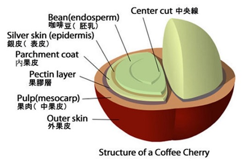

#咖啡
[TOC]

## SCA Barista 初級 + 中級

### 筆試

#### Q1: 咖啡豆的種類中，Arabica & Robusta的差異為何

@import "1.csv"

#### Q2: 以下何者不是Arabica的亞種? A. Ethiopia B. Typica C. Pacas

- A (衣索比亞是地名)

#### Q3: 發啡豆由內而外的組成為何?

- (外)果皮，果肉，果膠，(內)果皮，銀皮，咖啡豆，中央線
(皮肉膠 皮皮豆中)

#### Q4: 咖啡豆放久了會有什麼氣體排出?

- $CO^2$

#### Q5: 密封咖啡豆的袋子中，圓圓的孔洞是叫做什麼?

- 單向排氣閥

#### Q6: 咖啡不能保存在什麼地方?

- 濕、光、熱、異味，如冰箱

#### Q7: 沖咖啡的蓮蓬頭由下往上的構造?

- 墊圈(用來卡填壓把手)->沖煮頭->濾網
    
    
    

#### Q8: 墊圈較軟代表?

- 較新

#### Q9: 磨豆機多久清一次?

- 每天

#### Q10: 蒸奶棒多久清一次?

- 每次用完

#### Q11: channel效應是指?

- 落粉不均 -> 龜裂 -> 一邊快一邊慢

#### Q12: expresso 沖泡sop

1. 擦乾
1.1 磅秤扣重
2. 磨豆/填粉
3. 整粉
3.1 秤重
4. 填壓(用手肘出力)(旋轉)
5. 抹拭殘粉
6. 放水
7. 上把手
8. 沖煮
9. 觀察
10. 飲用
11. 清潔

#### Q13: 咖啡因怎樣算萃取正常?(背)

- 14%萃取不足 (酸)
- 19~22%正常
- 22%以上過度萃取(苦、澀)

#### Q14: 牛奶應該如何保存?

- $4 -5^{\circ}C$ , 12~18天(未開封)

#### Q15: 發泡適宜溫度?

- $65^{\circ}C$ ，最高不可超過 $70^{\circ}C$

[https://www.notion.so](https://www.notion.so)

#### Q16: 日曬跟水洗的差異?

@import "2.csv"

#### Q17: 下列何者為萃取0~10s的expresso?

@import "3.csv"

#### Q18: 牛奶的發泡質量與什麼有關?

- 質量 - `脂肪`

> 多寡是跟蛋白質有關
> 

#### Q19: 以下何時洗手正確? A: 落粉完 B: 吃東西完 A: 發泡完

- B, 吃東西完

#### Q20: 客戶處理SOP為何?

1. Listen傾聽
2. Sorry道歉
3. 處理方法告知
4. action行動
5. ask問滿意度

#### Q21: 磨豆機/咖啡機/甜點冷藏櫃

- 磨豆機 / 咖啡機 / 甜點冷藏櫃
- (點餐———(客人動線)—————>取餐)

### 風味描述

#### 酸度

- 草莓、藍莓、柑橘、檸檬、萊姆、黑櫻桃、覆盆子

> 禁止說`莓果`、`堅果`、`花香`
> 

#### 香氣

- 泥土、煙熏、可可、焦糖、杏仁、水蜜桃、佛手柑、桃子、茉莉花、黑醋栗、花生、木質

#### 醇度（body）：咖啡在口中的口感

- 水、脫脂乳、牛奶、奶油、糖漿

#### 整體

- 均衡、有層次、香醇、溫和、柔潤

### 上機考試SOP

#### 12分鐘，2杯Exp

- 出杯擺盤
    - 風味(聞起來像什麼)
    - 味道(嘗起來像什麼)
    - 醇度(口感如何)

#### 8分鐘，1杯Exp、1杯拿鐵、兩杯卡布

- 出杯擺盤

#### 5分鐘，2杯拉花

- 出杯擺盤

### 附註

- 咖啡研磨粗細 - **`順粗逆細`**
- 填壓把手的濾杯有`１８ｇ`＆`２０ｇ`等大小差異
- 中奶缸倒入 A,B 兩個小奶缸
    - `A杯` $\frac{1}{3}$ -> B杯 $\frac{1}{2}$ -> `A杯` $\frac{1}{2}$ -> B杯缺口下 -> `A杯`缺口下 -> `B杯`滿杯 -> `A杯`滿杯