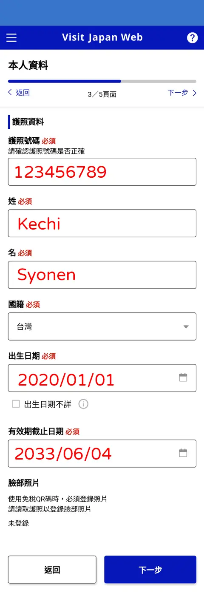
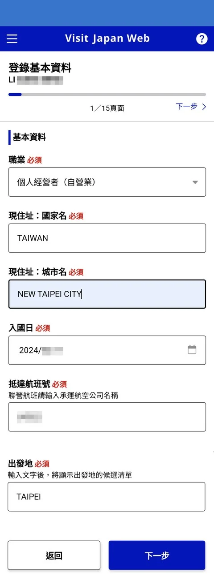
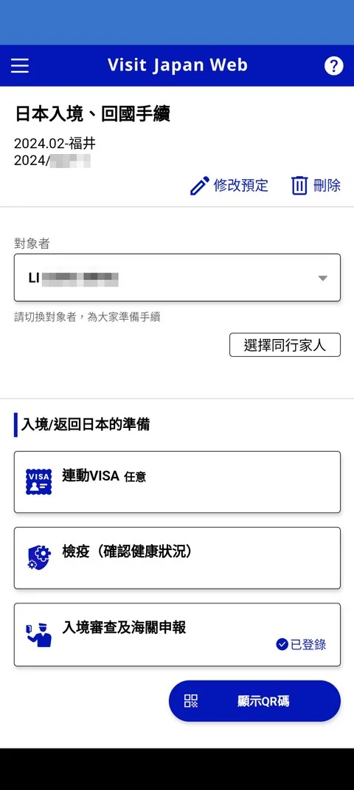

# 日本

[TOC]

## 攜帶物品

- [ ] 超級牙線
- [ ] 椰子乖乖
- [ ]
- [ ]

## 準備作業

- [x] 1000 NTD
- [ ] esim 開通
- [ ] esim 7 days
- [x] VJW 註冊帳號
- [x] VJW 登錄個人資料
- [ ] VJW 登錄入境資料
- [ ] VJW 登錄日本入境、回國手續
- [ ] VJW 存取 QR 碼
- [ ] 兌換日幣
- [ ] 訂飯店 6/22 京都
- [ ] 訂飯店 6/23 京都
- [ ] 訂飯店 6/24 京都
- [x] 訂飯店 6/25 - `日本環球影城森格拉爾天空水療酒店`
- [x] 訂飯店 6/26 - `日本環球影城森格拉爾天空水療酒店`
- [x] 訂飯店 6/27 - `Citadines 難波大阪 雙床房`
- [ ] 訂環球門票+速通
- [x] 挑選信用卡 - `Cube`
- [x] 儲值`Suica`
- [x] 來回機票
- [x] 機場接送

### APP

- `Wanderlog` - 可記錄航班/住宿/景點/開銷/營業時間
- `Trip.com` - 搭飛機可提醒行李在幾號門

### VJW (Visit Japan Web)

- 日本入境卡包含2個部份
  - 針對「人」的「入境審查」
  - 針對「物」的「海關申報」
- 手機填寫Visit Japan Web資料，就可以省去手寫
  - 申請完畢後截圖Qrcode(因為機場WiFi 網路很爛)
- 也可以機場填寫紙本 or 飛機上空姐會給你（他會問）

#### 註冊帳號

| 1  | 2  | 3 |
|  ----  | ----  | ----  |
|{width=130 height=300}|{width=130 height=300}|{width=130 height=300}|{width=130 height=300}

#### 登錄個人資料

| 1  | 2  選「否」(使用機率很低)  | 3 |4| 5  |
|  ----  | ----  | ----  | --- | ----  |
{width=160 height=250}|{width=130 height=250}|{width=200 height=250}|{width=200 height=250}|{width=200 height=250}

| 6  | 7  台港澳直接填否 |
|  ----  | ----  |
{width=160 height=300}|{width=160 height=300}|

#### 登錄入境資料

| 1  | 2 | 3  航班編號不用填英文 桃機選台北 | 4  第一晚住宿飯店 |
|  ----  | ----  | ----  | --- |
{width=200 height=300}|{width=200 height=300}|{width=200 height=300}|{width=130 height=300} google map 可以看到英文地址 |

| 5  | 6 |
|  ----  | ----  |
{width=180 height=300}|{width=180 height=300}|

#### 登錄日本入境、回國手續

| 1  | 2 | 3  | 4  |
|  ----  | ----  | ----  | --- |
{width=130 height=300}|{width=130 height=300}|{width=130 height=300}|{width=130 height=300}|

| 5  | 6  慎重回答 | 7  黃賭毒  | 8  刀肉蔬果  |
|  ----  | ----  | ----  | --- |
{width=130 height=300}|{width=130 height=300}|{width=130 height=300}|{width=130 height=300}|

| 9  金條  | 10  過量的物品 | 11  商業貨物 | 12  走私 |
|  ----  | ----  | ----  | --- |
{width=130 height=300}|{width=130 height=300}|{width=130 height=300}|{width=130 height=300}|

| 13  100萬日圓  | 14  後送物品  | 15  確認  | 16  成功登錄  |
|  ----  | ----  | ----  | --- |
{width=130 height=300}|{width=130 height=300}|{width=130 height=300}|{width=130 height=300}|

#### 顯示QR 碼

| 1  | 2 | 3  |
|  ----  | ----  | ----  |
{width=130 height=300}|{width=130 height=300}|{width=130 height=300}|

### 電信

- 如果`關於本機->電信業者鎖定->SIM卡已鎖定`則必須先去電信業者解鎖

    {width=150 height=150}
- Ahamo 日本電話號碼
  - `090-2661-4807`

### 信用卡

- `台新Flygo` - 無腦 3%
- `Cube信用卡` - 無腦3.3%回饋
  - 如果有切日本賞是無腦 3.5%

    | 1  | 2  | 3 | 4 |
    |  ----  | ----  | ----  |----  |
    |{width=130 height=130}| {width=100 height=200}|{width=100 height=200}|{width=100 height=200}|

  - 可以先儲值 `Suica` 5%回饋

## 京都-大阪

### 交通

#### 一般交通

- 京都觀光一日券(跟`Suica`差不多)
- `Suica` (方便)

    | 1  | 2  |
    |  ----  | ----  |
    |{width=130 height=100}|{width=150 height=100}|

### 景點

#### ドーミー京都西院

地址：〒615-0014 京都府京都市右京区西院巽町38-2
GoogleMap：<https://maps.app.goo.gl/KACXwmsU8CB1GKwK9>

#### 大阪環球影城

- 速通2個月前要開搶

##### 購買方式

- Klook
- KKday
- trip.com

##### 建議組合

- line 旅遊 + Klook + 信用卡
- VPN 到大阪環球官網

### 行程

#### 6/22(日)

- 抵達大阪

#### 6/23(一)

- 豬一拉麵
- 錦市場
- snoopy史奴比茶屋 京都錦店
- 晚上河原町（snoopy town在河原町四條）
- 晚餐可以吃shake shake 四條店
- 有時間的話可以去京都站的yodobashi
（porter、小V鍋、3C產品整棟）

#### 6/24(二)

- 早上：去京都車站搭車跟團
- Klook一日行程-天橋立+伊根舟屋
- 晚上去AEON-京都的永旺吃飯（先領折價卷）
- 有時間的話去看京都塔

#### 6/25(三)

- 早上清水寺or嵐山（要很早起待確認）
- 晚上移動行李到大阪
- 晚上住—日本環球影城森格拉爾天空水療酒店

#### 6/26(四)

- 大阪環球影城一整天
- 必去大阪環球影城-snoopy主題館
- 晚上住—日本環球影城森格拉爾天空水療酒店

#### 6/27(五)

- shake shack漢堡(漢堡)or其他
- 晚上大阪阿倍野HARUKAS展望台（夜景）
- 晚上住—Citadines 難波大阪 雙床房

#### 6/28(六)

- 早餐吃-黑門市場
- 臨空城outlet

### TBD

黑狗日本待去：
《京都〉
吉伊卡哇MOGUMOGU本舖｜京都-伏見稻荷
從京阪本線「伏見稻荷」站徒步3分鐘，或是JR奈良線「稻荷」站徒步約2分鐘可抵達。

清水寺
下雨備案：
京都yodobashi
Three Kingdoms Overalls-在名古屋

抹茶🍵
嵐山小火車
——————————————————
《大阪》
shake shack漢堡(漢堡)京都四條or大阪吃
倍野HARUKAS展望台
夜景  OSAKA WHEEL
黑門市場
Big camera
《奈良公園》
