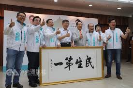

# 時事
[TOC]

## 2018

### 永和分屍案

- 8月22日
- 新北市永和
- 加拿大男子遭殺害並肢解
- 犯罪嫌疑人多為外國籍
- 新聞播出後，一名具有美國和德國雙重國籍的嫌犯立即潛逃菲律賓
- 截至2018年8月25日，兇手仍逍遙法外
- 台灣警方獲報到達現場，發現一具無頭男屍，其前臂、小腿已被肢解，從死者愛犬得知並確定是43歲的加拿大男子Ryan
- 死者妻子曾在2017年10月8日宜蘭戲水時不慎溺斃，並上[新聞版面](https://www.mirrormedia.mg/story/20180822soc007/)
- 之前一起去玩的臘腸Spongy失蹤
- 黑色愛犬Lulu被送往警察局，礙於「驚嚇過度」，不小心從中正橋派出所跑掉，
- 8月24日，警方先對6名外國人進行盤查，初步鎖定30歲俄羅斯男子和美國籍女子
    - 因2人皆在大安區擔任英語老師和死者碰面後去向不明，2人主動到案訊問後警方排除涉案可能
- 警方在死者Ryan通訊軟體中，發現他與多名外籍友人發生爭執
    - 主要起源於今年5月，死者Ryan遭警方查獲為提供毒品上游
    - 隨之死者生活圈中的毒友，每當與死者從事毒品活動後，沒多久就會遭警方查獲
    - 毒友懷疑死者為提供線報給警方的「線人」，為此常與死者發生懷疑而爭吵。
- 警方非裔美籍男子班特（Bent），台籍男子吳宣，，綽號「OZ」的主嫌美籍刺青師孫武生則潛逃至菲律賓
    - 孫嫌美國護照在菲律賓時被註銷，讓他無法再出境遁逃，因此孫嫌一見AIT人員到場，對他們連比3次中指，還邊罵髒話洩憤
    - Bent原本堅不吐實，沒想到得知OZ在菲國落網後，Bent立刻向警方供出所有情節
        - 指稱因為OZ在美國時就很兇殘，他擔心家人遇害，所以才不敢說出實情。

### 台北監督連線

- 六名親民黨、無黨籍台北市議員共組「台北監督連線」
    - 親民黨市議員黃珊珊、林國成、參選人洪士奇
    - 無黨籍市議員陳政忠、李慶元、參選人徐立信
    - 主打「放下藍綠、民生第一」
    - 就連參選人的「戰袍」都是清一色白底、藍綠色字樣
        
        

- 昨天邀請親民黨主席宋楚瑜、台北市長柯文哲同台造勢
- 是否象徵親民黨和柯文哲結盟合作？柯文哲說，「合作啦，不要說結盟」

### 薩爾瓦多斷絕外交

- 8月21日，中華民國宣佈與薩爾瓦多斷絕外交關係，隨後薩爾瓦多與中華人民共和國建交，中華民國邦交國總數剩餘17國。
- 美國聯邦參議院外交委員會亞太小組賈德納主席針對《2019年國防部撥款法案》（Department of Defense Appropriations Act, 2019）提出修正案，限制（restrict）美國對薩爾瓦多的援助

### 郭台銘質押鴻海股票850張

- 鴻海董事長郭台銘在7月初申報質押鴻海股票850張，價值逾6,800萬元
- 提供其資助前總統馬英九正積極籌設創立的「財團法人馬英九文教基金會」
- 該基金會預定8月27日正式成立運作。

### 85°C事件 (溫朗東：85度c根本是台灣一堆企業的縮影)

- 8月15日，蔡英文造訪位於洛杉磯的85°C門市，店員拿出吉祥物抱枕給蔡總統簽名
- 此舉也惹惱大陸網友，大陸網友灌爆85°C微博，指責85°C是台獨企業，揚言抵制、拒買
- 85°C隨即在官網及微博上發出三點聲明，表示堅定支持「九二共識」的立場從未改變，持續秉持「兩岸一家親」信念為海峽兩岸消費者提供提供優質的產品與服務
    - 沒有放在台灣官網，只放在中國的子網頁上
    - 但討不了台灣人歡喜，也被中國人討厭
1. 營利至上，規避社會責任
    - 誠實納稅，是企業最基本的社會責任。
    - 85°C總部設在避稅天堂、被稱作「公司比居民還多」的開曼群島，用外國公司身份在台灣上市，避掉了一堆企業所得稅、大股東的個人綜所稅。
    - 不僅如此，85度c的食安管理荒腔走板：桃園平鎮延平店綠茶生菌超標、花蓮中正店造假標籤日期、福州買三明治送蚯蚓、上海買奶茶內贈電池……
    - 從2008年開始，各地陸續爆出85度c是未保勞健保、給薪不到基本工資的慣犯。在澳大利亞還爆出只給法定最低工資的56％，被政府要求償還勞工42,775澳元。
2. 仰賴中國賞飯吃
    - 85°C是個聽從「親中建議」的乖寶寶，把市場命脈交到了中國手上，這就註定了它今天的命運
    - 85°C 2017年第三季的營收中，有66%來自中國，台灣營收只有16%。
        - 一個人，如果有一半的生計收入來自於老闆，他勢必不敢得罪
        - 一間企業，如果有一半的收入來自於中國，他勢必要懂得道歉
        - 我們的台灣，如果有一半的收入來自於中國，還要簽ecfa服貿貨貿……
        - 85°C 今時今日的處境，恰恰證明讓中國國民黨下台是正確的，擋下服貿是正確的，蔡英文發展新南向政策（即使成效不顯），方向也是正確的
3. 心中不是沒有台灣，只是太想左右逢源
    - 美中貿易戰，中國受傷，民眾焦慮，情緒需要個出口。
    - 嗆不贏美國，就來嗆台灣。
    - 但長年以來，85度c的飲食管理不佳，形象已經不好。
    - 更嚴重的是，在中國網友的眼中，85度c確實有著「台獨企業」的跡象。
        - 中國三鹿毒奶粉事件，85度c在台灣的店面澄清說：「本公司所有乳製品均未直接或間接使用中國製商品。」
        - 85度c的官網中，把「中國」跟「美國」、「澳大利亞」並列為「海外據點」。
        - 85度c承認九二共識的道歉聲明，沒有放在台灣官網，只放在中國的子網頁上。就只是給中國人看的。
    - 比起近期爆出眾多大飯店，其中還不乏號稱本土財團的飯店，大搖大擺的在官網、飯店wifi寫著「中國台灣」，85度c的品格高出他們幾倍！
    - 但討不了台灣人歡喜，也被中國人討厭，成了85度c的結局。
        - 左右逢源，終究一無所獲。
4. 總結
    - 但它所犯的錯，不至賣台
    - 「獲利至上」
    - 「稅能避則避，能逃則逃。勞工薪資、食料成本越低越好」
    - 「前進中國是唯一出路」
    - 「在台灣愛台灣，在中國愛中國」
    - 在85度c的故事裡，我看到台灣很多人的影子。

### 新北市台北醫院養護之家大火

- 8月13日，新北市新莊區源路上的衛生福利部台北醫院養護之家發生大火
    - 火警發生時間為凌晨4點25到26分，護理人員第一時間是內部通報，但總機沒人接，因此到了4點36分才通報消防
    - 0427 火煙冒出
    - 0428 護理師著急打電話
    - 0429 抬出起火病房病患
    - 火警發生後，該病房人員撤出，沒有將門關起來，導致火勢還有煙霧蔓延
    - 0436 119消防局接獲報案
    - 0441 消防隊抵達
    - 0515 火勢控制
    - 0527 火勢熄滅
    - 造成14人（7男7女）死亡，十一人重傷，二十餘人輕傷
    - 應負責單位：衛福部
- 護理公會臉書下各個憤怒的留言：
    - 堅持嚴格立法三班各班護病比
    - 反對平均護病比
        - 評鑑只是裝模作樣的把病護比用「平均數」計算
    - 護理長不納入護病比
        - 掛名可能不知道人去到哪棟樓的護理長，都可以當作分母
- 澳洲公立醫院的病護比1:4、美國區域醫院1:6，台灣的病護比規定擺明在放水。

### 台杉水牛一、二號創投案

- 蔡政府以「台杉投資管理顧問公司」為名，推出「台杉水牛一、二號創投案」極似鐽震案翻版
- 行政院國發基金為最大股東，再加上公股銀行挹注，泛公投持股高達6~7成
- 銀行業密報，民進黨政府透過「搬錢三部曲」，已從銀行搬走高達105.5億元
- 106年8月成立資本額1.26億元的台杉投資管理顧問公司
- 106年12月金管會修正規定，將銀行轉投資創投比例由5％放寬為100％
- 107年3月成立資本額50萬元的台杉生技
- 台杉生技&台杉投資管理顧問提出台杉水牛一號、二號創投案向銀行募資
    - 台杉水牛一號創投泛公股合計持股高達60％
    - 台杉水牛二號創投有71％是泛公股錢來自泛公股的民脂民膏，卻設計成100％純民營，不受任何監督及規範
    - 台杉生技資本額只有50萬元，一年管理費收入卻近1.5億元，「有這麼好的生意？」

### 美河市案

- 台北捷運新店機廠之聯合開發案
- 起初由台北縣政府（即今新北市政府；時任縣長為尤清）於1991年3月公告徵收
- 後由前台北市長馬英九任內與日勝生簽約
- 2012年12月郝龍斌任內完工
- 2012年12月監察院認定美河市建案，低估土地成本、高估建物成本，台北市府棄守權益達100億元，恐有圖利廠商之
- 2013年12月25日，台北地檢署檢肅黑金專組檢察官認為前台北市政府捷運工程局聯合開發處長**高嘉濃**涉偽造建物鑑價報告，高估建物涉嫌圖利
    - 檢方認定，前台北市捷運局聯合開發處長**高嘉濃**、課長**王銘藏**承辦美河市共構建案（北捷新店機廠聯合開發案），以偽造鑑價報告，涉嫌圖利日勝生公司
    - 導致市府減少選取10743.3913平方公尺（約3250坪）的樓地板面積，百分之九十九點三五土地的北市府，在二千二百戶建物中僅拿到六百六十八戶
    - 使市府蒙受市價逾20億元的損失，依偽造文書、圖利罪嫌起訴高、王2人

- 2017年12月高等法院依公務員假借職務上機會行使偽造私文書罪，判高4年徒刑並緩刑5年

### 2019年台中市東亞青主辦權遭拔

- 台中市政府舉辦首屆「東亞青年運動會」主辦權遭拔
- 主要是中國認為台灣推動「東京奧運正名活動」，違反國際奧會規定
    - 遭對岸、親中人士質疑這個公投挑釁兩岸關係，炒作台獨
- 整件事傳出是由中華奧會前國際組長姚元潮向國際奧會密告
- 「2020東京奧運台灣正名公投運動」領銜人紀政表示「台灣人扯自己人後腿」
    - 2020東奧以台灣隊出賽，並不是她先發起的，是兩年前一群友台的日本好友，在日本東京大街小巷開始連署，「連日本朋友為我們打抱不平，台灣怎麼可以沒有任何行動？這是非常不對，基於別人幫助我們，我們可能無動於衷嗎？所以才會有這樣的活動。」
    
    
    

### 巴黎同志運動會將以「臺灣隊」名義出賽

- 四年一度、即將在八月登場、被慣稱為同志奧運的 2018 巴黎同志運動會，臺灣將首次以「臺灣隊」（Team Taiwan）名義出賽
    - 臺灣隊的選手中，代表時代力量參選新北市第2選區（新莊、泰山、五股、林口）的唐聖捷相當引人注目。
    - 採用象徵台灣意象的鯨魚彩虹旗
    
    - 但在中國壓力下，法國主辦單位未通知臺灣選手們，就先將官網上原本的 Taiwan ROC 改為加註 Taiwan (Chinese Taipei) （中華台北）
        - 最後甚至又直接拔掉 Taiwan，僅剩令人難以忍受的 Chinese Taipei

### 蔣月惠在抗爭中咬傷警察

- 屏東縣政府認為，**屏東車站**改建、鐵路高架化之後，**車站人潮會大幅增加**
    - 為了避免到時的交通阻塞。原有的8米道路太窄，必須徵收民宅拓寬道路
    - 縣政府以每坪**13萬元**至**15萬元**徵收土地
    - 有**12戶已同意**拆遷，**7戶仍居住現地**，不願搬遷
    - 7戶牴觸戶中有6戶也一度同意簽署，僅剩1戶堅持不願搬遷
    - 同時間，長期關注公勇路牴觸戶居民權益的議員蔣月惠，到場聲援住戶，要求縣府利用公有地拓寬道路，不要逼住戶遷出已住了一輩子的房子
    - 在蔣極力抗爭下，原本一度同意的6戶住戶也反悔要求撤銷。
- 居民質疑，附近有一塊交通部鐵路局的地，離鐵道更近，要拓寬道路，拿那塊地進行效果更好。
    - 屏東縣政府的新聞稿中，把責任推給交通部，說交通部不核可，理由語焉不詳。
    - 此外，新建車站工程依據法規，必須增設停車場，目前的臨時便道，剛好可以拿來蓋停車場。
    - 換句話說，為了法規要增設停車場，鐵路局的地不用，臨時便道也不能用，就是要拆你有產權有土地權狀的房子。
    - 然後跟你說，已經按照市價徵收了，價錢很好，不要囉嗦，再找麻煩，就是阻礙城市發展的釘子戶。
    - 然而，屏東縣政府仰賴的只是一個有待商榷的推論
    - 他們認為，車站改建後人潮會大幅增加，如果不把公勇路民宅拆掉道路拓寬，會不敷使用
- 這個推論，必需要有客觀數據的支持
    - 首先，屏東縣因為產業結構的關係，人口長期外移，2002年開始人口負成長16年。人口從1997年的高峰91.3萬人，減少到去年約83萬人。
    - 其次，從推論上來看，台鐵班次增加，意味著屏東人要往外縣市跑
    - 候車時間減少，但未必會造成整體運量上升
    - 運量上升的前提是，班次增加讓原本不坐台鐵的屏東人改坐台鐵，又或是帶來以台鐵為交通工具的觀光客。這個推論，必須有明確數據支持
- 屏東縣政府在清晨四點，帶著機具怪手，強拆數戶位於屏東後站公勇路的民宅
    - 在拆除現場，工務處表示先進行同意戶拆除工程，並不影響不同意戶的權益，但仍讓居民人心惶惶。
    - 前來聲援的台中市黎明幼兒園園長林金連提到，縣府將切割工具「焊切氧乙炔」等物放在不同意戶家門前，由工務處處長楊慶哲與不同意戶進行「溝通」、簽署同意書
    - 當地居民中有2戶不同意戶被無預警拆除電表、家門口被停放怪手等機具，直到簽署同意
    書之後，才被覆電
    - 當地居民表示，「溝通」的內容形同恐嚇，倘若今天不簽署同意書，那就今天進行強拆；今天若簽署同意，那就進行協商、兩週後再來拆除
    - 大多數的居民無所選擇，只能在被逼迫的狀態下同意簽署
    - 蔣月惠接到民眾電話後趕忙到達現場，她坐在怪手前與對方僵持一個多小時，工務處便要求，「議員，不然妳先讓我們拆那個同意戶好了」
    - 蔣月惠同意後因為手機沒電，便離開現場要去拿包包，她才離開封鎖區因為遇到朋友有電池，便立即要返回現場，結果才一分鐘的時間，現場人員就禁止她進入，後來她從洞溜進現場。
    - 蔣月惠表示，她有問工務處長，「你是不是同意戶、不同意戶今天都要完成？」對方點頭稱是
    - 所以她當時很緊張，要趕到怪手處，結果就被警員圍住、壓制在紐澤西護欄，她感覺自己有點無法呼吸，反抗時有手伸到她前方，她便重咬下去，「他們就針對我一個人」

### 馬英九三中案

- [三中案偵結 馬英九、蔡正元遭起訴([https://tw.appledaily.com/new/realtime/20180711/1388421/](https://tw.appledaily.com/new/realtime/20180711/1388421/))
    
    
    

### Google違反反托拉斯法

- 歐洲聯盟（EU）7/19 宣布，Google因違反反托拉斯法，遭重罰 43.4 億歐元（約新台幣 1545 億元）天價
- 谷歌（Google）發言人費尼（Al Verney）在聲明中說：「Android 已為大家創造更多選擇，而不是更少…我們將針對歐盟執委會裁決提出上訴。」
- 歐盟主管市場競爭執委維斯塔哲（Margrethe Vestager）說：「谷歌非法利用 Android 近乎獨占的地位，鞏固自家搜尋引擎和瀏覽器的市占。歐盟執委會今天決定針對谷歌違反歐盟反托拉斯法規，處以 43.4 億歐元（50 億美元）罰款。」
    - 強迫智慧型手機製造商預先安裝旗下App
    - 免費提供手機製造商Android軟體，但以「獨家協議」綁定手機製造商，迫使廠商在手機上安裝Google的網路程式
    - 若業者想安裝Google Play商店，就必須連帶預設Google為搜尋引擎，或是安裝Chrome瀏覽器以及Google的電郵、地圖等服務。

### 文大宿舍爭議案

### 台大校長管中閔事件簿

### 中興事件

- 4 月 16 日（美東時間）美國商務部宣布，未來 7 年將禁止美國公司向中興通訊銷售零件、商品、軟體和技術（後文稱之為【拒絕令】）
    - 禁售理由是中興違反了美國限制向伊朗出售美國技術的製裁條款。
    - 具體來說，根據 2017 年 3 月中興通訊與美國財政部、商務部和司法部達成的和解協議，中興通訊承諾解僱 4 名高級僱員，並透過減少獎金或處罰等方式處罰 35 名員工；但中興通訊在 2018 年 3 月承認，該公司只解雇了 4 名高級僱員，未處罰或減少 35 名員工的獎金。
- 4 月 17 日早晨，深交所發佈公告，因中興通訊股份有限公司發生對股價可能產生較大影響、沒有公開披露的重大事項，經公司申請，該公司股票自 2018 年 4 月 17 日開市起停牌。
    - 與此同時，中興通訊 H 股上市公司發佈公告，宣佈公司自 4 月 17 日 9 時起在港交所停牌。同一天，中興發布聲明稱獲悉此事，並對此事件對公司可能產生的影響進行評估。
- 4 月 20 日，美國商務部接受澎湃新聞採訪時表示，這項禁令即時生效，目前沒有扭轉的餘地或協商的空間；也就是說，要嚴格地等到 7 年才有望重啟協商。
    - 中興發布聲明稱，美國商務部對中興的製裁極不公平，不能接受，拒絕令不僅會嚴重危及中興通訊的生存，也會傷害包括大量美國企業在內的中興通訊所有合作夥伴的利益。
    - 中興還表示不會放棄通過溝通對話解決問題，也有決心通過法律手段維護自身合法權益。
- 4 月 22 日，中興聲明稱將吸取教訓，將合規視為戰略基石和經營前提。
- 4 月 25 日，中興發佈公告稱決定採取相關美國法律下可採取的與美國政府命令相關的某些行動， A 股將維持停牌。
- 5 月 1 日，中興聲明稱收到 BIS 的指引，內容有關美國商務部接受並審議公司提交的補充資料的程序；中興表示，中興預計將按照上述程序向 BIS 提供資料。
    - 而公司將在必要的情況下考慮才去相關美國法律下可採取的行政或法律措施。
- 5 月 3 日至 4 日，中共中央政治局委員、國務院副總理劉鶴與美國總統特使、財政部長姆努欽率領的美方代表就經貿問題進行討論。
    - 在 4 日的答記者問中，中國商務部新聞發言人表示中方就中興公司案與美方進行了嚴正交涉；美方表示，重視中方交涉，將向美總統報告中方立場。
- 5 月 4 日晚間，中興發佈內部信表示，中興已正式向 BIS 提交了關於暫停執行拒絕令的申請，並根據 BIS 指引提交了補充材料。
    - 中興不會放棄通過溝通對話解決問題的努力，也會運用一切法律允許的手段維護自身的合法權益。這一內部信傳遞的信息在 5 月 6 日對外公開。
- 5 月 7 日，美國白宮發言人桑德斯宣布中國國務院副總理劉鶴將率團赴美繼續同美方磋商經貿問題。
- 5 月 8 日，中國國家主席習近平應約與美國總 統川普通電話。川普表示將妥善處理好經貿問題。
- 5 月 9 日，中興聲明稱該公司的主要經營活動已經無法進行，同時公司的現金充足。
- 5 月 13 日，美國總統川普在 Twitter 發布消息，稱已經指示美國商務部處理中興問題。
- 5 月 14 日，中國外交部發言人宣布，習近平主席特使、中共中央政治局委員、國務院副總理、中美全面經濟對話中方牽頭人劉鶴將於 5 月 15 日至 19 日赴美訪問。
    - 屆時，劉副總理將同美國財政部長姆努欽率領的美方經濟團隊繼續就兩國經貿問題進行磋商。
    - 與此同時，外交部發言人還表示，中方十分讚賞美方對中興公司問題所作積極表態，正在與美方就落實具體細節保持密切溝通；對於美方關注的一些具體問題，中美雙方也在保持密切溝通。
- 5 月 30 日，中興宣布繼續停牌。
- 6 月 2 日至 4 日，美國商務部長 Wilbur Ross 率團訪華，中美雙方團隊繼續就中美經貿問題進行磋商。
- 6 月 6 日，中興宣布繼續停牌。
- 6 月 7 日，美國商務部長 Wilbur Ross 宣布，美國政府已經與中興正式達成協議。

### M17 IPO敲鐘停擺事件

- 6 月 7 日，M17 聯合創辦人「麻吉大哥」黃立成帶一票人赴紐約敲鐘，本以為可創下新紀錄，卻創下一個令外界匪夷所思的難堪世界紀錄：「敲鐘當天，股票沒辦法交易。」
    - 上市前失誤！募資金額小，券商多不願接
        - M17 想在美國上市，當然是因為本益比高，可募得的資金相對多，但美國法人機構看的投資標的物要更大，現在中國網路股的市值從 10 億美元、20 億美元起跳的比比皆是，「M17 要募 1 億美元，在法人眼中根本是小 case，不會有人關注。」
    - 上市時誤判！募資不如預期，卻仍繼續
        - 在 M17 定價前，黃立成已帶了 30 多人赴美準備敲鐘，結果當時金融圈傳出只募了不到兩千萬美元。此時，黃立成與承銷團隊可因股價過低選擇喊停，但是「大哥性格」的黃立成仍決定要敲鐘。
    - 上市後危機！無法履約，恐招來訴訟蟑螂
        - M17 大股東、承銷團隊都動員找資金，最後將籌資金額湊到 6 千萬美元，從原本每股 10 至 12 美元的一億美元籌資目標，下修到現在的每股 8 美元定價
        - 因為很「臨時」，根本沒有在承銷商的路演法說名單中，也沒有在承銷商配合銀行開戶，因而無法第一時間就匯錢來進行股票買賣交易，這就是現在「敲了鐘，卻沒辦法交易」的真正原因。
- 6 月 12 日上午，M17 召開董事會，原有投資人不想玩了，承銷商建議撤回
- 承銷商無法履約，當前美國股市「訴訟蟑螂」環伺，萬一投資人訴諸法律，承銷商跟大股東將有大麻煩。
- 根據 M17 財報，這次籌備上市，包括會計師公費、承銷、給紐約證交所與 SEC 的申請費等等，合計高達 355 萬美元（約合新台幣 1 億元）
- 「不敗神話」已非這時代的信仰，「快速修正」才是真正的新創業精神

## 2015

### 桃園市新屋保齡球館火災

- 時間1月20日2時2分
    - 消防局緊急派出84人搶救
    - 2時52分，鐵皮鋼架的2層樓建築因發生閃燃，突然燒塌，6名消防隊員殉職
- 事故原因:變電箱爆炸起火
- 死亡人數:6名消防員
- 受傷人數:2人
- 該建築為二十年違建，等級本為三十天內必須拆除的「A1-A4」等級被塗改成「非供公眾使用」的A7級或是「無立即拆除必要」的B級
- 過去六年來二十八次安檢僅一次沒過