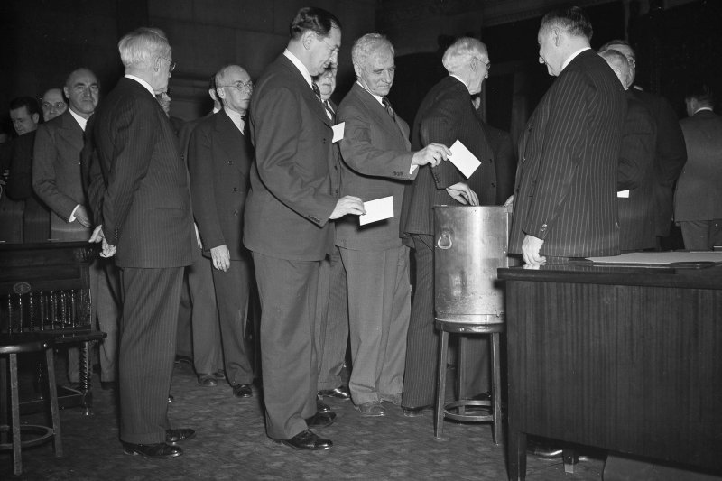
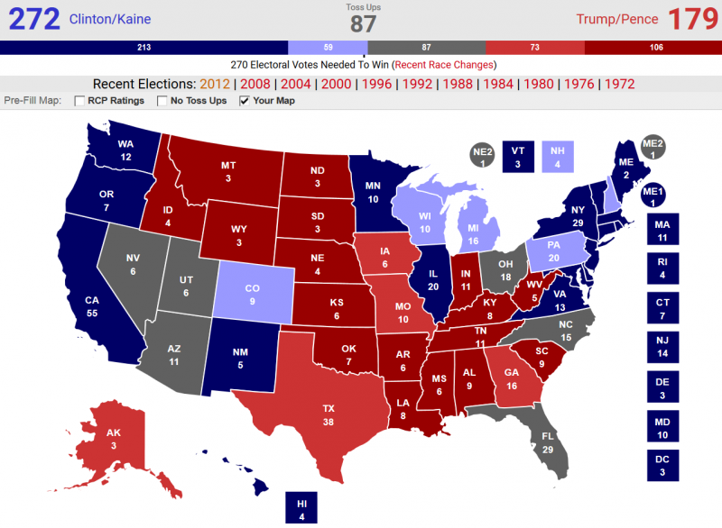
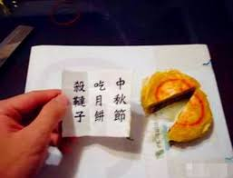

# 社會

[TOC]

## 外交

### 美國

#### 總統大選

- 先選出多位「選舉人」（Elector）所組成的「`選舉人團`」（Electoral College）
- 選舉人團再依照全民普選結果選出總統
- 各州推選選舉人的過程都不同，一般是由各政黨提名選舉人，或是直接由各黨委員會投票選出
- 為了避免「跑票」，通常會選對政黨有優良貢獻的老黨員或資深幹部。

- 美國大選當天，我們會看到美國人民興匆匆投票「選總統」
  - 當然他們是在選總統沒錯，但實際上他們選出的應是「`選舉人團`」
        

- 選舉人票共有538張

    

- 總統候選人若在一州獲得最高票數，就能拿到該州全部「選舉人票數」
  - 被稱為「勝者全拿」（the winner-take-all）
- 候選人在全國只要獲得270張選舉人票（538張的一半）就算當選
- 如果選舉人不遵守該州普選結果，就會成為「失信選舉人」（faithless elector）
  - 如果跑票程度嚴重到改變選舉結果，國會可能會介入
  - 美國歷史上共出現100多位失信選舉人，所佔比例極小，也從來沒有影響到選舉結果

#### 中美三個聯合公報

- 中共與美國共同簽署的三個外交公報
  - 上海公報
  - 中美建交公報
  - 八一七公報
- 這三個公報是中美在冷戰時期開啟對話和關係正常化的重要基礎
- 美國主張其兩岸政策是基於
  - 一個中國政策
  - 中美三個聯合公報
  - 台灣關係法

## 法律

### [美國防授權法](https://www.whitehouse.gov/briefings-statements/statement-president-donald-j-trump-h-r-5515/)

- 美國將這些條款視為總統的專屬憲法當局，作為總司令和國家在外交事務中的唯一代表，包括當局確定承認外國主權的條款，接待外國代表，並進行國家外交。
  - 三中報已經是過去式
  - 川普政府將只以現任川普總統依照憲法為對外交的唯一決策人物
  - 川普本人將有權決定要對外國政權的認定, 接待外國的代表, 以及執行美國外交
  - 過去的東西如同一張壁紙
  - 川普愛不愛執行，不關中國的事情
  - 要不要接待台灣的代表、對台灣的外交行為、都是由川普決定，而不是由中國

> Several provisions of the bill, including sections 1207, 1241, `1257`, and 1289, purport to dictate the position of the United States in external military and foreign affairs. `My Administration` will treat these provisions consistent with the President’s exclusive `constitutional authorities` as Commander in Chief and as the sole representative of the `Nation in foreign affairs`, including the authorities to determine the terms upon which `recognition is given to foreign sovereigns`, to `receive foreign representatives`, and to `conduct the Nation’s diplomacy`.
>

### 競爭法

#### 美國的反托拉斯法

- Antitrustex
- 反托拉斯就是反壟斷
- 信託基金讓鐵路公司可以依提供給消費者與企業的服務差別定價，以摧毀潛在的競爭對手
- 該法案的主要關注焦點在於，競爭市場本身應能提供對價格、產出、利益與利間的大部分調控機能
  - 該法**禁止反競爭行為**
- 聯合定價行為，則可能觸犯反托拉斯(Antitrust)

### 長期照顧服務法

- 在2015年　立法
  - 新法上路後，由於長照財源明顯不足，又再次修法
- 2017.01.11 《長期照顧服務法》財源與`法人化`修正三讀通過
- 2017.12.29　立法院三讀通過《長期照顧服務機構法人條例》
  - 配合長照法
  - 未來凡是新成立的住宿式服務的長照機構，都要以「長照機構法人」形式設立
- 早期成立的長照機構
  - 依照老人福利法的規範，床位在49床以下的老人福利機構，只要一名負責人即可成立
- 新成立的住宿式服務的長照機構
  - 要以「法人（財團法人、社團法人）」形式設立
    - 長照機構權責更加分明
    - 帳務公開透明
    - 不怕負責人跑路

## 政治

### 媒體

#### 親國民黨媒體

- 電視台:中視、中天、東森、超視、台視、華視、tvbs
- 報紙:中國時報、旺報、聯合報、聯合晚報

#### 親民進黨媒體

- 電視台:三立、民視、年代新聞
- 報紙:自由時報、Taipei Times

### 邦交國

- 台灣邦交國剩下17國
- 與台灣斷交的友邦國，大多是接受中國大陸金援而轉向建交
- **哥斯大黎加**在2007年宣布和台灣斷交，中國大陸曾承諾，會提供哥斯大黎加4億美元蓋高速公路
  - 但至今已經過10年，卻是一點下文都沒有，讓哥斯大黎加當年普天同慶的大動土木開工，現在只能停擺在那兒，連橋墩都還沒蓋出來。
- **薩爾瓦多**是台灣2年來第5個斷交友邦。
- **剛果**、**甘比亞**和**莫三比克**，當年也是接受中國大陸以幫助國內建設、挹注大量資金為誘因和我國斷交
  - 後來不但建設金沒拿到，當地人還成為大陸加工廠的血汗勞工
- **聖多美普林西比**當年要求我國投注2.1億美金的金援，卻被我國以「堅持健康外交」為由拒絕，因此斷交
  - 但大陸承諾的1.4億美元至今沒有下文，就連機場擴建的工程也無限延期。
- **馬拉威**當年也被大陸以60億美元的天價，利誘與我國斷交
  - 雖然有得到金援拓展基礎建設，但是醫療卻陷入困境，由於大陸醫療團隊缺乏周詳計畫，使得愛滋病在馬拉威氾濫，1年多達8萬人死於愛滋病
  - 馬拉威總統事後還對和台灣斷交一事大嘆後悔，但大陸的空頭支票，讓他們進退兩難，民不聊生。

### 名詞

#### 台灣價值

- 政治術語
- 2018年1月由中華民國總統兼民主進步黨主席蔡英文接受三立iNEWS台節目《鄭知道了》專訪，主持人鄭弘儀提問，無黨籍台北市市長柯文哲是否為民主進步黨盟友；蔡英文回答，柯文哲必須再次確認台灣價值，讓民進黨支持者認可。

#### 中華民國促進轉型正義委員會

- 2018年5月31日由民進黨執政創立
- 簡稱`促轉會`
- 主要任務
  - 統籌規劃「開放政治檔案」
  - 「清除威權象徵及保存不義遺址」
  - 「平復司法不法、還原歷史真相並促進社會和解」
  - 「處理不當黨產」
  - 「其他轉型正義事項」
- 獨立機關（行政院任務編組）
- 前副主委`張天欽`於9月12日自豪促轉會是「`東廠`」
  - 張天欽並於當天請辭負責
  - 總統府表示無法認同-
  - 行政院長`賴清德`表示無法接受`張天欽`作為
  - 國民黨新北市長參選人`侯友宜`也要求`蔡英文`要說清楚
  - 國民黨痛批`張天欽`是民主之恥
  - 促轉會主委`黃煌雄`也鞠躬道歉
- 24日適逢中秋節，國民黨台北市議員參選人`羅智強`也在臉書貼出一張月餅照片，旁邊一紙條寫著「1124滅東廠」
  - 11月24日是包括六都首長、縣市議員等九合一大選
  - 而月餅藏紙條相傳是明朱元璋揭竿反元，但元軍控制嚴密，義軍無法傳遞消息，適逢中秋節將至，劉伯溫獻計，在中秋節互贈的月餅裡面夾紙條，上面寫著「八月十五殺韃子」
        

#### 基金會

- 政客利用基金會公益的招牌與節稅的方便，用以接受政治獻金，甚至成為洗錢的管道，早令社會側目與詬病
- 國人對於由政客所成立的基金會，即使不負面表列，也絕對不會視為是正面表列。
- 曾經當過台灣民選總統的，每一位都設有基金會，誰也不必說誰，但是懂得愛惜羽毛者，至少會在透明度上力求公開，資金來源上分散且避嫌，為的是以昭公信。
- 2014年打算參選台北市長的柯文哲籌措競選經費，想找郭台銘募款，於是透過民進黨總召柯建銘希望引薦
  - 柯建銘之後有機會跟郭台銘餐敘，郭台銘藉這個場合，反要柯建銘幫忙轉告柯文哲不方便見他，因為他「長期以來都是支持國民黨」
- 反觀馬英九即使不在位了，仍能為自己的基金會向郭募得鴻海股票850張，價值逾6,800萬元

#### 環狀線

- 環狀線
  - 南環段:動物園站-大坪林站
  - 中環段:大坪林站-新北產業園區
  - 北環段:新北產業園區-劍南路站
  - 東環段:劍南路站-動物園站
  - 舊有馬郝時代規劃的捷運`南北線`由東環取代
    - 原缺點是只停`藍線`，沒停紅、綠線

**台北捷運**

**南北線**

**東環**

### 無良記者

#### 陳思豪

- <https://disp.cc/b/163-aJob>

### 國外公眾人物

#### 翁山蘇姬

- 2005年，的翁山蘇姬被緬甸軍政府軟禁
  - 獲頒「愛丁堡自由獎章」殊榮
- 去年8月25日，緬甸政府列為恐怖組織的「若開羅興亞救世軍」（ARSA）與緬甸軍警爆發衝突
  - 緬甸政府軍開始血腥鎮壓，導致70萬羅興亞穆斯林離開家園，湧進鄰國孟加拉
  - 外界紛紛以「種族清算」和「屠殺」，來形容羅興亞人受迫害的慘況。
  - 羅興亞人飽受迫害，尤其女性受害最深。
  - 孟加拉的難民營裡，誕生了許多性侵寶寶
  - 緬甸國務資政翁山蘇姬(2017.09)：「我們要去了解，為什麼這些難民事件會發生？」
  - 緬甸國務資政翁山蘇姬(2018.08.21)：「恐怖份子的危害是當初若開邦陷入人道危機的主因，至今威脅仍舊存在。」
  - 翁山蘇姬的諾貝爾和平獎還牢牢在握，但其他獎項紛紛和翁山蘇姬劃清界線
  - 聯合國人權理事會主席侯賽因：「非常失望，非常令人失望。」
  - 愛丁堡市議會準備撤銷頒給她的殊榮，翁山蘇姬將成為120年來，第2位被撤銷「愛丁堡自由獎章」殊榮的得主。

### 國內公眾人物

#### 劉喬安

- 反服貿太陽花學運中的知名人士，主張「民主不能交易」
- 由於頗有姿色，被記者私自稱為「太陽花女神」、「太陽花女王」
- 遭週刊記者揭露曾參與援交及仲介賣淫。
- 2015年11月5日，在臉書宣布自己進軍演藝圈，育有1女。

#### 周玉蔻

- 因為`柯文哲`上`黃光芹`主持節目而反感

#### 李來希

- 全國公務員協會理事長
- 反年金改革
- 在「軍公教網路之聲直播電台」指出，他現在只好吃剩飯，並群眾號召節衣縮食運動

#### 朱澤民

- 行政院主計長

#### 陳吉仲

- 行政院農業委員會副主任委員
- 推薦`吳音寧`

#### 徐立信

- 律師
- 提供民眾免費的法律諮詢服務
- 2014以無黨籍參選臺北市中正、萬華區市議員拿下9057票9,057（4.65%）
- 2018台北市議員`童仲彥`因酒駕風波宣布退出市議員選舉，並表示租到 11 月底已付費 300 萬左右的競選看板無償提供`徐立信`使用

#### 游藝

- 松菸公園催生聯盟召集人
- 反對遠雄集團在松山菸廠森林蓋大巨蛋
- 2018年4月23日，自行宣布參選台北市台北市第三選區（松山區、信義區）市議員參選人
- 「丁守中不用講，就是沿襲國民黨馬英九、郝龍斌一脈相傳的思維。他就說大巨蛋要讓它續建，但所有的爭議不去面對，你說這樣會讓臺北變更好，我不相信！你連自己要做事情的基本論述都不交代清楚，當選之後會用怎樣的方式對待市民？」
- 「我四年前就就是投給柯文哲，在我內心深處其實希望他變好，真的很希望變回以前剛當選的柯文哲，但他自己沒有堅定的價值信仰、容易搖擺。他當然也做了很多值得激賞的事，但太多跟我的理念背道而馳，不只是大巨蛋。」
- 「年輕人都很喜歡柯文哲，我孩子都問我為什麼要一直罵他？但就事情做不對啊，難道要嘴巴閉著嗎？又有人說：『可是你罵到他不連任怎麼辦？如果是丁或姚當選怎辦？』我說，可是你不罵他，他就變成丁守中或姚文智。不監督，政治人物就會變。」
- 「團隊成立時，就有人問說柯文哲來站臺接不接受？我說當然不！我就是要出來監督你了，站臺後我怎麼監督你？除非是黨籍關係，第三勢力不該向任何候選人靠攏。不能因為你的恩賜，進了議會之後還要跟你磕頭、變成支持者，那是不正當的。」

#### 汪潔民

- 財經專家
- 政論節目壹起來翻轉主持人
- 痛批：「瓦斯表需要智慧？」
  - `林昆鋒`解釋智慧瓦斯表用途，稱大家在冬天下班5點多時煮飯，瓦斯的壓力會突然降下來，台北市一共有7顆瓦斯高壓球，在平常是不用的，但是在冬天瞬間降壓是需要的，這時可以靠智慧瓦斯表調節，反諷汪潔明：「這就是智慧瓦斯表，需要智慧去了解。」
  - `汪潔民`更試圖反擊：「我講這麼多，你拿智慧瓦斯表，我同意你，也許我真的沒唸書。好，那就把智慧瓦斯表拿出來，那其他４項呢？」

#### 吳音寧

- 北農總經理
- 2018年6月6日民進黨中常會上，推薦`吳音寧`的農委會`陳吉仲`指出不管事菜價穩定程度、北農的獲利、業務推廣費運用等等，`吳音寧`都遠勝過前任北農總經理`韓國瑜`
- 兼任民進黨主席的`蔡英文`總統也在會上聲援`吳音寧`
  - 要求部會、黨給予`吳音寧`協助
- 老爸`吳晟`(國中課本的：不驚田水冷霜霜)
  - `吳晟`主張廢18%，獲得小英政府賞識，而提拔他的女兒當北農總經理

### 香港民族黨

- 主張香港獨立，建立獨立主權國家的「香港共和國」
- 成立於2016年
- 2018年下旬被香港政府禁止運作
- 召集人為香港獨立運動支持者`陳浩天`，發言人為`周浩輝`
- 在中國大陸慶祝「十一」國慶，香港民間人權陣線發起遊行，抗議北京和港府的政治打壓，以及不滿民族黨遭取締

### 社會民主黨

#### 范雲

- 社會學學者
- 1990年的台灣年輕人自主發起`野百合學運`民主運動
  - `范雲`是學運決策小組成員及總指揮
- 2018年5月4日，`范雲`宣布參選台北市長。同年8月23日，因200萬元登記費太高宣布退選

### 國民黨

#### 曾銘宗

- 國民黨立委
- 金管會主委(2013年-2016年)

#### 黃義交

- 2008年立法委員
- 舊情人是`周玉蔻`和`黃光芹`

#### 侯友宜

- 警政署署長

#### 丁守中

- 贊成停建核四

#### 徐巧芯

- `馬英九`發言人
- 參選臺北市松山信義區的市議員
- 覺得馬英九沒做違法的事
- 「對228事件，覺得雖然很多人討厭馬英九，但他至少每年道歉。」
- 「對婚姻平權態度和國民黨中央是不一樣」
- 屬於反共的國民黨人、支持中華民國
- 「我是中華民國派，只要是中華民國這個國旗、國徽、歷史。那兩種選擇，一種就是現在這樣，另一種就是真的很厲害、給它統一起來，但兩者我都不反對」
- 希望婚姻平權的法案能夠通過

### 民進黨

#### 許信良

- 前民進黨主席

#### 陳其邁

- 不分區立委
- 個性溫
- 老爸`陳哲男`涉及貪污罪

### 時代力量

#### 林昶佐

- 稱`柯文哲`「這真的是呷賽」「莊孝維」
  - 2018/4月，`柯文哲`強力掃蕩長期在街頭抗議者，稱這些人是政治路霸，強行拆除包括公投護台灣聯盟、原民團體等的帳篷
  - `林昶佐`當時受訪公開說，進步價值在處理陳抗事件應該重視的是人權，但柯卻用集遊惡法拆帳篷，還說是進步價值，「這真的是呷賽」，根本是「莊孝維」
  - 柯市長只是依照立委訂定的集會遊行法去執行，被批評不進步、去甲賽
  - 如果真是惡法你們又沒能力修，那何來臉面叫柯文哲呷賽 ### 吳錚
- 美國人
- 挺吳音寧
- 假台獨
- 沒當兵
- 小綠

#### 洪慈庸

- 2016年2月18日，與台中市新聞局長`卓冠廷`春節共遊新加坡，媒體當天採訪兩人堅稱「只是好朋友」
- 2017年4月24日，與`卓冠廷`宣布登記結婚
- 推動軍士官退場機制
  - 107年6月20日立法院三讀通過《陸海空軍軍官士官服役條例》第15條修正案
  - 未來任官滿一年的軍官士官，若真的無法留任軍旅，將能申請退伍，並經人事評審會三個月內審定，可依循各軍職的賠償辦法合宜退伍

#### 陳為廷(陳奶昔)

### 2018九合一選舉

- 2018年中華民國地方公職人員選舉
- 出新一屆的
  - 直轄市長
  - 直轄市議員
  - 里長
  - 山地原住民區長
  - 區民代表
  - 縣市長
  - 縣市議員
  - 鄉鎮市長
  - 鄉鎮市民代表
  - 村里長

@import "csv/1.csv"
