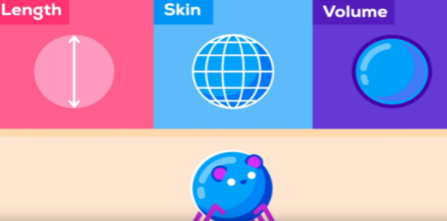

# 科學
[TOC]

## 科普

### 來源

- [各類效應](http://www.buzzhand.com/post_375164.html)
- [Optimistic Nihilism(樂觀的懷疑)](https://www.youtube.com/watch?v=MBRqu0YOH14)
- [Kurzgesagt – In a Nutshell](https://www.youtube.com/channel/UCsXVk37bltHxD1rDPwtNM8Q)
- [3Blue1Brown](https://www.youtube.com/channel/UCYO_jab_esuFRV4b17AJtAw)
- [打火哥教你火場求生](https://courses.mastertalks.tw/courses/take/fire-safety/chapters)

### [為何老鼠掉下來沒事?](https://www.youtube.com/watch?v=f7KSfjv4Oq0&t=324s)

- 因為你愈小，受到重力的影響愈低

- 假想一個球形生物，有長度、表面積和體積
    
    
    

- 如果將其放大10倍，則有些特徵放大倍數超過10
    
    
    

- 質量愈大，撞到地面的動能愈高
    
    
    

- 表面積比例愈大，空氣阻力影響愈大
    
    
    

- 大象的表面積與體積比非常小，所以動能被分佈在一個狹小的空間，且空氣阻力影響減速不高
    
    
    

- 已知最小的昆蟲（纓小蜂），體積只有一粒鹽的一半
    
    
    

- 對他們來說，空氣就像果凍或糖漿
- 翅膀比較像毛，用來游過空氣
    
    
    

### 核能發電 [1](https://www.youtube.com/watch?v=rcOFV4y5z8c) [2](https://www.youtube.com/watch?v=HEYbgyL5n1g) [3](https://www.youtube.com/watch?v=pVbLlnmxIbY)

- 中東戰爭導致全球油價飛漲，導致1970-1985年代核子反應爐興建巔峰
- 反應爐中由輕水反應爐(light water reactor)勝出
    - 早已存在
    - 可運作
    - 不貴
    - 調節器來控制中子能量
    - 用來加熱水
    - 不是很穩定
    - 至今仍有80%是輕水反應爐

#### 反對方

- 核子武器的擴散
    - 核子反應爐技術的擴展，造成各國隱匿發展核武
        
        
        
        
        
        
        

- 核廢料與汙染
    - 核廢料不只有放射性，還有極毒物質**鈽**
    - **鈽**需數萬年才慢慢衰退
    - **鈽**透過再處理可用於**核武**或**核燃料**
    - 但沒有新反應爐的話，無法處理**鈽**
    - 最後多數丟入海中或掩埋
        
        
        
        
        
    - 只有`芬蘭`認真設立永久核廢料儲存場
        
        
        

- 意外與災害
    - 1979年賓州三哩島發生第一次反應爐爐心融毀的事故
    - 1986年車諾比核子反應爐破裂事故震憾中歐
    - 2011福島核災
    - 災害發生在不同國家、不同時間、不同反應爐
    - 為了全球10%的能源，是否值得用每30年一次的毀滅性災害來換？
        
        
        

#### 支持方

- 核能拯救不少生命
    - 就算你包含車諾比、福島核災的死亡數，核災造成的死亡數／每單位發電量 比例是倒數第一
        
        
        
    - 就算核能很糟，但他依然存在某處
        
        
        
    - 主要是因為核災帶來的印象深刻，而煤礦石油殺人於無形(就像飛機意外與開車意外)
    - 轉換到100%再生能源前，核能能拯救生命比奪走的多
        
        
        
        
        

- 核能減少二氧化碳排放量
    - 自1976年以來，約有640億噸溫室氣體沒被排放出來
        
        
        

- 新的科技
    - 我們所使用的大部分核反應爐科技已經過時（自1970年停擺）
    - 釷反應爐更好，釷原料豐富，也難用於核武，造成的浪費也少
    - 核廢料的週期也只有百年
        
        
        
    - 一頓的釷相當於200噸的鈾或3500萬噸的煤炭
        
        
        
    - 我們不能保證核能科技不能奏效，但為何在我們放棄之前，不去做更多研究？
        
        
        

### 人工增雨

- 投碘化銀(沖洗照片用)幫助水分子附著:人類的1/1000用量
- 每年耗費數百萬美元
- 1962年，美國「破風計畫」：對颶風投藥=>失敗
- 1967~1972年，美國於越戰中，對寮國物資運補路線增雨30%
- 1973年曝光
- 1977年簽屬國際公約：禁止於軍事目地操控天氣
- 曾降雨過量造成洪水
- 泰國國王蒲美蓬發明對不同高度的冷暖雲投放藥劑，稱為超級三明治
- 在泰國，說國王壞話是要坐牢的

### 植物人

- 功能性磁共振造影(fMRI)：用來看腦部作用反應地區
    - 金屬不可帶入
    - 移動困難(需要救護車)
    - 利用讀心判斷病人是否有意識
- 腦電圖(EEG)：在頭皮上測量皮質電極，方便，但不深層
- 一位12年植物人，利用讀心回答「你痛苦嘛？」「不」
    - 如何增加病人生活品質&照顧
- 大腦似乎會無意識自動處理語言
- MRI常搭配「雙穩態錯覺」來穩定觀察大腦的刺激
- 顯眼影像快速呈現，可影響淺意識。
    - 吸引注意力的過程，似乎不需要意識參與

### 外星人

#### 德克雷公式

- 人類透過無線電可探測之外星文明數量
    - 銀河系內，類日恆星的形成率
    - 這顆恆星擁有的行星系統比率
    - 此行星系統內，適合生命存在的平均行星數(也就是類地球數目)
    - 行星發展出生命的機率
    - 生命演化出智慧的機率
    - 智慧生命發展出無線電訊號傳送技術，能被人類偵測到的機率
    - 無線電持續發送或是存活的平均時間

### 當社會不相信自由意志

- 越來越多神經科學家與哲學家，主張自由意志不存在，我們其實是受潛意識擺佈，只是有受到意識控制的錯覺 (如同夢遊)
- 人們越是懷疑自由意志，對被控犯罪的人越寬大為懷，同時也更會打破規則、傷害他人，以得到自己想要的
- 相信自由意志=>主張法律應採取矯正惡人措施(因為是神經失調)
- 不相信自由意志=>主張法律應採取以牙還牙之懲罰
- 若自由意志被證實實質並不存在，但相信自由意志能防止瓦解社會秩序的惡行，那就將自由意志這件事情，像人類創造上帝一樣創造出來吧

### 基因治療

- 基因治療試圖恢復受損或缺陷基因造成的疾病
- 透過把有功能的基因放進移除大部分原有基因的病毒內，當載體注入人體，進入目標細胞的受體上。進入後，病毒攜帶的正確基因會指示戲胞開始製造它以前一直無法製造的蛋白質
- 如果基因意外插入病患中會引起癌症的位置，或是病患自己免疫系統在防禦身體對抗外來物時太劇烈，可能引發強烈副作用
- 新的傳輸系統其一是腺相關病毒(AAV)，有分AAV2(眼睛細胞用)、AAV8(肝臟細胞用)、AAV9(心臟、腦部細胞用)，且不會導致癌症 其二是HIV簡化版，可安置多個大基因

### 微積分

#### 微積分與宗教

- 17世紀義大利卡瓦列里提出：任何平面都是由無窮多個線組成，而任何立體都是由於窮多個平面組成。我們可以利用這些「不可分量」來計算長度、面積、體積
- 瑞士古爾丁反對，認為這是直覺而非理性。平面內的線應該是無窮。但此爭辯並非只由於數學理由
- 古爾丁屬於耶穌會，而卡瓦列里屬於耶穌教團，前者相信可利用數學把嚴密的邏輯結構強加在混論的宇宙之上，後者則比較想順從直覺去了解複雜的世界(建構vs解構)
- 古希臘人畢氏學派認為，線段是可公度的，直到不可公度帶來了「無窮」的困惑
- 阿基米德與卡瓦列里都用**無窮小**當做輔助工具，求出未知體積與已知體積的比例

## 健康

### 吃

- 運動後黃金39分鐘內是最佳吸收時間
- 指某些快速吸收的碳水化合物與乳清
- 一般吃飯，是澱粉、蔬菜、蛋白質混合，在胃部消化停留的時間約2-3小時就沒有這效用了
- 澱粉必吃
- 早餐必吃
- 假如一感覺到餓，馬上吃一到兩片全麥土司(否則有機會導致肌肉被分解)
- 油脂攝取過少，也會造成憂鬱症狀
- 纖維質可以幫助腸胃蠕動與延緩血糖上升的速度
- 抽煙：尼古丁增加BMR的代謝率，但戒煙的人，多會復胖。
- 便秘會導致脂肪代謝不良
- 睡前禁止宵夜

### 喝

- 喝水幫助生成肝醣
- 沒水分，腎臟會請肝臟幫忙工作，肝臟就沒空分解脂肪。

### 睡眠

- 熬夜或睡眠不正常，減重速度變慢，體脂不易下降。

### 運動前

- 先做無氧再做有氧，可以先消耗部分肝醣，之後有氧減脂會比較有效率，但是這樣做，可能累的半死
- 一般人還是吃點東西在去運動

### 運動後

- 運動過後體重增加
- 碳水化合物分解快，不好儲存。脂肪相反
- 規律的運動對身體而言是一個訊號
- 收到訊號，身體會多儲存一些碳水化合物(肝糖)，少儲存一點脂肪
- 合成1g的肝糖，就必須帶著3g的水分
- 1.6kg的肝醣能量，脂肪只需要200g
- 肌肉的發炎會伴隨著水腫

### 知識
- 1kg肌肉消耗30大卡；1kg脂肪消耗6大卡
- 澱粉供給足夠的運動所需的血糖，可完全燃燒分解脂肪，防止因脂肪分解不完全，產生的酮酸態中毒。進而造成，腎臟裡的腎元不可逆的破壞。
- 有氧瘦全身