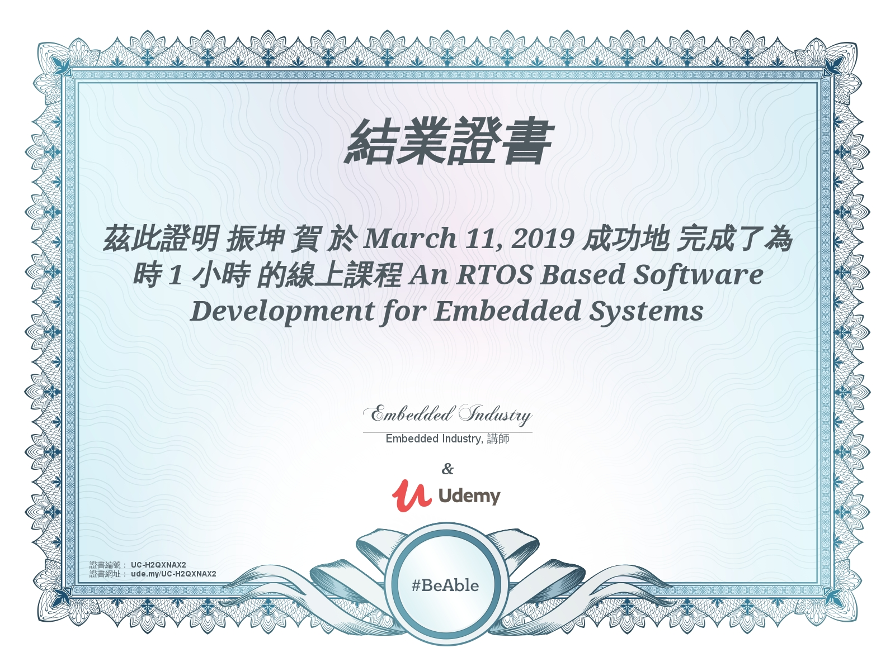

# 課程

[TOC]

## Hahow

- [ ] [三小時學會拆解社會現象與新聞議題](https://hahow.in/courses/59c1c8c84c36510700f925b2)
- [ ] [三小時教你怎麼講道德不輸人](https://hahow.in/courses/5aaf2dad1e4ee6001e9632fd)
- [ ] [職場必備的批判思考力：基礎篇](https://hahow.in/courses/5cac9bd2d133060020f42ab4)
- [ ] [職場必備的批判思考力：創意力篇](https://hahow.in/courses/5cee252cea2d0500209c0b8e)
- [ ] [職場必備的批判思考力：論戰力篇](https://hahow.in/courses/5d80dde645639e00212d81a5)
- [ ] [職場必備的批判思考力：反省力篇](https://hahow.in/courses/5dff3b91f066100021955305)
- [ ] [職場必備的批判思考力：沉思力篇](https://hahow.in/courses/5ebce244df2168d2c1d83995)
- [ ] [男友必學攝影課 by 有fu攝影](https://hahow.in/courses/575045e7206cd60900c53085/discussions)
- [ ] [挖出你的節奏細胞!爵士鼓教學-基本節奏篇](https://hahow.in/courses/580f1cedda04300700fe7fc9/main)
- [ ] [畫圖不帶尺，輕鬆學會透視畫建築！](https://hahow.in/courses/58aedfd95c4e6507007c4599/main)
- [ ] [復古風味色鉛筆食品速寫](https://hahow.in/courses/5780d82fd0c3030700412ef1/)
- [ ] [【不沾水水彩】入門-色鉛筆畫出水彩風](https://hahow.in/courses/59eca796ed6610001e82f784/main)
- [ ] [透視超訣竅(上) 如何運用透視畫出複雜的建築](https://hahow.in/courses/55e3dccbfa223d100058f3cb/)
- [ ] [從 0 到 1 - 為初學者而設計的日文課](https://hahow.in/courses/58e3714a5b23b507002a8d1e/discussions)
- [ ] [克服阻礙，快速說出流暢英文](<https://hahow.in/courses/57728810c2917a110075fb68/main>)
- [ ] [讓圖不只是好看的－資訊設計思考力！](<https://hahow.in/courses/572be49fd60bb3090091d208/main>)
- [ ] [全民防疫通識課：陳建仁副總統來開講](<https://hahow.in/courses/5e8d70a52aa77e6f34d6fded/main>)
- [ ] [用 Python 理財：打造小資族選股策略](<https://hahow.in/courses/5a2170d5a6d4a5001ec3148d/main>)
- [ ] [用 Python 理財：打造自己的 AI 股票理專](<https://hahow.in/courses/5b9d3a6dca498a001e917383>)
- [ ] [15 單元看懂經濟運行，掌握全球投資趨勢](<https://hahow.in/courses/5cad79b0d133060020f44c5e>)
- [ ] [小資族理財的第一堂入門課](<https://hahow.in/courses/598c2c8ab987ea0700cea684/main>)
- [ ] [小資族保險的第一堂入門課](<https://hahow.in/courses/5ca2cee872a72f0021514421/main>)
- [ ] [不必下蠱的人心攻略術 — 小說實戰技術](https://hahow.in/courses/58e5d4844909c907004a657a/main)
- [ ] [聲入人心-周震宇的人聲必修課](https://hahow.in/courses/5bfd47782d018e0020e4b0e4/main)
- [ ] [JavaScript 程式設計新手村](https://hahow.in/courses/57d60701ed63880700da234c)

## Word up

- [ ] [英文單字簿](https://app.wordup.com.tw/materials/1078)
- [ ] [遇見說英文的自己?入門英文(上)](https://app.wordup.com.tw/materials/736)
- [ ] [遇見說英文的自己?入門英文(下)](https://app.wordup.com.tw/materials/737)
- [ ] [遇見說英文的自己?進階英文(上)](https://app.wordup.com.tw/materials/735)

## 知識衛星

- [ ] [料理萬用公式課](https://sat.cool/classroom/103>)

## PressPlay

- [ ] [生活日文輕鬆學](https://www.pressplay.cc/project/2C5CD3B885C9B204A099D80088DB46F2/about)
- [ ] [90 天體態挑戰](https://www.pressplay.cc/project/DA27FF161D619AE6121A38DF9F4538BF/about)
- [ ] [聰明買房的地產秘密課](https://www.pressplay.cc/project/ED096ECF5BDF31659C407B210B0F8F9D/about)
- [ ] [超實用買房秘技](https://www.pressplay.cc/project/A7E8408DA30A23D719B4F0B3B33B1820/about)

## Hiskio

- [ ] [工程師學理財｜期貨自動化投資術](https://hiskio.com/courses/253/lectures/12700)
- [ ] [工程師學理財｜股票自動化煉金術](https://hiskio.com/courses/252/lectures/15289)
- [ ] [工程師學理財｜投資起手式](https://hiskio.com/courses/251/lectures/11793)
- [ ] [React 16 完全精通](https://hiskio.com/courses/215/lectures/9113)
- [ ] [精通 VueJS 前端開發完全指南](https://hiskio.com/courses/145/lectures/5481)
- [ ] [演算法 algorithm](https://hiskio.com/courses/127)
- [ ] [零基礎學 網頁爬蟲](https://hiskio.com/courses/121)
- [ ] [零基礎學 AI - Keras 深度學習打底](https://hiskio.com/courses/250)
- [ ] [Python駭課 - 駭入基礎語法](https://hiskio.com/courses/155)
- [ ] [零基礎學 AI - 玩轉 GAN 模型](https://hiskio.com/courses/217)
- [ ] [零基礎學AI - NLP五大模型應用實戰](https://hiskio.com/courses/304)
- [ ] [矽谷阿雅的團隊溝通課](https://hiskio.com/courses/2130)

## MasterTalks

- [ ] [科學化計量選股術](https://courses.mastertalks.tw/courses/take/value-investment/texts/4813929)

- [ ] [用Python打造智慧股票下單機](https://courses.mastertalks.tw/courses/take/pythontostock/)

- [ ] [打火哥教你火場求生](https://courses.mastertalks.tw/courses/take/fire-safety/chapters)

## 哥倫布

- [ ] [哥倫布發音庫](https://courses.english.cool/courses/enrolled/477966)

## Lingvist

- [ ] [Lingvist](https://learn.lingvist.com/#subscriptions)

## coursera

- [ ] [Bitcoin and Cryptocurrency Technologies](https://www.coursera.org/learn/cryptocurrency)
- [ ] [商管研究中的賽局分析（一）：通路選擇、合約制定與共享經濟 (Game Theoretic Analysis for Business Research (1))](https://www.coursera.org/learn/gabr?utm_medium=email&utm_source=other&utm_campaign=partner.75.opencourse.targetedmessages.marketing~partner.75.ZAauZNEjEeiDDBIiQGzv5A)
- [ ] [商管研究中的賽局分析（二）：資訊經濟學 (Game Theoretic Analysis for Business Research (2))](https://www.coursera.org/learn/infoecon?utm_medium=email&utm_source=other&utm_campaign=partner.75.opencourse.targetedmessages.marketing~partner.75.ZAauZNEjEeiDDBIiQGzv5A)
- [ ] [Deep Learning](https://www.coursera.org/specializations/deep-learning#courses)
- [ ]  [Mathematics for Machine Learning: Multivariate Calculus](https://www.coursera.org/learn/multivariate-calculus-machine-learning)
- [ ]  [Convolutional Neural Networks](https://www.coursera.org/learn/convolutional-neural-networks/home/welcome)
- [ ]  [Mathematics for Machine Learning: Linear Algebra](https://www.coursera.org/learn/linear-algebra-machine-learning)
- [ ]  [Sequence Models](https://www.coursera.org/learn/nlp-sequence-models/home/welcome)
- [ ]  [Mathematics for Machine Learning: PCA](https://www.coursera.org/learn/pca-machine-learning)
- [ ]  [Neural Networks and Deep Learning](https://www.coursera.org/learn/neural-networks-deep-learning/home/welcome)
- [ ]  [Improving Deep Neural Networks: Hyperparameter tuning, Regularization and Optimization](https://www.coursera.org/learn/deep-neural-network/home/welcome)
- [ ]  [Structuring Machine Learning Projects](https://www.coursera.org/learn/machine-learning-projects/home/welcome)
- [ ] [Machine Learning](https://www.coursera.org/learn/machine-learning/home/welcome)
- [ ] [NRU - Advanced Machine Learning 專項課程](https://www.coursera.org/specializations/aml?siteID=BoHFIyu6APU-nXvIhkIqjNbUadqJVYgeLg&utm_content=2&utm_medium=partners&utm_source=linkshare&utm_campaign=BoHFIyu6APU)
- [ ] [Google - Machine Learning with TensorFlow on Google Cloud Platform 專項課程](https://www.coursera.org/specializations/machine-learning-tensorflow-gcp?utm_campaign=CodeTengu&utm_medium=web&utm_source=CodeTengu_131)
- [ ] [Google - Machine Learning Crash Course](https://www.coursera.org/specializations/machine-learning-tensorflow-gcp?utm_campaign=CodeTengu&utm_medium=web&utm_source=CodeTengu_131)
- [ ] [台大-人工智慧：機器學習與理論基礎 (Artificial Intelligence - Learning & Theory)](https://www.coursera.org/learn/ai2/home/welcome)

## Udemy

- [ ] [The Complete Course On Understanding Blockchain](https://www.udemy.com/understanding-blockchain-technology/)
- [ ] [The Million Dollar Paper: The Complete ICO Whitepaper Guide](https://www.udemy.com/the-million-dollar-paper-the-complete-ico-whitepaper-guide/learn/v4/overview)
- [ ] [Build a Crypto Currency Portfolio App With Python](https://www.udemy.com/build-a-crypto-currency-portfolio-app-with-python/learn/v4/overview)
- [ ] [Data Visualization with MATLAB - Projects and Examples](https://www.udemy.com/data-visualization-matlab/learn/v4/overview)
- [ ] [From 0 to 1: Machine Learning, NLP](https://www.udemy.com/from-0-1-machine-learning/learn/v4/overview)
- [ ]  [Introduction to Natural Language Processing](https://www.udemy.com/natural-language-processing/learn/v4/overview)
- [ ]   [Natural Language Processing (NLP) with Python NLTK](https://www.udemy.com/natural-language-processing-python-nltk/learn/v4/overview)
- [ ]   [Natural Language Processing with Deep Learning](https://www.udemy.com/natural-language-processing-with-deep-learning-in-python/learn/v4/overview)
- [ ]   [ChatBots: How to Make a Facebook Messenger Chat Bot](https://www.udemy.com/chatbots-how-to-make-chat-bot-for-facebook-messenger/learn/v4/overview)
- [ ]   [Data Science: Natural Language Processing (NLP) in Python](https://www.udemy.com/data-science-natural-language-processing-in-python/learn/v4/overview)
- [ ]   [Deep Learning and NLP A-Z™: How to create a ChatBot](https://www.udemy.com/chatbot/learn/v4/overview)
- [ ] [Understand and Practice AI - Basics of NLP using NLTK](https://www.udemy.com/understand-and-practice-ai-natural-language-processing-in-python/learn/v4/overview)
- [ ] [English Made Simple: The A-Z Guide To Phrasal Verbs](https://www.udemy.com/english-made-simple-the-a-z-guide-to-phrasal-verbs/learn/v4/overview)
- [ ] [Forex Trading A-Z? - With LIVE Examples of Forex Trading](https://www.udemy.com/forex-trading/learn/v4/overview)
- [ ] [Python 入門到製作股市分析](https://www.udemy.com/python-stock-data/learn/v4/overview)
- [ ] [用Python打造智慧股票下單機](https://www.udemy.com/python-stock-data/learn/v4/overview)
- [ ] [Python for Financial Analysis and Algorithmic Trading](https://www.udemy.com/python-for-finance-and-trading-algorithms/learn/v4/overview)
- [ ] [The Complete Python and JavaScript Course: Build Projects](https://www.udemy.com/the-complete-python-and-javascript-course-build-projects/learn/v4/content)
- [ ] [Vue.js Fast Crash Course](https://www.udemy.com/vuejs-fast-crash-course/learn/v4/overview)
- [ ] [Modern React with Redux](<https://www.udemy.com/react-redux/learn/v4/overview>)
- [ ] [CSS - MASTERING ANIMATIONS](<https://www.udemy.com/css-mastering-animations/learn/v4/overview>)
- [ ] [Building a TodoMVC Application in Vue, React and Angular](<https://www.udemy.com/todo-mvc/learn/v4/overview>)
- [ ] [NoSQL: Neo4j and Cypher (Part: 1-Beginners)](<https://www.udemy.com/neo4j_beginners1/learn/v4/overview>)
- [ ] [NoSQL: Neo4j and Cypher (Part: 2-Intermediate)](<https://www.udemy.com/neo4j_intermediate/learn/v4/overview>)
- [ ] [Web Hacking for Beginners No 資安 課程 Udemy](<https://www.udemy.com/hacking-websites-for-beginners/learn/v4/overview>)
- [ ] [Cloud Ethical Hacking : Use Kali Linux on Amazon AWS No 資安 課程 Udemy](<https://www.udemy.com/cloud-hacking/learn/v4/overview>)
- [ ] [Build an Advanced Keylogger using C++ for Ethical Hacking! No 資安 課程 Udemy](<https://www.udemy.com/how-to-create-an-advanced-keylogger-from-scratch-for-windows/learn/v4/overview>)
- [ ] [Practice Your First Ethical Hacking with Metasploit and Kali No 資安 課程 Udemy](<https://www.udemy.com/practice-your-first-ethical-hacking-with-metasploit-and-kali/learn/lecture/14758284#overview>)
- [ ]  [Embedded Systems Programming on ARM Cortex-M3](https://www.udemy.com/embedded-system-programming-on-arm-cortex-m3m4/learn/v4/overview)
- [ ]  [Mastering Microcontroller with Embedded Driver](https://www.udemy.com/mastering-microcontroller-with-peripheral-driver-development/learn/v4/overview)
- [ ] [Embedded Linux Step by Step using Beaglebone Black](https://www.udemy.com/embedded-linux-step-by-step-using-beaglebone/learn/v4/overview)
- [ ] [Mastering Microcontroller : TIMERS, PWM, CAN, RTC,LOW POWER](https://www.udemy.com/microcontroller-programming-stm32-timers-pwm-can-bus-protocol/learn/v4/overview)
- [ ] [ARM Raspberry Pi Assembly Language From Ground Up™](https://www.udemy.com/arm-raspberry-pi-assembly-programming-from-ground-uptm/learn/v4/overview)
- [ ]  [The Top 5 Machine Learning Libraries in Python](https://www.udemy.com/the-top-5-machine-learning-libraries-in-python/learn/v4/overview)
- [ ]  [Deep Learning: Convolutional Neural Networks in Python](https://www.udemy.com/deep-learning-convolutional-neural-networks-theano-tensorflow/learn/v4/overview)
- [ ]  [Deep Learning Prerequisites: The Numpy Stack in Python](https://www.udemy.com/deep-learning-prerequisites-the-numpy-stack-in-python/learn/v4/overview)
- [ ]  [Deep Learning and Computer Vision A-Z™: OpenCV, SSD & GANs](https://www.udemy.com/computer-vision-a-z/learn/v4/overview)
- [ ] [Machine Learning Optimization Using Genetic Algorithm)](https://www.udemy.com/machine-learning-optimization-using-genetic-algorithm/learn/v4/overview)
- [ ] [Unsupervised Machine Learning Hidden Markov Models](https://www.udemy.com/unsupervised-machine-learning-hidden-markov-models-in-python/learn/v4/overview)
- [ ] [Advanced Machine Learning & Data Analysis Projects](https://www.udemy.com/machinelearning-dataanalysis-mammothinteractive/learn/v4/overview)
- [x] [An RTOS Based Software Development for Embedded Systems](https://www.udemy.com/an-rtos-based-software-development-for-embedded-systems/learn/v4/overview)

- [x] [Arduino FreeRTOS From Ground Up™ : Build RealTime Projects](https://www.udemy.com/arduino-freertos/learn/v4/overview)

## Etalking

- [ ] [Etalking](https://www.etalkingonline.com)

## Marshall

- [ ] [Marshall Cavendish Education - LMS](https://www.mconline.sg)

## OLEV奧斯卡國際英語村

- [ ] [奧斯卡國際英語村](http://olev.eorz.net/bookactivity/index.php)

## Microsoft

- [ ] [Microsoft - Python A-Z™: Python For Data Science With Real Exercises!](https://www.udemy.com/python-coding/learn/v4/content)
- [ ] [Microsoft - R Programming A-Z™: R For Data Science With Real Exercise](https://www.udemy.com/r-programming/learn/v4/overview)
- [ ] [Microsoft - Introduction to Data Science](https://courses.edx.org/courses/course-v1:Microsoft+DAT101x+2T2018/course/)
- [ ] [Microsoft - Querying Data with Transact-SQL](https://courses.edx.org/courses/course-v1:Microsoft+DAT201x+2T2018/course/)
- [ ] [Microsoft - Analyzing and Visualizing Data with Excel](https://courses.edx.org/courses/course-v1:Microsoft+DAT206x+2T2018/course/)
- [ ] [Microsoft - Analyzing and Visualizing Data with Power BI](https://courses.edx.org/courses/course-v1:Microsoft+DAT207x+2T2018/course/)
- [ ] [Microsoft - Essential Statistics for Data Analysis using Excel](https://courses.edx.org/courses/course-v1:Microsoft+DAT222x+2T2018/course/)
- [ ] Microsoft - Essential Math for Machine Learning: R Edition
- [ ] [Introduction to R for Data Science](https://courses.edx.org/courses/course-v1:Microsoft+DAT204x+2T2018/course/)
- [ ] [Microsoft - Data Science Research Methods: R Edition](https://courses.edx.org/courses/course-v1:Microsoft+DAT274x+2T2018/course/)
- [ ] [Microsoft - Principles of Machine Learning: R Edition](https://courses.edx.org/courses/course-v1:Microsoft+DAT276x+2T2018/course/)
- [ ] [Microsoft - Developing Big Data Solutions with Azure Machine Learning](https://courses.edx.org/courses/course-v1:Microsoft+DAT228x+2T2018/course/)
- [ ] [Microsoft - Analyzing Big Data with Microsoft R](https://courses.edx.org/courses/course-v1:Microsoft+DAT213x+2T2018/course/)
- [ ] [Microsoft - Implementing Predictive Analytics with Spark in Azure HDInsight](https://courses.edx.org/courses/course-v1:Microsoft+DAT202.3x+2T2018/course/)
- [ ] [Microsoft - Microsoft Professional Capstone : Data Science](https://courses.edx.org/courses/course-v1:Microsoft+DAT102x+2T2018/course/)
- [ ] [Microsoft - Introduction to Artificial Intelligence (AI)](https://courses.edx.org/courses/course-v1:Microsoft+DAT263x+2T2018/course/)
- [ ] [Microsoft - Introduction to Python for Data Science](https://courses.edx.org/courses/course-v1:Microsoft+DAT208x+2T2018/course/)
- [ ] [Microsoft - Essential Math for Machine Learning: Python Edition](https://courses.edx.org/courses/course-v1:Microsoft+DAT256x+2T2018/course/)
- [ ] [Microsoft - Ethics and Law in Data and Analytics](https://courses.edx.org/courses/course-v1:Microsoft+DAT249x+2T2018/course/)
- [ ] Microsoft - Data Science Research Methods: Python Edition
- [ ] [Microsoft - Principles of Machine Learning: Python Edition](https://courses.edx.org/courses/course-v1:Microsoft+DAT275x+2T2018/course/)
- [ ] [Microsoft - Deep Learning Explained](https://courses.edx.org/courses/course-v1:Microsoft+DAT236x+2T2018/course/)
- [ ] [Microsoft - Reinforcement Learning Explained](https://courses.edx.org/courses/course-v1:Microsoft+DAT257x+2T2018/course/)
- [ ] Microsoft - Knowledge Graphs
- [ ] [Microsoft - Computer Vision and Image Analysis](https://courses.edx.org/courses/course-v1:Microsoft+DEV290x+2T2018/course/)
- [ ] [Microsoft - Speech Recognition Systems](https://courses.edx.org/courses/course-v1:Microsoft+DEV287x+2T2018/course/)
- [ ] [Microsoft - Natural Language Processing (NLP)](https://courses.edx.org/courses/course-v1:Microsoft+DEV288x+1T2018/course/)
- [ ] [Microsoft - Microsoft Professional Capstone : Artificial Intelligence](https://courses.edx.org/courses/course-v1:Microsoft+DAT264x+2T2018/course/)

## Youtube

- [ ] [Getting Started with Blockchains and Cryptocurrencies in Python - PyCon 2018](https://www.youtube.com/watch?v=hG4xkqZy2oQ)
- [ ] [李宏毅 - Machine Learning](https://www.youtube.com/watch?v=CXgbekl66jc&list=PLJV_el3uVTsPy9oCRY30oBPNLCo89yu49)
- [ ] [李宏毅 - Deep Learning Theory](https://www.youtube.com/watch?v=KKT2VkTdFyc&list=PLJV_el3uVTsOh1F5eo9txATa4iww0Kp8K)
- [ ] [李宏毅 - Deep Reinforcement Learning](https://www.youtube.com/watch?v=z95ZYgPgXOY&list=PLJV_el3uVTsODxQFgzMzPLa16h6B8kWM)
- [ ] [李宏毅 - Generative Adversarial Network (GAN)](https://www.youtube.com/watch?v=DQNNMiAP5lw&list=PLJV_el3uVTsMq6JEFPW35BCiOQTsoqwNw)
- [ ] [李宏毅 - Structured Learning](https://www.youtube.com/watch?v=5OYu0vxXEv8&list=PLJV_el3uVTsNHQKxv49vpq7NSn-zim18V)
- [ ] [李宏毅 - Advanced Topics in Deep Learning](https://www.youtube.com/watch?v=IzHoNwlCGnE&list=PLJV_el3uVTsPMxPbjeX7PicgWbY7F8wW9)

## BiliBili

- [ ]  [线性代数的本质](https://www.bilibili.com/video/av6731067/)

## tibame

- [ ] [智能合約開發超級入門](https://www.tibame.com/courseplayer/347/0)
- [ ] [區塊鏈發展](https://www.tibame.com/courseplayer/244/0)
- [ ] [區塊鏈的前世今生與未來](https://www.tibame.com/courseplayer/185/0)

- [ ] [Python輕鬆上手學](https://www.tibame.com/course/285/)
- [ ] [AI引導師Coffee Time｜帶你掌握職場關鍵字](https://www.tibame.com/course/4585)
- [ ] [Java起步走《精華版》](https://www.tibame.com/course/284)
- [ ] [Google Analytics 網站流量數據分析](https://www.tibame.com/course/291)
