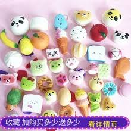

# 雜學

[toc]

## 寵物

### 狗

- 狗很髒：毫無衛生概念，可以滾腐爛的肉、可以把白毛玩到黑、可以全身溼答答又把全家甩的都是水，最喜歡的食物是大便和自己剛剛的嘔吐物。
- 狗很臭：承上，髒兮兮和臭兮兮通常是相輔相成的。我最崩潰的經驗是狗被臭鼬噴到之後又在沙發上猛滾，因為噴到眼睛又趕快帶牠去急診，然後晚上十一點半回家洗狗。
結局是客廳也臭、車子也臭、我也臭、狗也臭，但是狗笑得好開心。
- 狗很黏：跟屁蟲無誤，猛刷存在感。看電視也跟、煮飯也跟、上廁所也跟。關了房門要換衣服，狗就坐在門外哭。飼主毫無私人空間。
- 狗很貴：跟養貓一樣，除了定期健檢與固定使用預防藥之外，狗會生病會受傷，又沒有健保，飼主要全部買單。除此之外還要買項圈、牽繩、玩具、便便袋、狗床、洗毛精，族繁不及備載。
- 狗很毛：短毛狗讓家裡狗毛飛揚，長毛狗讓家裡很多狗毛飛揚。這是命中註定的。
- 狗很吵：會養來看門不是沒道理的。
- 狗很會吃：食量不僅與體型成正比，而且大部分的狗都貪吃。除了正餐，零食來者不拒。有時候還會吃到不該吃的而需要急診（請參見第四點狗很貴）。
- 狗很會拉：糞量與食量成正比。看過大丹狗的屎量嗎？連男人都甘拜下風的。而且這坨屎還需要你用手撿起，那濕軟又微帶餘溫的觸感，隔著塑膠袋都栩栩如生。
- 狗需要訓練：貓有內建自律系統，狗沒有。就算不特別訓練把戲，光是廁所訓練、鬆繩散步、社會化、和基本居家禮儀，就可以讓飼主很忙了。
- 狗很會破壞：承上，狗需要訓練，然後再乖的狗也是有瘋狂的時刻。撞掉物品弄亂洗衣籃只是小兒科，真正的強者是可以咬穿門板或拆毀牆壁的。
- 狗很不要臉：非常會見縫插針、以退為進，飼主則節節失守。本來是狗不能進室內的，變成可以進室內但是不能上家具、再變成可以上家具但是不能進臥室、再變成可以進臥室但是不能上床、再變成可以上床但是不能上枕頭，最後飼主全面棄權，狗想做什麼都可以。
- 狗很混帳：敗家子一枚。買了三千塊的狗床給牠，牠睡地板。買了三千塊的皮靴給自己，牠拿去磨牙。
- 狗很花時間：除了每天都要餵狗、遛狗、清廁所（在室內的話），還需要刷毛、刷牙、洗腳、剪指甲、清耳朵，除此之外還要滿足狗的情感需求（請參見第三點狗很黏）。難怪長年蟬聯「最花時間的寵物」冠軍。
- 狗無法獨立：跟貓或魚不同，狗不能一天沒有人照顧。就算只是三天兩夜的小旅行，也一定要考慮到狗。如果無法帶在身邊，就需要請人照顧。如果飼主是沒有朋友的邊緣人，就需要花錢請到府照顧或是送寄宿，又是一筆支出（再度參見第四點狗很貴）。

## 娛樂

### 電影

[人类会无限增涨吗？](https://www.youtube.com/watch?v=NZcqNE5NgGY&feature=youtu.be)

[有沒有蝙蝠俠裡小丑的家庭的八卦?](http://disp.cc/b/163-7I29)

[How to Do Visual Comedy](https://www.youtube.com/watch?v=3FOzD4Sfgag&feature=youtu.be)

### 軟軟

- 是現在國小國中女生在網絡上流行的小物
- 許多小女生會在 YouTube 上關注軟軟的影片
- 英文名稱為「Squishy」
- 分為「普通」、「正版」、「海外正版」
  - 普通版：沒有「吊牌」，價錢跟質感都較低。
  - 正版：像是蛋黃哥、迪士尼等造形精緻的卡通圖案。
  - 海外正版：國外進口的知名軟軟品牌：Yummiibear 、 i-bloom 、 puni 丸、 Cafe de N ，不僅質感較好，還會依據食物的造型有不同的香味。

    

### 網紅

- 冏星人
  - 為了完成夢想，所以犧牲健康、放棄高薪的創作者
- 呱吉
  - 自己的網路聲量做一些對社會有意義的實驗
- 不要鬧工作
  - 初衷是想讓世界看見台灣@[雜學](雜學)
- 這群人
  - 對作品的自我要求之高有目共睹
- 台客劇場
  - 頻頻提倡環保
- 走路痛
  - 堅持只做自己喜歡的東西不改變風格
- 魚乾
- 安啾
- 聖結石
- 蔡阿嘎

## [社會](https://lab.watchout.tw/)

[人类会无限增涨吗？](https://www.youtube.com/watch?v=NZcqNE5NgGY&feature=youtu.be)

### 月子中心

1. 現做養生月子餐、提供飲品、點心。月嫂也有提供！
2. 幫寶寶洗澡、護理未脫落的臍帶。月嫂也有提供！
3. 每日幫寶寶注意黃疸，測量寶寶體重、體溫。
4. 除了月子中心消毒嬰兒室的時間外，都可將寶寶留在嬰兒室請人員照顧。
5. 注意產後媽媽心情，填寫產後憂鬱量表，適時做衛教。
6. 提供育兒知識，媽媽教室課程如幫寶寶拍嗝、餵奶、洗屁屁等。月嫂也有提供，除了媽媽教室！
7. 提供洗頭髮、胸部護理按摩服務。
8. 教導新手媽媽如何哺乳知識，如餵奶擠奶，塞奶時隨call隨到，幫忙解決塞奶之苦。
月嫂也有提供哺乳協助，但無法隨CALL隨倒，還須視寶寶狀況而定！
9. 專業人員服務較安心，護理師、婦產科醫師、小兒科醫師，甚至有中醫師進駐。
10. 門禁服務有好有壞，端看自己是否認同，像是避免不相干人等打擾。
11. 有打掃阿姨掃地、鋪床、洗衣服、倒垃圾。月嫂也有簡易家事！
12. 提供消耗品，如寶寶尿布、濕紙巾、衛生紙、衛生用品等。

### 月嫂阿姨

1. 住在自己家很方便、熟悉、舒服，減少另一半舟車勞頓。月子中心有距離問題！
2. 月子餐可隨產婦口味自行調整，準備全家人餐點。
3. 可兼顧大寶，至於若有需要照顧大寶（ㄎㄎ如洗澡），也可與月嫂商量。
月子中心大多無法帶大寶入住，或是僅能有爸媽進到房內照顧大寶。
4. 以價格來看，月嫂較月子中心便宜。月子中心價格較貴。
5. 現做養生月子餐、提供飲品、點心。月子中心變化多。
6. 幫寶寶洗澡、護理未脫落的臍帶、幫寶寶拍嗝、餵奶、洗屁屁等。
7. 教導新手媽媽如何哺乳知識、協助處理塞奶問題。
8. 協助處理簡易家事，保持家裡基本清潔
    - 建議若是生第一胎的新手爸媽，若無經濟及大寶的考量下可選擇月子中心，
    - 第一胎該學的都學完了，第二胎才考慮月嫂，
    - 如果想要過的更舒服一點，還可以請月嫂外加訂月子餐，
    - 不僅一家大小輕鬆，一家人還有閒暇時間看電影、去健身房呢！

### 看護

- 準備的東西
  - 食：水果、飲料、舒跑、水(要清楚知道醫院裝水的地點)、吸管、紙杯
  - 衣：衣服(盡量不要是穿脫不方便的扣子)、圍巾、襪子(符合當季)、薄外套、口罩、眼罩
  - 住：香水、乳液、衛生棉
  - 盥洗：吹風機、梳子、衛生紙、牙線、毛巾、浴巾、牙刷、牙杯、牙膏、沐浴乳、刮鬍刀、指甲剪
  - 行：拖鞋、輪椅、停車位(金額、地形查看)
  - 育：報紙、聖經(針對基督徒^^)
  - 樂：筆電、MP3、耳機、手機&手機充電器
  - 醫療：棉花棒、舒酸軟膏、護唇膏、衛生棉、耳溫槍、自己私人藥品
- 注意事項
    1. 病人上廁所要為他開關門，不知為何醫院廁所的門有點重
    2. 病人上廁所前如是行動不方便，要為他把馬桶蓋上的水擦乾淨，上完廁所要為他沖水
    3. 病床旁要放一件外套，病人下床時沒棉被可蓋會冷
    4. 為病人蓋棉被要蓋到貼脖子，才會讓病人安心
    5. 與家人看護交接時，要盡快熟悉所有物品擺放的位置，電燈開關位置不要病人要東西時才東找西找
    6. 病人下床時手上的點滴是否有纏繞，要把線理乾淨
    7. 隨時注意點滴是否有在滴
    8. 準備好一罐冷水、一罐熱水以備不時之需
    9. 因為病人如有開刀無法飲用水，要常用棉花棒濕潤嘴唇
    10. 拉動住院房間的簾子要輕聲，勿吵到病人或鄰床的病人
    11. 病人如要理髮或洗髮，去之前要先打電話詢問是否要排很久
    12. 推輪椅下斜坡時要倒著推病人才不會怕
    13. 早上病人如要盥洗不方便下床要幫他擠牙膏揉熱毛巾
    14. 晚上會冷，病人要穿襪子睡覺(除非腳有傷口)
    15. 塑膠杯的水蓋子要蓋好
    16. 趁病人上廁所時病床的被子要折好才不會病人回來時不好蓋棉被
    17. 手濕濕的不要亂摸病人的額頭= =(你以為你的手是可以幫他降溫嗎?)
    18. 因為病人開刀要禁食頗久，要吃的稀飯不是7-11賣的鹹粥，要買一般的白稀飯(或訂餐時要跟院方提醒)
    19. 準備的拖鞋不要是夾腳拖，因為病人穿了襪子
    20. 手機要關震動，如果有設鬧鐘也要關掉

## 教育

[化工、化學、材料的差別](https://www.ptt.cc/bbs/SENIORHIGH/M.1311064479.A.A11.html)

[如何在6个月内学会任何一种外语](https://www.youtube.com/watch?v=de18lgWJHm8&feature=youtu.be)

[成大教授嘆：我看台灣教育的４大問題](https://news.tvbs.com.tw/ttalk/detail/topic/5784)

[讀書不是唯一的路；但如果不讀書，告訴我你想幹什麼？](https://www.thenewslens.com/article/31894)

[當媽才知為母難](https://opinion.cw.com.tw/blog/profile/432/article/6737)

[變態鎖定觀看YouTube孩童](https://www.ptt.cc/bbs/Gossiping/M.1516509356.A.721.html)

### 如何教小孩

- 第一個問題是：“發生什麼事情了？”
- 第二個問題是：“你的感覺如何？”
- 第三個問題：“那你覺得有些什麼辦法？”
- 第四個問題：“你決定怎麼做？”
- 第五個問題：“這些方法的後果會怎樣？”
- 第六個問題：“你希望我做什麼？”
- 第七個問題：“結果怎樣？有沒有如你所料？”

### 媒體強調榜首們「努力」卻不談「天分」，反而造就無數悲劇

[https://www.thenewslens.com/article/114556?utm_campaign=sharebtn&fbclid=IwAR1S6zu_M8VFfJX3seClJKnlvL0pZFGe2qtb3zFOQfl5RJMIWH5ltLBT2es](https://www.thenewslens.com/article/114556?utm_campaign=sharebtn&fbclid=IwAR1S6zu_M8VFfJX3seClJKnlvL0pZFGe2qtb3zFOQfl5RJMIWH5ltLBT2es)
