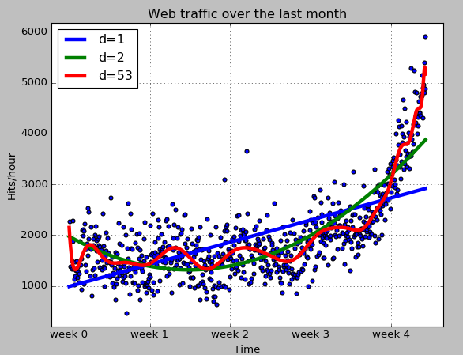

# Basic

tags: Machine Learning

[TOC]

## Introduction

- ML 競賽網站:[Kaggle](https://www.kaggle.com)
- Python 數據處理:`numpy`,`scipy`

## Numpy數組函數

- 找維度:`ndim()`
- 找矩陣:`shape()`
- 將資料轉換成矩陣: `reshape((3,2))`
- call by value: `copy()`

``` python
import numpy as np
a = np.array([0,1,2,3,4,5])
print "a =",a.ndim
print "a.shape =",a.shape
print "--------------------------------"
b = a.reshape((3,2))
print "b =",b
print "b.ndim =",b.ndim
print "b.shape =",b.shape
print "--------------------------------"
b[1][0] = 77
print "b[1][0] = 77"
print "b =",b
print "a =",a
print "--------------------------------"
c = a.reshape((3,2)).copy()
print "c =",c
c[0][0] = -99
print "c[0][0] = -99"
print "a =",a
print "c =",c
```

- 數組運算:`數組*2`,`數組**2`
- 找某些index的資料:`numpy.array([2,3,4])`
- 對數組做邏輯判斷:`數組>4`
- 用強制數組的值在某個區間:`clip(0,4)`
- 判斷是否NaN:`numpy.isnan(數組)`
- 數組中不是NaN的結果:`數組[~numpy.isnan(數組)]`
- 平均值:`numpy.mean(數組)`
- 數組內資料的型態:`數組.dtype`

``` python
import numpy as np

a = np.array([0,1,2,3,4,5])
b = np.array([1,"stringy"])
c = np.array([1,"stringy",set([1,2,3])])

print "a*2 =",a*2
print "[1,2,3,4,5]*2 =",[1,2,3,4,5]*2
print "a**2 =",a**2
#print [1,2,3,4,5]**2 will fail
print "---------------------------------"
a=a**2
print "a=a**2"
print "a[np.array([2,3,4])] =",a[np.array([2,3,4])]
print "a>4 =",a>4
print "a[a>4] =",a[a>4]
print "a.clip(0,4) =",a.clip(0,4)           #a[a>4] = 4
print "---------------------------------"
c = np.array([1,2,np.NaN,3,4])
print "c =",c
print "np.isnan(c) =",np.isnan(c)
print "c[~np.isnan(c)] =",c[~np.isnan(c)]
print "np.mean(c[~np.isnan(c)]) =",np.mean(c[~np.isnan(c)])
print "---------------------------------"
print "a.dtype =",a.dtype
print "b.dtype =",b.dtype
print "c.dtype =",c.dtype
```

- 循環處理數組的時候,多用library以c實做的function,可以提昇速度

``` python
import numpy as np
import timeit

normal_py_sec = timeit.timeit('sum(x*x for x in xrange(1000))',number=10000)
navie_np_sec = timeit.timeit('sum(na*na)',setup="import numpy as np; na=np.arange(1000)",number=10000)
good_np_sec = timeit.timeit('na.dot(na)',setup="import numpy as np;na=np.arange(1000)",number=10000)

print ("Normal Python: %f sec" %normal_py_sec)
print ("Naive Numpy: %f sec" %navie_np_sec)
print ("Good Numpy: %f sec" %good_np_sec)
```

## Scipy數組運換函數

- numpy內全部的命名空間,都可以通過scipy來使用

``` python
import scipy
import numpy
print scipy.version.full_version
print scipy.dot is numpy.dot
```

## 基本資料模型

- 比較兩個模型的時候,才會判斷絕對誤差的大小
- 太過貼近真實的資料,會把雜訊資料也貼合進去,稱為`過度擬和(overfitting)`

``` python
# !/usr/bin/env python
# -*- coding: utf-8 -*-
import scipy as sp
import numpy as np

#標準平方差公式
def error(f,x,y):
    return sp.sum( (f(x)-y) **2 )

data = sp.genfromtxt("web_traffic.tsv",delimiter="\t")

#前十筆資料
print (data[:10])
#資料矩陣
print (data.shape)

#第一維度的資料
x = data[:,0]
#第二維度的資料
y = data[:,1]
#NaN資料的數目
print sp.sum(sp.isnan(y))

#取出不是NaN的資料
x = x[~sp.isnan(y)]
y = y[~sp.isnan(y)]

#根據資料繪製基本圖形
import matplotlib.pyplot as plt
plt.scatter(x,y)
plt.title("Web traffic over the last month")
plt.xlabel("Time")
plt.ylabel("Hits/hour")
plt.xticks([w*7*24 for w in range(10)],['week %i'%w for w in range(10)])
plt.autoscale(tight=True)

#取得誤差最小的一階方程式參數
fp1,residuals,rank,sv,rcond = sp.polyfit(x, y, 1,full=True)
print ("Model parameters: %s" % fp1)
#根據方程式參數,來建立方程式
#ex: f1(x) = 2.59619213 * x + 989.02487106
f1 = sp.poly1d(fp1)
#誤差總和
print (error(f1,x,y))

#取得誤差最小的二階方程式參數
f2p = sp.polyfit(x, y, 2)
#根據方程式參數,來建立方程式
f2 = sp.poly1d(f2p)
#誤差總和
print (error(f2,x,y))

#取得誤差最小的100階方程式參數
f100p = sp.polyfit(x, y, 100)
#根據方程式參數,來建立方程式
f100 = sp.poly1d(f100p)
#誤差總和
print (error(f100,x,y))

fx = sp.linspace(0,x[-1],1000)
plt.plot(fx,f1(fx),linewidth=4)
#plt.plot(fx,f2(fx),linewidth=4,linestyle='dotted')
plt.plot(fx,f2(fx),linewidth=4)
plt.plot(fx,f100(fx),linewidth=4)
plt.legend(["d=%i" % f1.order,"d=%i" % f2.order,"d=%i" % f100.order],loc="upper left")

plt.grid()
plt.show()
```


