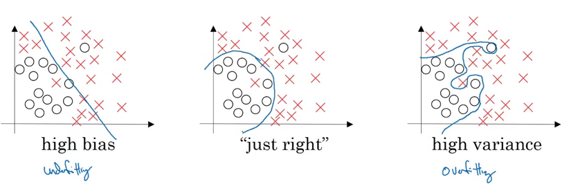

# Improving Deep Neural Networks: Hyperparameter tuning, Regularization and Optimization

[TOC]

## 1. Setting up ML

### 1-1. Train/Dev/Test sets

- NN就是Try and Error的過程，用直覺跟經驗尋找這些參數
  - Layers
  - Hidden units
  - Activation functions
  - Learning rates
- 如何最有效率地Try and Error？
  - 以前會將資料分為60%訓練：20%模型開發(交叉驗證)：20%測試
    - 模型開發的資料，是用來評估不同演算法的作用
  - 在大數據的發展下，我們只需要在1,000,000筆資料中分配10,000給模型開發與測試
  - 大約為98%訓練：1%模型開發：1%測試
  - 開發與測試儘量來自相同資料群，不要有高低解析資料混雜的現象
  - 只有模型開發資料，沒有測試是可以接受的

### 1-2. Bias/Variance

- Bias(偏差) & Variance(變異) = 訓練的優秀程度 & Overfitting的程度

- 假設你的Train set 與 Dev set來源相同，我們可以用兩個參數來理解Bias & Variance
  - Train set error：如果誤差大於Optimal error很多，代表High Bias
    - 現實中，我們可以接受Optimal error大約落在15%左右
  - Dev set error：如果誤差大於Train set error很多，代表High Variance
?

- High Bias & High Variance就像是你有一個簡單的分類器，同時做了一些很奇怪的特例判斷
?

### 1-3. Training flow

- 如果你有High Bias問題，可以試著：
  - 較大的神經網路：往往可以解決這個問題，代價是時間
  - 訓練更長的時間：不一定能解決問題，但也沒有壞處
  - （採用其他神經網路）：不見得有效過，要嘗試
- 如果你有High Variance問題，可以試著：
  - 較多的訓練資料：往往可以解決這個問題，代價是時間
  - regularization：適當的降低fitting
  - （採用其他神經網路）：不見得有效過，要嘗試
??
- Deep learning以前常減少Bias卻提高了Variance，或相反
- 但大數據的現代，我們通常使用
  - 較大的神經網路來減少Bias，但不影響Variance
  - 較多的訓練資料來降低Variance，不影響Bias（只要有做適當的regularization）

### 1-4. L2 & L1 regularization

- L2 regularization
  - 又叫權重衰減
  - 在誤差函數上，多增加一個與w有關的參數
  - 通常只考慮在w上，不太常考慮b(影響不大)
- L1 regularization
  - w會變得比較稀疏(w向量有很多0在裡面)

??

- regularization參數
  - 開發集(交叉驗證集)才會使用
  - 是一個超參數
  - lambda是Python的關鍵字，所以lambd是比較常使用的名字
- Frobenius norm
  - 矩陣範數的一種
??
- 如果λ很大的話，會使得某些w的值衰減趨近0
  - 就像是簡化我們的神經網路
  - 有較小權重的model比具有較大權重的model更簡單
  - 這種解釋比較直觀但不正確
  - 實際上每個神經元都還是會作用，只是每個一的影響變得比較小
  - 另一個解釋是，我們將激勵函數的作用降低成近似線性函數
??

### 1-5. Dropout regularization

- 隨機去除某些神經元
??
- 會搭配Inverted dropout來修補每一層輸出的期望值
??
- 每次訓練都可以對每一層決定是否dropout
- 在你覺得需要降低fitting的層上，使用大一點的dropout
- 缺點是你要測試更多的超參數
- 另一種方式是，你可以選擇使用或不使用dropout，然後只用一個超參數
- 通常不會在一開始的輸入樣本中就採用Dropout
??
- 原理是，神經元不能過度依賴任何一個特徵
- 在每次迭代時，您都會訓練一個只使用一部分神經元的不同模型
- 隨著輟學，你的神經元因此對其他特定神經元變得不那麼敏感，因為其他神經元可能在任何時候被關閉
??
- 不要在測試集上面使用Dropout，這只會造成隨機的結果
- 通常用在資料量遠小於特徵量的電腦視覺上(很容易overfitting)
- 沒有overfitting就不要用
  - 他使得cost function定義模糊，難以理解是否真實下降
  - 至少，cost function下降圖是畫不出來了

### 1-5. 其他regularization

- 資料擴充
??
??
- Early stopping
  - 盡量不要使用，因為這讓Optimize cost function與Not Overfit兩件事不獨立(非正交)
  - 用L2 regularization取代

??

### 1-6. 加速訓練的技巧

#### 1-6-1. 正規化輸入資料

- 盡量讓各維度的
  - 平均值=0
  - 變異數=1
??
- 讓梯度可以更均勻
??

#### 1-6-2. 梯度消失/爆炸

- 過多的層數，會導致梯度消失/爆炸，使梯度下降無法繼續
- 因此糟糕的初始化，可能導致消失/爆炸漸變，這也會減慢優化算法
- 如果你長時間訓練這個網絡，你會看到比較好的結果，但用過大的隨機數初始化會減慢優化速度
??
- 一個方式是**初始化權重**
- He initialization適用於使用ReLU神經網路
??
- 不同的激勵函數，初始化權重的方式不同(需要研究變異數的論文)
- 這個也算是超參數的一種(但通常不是優先調整的超參數)
- 又稱Xavier initialization

#### 1-6-3. 梯度驗證

- 幫助確定反向傳播是正確的梯度
??
- 由於limit的計算，雙邊差異的驗證誤差會是平方級的
??
- 使用時，先將每一層的w,b給合併成一個大向量
- 合併dw,db成為一個大向量
??
- 用以上的原理，檢驗每一個層的梯度是否計算正確
- 產生兩個向量dθapprox,dθ，代表階層上的測試梯度與真實梯度
??
- 比較兩個向量的誤差(正規化)，來檢驗梯度是否正確
??
- 只有Debug才用(每次下降前，多計算一次dθapprox很花時間)
- 如果出現錯誤，尋找哪一層的θ(w,b)與dθ(dw,db)，來鎖定問題點
- 記得L2 regularization
- 不要打開dropout,直到你檢驗正確
- 有一種很少發生，但不是不可能的狀況，當你的w,b在隨機初始化成趨近0的值時是正常的，但當w,b越來越大時，你的梯度變得不正常
  - 你可以在一開始進行梯度檢查
  - 訓練一段時間以後，再進行一次梯度檢查

## 2. Optimization algorithms

- Deep learning 只有在資料量大的時候才有效發揮
- 但資料量大等同於計算慢
- 如何最佳化你的演算是關鍵
mini-batch gradient descent

## Ａppendix

### 1. 變異數與平均數

- Var(X)=σ^2
- E(X)=平均數
- 標準差=變異數開根號
- 量測所有資料到平均數的平均距離
- 量測資料分散程度之指標

??
??
