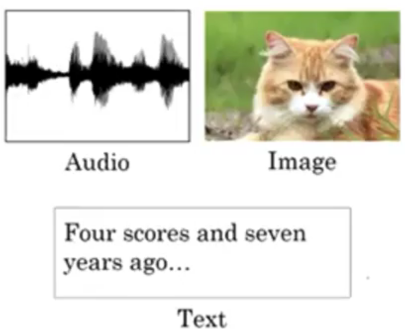

# Introduction to deep learning

[TOC]

## dx, dy是什麼意思? 能舉例嗎?

dx, derivative of x, 對 x 進行微分
dy, derivative of y, 對 y 進行微分

例子 ~
假設 y = x² + x + 1, 現在對兩邊 "分別" 進行微分
y = x² + x + 1
1 *dy = 2x* dx + 1 *dx + 0* dx
dy = ( 2x + 1 ) * dx

dy/dx 是什麼?
dy/dx 就是函數 y = ....... 對 x 進行微分
設函數 y = x² + x + 1, 現在兩邊 "對 x" 進行微分
y = x² + x + 1
dy/dx = 2x + 1

## 1. 神經網路

- 線性回歸

- 神經元

- Rectified Linear Unit (線性整流函數)

- 堆樂高

- 圖形表示


## 2. Supervised Learning with Neural Networks

- 應用

- 種類

- 結構性資料
  - 電腦善於執行

- 非結構性資料
  - 電腦以往不善於處理


## 3. 神經網路的起源

- 效能與神經網路的大小,資料量有關
- 神經網路大小是有極限的
- 資料少的時候，比較不明顯

- 許多時候演算的改變只是為了加速計算


## 4. 數學符號

- 二元分類器

- 資料表現


## 5. 神經元: Logistic Regression

### 5-1. 確定目標

- 公式
  - 線性運算
  - 激勵函數

- 表示式

- 單一目標：Lose function
  - 用來衡量單一訓練樣本的預估結果與實際的偏差值
  - 採用單一凸形函數
    - 方便找到全域最佳解

- 全域目標：Cost function
  - 總樣本造成的計算偏差


### 5-2. 初始值

- ｗ可能代表更高維度 (這邊只是示意)
- w,b的初始值可以隨機產生，也可以是0（不重要）


### 5-3. 確立修正方式

- 新值 = 舊值 - 方向導數
  - 每個維度減去該維度的偏微分（梯度）
  - $\alpha$為**學習速率**


- 如何求出偏微分：反向傳導
- 先介紹正向傳導與圖形
  
  
- 反向傳導
  - 利用微積分的**連鎖律**
  - 求出Input的偏微分
  - 程式中，我們常將某個input的偏微分取名為`dvar`
?
?

### 5-4. 最後公式

- 利用反向傳導，找出梯度
- 單一誤差方程式的梯度：
?
- 總體誤差方程式的梯度：
?
- pseudo code：
- 為了減少迴圈，需要向量化來提昇速度
- 以前向量化這個動作可有可無，現在已經是必須了
?

### 5-5. Vectorization

- 可能造成一分鐘與五個小時的差別
?
- Demo使用CPU
?
- 儘可能運用numpy函數
?
- 減少Logistic Regression的迴圈
?
- 再減少迴圈
- 實數可以被broadcast成向量
- Z & A
?
- dZ , dw & db
?
- Finel
?

### 5-6. Note

- 使用神經網絡思維模式構建Logistic回歸，是一個非常簡單的神經網絡！
?

- 不同的learning rates會產生不同的costs，導致不同的預測結果
  - 如果learning rates過高，costs可能會上下波動
  - 較低的costs並不意味著更好，必須檢查是否有可能overfitting
- 通常建議您：
  - 選擇更好地最小化成本函數的學習率
  - 如果您的module overfitting，請使用其他技術來減少overfitting
?

## 6. 淺層神經網路

- 神經網路就是神經元堆疊而成
?
- 輸入層常常不視為一層
- 隱藏層之所以隱藏，是由於不觀察他的輸出
- a代表著activations
- 兩層神經網路＝單一隱藏層神經網路
?
- 每一個node都在做一樣的事情
?
- 在一層中，把每一個node堆疊成矩陣運算
?
- 這樣來看兩層神經網路，就是四個方程式
?
- 這四個方程式，實際上長這樣
- 橫向代表每個訓練樣本
- 縱向代表那一層的每個node
?
- 用顏色表示每個樣本，在一層中的每個node由上到下運算的結果
?
- 反向傳播(微分後)的公式
?

> 分解:
>?

- 單一邏輯回歸時，初始化可以用0
- 但在神經網路時，這是不可行的
  - 因為你從同一點出發，又往相同梯度走相同步距，你會得到一樣的神經元
?
- 解決方式：隨機初始參數
- b並沒有這個問題，所以0就好
- 為了初始化太大，使得Activation function斜率緩慢，幾乎都會初始化在0的附近
?

## 7. 深層神經網路

- 深度學習是一個簡單到複雜的階層表現
- 有人認為，人腦也是如此運作
?
- 又或者，用電路來非正式地比喻深度(階層化)這件事情帶來的好處
?
- 概觀
?
- 先複習維度
- 單一樣本的w,b
- 樣本集的W不變,b改變成m
?
- 樣本集Z,A也是改變成m
?
- Forward
- 無可避免地會有一個`for( 1 to l )`迴圈
?
- Backward
- 回顧
?
- 公式化
?
- 單一步驟
?
- 總體步驟
?
?
- 結論
?

## Appendix

### 1. 方向導數

- 針對某個單位向量移動時，**函數的偏微分**(梯度)與**該單位向量**的內積
?
- 偏微分可視為斜率，或該變數對此函數的**變化劇烈度**
- 偏微分結果是實數（處處相同）的例子
?
- 偏微分隨之變化的例子
?
>
> - 設$f(x,y)=x^2 + y^3 -2$，求在點$(1,2)$時，方向為$<\frac{1}{2},\frac{\sqrt[]3}{2}>$之方向導數
> $={duF}(1,2)=<\frac{\partial f}{\partial x},\frac{\partial f}{\partial y}>\bullet<\frac{1}{2},\frac{\sqrt{3}}{2}>$
> $=<2x,3y^2>_{(1,2)}\bullet<\frac{1}{2},\frac{\sqrt[]3}{2}>$
> $=<2,12>\bullet<\frac{1}{2},\frac{\sqrt[]3}{2}>$
> $=1+6\sqrt[]3$

- 簡寫與偏導數記號$\partial$
?

- **梯度**是**向量空間**
- **梯度**可以造成最大的**方向導數**的向量
?

### 2. GPU

#### 2-1. SIMD - 單指令多資料流

- 一個指令同時對多個資料進行相同的動作
  - 如說圖像處理資料常用類型是RGB565, RGBA8888, YUV422等格式
  - 這些格式的資料特性是：一個像素點的一個分量總是用小於等於８bit的資料表示
  - 如果使用傳統的處理器做計算，雖然處理器的register是32/64 bits，處理這些Data卻只能用low 8 bits，似乎有點浪費
  - 如果把64 bits register拆成8個8 bits register，就能同時完成8個操作
  - SIMD指令的初衷就是這樣的，只不過後來慢慢cover的功能越來越多
?
- GPU和CPU都有並行指令
  - 如Intel MMX,SSE,SSE2,SSE3,SSSE3,SSE4
- GPU擁有強大的並行處理能力
  - GPU非常擅長這些SIMD計算
  - CPU實際上也不算太壞
  - 只是CPU不如GPU

#### 2-2. MIMD - 多指令多資料流

- 以傳統多處理器環境為典型，透過更加複雜的軟體開發方式，換取最高的運算效能使用彈性
- 打散全部運算工作，通通丟給一大堆獨立的純量 (Scalar) 處理器「塞好塞滿」
- 「由數個多執行緒架構的SIMD處理器，所組成的MIMD多處理器環境」，只是一層無足輕重的外皮

#### 2-3. GPU - SIMT

- SIMT企圖在SIMD和MIMD之間尋求「兼顧易於開發軟體與提高運算效能利用率」的平衡點
- MIMD的「拆散運算，分而治之」是充分理解SIMT前很重要的認知
- 但這觀點卻忽略了「如何簡化軟體開發」與「充分利用運算單元」的因素，更絲毫看不見多執行緒的影子
- SIMT的目標：
  - 「軟體開發者可延續既有循序性思考，亦可藉由資料階層平行化，提昇運算效能」
  - 「可單指令啟動多筆資料運算，比起每道運算都需要執行一道指令的MIMD享有更多潛在的能量效率」
- 以NVIDIA的CUDA為例，代表畫面上一塊小方格、最多由32執行緒組成的「Warp」，是其GPU的基本運算單位，同一個Warp內的執行緒，共用同一個程式計數器 (Program Counter)，執行相同的程式碼，但處理不同的資料
- 此外，如一個Warp因某些因素被迫停滯 (如等待記憶體存取)，就會切換執行另一個Warp，確保GPU的執行單元被塞好塞滿。
- 假使硬塞一沱執行緒給傳統「一個蘿蔔一個坑」的SIMD執行單元，慘劇就發生了：很容易發生執行單元空轉的狀態，還不如整個打散，採取類似MIMD的純量執行單元結構
?

- SIMT寄望程式開發模型卻維持現有的簡單形式，讓SIMD享有接近MIMD的自由度，企圖兼具兩者的優點
- 如何控制龐大執行緒的運行，特別是當進行條件判斷，決定執行哪些程式碼? - 「引述碼 (Predication)」
?

**GPU是由數個兼備SIMD簡易性與MIMD高彈性的「單指令多執行緒 (SIMT)」核心，所組成的單晶片多處理器，利於密集處理大量先天具有高平行度且高度同質性的運算工作**

#### 2-4. 比較

- 傳統4大指令比較
?
- SIMD vs SIMT
?
?

#### 2-5. 測試

```bash
$ cat /proc/cpuinfo
flags: fpu vme de pse tsc msr pae mce cx8 apic sep mtrr pge mca cmov pat pse36 clflush dts acpi mmx fxsr sse sse2 ss ht tm pbe syscall nx pdpe1gb rdtscp lm constant_tsc arch_perfmon pebs bts rep_good nopl xtopology nonstop_tsc aperfmperf pni pclmulqdq dtes64 monitor ds_cpl vmx est tm2 ssse3 sdbg fma cx16 xtpr pdcm pcid sse4_1 sse4_2 x2apic movbe popcnt tsc_deadline_timer aes xsave avx f16c rdrand lahf_lm abm tpr_shadow vnmi flexpriority ept vpid fsgsbase tsc_adjust bmi1 avx2 smep bmi2 erms invpcid xsaveopt dtherm ida arat pln pts
```

- [SSE2 instructionsh](images/https://en.wikipedia.org/wiki/X86_instruction_listings#SSE2_instructions)
`test.c`

```c
#include <stdio.h>

int main()
{
   double x = 2.1;
   double y = 3.2;
   double z = x + y;
   return 0;
}

```

```bash
$ gcc test.c -msse2 -S -o test.svim 
$ cat test.s                                                                                                                           
        .file   "test.c"
        .text
        .globl  main
        .type   main, @function
main:
.LFB0:
        .cfi_startproc
        pushq   %rbp
        .cfi_def_cfa_offset 16
        .cfi_offset 6, -16
        movq    %rsp, %rbp
        .cfi_def_cfa_register 6
        movsd   .LC0(%rip), %xmm0
        movsd   %xmm0, -24(%rbp)
        movsd   .LC1(%rip), %xmm0
        movsd   %xmm0, -16(%rbp)
        movsd   -24(%rbp), %xmm0
        addsd   -16(%rbp), %xmm0
        movsd   %xmm0, -8(%rbp)
        movl    $0, %eax
        popq    %rbp
        .cfi_def_cfa 7, 8
        ret
        .cfi_endproc
.LFE0:
        .size   main, .-main
        .section        .rodata
        .align 8
.LC0:
        .long   3435973837
        .long   1073794252
        .align 8
.LC1:
        .long   2576980378
        .long   1074370969
        .ident  "GCC: (Ubuntu 5.4.0-6ubuntu1~16.04.5) 5.4.0 20160609"
        .section        .note.GNU-stack,"",@progbits
```

### 3. Broadcasting

- 一種可以使Python code運行更快的技術
- 如以下：卡路里比例計算
?
- Code:
?
- 行與列運算皆可
?
- 總結
?

### 4. Tips

- Python numpy
  - 優點：靈活性很大
  - 缺點：可能會引發非常微妙的錯誤

>例如：
>
> - 如果你將一個列向量添加到一個行向量中
> - 你期望它拋出維度不匹配或類型錯誤或什麼的
> - 但是，你可能實際上得到一個矩陣：一個行向量+列向量的矩陣

?

- Code
?

### 5. Logistic Regression的Cost function

- 統計  -> 機率 -> 統計...
- 介紹機率函數
- log為嚴格單調函數
?
- 介紹似然函數
  - 似然函數也是一種條件機率函數
- 主要是為了求得最大似然估計
?
?
?
?
?

### 6. Activation Function

- sigmoid
  - 除非是二元輸出，不然幾乎不用
  - g prime of z 代表此激勵函數的微分
?

- tanh
  - 比sigmoid好，就像是sigmoid的衍生版
  - 但平均值落在0，而不是0.5
    - 這對於輸入到下一層運算有很好的幫助
  - 但缺點都是邊緣的輸出結果區分不明確
  - 這會造成計算梯度下降的緩慢
?

- ReLu
  - 最常用的預設激勵函數
  - 運算速度快
  - 雖然一半的z值被0取代，但實作時足夠多得神經單元會讓z大於0
  - 所以學習還是可以很快
?

- leaky ReLU
  - 極少人這麼做
  - 據說效果比ReLu更好
?

- 如果你不使用激勵函數，你只是在做線性運算
- 這會使得隱藏層跟沒有一樣
?

- 唯一不使用激勵函數的只有特定目標的output層
?

### 7.線性

- 線性運算
  - 交換律
  - 結合律
  - 分配律

- 子空間
  - 如果 u 和 v 是 W 的元素，則向量和 u + v 是 W 的元素。
  - 如果 u 是 W 的元素而 c 是來自 K 的純量，則純量積 cu 是 W 的元素。

- 線性子空間
  - 零向量 0 在 W 中。
  - 如果 u 和 v 是 W 的元素，則向量和 u + v 是 W 的元素。
  - 如果 u 是 W 的元素而 c 是來自 K 的純量，則純量積 cu 是 W 的元素。

## 8.參數 vs 超參數

- 參數
  - W1,W2....
  - b1,b2...
- 超參數
  - 學習速率
  - 學習迴圈次數
  - 隱藏層數量
  - 隱藏層神經元個數
  - 激勵函數的選擇
  - 正規劃的選擇

- 超參數影響著參數的結果
- 超參數是經驗的累積
- 超參數隨時時代硬體的改革而有所不同
