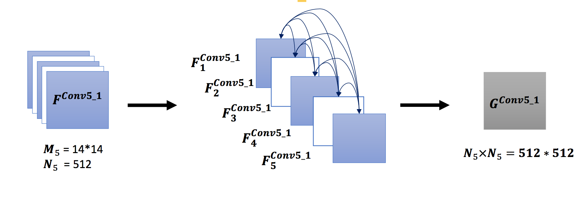
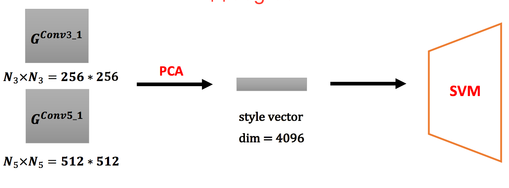
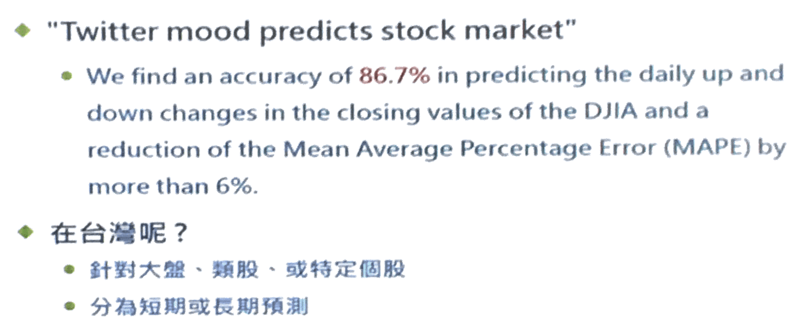

# Machine learning

[TOC]

## 1. Feature corp

- Feature map corpertation to array  

- PCA 降維度再做feedback

- 不同feature map的correlation 與 不同layer 的feature map的correlation 找出correlation
- 以上動作用ＭＬ找
CS231N youtube
CPPR paper

## 2

- 意藍OpView：第一名的語意分析
- 民眾的聲音在社群網站上，代著風向球
- 取詞的特徵空間
- NLP -> NLU -> NLG(generation)
- insider是專門塞消息給大眾的人
- 國外做過道瓊預測，效果非常好

