# NLP

[TOC]

- Artificial  NN

## 1. Deep NLP

### 1-1. Classical vs Deep Learning Model

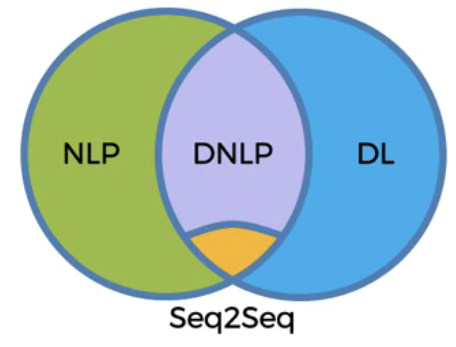

- If / Else Rules

- Speech Recognition
  - 嘗試找出波型
  - 預先錄製
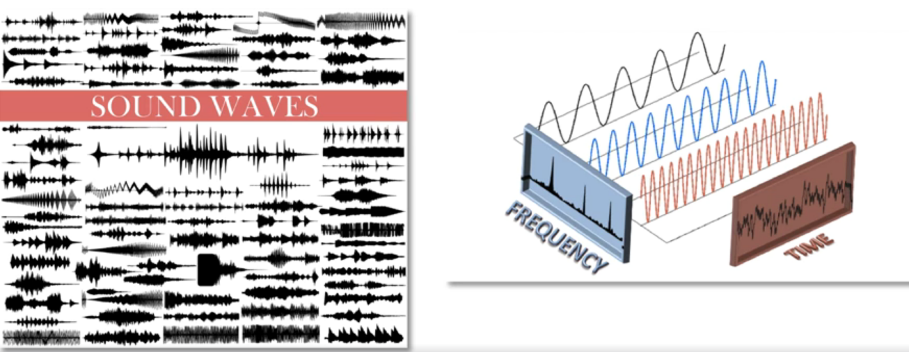

- Bag-of-words model - Classification
- 背單字
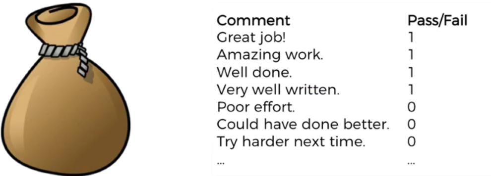

- CNN - Classification
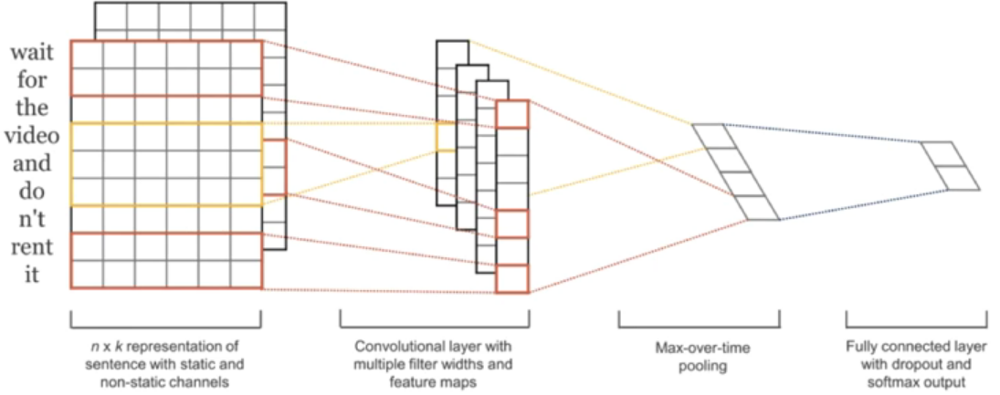

- Seq2Seq
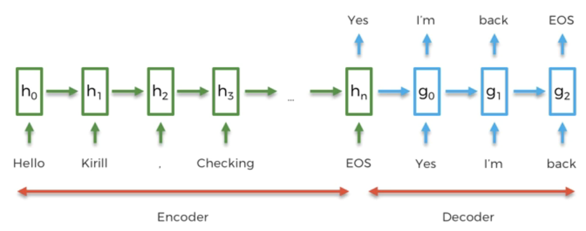

### 1-2. End-to-end

- Seq2Seq是一種End-to-end deep learning module
- 什麼是End-to-end?
- 我們先來看傳統決策樹的客服中心
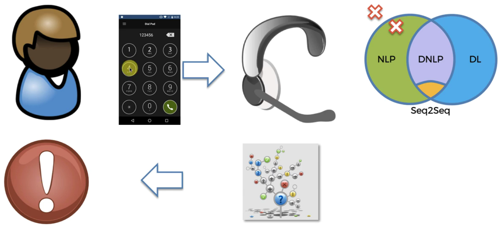
- 如果將語音識別加入
- 但起始分辨錯誤就GG了
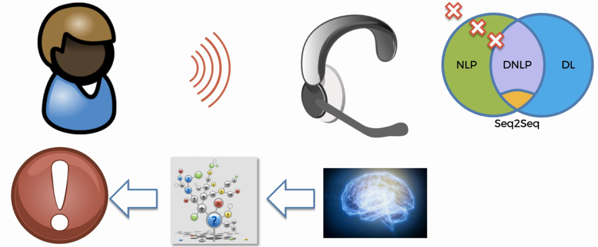
- 即便將各環節改善成AI，也會因為傳話筒效應而有不好的體驗
- 獨立大腦如果個別工作會有很好的成效，但一起作用就不好
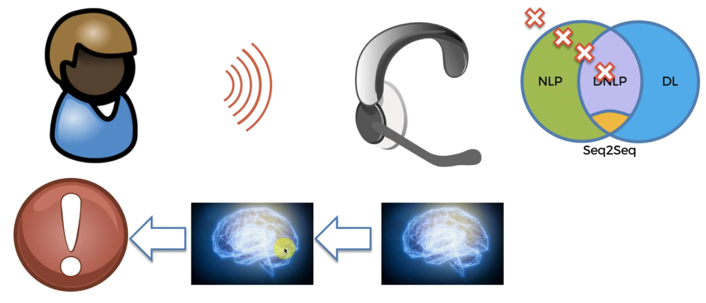
- 最後我們希望的是一個大腦搞定
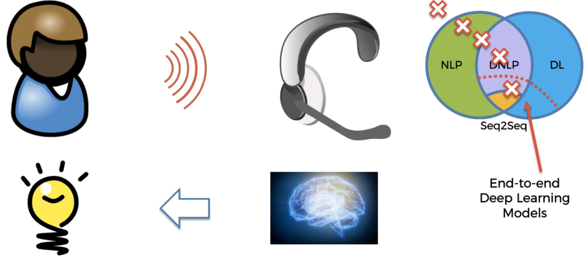

### 1-3. Bag-Of-Words

- Gmail的建議回文器
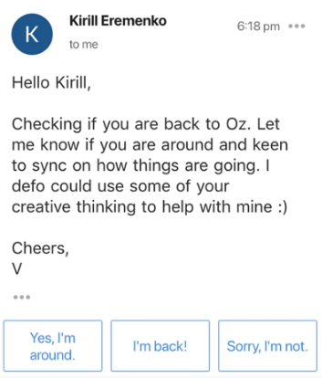
- 如果要寫一個簡單的Y/N回答器

- 建立一個vector，網羅所有英文常用單字
- 第1代表句子的開始，2代表句子的結束，最後一個代表特殊字：如人名
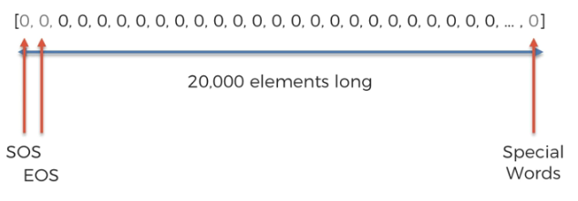
- 將mail出現的單字count+1
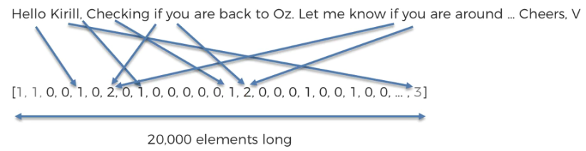
- 提供訓練樣本
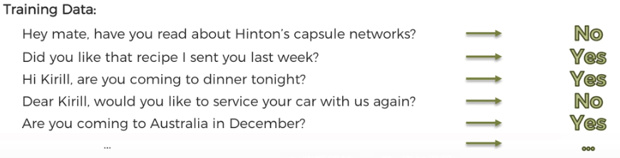
- 轉換資料成向量
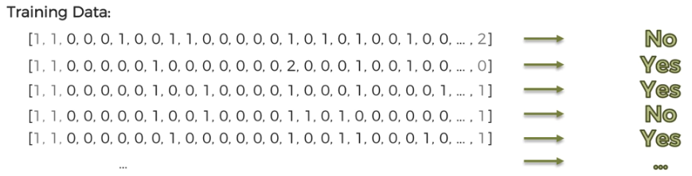
- 邏輯回歸 & DNN
- 但這個演算的侷限性，使得無法產生有意義的對話
- 這只是背單詞而已
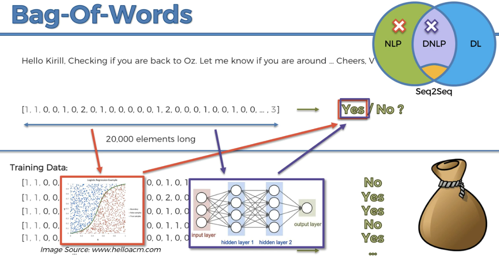
- 缺點探討：
  - 固定長度的Input
  - 沒有考慮詞序性，而我們都知道改變句子中的順序，其意義完全不同
    - 例如：貓腿比狗腿短
  - 固定長度的Output

### 1-4. Seq2Seq

- 解決以上的問題的答案：RNNs
