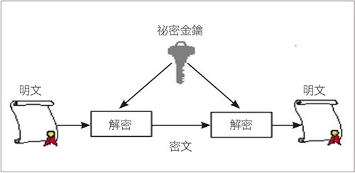

# Key & Address

[TOC]

## 對稱式加密



- 加解密所使用的key是相同的
- 比公鑰加密快很多
- 加密類型有分為

    $\begin{array}
    {|c | c |}
    \hline
    Stream Cipher & Block Cipher
    \\\hline
    每一個 bit 逐一加密 & 分成多個 block(區塊) 後，一次針對一個 block 加密
    \\\hline
    \end{array}$

- 常用的對稱式加密演算法

    $\begin{array}
    {|c | c |c|c|c|}
    \hline
    DES & Triple DES & IDEA & RC5 & AES(Advanced Encryption Standard)
    \\\hline
    Block \space Cipher & Block\space Cipher & Block \space Cipher & Block \space Cipher
    &Block \space Cipher
    \\\hline
    block為 64 bits & 進行三次 DES 的運算處理 & block為 64 bits & 可自訂加密區塊的長度 & block為 128 bits
    \\\hline
    Key為 56 bits(其實為 64 bits，但是有 8 bits 捨棄不用) & & Key為 128 bits &可自訂加密的回合數 & Key為 128, 192或者256 bits
    \\\hline
     & & &可自訂金鑰的長度&
    \\\hline
    \end{array}$

## 非對稱式加密

- 常用的非對稱式加密

    $\begin{array}
    {|c | c |c |c|c|}
    \hline
    RSA & ElGamal & 背包演算法 & Rabin &橢圓曲線加密
    \\\hline
    為了安全，其密鑰的長度一直令人詬病 &
    \\\hline
    \end{array}$

    

## 私鑰,公鑰,地址

### A. 私鑰

- 私鑰可以是 $1$ 和 $n-1$ 之間的任何數字，其中 $n$ 是由生成點 $G$ 產生的子群階
  - $n=1.158 * 10^{77}$，略小於 $2^{256}$
- 私鑰就是一個隨機選出的 **256 bits** 而已
  - 你可以用硬幣、鉛筆和紙來隨機生成你的私鑰：
    - 擲硬幣256次，用紙和筆記錄正反面並轉換為0和1，隨機得到的256位二進制數字可作為比特幣錢包的私鑰
  - 一般使用OS底層的隨機數生成器來產生
    - 通常情況下，操作系統隨機數生成器由人工的隨機源進行初始化
    - 這就是為什麼也可能需要不停晃動鼠標幾秒鐘。
- 從程式的角度來看，一般是通過在一個密碼學安全的隨機源中取出一長串隨機字節，對其使用 **SHA256** 運算，這樣就可以方便地產生一個256位的數字
  - 不要自己寫code或使用你的程式語言提供的簡易隨機數生成器來獲得一個隨機數
  - 使用密碼學安全的偽隨機數生成器（CSPRNG），並且需要有一個來自具有足夠熵值的源的種子
  - 使用隨機數發生器的Lib時，需仔細研讀其Doc，以確保它是加密安全的
  - 正確實施CSPRNG是密鑰安全性的關鍵所在

### B. 公鑰轉地址


### C. [地址產生實作](https://en.bitcoin.it/wiki/Technical_background_of_version_1_Bitcoin_addresses#How_to_create_Bitcoin_Address)

1. 取得 private key

```bash
openssl ecparam -name secp256k1 -genkey -check -out key
```

可以用以下指令驗證內容：

```bash
openssl ec -in key -text -noout
openssl ecparam -in key -text -param_enc explicit -noout
```

2. 取得 public key

```bash
$ openssl ec -in key -outform DER \\
| dd bs=1 skip=$((2+2+1+2+32+2+7+2+2+1)) \\
| xxd -ps -c 65
```

3. 對public key進行 SHA256 hash

```bash
$ openssl ec -in key -outform DER \\
| dd bs=1 skip=$((2+2+1+2+32+2+7+2+2+1)) \\
| openssl dgst -sha256 -binary \\
| xxd -ps -c 32
```

4. 將結果進行 RIPEMD160 hash

```bash
$ openssl ec -in key -outform DER \\
| dd bs=1 skip=$((2+2+1+2+32+2+7+2+2+1)) \\
| openssl dgst -sha256 -binary \\
| openssl dgst -ripemd160 -binary \\
| xxd -ps -c 20
```

5. 增加 version 到step 4的結果前

```bash
$ cat \\
  <(printf '\\x00') \\
  <(openssl ec -in key -outform DER \\
  | dd bs=1 skip=$((2+2+1+2+32+2+7+2+2+1)) \\
  | openssl dgst -sha256 -binary \\
  | openssl dgst -ripemd160 -binary) \\
| xxd -ps -c 21
```

6. 結果進行兩次 SHA256 hash

```bash
$ cat \\
  <(printf '\\x00') \\
  <(openssl ec -in key -outform DER \\
  | dd bs=1 skip=$((2+2+1+2+32+2+7+2+2+1)) \\
  | openssl dgst -sha256 -binary \\
  | openssl dgst -ripemd160 -binary) \\
| openssl dgst -sha256 -binary \\
| openssl dgst -sha256 -binary \\
| xxd -ps -c 32
```

7. 取前4 bytes

```bash
$ cat \\
  <(printf '\\x00') \\
  <(openssl ec -in key -outform DER \\
  | dd bs=1 skip=$((2+2+1+2+32+2+7+2+2+1)) \\
  | openssl dgst -sha256 -binary \\
  | openssl dgst -ripemd160 -binary) \\
| openssl dgst -sha256 -binary \\
| openssl dgst -sha256 -binary \\
| dd bs=1 count=4 \\
| xxd -ps -c 4

```

8. 將結果加到step 5的後面，並進行base58編碼

```bash
$ cat \\
  <(cat \\
    <(printf '\\x00') \\
    <(openssl ec -in key -outform DER \\
    | dd bs=1 skip=$((2+2+1+2+32+2+7+2+2+1)) \\
    | openssl dgst -sha256 -binary \\
    | openssl dgst -ripemd160 -binary)) \\
  <(cat \\
    <(printf '\\x00') \\
    <(openssl ec -in key -outform DER \\
    | dd bs=1 skip=$((2+2+1+2+32+2+7+2+2+1)) \\
    | openssl dgst -sha256 -binary \\
    | openssl dgst -ripemd160 -binary) \\
  | openssl dgst -sha256 -binary \\
  | openssl dgst -sha256 -binary \\
  | dd bs=1 count=4) \\
| base58
```

### Ｄ. 透過bitcoin產生公私鑰與地址

- 要使用比特幣核心客戶端生成一個新的密鑰，可使用 `getnewaddress` 命令
  - 出於安全考慮，運行後只顯示生成的公鑰，而不顯示私鑰

```bash
./bitcoin-cli -datadir=/media/alex/0C610D940890D88E/bitcoin getnewaddress

3CfY9dE9oj5oateHMGvK2B8aP3dDCoTmzQs
```

- 如果要**bitcoind**顯示私鑰，可以使用 `dumpprivkey`
  - `dumpprivkey` 命令會把私鑰以**Base58**校驗和編碼格式顯示
  - 這種私鑰格式被稱為錢包導入格式**WIF**(Wallet Import Format）

```bash
./bitcoin-cli -datadir=/media/alex/0C610D940890D88E/bitcoin dumpprivkey "3CfY9dE9oj5oateHMGvK2B8aP3dDCoTmzQ"

KzqC9d37kgqGGaQz8o2ejLfztJtkBft6KhxLTpgaXXapQAc4qYBk
```

- `dumpprivkey`命令無法從公鑰得到對應的私鑰，因為這是不可能的
  - 這個命令只是顯示錢包中已有也就是由`getnewaddress`命令生成的私鑰
  - 除非密鑰對都存儲在錢包裡，否則bitcoind的並不能從公鑰得知私鑰
