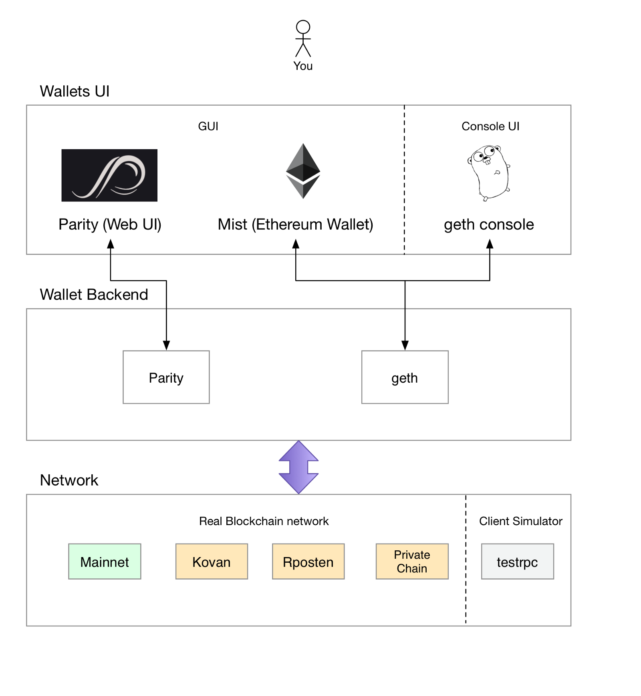

# Smart contracts
[TOC]
## 1. 前言

### 1-1 Node program



- [https://github.com/ethereum/go-ethereum](https://github.com/ethereum/go-ethereum)
    - [https://github.com/ethereum/mist/](https://github.com/ethereum/mist/)
        - 已經Build好的：[https://github.com/ethereum/mist/releases](https://github.com/ethereum/mist/releases)
        - 裡面內建了 geth 核心
        - sudo apt-get install libgconf2-4
- [https://github.com/ethereum/cpp-ethereum](https://github.com/ethereum/cpp-ethereum)
    - C++
    - CMake >= 3.4.3
    - leveldb
        - 由Google公司所研發的鍵／值對（Key/Value Pair）DB
        - 不支持SQL語言
    - 暫時不支援mining（因為前段時間把GPU mining的code移除了）
    - 挖礦改用https://github.com/ethereum-mining/ethminer

- [https://github.com/paritytech/parity](https://github.com/paritytech/parity)
    - Rust (2010 Mozilla) v1.26.0
    - 已經Build好的：[https://www.parity.io/](https://www.parity.io/)
    - 用 Parity 作為 backend，Mist 作為 front end 也是可以，詳情可以看這個 [reddit](https://www.reddit.com/r/ethereum/comments/53eh1w/how_to_use_the_ethereum_wallet_with_parity/)

- Console


- Parity UI


### 1-2 cpp-ethereum

```bash
// Get source code
$ git clone --recursive <https://github.com/ethereum/cpp-ethereum.git>
$ cd cpp-ethereum

// Install dependencies
$ sudo apt-get install libleveldb-dev cmake
# or
$ ./scripts/install_deps.sh

// Build
$ mkdir build
$ cd build
$ cmake ..
$ cmake --build .
```

## 2. Blockchain

### 2-1. 術語/定義

- **Block** (區塊)
    - 根據**區塊在鍊上的位置**分為3種區塊：
    - **Genesis Block**(區塊頭、創世區塊) - Blockchain裡的第一個區塊
    - **Current Block**(當前區塊) - Blockchain裡的最後區塊
    - **Orphan Block**(孤兒塊) - 不在區塊鏈上
- **Mining** (挖礦)
    - 產生新Block的演算法
    - 其實就是尋找**Proof**的過程
- **Proof**
    - 是一個計算的結果數組
    - 難以產生，但容易驗證
- **Node**
    - 區塊鏈網路上的一台server
    - 簡單理解成一個HTTP servers
- **Consensus(共識)**
    - 登入區塊鏈網路時，確認**手上的區塊鏈已經跟全世界同步**的一個演算法

### 2-2. Blockchain是指？

- `區塊鏈`就是一個`Array`，裡面的item被稱為`區塊`

### 2-3. 區塊包含什麼資料？

- 最重要的資料有3個： **Proof**、**Hash**與**Transactions**

#### 2-3-1. Proof

- 是一個計算的解答**之一**
- 比如符合 $x^2 + y^3 -2=1234$ 的一組解 **(x,y)**
- 要符合**難以產生，但容易驗證**的特性
- 尋找未被發現的**Proof**，就叫作**Mining** (挖礦)

#### 2-3-2. Hash

- 用來驗證**Proof**與**其他data**沒有被修改過
- 產生方式是將 **上一個區塊的hash + 本區塊的data** 做hash運算
    
    > 請理解成：
    hash新值 = HASH演算( hash舊值 || 本區塊的其餘data )
    > 
- 所以從**Genesis Block**（區塊頭、創世區塊）出發，對每個**區塊**做hash然後比較，即可驗證：
    - 區塊內的資料是沒被竄改過的
    - 順序沒被調換過
    
    > 這都要基於：你信任hash的逆向困難特性
    > 

#### 2-3-3. Transactions

- 就是**從誰產生，要給誰的**
- 是一個Array，如下

```json
"transactions":
[
    {'sender': 'address_x', 'recipient': 'address_y', 'amount': 1}
]
```

- 如果是自己挖到的，`sender=0`

#### 2-3-4. 總結

- 所以一個**區塊**長相如下

```json
{
    "index": 2,
    "proof": 14,
    "previous_hash": "8fb156e516b52afffb5860b5e3a076b0513c0d2d4489a9c4675c98e7e4a48a0d",
    "transactions":
    [
        {'sender': '0', 'recipient': '172.0.1.2', 'amount': 1},
        {'sender': '0', 'recipient': '172.0.1.3', 'amount': 1}
    ],
    "timestamp": 1514822766.046704
}
```

### 2-4. 實戰

#### 2-4-1. Block

```python
import time
import hashlib

class Block(object):

    def __init__(self, index, proof, previous_hash, transactions):
        self.index = index
        self.proof = proof
        self.previous_hash = previous_hash
        self.transactions = transactions
        self.timestamp = time.time()

    @property
    def get_block_hash(self):
        block_string = "{}{}{}{}{}".format(self.index, self.proof, self.previous_hash, self.transactions, self.timestamp)
        return hashlib.sha256(block_string.encode()).hexdigest()
```

- 這裡有一個method：`get_block_hash()`
    - 利用`index`,`proof`,`previous_hash`,`transactions`,`timestamp`產生出此Block的`hash`

#### 2-4-2. Blockchain

- 這邊先列出method list
- 下面細講每一個method

```python
class BlockChain(object):

    def __init__(self):
        self.chain = []                     # Blockchain的本體,視為Array即可
        self.current_node_transactions = [] # Blockchain內最後一個Block的transaction data
        self.create_genesis_block()

    def create_genesis_block(self):
        self.create_new_block(proof=0, previous_hash=0)

    def create_new_block(self, proof, previous_hash):
        pass

    def create_new_transaction(self, sender, recipient, amount):
        pass

    @staticmethod
    def create_proof_of_work(previous_proof):
        pass

    @property
    def get_last_block(self):
        return self.chain[-1]
```

1. Constructor
- 從Constructor可以看出，一個**Blockchain**有2個變數
- Constructor最後呼叫

```python
self.create_genesis_block()
//等於呼叫
self.create_new_block(proof=0, previous_hash=0)
```

2. create_new_block

```python
def create_new_block(self, proof, previous_hash):
    block = Block(
        # 就是`last_index+1`的意思
        index=len(self.chain),
        proof=proof,
        previous_hash=previous_hash,
        # 把Current Block(最後區塊)的transactions放到新Block內
        transactions=self.current_node_transactions
    )
    self.current_node_transactions = [] # Reset the transaction list

    self.chain.append(block)
    return block
```

- 最後把新Block append到chain上
- 但除了`self.create_genesis_block()`以外，何時呼叫`create_new_block`來增加一個區塊呢？
    1. 如果有人找到新的proof值
    2. 那就產生一筆transaction並appand在chain上
    3. 將proof值與last block hash傳入`create_new_block`來創造
- 於是，重頭戲來了：`create_proof_of_work(previous_proof)`

3. create_proof_of_work(previous_proof)

```python
@staticmethod
def create_proof_of_work(previous_proof):

    # 這是一個極簡的Proof產生式：
    # 找到一個number，它與上一個區塊找到的number相加，可以被7整除

    proof = previous_proof + 1
    while (proof + previous_proof) % 7 != 0:
        proof += 1

    return proof

```

- Bitcoin使用[Hashcash](https://en.bitcoin.it/wiki/Hashcash)作為proof產生式

4. create_new_transaction()

```python
def create_new_transaction(self, sender, recipient, amount):
    self.current_node_transactions.append({
        'sender': sender,
        'recipient': recipient,
        'amount': amount
    })

    # Returning new block's index where this transaction will be stored
    return self.get_last_block.index + 1
```

- 到目前為止，我們完成了一個BlockChain Class，可以運用在HTTP APIs上測試

#### 2-4-3. 運作

- 讓我們來測試我們的BlockChain Class

```python
blockchain = BlockChain()

print(">>>>> 採礦前......")
for block in blockchain.chain:
    print(block.__dict__)

#--------------------------------------------------

last_block = blockchain.get_last_block
last_proof = last_block.proof
proof = blockchain.create_proof_of_work(last_proof)

#--------------------------------------------------

# Sender "0" 表示該節點已開採的區塊
# 對於挖到礦的人(或者說，找到 proof), 我們必須用一定數量的獎勵(例子中為 1)
blockchain.create_new_transaction(
    sender="0",
    recipient="address_x",
    amount=1,
)

last_hash = last_block.get_block_hash
block = blockchain.create_new_block(proof, last_hash)

#--------------------------------------------------

print(">>>>> 開採後......")
for block in blockchain.chain:
    print(block.__dict__)

```

- OUTPUT

```bash
>>>>> 採礦前......
0 - 0 - 0 - [] - 1514822766.046376

>>>>> 開採後......
0 - 0 - 0 - [] - 1514822766.046376
1 - 7 - 96 da8fdda8a8dea8a445ee220e27b961f64017f111c39145984eca146a048161 - [{ '發件人'：'0' ，'量'：1，“收件人”：“address_x' }] - 1514822766.046598
```

- 到目前為止，我們完成了一個BlockChain Class

> 可以運用在HTTP APIs上測試
> 

## 3. Smart contracts

### 3-1. Contract-Oriented Programming Language

- Design by Contract，縮寫為 `DbC`
    - 先驗條件
    - 後驗條件
    - 不變式


### 3-2. Ethereum

- 可寫程式的區塊鏈

### 3-3. Smart contracts 與 Ethereum的關係

- 在 Ethereum 區塊鏈中所屬的物件
    - 包含程式碼函式
    - 能夠與其他合約進行互動
    - 做出決策
    - 儲存資料
    - 傳送乙太幣給其他人

#### 3-3-1. Sample 1

```python
pragma solidity ^0.4.0;

contract SimpleStorage {
    uint storedData;

    function set(uint x) public {
        storedData = x;
    }

    function get() public view returns (uint) {
        return storedData;
    }
}
```

- 第一行就是告訴大家源代碼使用Solidity版本0.4.0寫的
    
    > 一般來說，pragmas（編譯指令）是告知編譯器如何處理源代碼的指令的（例如: `pragma once`）
    > 
- Smart contracts的含義就是一個**implement Ethereum interface**的**class**
- 該contracts允許任何人在contracts中**set**一個number
- 並且這個number可以被世界上任何人訪問，且沒有可行的辦法阻止你set這個number
- 當然，任何人都可以再次call set ，傳入不同的value，覆蓋你這個contracts的number
    
    > 但是這個操作仍會被紀錄在Block chain的歷史中
    > 

#### Sample 2 - Subcurrency

```python
pragma solidity ^0.4.21;

contract Coin {
    // 關鍵字“public”讓這些變量可以從外部讀取
    address public minter;
    mapping (address => uint) public balances;

    // 輕客戶端可以通過事件針對變化作出高效的反應
    event Sent(address from, address to, uint amount);

    // Constructor
    function Coin() public {
        minter = msg.sender;
    }

    function mint(address receiver, uint amount) public {
        if (msg.sender != minter) return;
        balances[receiver] += amount;
    }

    function send(address receiver, uint amount) public {
        if (balances[msg.sender] < amount) return;
        balances[msg.sender] -= amount;
        balances[receiver] += amount;
        emit Sent(msg.sender, receiver, amount);
    }
}
```

- `address public minter;` = **160**bit value
    - public會自動產生get function

```python
function minter() returns (address) { return minter; }
```

- `mapping (address => uint) public balances;`
    - 同`<key,value>`結構的data
    - public會自動產生get function

```python
function balances(address _account) public view returns (uint) {
    return balances[_account];
}
```

- User listen Even可用以下方式

```python
Coin.Sent().watch({}, '', function(error, result) {
    if (!error) {
        console.log("Coin transfer: " + result.args.amount +
            " coins were sent from " + result.args.from +
            " to " + result.args.to + ".");
        console.log("Balances now:\\n" +
            "Sender: " + Coin.balances.call(result.args.from) +
            "Receiver: " + Coin.balances.call(result.args.to));
    }
})
```

- 真正被用戶或其他contract所調用的，以完成本contract功能的方法是`mint`和`send`
- 如果`mint`被contract創造者外的其他人調用則什麼也不會發生
- 另一方面，`send`函數可被**任何人向他人發送幣**（當然，前提是發送者擁有這些幣）
- 如果你使用contract發送Subcurrency給一個address，你在Blockchain explorer上查看該address時是看不到任何相關資料的
    - 因為，實際上你發送幣和更改餘額的info，僅存在這個coin contract中
    - 通過使用events，你可以非常簡單地為你的新幣創建一個**blockchain explorer**來追踪交易和餘額。

### 3-4. Solidity

- [官方Github](https://github.com/ethereum/solidity)
- [官方線上IDE](http://remix.ethereum.org/)
- the Contract-Oriented Programming Language
    
    
    
- Contract由撰寫 Solidity 語言來定義
    - `成員變數`的儲存採用Blockchain交易與合約的方法，來詢問合約或改變的其狀態
    - 作為Blockchain的副本會分散到網路中的所有節點，任何人都可以詢問合約，以從中搜尋公開的訊息
- 支援繼承
- 高級語言
- 設計參考自C++,Python和JavaScript
- 要存取一個local value，並不需要像 this. 這樣的前綴 (雖然這是其他語言常見的做法)
- 執行在`Ethereum Virtual Machine`環境內

### 3-5. Ethereum Virtual Machine

## Appendix 1: Hash

- 在應用中又被稱為`指紋（fingerprint）`、`摘要（digest）`
- 有以下特點：
    - **正向快速**：給定明文和 hash 算法，在有限時間和有限資源內能計算出 hash 值
    - **逆向困難**：給定（若干） hash 值，在有限時間內很難（基本不可能）逆推出明文
    - **輸入敏感**：原始輸入信息修改一點信息，產生的 hash 值看起來應該都有很大不同
    - **衝突避免**：很難找到兩段內容不同的明文，使得它們的 hash 值一致（發生衝突）