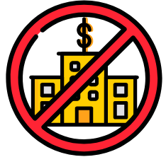

# Wallet

[TOC]

## MyEtherWallet

- MyEtherWallet 不是一間銀行
  - 當你在銀行或交易所開了一個帳戶，他們會在他們的系統上建立你的帳戶。
  - 銀行會保管你的個人資料、帳戶密碼、帳戶餘額、交易明細和你的資產。
  - 銀行會向你收取費用來管理你的帳戶並提供服務，如：當你的信用卡遺失時，退回費用給你。
  - 銀行允許你開立支票或使用你的金融卡來傳送金錢、在線上確認你的帳戶餘額、重設你的密碼，並在你遺失金融卡時補發給你。
  - 你在銀行或交易所開立帳戶，他們決定你可以轉帳的金額大小、你得在哪裡轉帳，並在異常轉帳發生時凍結帳戶多久。每一項服務都向你收取費用。

MyEtherWallet 是一個介面

- 當你在 MyEtherWallet 建立一個帳戶，你是在產生一串密碼數列：你的私鑰和你的公鑰 (地址)。
- 整個過程發生在你的電腦上、你的瀏覽器裡。
- 我們永遠不會傳出、接收或儲存你的私鑰、密碼或其他帳戶資料。
- 我們不收取交易費用。
- 你只是在用我們的 介面 直接和區塊鏈互動。
- 如果你把你的 公鑰 (地址) 給其他人， 他們可以傳送乙太幣或代幣給你。 👍
- 如過你把你的 私鑰 給其他人， 他們將完全控制你的帳戶。 👎

區塊鏈就像一個巨大的，全球性的，分散的電子表格。
它跟踪誰發送了多少個硬幣給誰，以及每個帳戶的餘額是多少。
它由全球數千名擁有特殊電腦的人（礦工）進行存儲和維護。
區塊鏈中的區塊由MyEtherWallet，MetaMask，Exodus，Mist，Geth，Parity和其他地方發送的所有單個交易組成。
當您在MyEtherWallet.com上看到您的餘額或在etherscan.io上查看您的交易時，您會看到區塊鏈上的數據，而不是我們的個人系統中的數據。
再說一遍：我們不是銀行。

你為什麼讓我讀這一切？
因為我們需要你明白我們不能…

> 訪問您的帳戶或為您發送資金X.  
恢復或更改您的私鑰。 
恢復或重置您的密碼。 
反向，取消或退款交易。 
凍結帳戶。 
你只有你對你的安全負責。

>要勤於保證你的私鑰和密碼的安全。 您的私鑰有時稱為您的助記詞組，密鑰庫文件，UTC文件，JSON文件，錢包文件。 
 如果您丟失了私鑰或密碼，則無法恢復。 
 如果您在釣魚網站上輸入您的私鑰，您將獲得所有資金。 

如果MyEtherWallet不能做這些事情，那有什麼意義？

> 因為這是權力下放和區塊鏈的關鍵。 
 當你想要移動你的資金時，你不必依靠你的銀行，政府或其他任何人。 
 您不必依靠交易所或銀行的安全來保證您的資金安全。 
 如果你沒有發現這些有價值的東西，問問自己為什麼你認為區塊鍊和加密貨幣是有價值的。😉 
 如果你不喜歡這個聲音，可以考慮使用Coinbase或Blockchain.info。 他們有更熟悉的用戶名和密碼帳戶。 
 如果你害怕，但想使用水電部，獲得一個硬件錢包！ 這些保證您的密鑰安全。 

如何從釣魚者保護自己

網絡釣魚者給你一個鏈接到一個網站的消息，看起來就像MyEtherWallet，EtherDelta，PayPal，或者你的銀行，但不是真正的網站。 他們竊取你的信息，然後竊取你的錢。

>通過Metacert或MyEtherWallet Chrome擴展來安裝EAL或MetaMask或Cryptonite來阻止惡意網站。 
 總是檢查網址：https：//www.myetherwallet.com。 
 始終確保URL欄中有綠色的MYETHERWALLET LLC。 
 不要相信通過電子郵件，Slack，Reddit，Twitter等隨機發送給您的消息或鏈接。 
 在輸入信息之前，請始終直接導航到某個網站。 點擊郵件或電子郵件中的鏈接後，請勿輸入信息。 
 安裝AdBlocker，不要在搜索引擎上點擊廣告（例如Google） 

如何保護自己免受騙局

人們會試圖讓你給他們錢，換來無償的回報。
> 如果真是太好，可能就是這樣。 
 在向別人或某個項目匯款之前進行研究。 尋找各種網站和論壇的信息。 警惕。 
 當你不明白某些東西或者看起來不正確的時候問問題。 
 不要讓恐懼，FUD或FOMO勝過常識。 如果事情非常緊急，問問自己“為什麼？”。 這可能是創建FOMO或阻止你進行研究。 

如何保護自己免受損失
如果你失去了你的私鑰或密碼，它將永遠消失。 不要失去它。

> 備份您的私鑰和密碼。 不要把它存儲在你的電腦上。 在一張紙上打印出來或保存到USB驅動器。 
 將本紙或USB驅動器存放在不同的物理位置。 如果一個備份與筆記本電腦一起被火災或洪水摧毀，則備份是無用的。 
 不要將您的私鑰存儲在Dropbox，Google Drive或其他雲存儲中。 如果該帳戶被盜用，您的資金將被盜用。 
 如果您擁有超過1週的加密貨幣價值，請購買硬件錢包。 沒有理由。 這很值得。 我承諾。 

這組密碼用來 加密 你的錢包。 並非用來作為產生金鑰的種子。 你需要這組密碼以及你的金鑰才能解鎖錢包。

您需要從交易所購買ETH。 最簡單的方法是使用Coinbase，然後將Coinbase錢包中的ETH轉移到MetaMask錢包。 不幸的是，你不能用Coinbase錢包或任何其他錢包來玩CryptoKitties。

您不能使用美元/加元購買一個CryptoKitty貨幣需要先轉換成ETH。

Keystore
「密碼」與「Keystore 檔案」：私密請備份保管好，「密碼」+「Keystore 檔案」同時使用等於「Private Key」，分開保存比較安全。這檔案存著你的私鑰 但還有用上面那組密碼對檔案加密 就跟你把私鑰寫進記事本，再丟進RAR鎖起來差不多 跟上面那組密碼一起保存好

Private Key：私密請備份保管好 。
Address(Public Key)：記起來，讓別人知道沒關係。

fee
