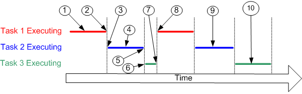

# Interview

[TOC]

## 須知
- 觀察此主官需要聽話的下屬還是有自主想法的下屬（觀察空氣）
- 習慣用白板畫架構圖（熟悉自己做過的工作）
- 說明自己的工作，並儘可能淺顯易懂（表達能力）

## 提問
- **可否請你自我介紹一下**
- 你認為自己有哪些優缺點？
- 未來的計畫為何？這份工作有幫助你的未來規劃嘛？
- **你有沒有什麼問題？**
- 有沒有與團隊意見相左的情況？你怎麼處理？
- 給你一面牆，跟白板筆，請你畫滿它，你如何預估此任務的時間？

## 反問
- 為什麼這個職位會開放徵才？
- 這是個全新的職位嗎？還是有人離開了？
- 需要出差？
- 加班？

## C & C++

### string

- `getchar()` & `putchar()`
    
    ```c
    char c;
    printf("請輸入一個字元：");
    c = getchar();
    putchar(c);
    ```
    

- `gets()` & `fgets()` & `puts()`
    
    ```c
    char str[20];
    puts("請輸入字串：");
    gets(str);
    fgets(str, sizeof(str), stdin);
    ```
    

- `strlen()`
    
    ```c
    size_t strlen(const char*);
    //size_t 是 unsigned 型態，在大部份系統是定義為 unsigned int
    ```
    

- `strcpy()` & `strncpy`
    
    ```c
    char* strcpy(char* target, const char* source);
    char* strncpy(char* target, const char* source, size_t); //不會自動在目的陣列加上空字元
    ```
    

- `strcat()` & `strncat`
    
    ```c
    char* strcat(char*, const char*);
    char* strncat(char*, const char*, size_t);
    ```
    
- `strcmp()` & `strncmp`

```c
int strcmp(const char*, const char*); 0 1 > -1 <
int strncmp(const char*, const char*, size_t); //比較兩個字串中指定的字元數目是否相同
```

- `strstr()` & `strspn`

```c
char* strstr(const char* target, const char* source);
    char *loc = strstr(source, search);
    if(loc == NULL)
    {
        printf("找不到符合的子字串\n");
    }
    else
    {
        printf("在索引位置 %lu 處找到子字串\n", loc - source);
    }

//會傳回兩個字串開始不匹配的第一個字元索引位置，否則傳回 0
size_t strspn(const char* target, const char* source);

    size_t loc = strspn(str1, str2);
    if(loc == strlen(str1))
    {
        printf("完全匹配\n");
    }
    else
    {
        printf("從索引位置 %lu 處開始不匹配\n", loc);
    }
```

- 轉換型態 & 大小寫

```c
int atoi(const char*);
int atol(const char*);
double atof(const char*);
tolower()
toupper()
```

#### 題目1. strcpy()

- 下面是一個簡單的密碼保護功能，你能在不知道密碼的情況下將其破解嗎？

```c
#include<stdio.h>

int main(int argc, char *argv[])
{
    int flag = 0;
    char passwd[10];

    memset(passwd,0,sizeof(passwd));

    strcpy(passwd, argv[1]);

    if(0 == strcmp("LinuxGeek", passwd))
    {
        flag = 1;
    }

    if(flag)
    {
       printf("\n Password cracked \n");
    }
    else
    {
        printf("\n Incorrect passwd \n");
    }
    return 0;
}
```

- **答:**
    - 破解上述加密的關鍵在於利用攻破`strcpy()`函數的漏洞
    - 用戶在向“passwd”緩存輸入隨機密碼的時候並沒有提前檢查“passwd”的容量是否足夠
    - 所以，如果用戶輸入一個足夠造成緩存溢出並且寫“flag”變量默認值所存在位置的內存的長“密碼”，即使這個密碼無法通過驗證，flag驗證位也變成了非零，也就可以獲得被保護的數據了。
    - 要避免這樣的問題，建議使用`strncpy()`函數

#### 題目2. 字串反轉

```c
void reverse(char* str)
{
    int i, j;
    char c;
    for(i=0, j = strlen(str)-1; i<j; ++i, -or-j)
        c = str[i], str[i]=str[j], str[j]=c;
}
```

#### 題目3. gets()

- 請找出下面code的問題

```c
#include<stdio.h>
int main(void)
{
    char buff[10];
    memset(buff,0,sizeof(buff));

    gets(buff);

    printf("\n The buffer entered is [%s]\n",buff);
    return 0;
}
```

- **答:**
    - 問題在於函數`gets()`的使用，這個函數從stdin接收一個字符串,而不檢查它所複製的緩存的容積，這可能會導致緩存溢出
    - 這裡推薦使用標準函數`fgets()`代替

### main

#### 題目1

- 下面的code能編譯過嗎？
- 如果能，它有什麼潛在的問題嗎？

```c
#include<stdio.h>

void  main( void )
{
    char  *ptr = ( char *)malloc(10);

    if (NULL == ptr)
    {
        printf( "\n Malloc failed \n" );
        return ;
    }
    else
    {
        // Do some processing
        free(ptr);
    }
    return ;
}
```

- **答:**
    - main()的返回類型應該是`int`而不是`void`
    - 這點非常重要，特別當程序是作為依賴於程序成功運行的腳本的一部分運行時

### memory leak

#### 題目1

- 下面的code會導致memory leak嗎？

```c
#include<stdio.h>

void  main( void )
{
    char  *ptr = ( char *)malloc(10);

    if (NULL == ptr)
    {
        printf( "\n Malloc failed \n" );
        return ;
    }
    else
    {
        // Do some processing
    }

    return ;
}
```

- **答:**
    - 儘管上面的code並沒有釋放分配給“ptr”的memory，但並不會在程序退出後導致memory leak
    - 在程序結束後，所有這個程序分配的memory都會自動被處理掉
    - 但如果上面的代碼處於一個“while循環”中，那將會導致嚴重的memory leak問題

### sizeof

#### 題目1

```c
char i[ ] = "Hello";
int *p = 0;
int n = 10;
printf("%d %d %d", sizeof(i), sizeof(p), sizeof(n));

$ 6 (8 or 4) 4
```

### Array
- 初始化

```c
int scores[10] = {0};
double numbers[10] = {0.0};
char symbols[10] = {'\0'};
```

- asign

```c
arr1 = arr2; // 錯誤！不能直接指定陣列給另一個陣列
for(int i = 0; i < 5; i++)
{
    arr1[i] = arr2[i];
}
```

- 字串

```c
char *str1[] = {"professor", "Justin", "etc."};
```

- Size

```c
int length = sizeof(text) / sizeof(text[0]);
```

#### 題目1

```c
int a[] ={1,2,3,4,5,6};
int *ptr = (int*) (&a+1);
printf("%d", *(ptr-1));

$ 6
```

#### 題目2

```c
int main()
{
    int ref[]={8,4,0,2};
    int *ptr;
    int index;
    for(index=0, ptr=ref; index<2; index++,ptr++)
        printf("%d %d\n", ref[index], *ptr);
    (*ptr++);
    printf("%d %d\n", ref[index], *ptr);
}

$ 8 8
  4 4
  0 2
```

#### 題目3

```c
char *str[ ][2] =
{
    "professor", "Justin" ,
    "teacher", "Momor" ,
    "student", "Caterpillar"
};

char str2[3][10] = {"professor", "Justin", "etc"};
printf("%s\n", str[1][1]);
printf("%c\n",str2[1][1]);

$ Momor
  u
```

#### 題目4

```c
char **pp;
char *ptr2countries[] = {"America", "Taiwan", "China"};
pp = ptr2countries;
pp++;
printf("%s", (*pp + 1));

$ aiwan
```

### Pointer operator

- 秘訣：先右後左
    - `int *a[10]` 先找到聲明符a
        - 向右看有`[]`，說明a是個array
        - 向左看，是`int *`，說明array中的每個元素是`int *`
    - `int(*a)[10]` 先找到聲明符a
        - 被括號括著，先看括號內的(優先級高)
        - 向右看，沒有
        - 向左看,是``，說明a是個指針，什麼指針？
        - 看括號外面，先向右看，有`[]`是個array，說明a是個指向array的指針
        - 向左看，是int，說明array的每個元素是int

```c
const int * foo; // 一個 pointer，指向 const int 變數。
int const * foo; // 一個 pointer，指向 const int 變數。U-Boot中MAC地址設置及往內核中傳遞
int * const foo; // 一個 const pointer，指向 int 變數。
int const * const foo; // 一個 const pointer，指向 const int 變數。
int a; // 一個整型數
int *a; // 一個指向整數的指標
int **a; // 一個指向指標的指標，它指向的指標是指向一個整型數
int a[10]; // 一個有10個整數型的陣列
int *a[10]; // 一個有10個指標的陣列，該指標是指向一個整數型的
int (*a)[10]; // 一個指向有10個整數型陣列的指標
int (*a)(int); // 一個指向函數的指標，該函數有一個整數型參數並返回一個整數
int (*a[10])(int); // 一個有10個指標的陣列，該指標指向一個函數，該函數有一個整數型參數並返回一個整數
```

#### 題目1

```c
char s[] = "0113256";
char *p = s;

printf("%c", *p++);
printf("%c", *(p++));
printf("%c", (*p)++);
printf("%c", *++p);
printf("%c", *(++p));
printf("%c", ++*p);
printf("%c", ++(*p));

printf("\n");
printf(s);

$ 0113234
  0123456
```

### Function pointer

- 傳回值型態 (*指標名稱)(傳遞參數);
- `&`可以省略

```c
int (*ptr1)(int, int) = &foo1;
char (*ptr2)(int, char) = foo2;

int (*compare[10])(int, int);
// or
typedef int (*CMP)(int, int);
CMP compare[10];
```

#### 題目1

- 以下是宣告一個什麼？

```c
int* (*(*var)(int(*)(int)))[10];
```

- **答:**

```c
/*
    宣告一個變數var，是一個int pointer
*/
int (*var);
/*
    宣告一個變數var，是一個function pointer
    function參數為(int)
    回傳為int
*/
int (*var)(int);
/*
    宣告一個變數var，是一個function pointer
    function參數為一個function pointer(int(*)(int))
    回傳為int
*/
int (*var)(int(*)(int));
/*
    宣告一個變數var，是一個function pointer
    function參數為一個function pointer(int(*)(int))
    回傳為一個指標，指向一個有10個元素的array，item的型態為int
*/
int (*(*var)(int(*)(int)))[10];
/*
    宣告一個變數var，是一個function pointer
    function參數為一個function pointer(int(*)(int))
    回傳為一個指標，指向一個有10個item的array，item的型態為*int
*/
int* (*(*var)(int(*)(int)))[10];

//用法
int* (*func(int (*func_param)(int)))[10]
{
    int *dstArr[10];
    return &dstArr;
}

var = &func;
```

### define & inline & const

- `define`
    - 在**preprocessor**時展開
    - 不會分配記憶體
    - 容易發生錯誤

```c
#define SUM(a,b) a+b
#define max(a,b) ((a)>(b)?(a):(b)):
val = max(100, GetBloodSample(BS_LDL))　//GetBloodSample被呼叫2次
val = max(x, y++)                       //y++被呼叫2次
val = SUM(2,5)*10　　　　　　 　　　　　　  //變成52
```

- `inline`
    - 在**編譯階段**展開
    - 函數只呼叫一次參數，避免了部分巨集易產生的錯誤
    - 參數類型被檢查，並進行必要的型態轉換

#### 題目1

```c
#define XPROC(X) X*X
int main()
{
    int n = XPROC(2 + 3);
    cout << n << endl;
}

$ 11
```

#### 題目2

```c
#define A 10

void func()
{
#define A 20
}

int main()
{
    cout << A << endl;
    func();
    cout << A << endl;
    return 0;
}

$ 20
  20
```

### const & mutable & volatile

- `const`
    - 取代`define`
    - 在**編譯階段**使用，會執行類型檢查
    - 會在記憶體中分配

```c
const char *pContent;       //pointer 指向 const char的變數
char const *pContent;       //pointer 指向 const char的變數
char * const pContent;      //const pointer 指向 char的變數
const char* const pContent; //const pointer 指向 const char的變數
```

- `mutable`
    - 為了突破const 的限製而設置的
    - 被mutable 修飾的變量，將永遠處於可變的狀態
    - 即使在一個`const 函數`中，結構體變量或者類對象為const，其`mutable` 成員也可以被修改
- `volatile`
    - 直接存取原始memory地址，而不是讀取register的值
    - 編譯器不可對其進行執行期寄存於register的優化
    - 用於Multi-thread，中斷等
        - Multi-thread中，由於多個thread是並發運行的
        - 有可能一個線程把某個公共的變量已經改變了，這時其餘thread中register的value已經過時
        - 但這個thread本身還不知道，以為沒有改變，仍從register裡fetch

### static & global

- `static` 變數
    - 只有宣告的檔案可以使用
- `global` 變數
    - 可加上 extern 關鍵字修飾，即可在其他檔案以 `.h` 標頭檔方式使用該變數

### malloc & calloc & realloc

```c
int *arr1 = malloc(size * sizeof(int));
int *arr = calloc(1000, sizeof(int));

printf("指定元素值：\n");
for(int i = 0; i < size; i++)
{
    printf("arr1[%d] = ", i);
    scanf("%d" , arr1 + i);
}
printf("顯示元素值：\n");
for(int i = 0; i < size; i++)
{
    printf("arr1[%d] = %d\n", i, *(arr1+i));
}
```

- `realloc()` 會需要複製資料來改變記憶體的大小，若原位址有足夠的空間，則使用原位址調整記憶體的大小
- 若空間不足，則重新尋找足夠的空間來進行配置，在這個情況下，realloc() 前舊位址的空間會被釋放掉
    - 也就是arr1 與 arr2 的位址相同並不保證
- 因此，必須使用 `realloc()` 傳回的新位址，而不該使用舊位址
- 若 `realloc()` 失敗，則傳回空指標（null）。最好是進行檢查

```c
int *arr2 = realloc(arr1, sizeof(int) * size * 2);
```

### memcpy & strcpy

```c
void *memcpy( void *dest, const void *src, size_t count );
```

- `memcpy()` - 記憶體複製
    - 可以複製任何類型資料，不處理字串結束`'\0'`的情況
    - 當 `src` 長度大於 `dest` 時會 buffer overflow (編譯時不會錯誤)

```c
void *strcpy( void *dest, const void *src);
```

- `strcpy()` - 字串複製
    - 只能用於字串複製，不需要指定長度，因為會自動偵測以`'\0'`為結尾
    - 當 `src`長度大於 `dest` 時會 buffer overflow (`dest` 將沒有 `'\0'`)

### extern

- 聲明一個在外部已經定義過的global variable

### extern C

- C++支援函數`overload`，而C則不支援
- 因此函數被C++編譯後在symbol table中的名字與C語言的不同

```c
void foo( int x, int y );
```

- C++編譯器則會產生像`_fooii`之類的symbol

### struct & typedef & union & enum

- `struct`

```c
typedef struct node
{
    int         size;
    strcut node *next;
} NODE, *pNODE;

NODE node0;
pNODE list;
```

```c
struct File
{
    unsigned int modified : 1;     // 使用 1 位元
    unsigned int mode     : 2;     // 使用 2位元
    unsigned int owner    : 3;     // 使用 3 位元
    unsigned int group    : 3;     // 使用 3 位元
};
```

- `enum`

```c
typedef enum {SUN=0, MON, TUE, WED, THU, FRI, SAT} week_type;
week_type week = WED;
```

- `union`
    - 共用一段記憶體空間
    - 分配到的memory大小取決於最大的data type
    - 如果是little-endian 方法排列，int 會放在 double 的 byte 3~0 的位置
    - 如何判斷系統是Big endian 或者是little endian？（解法如下）

```c
int check_CPU()
{
    union check
    {
        int i;
        char ch;
    } c;
    c.i = 1;
    return (c.ch == 1);
}
```

#### 題目1

```c
union AA
{
    char a[2];
    int s;
};

int main()
{
    AA aa = { 0 };
    aa.a[0] = 12;
    aa.a[1] = 1;
    printf("%x\n", aa.s);
    printf("%d\n", sizeof(aa));
    getchar();
    return 0;
}

$ 10C
  4
```

### call by value & call by pointer & call by reference

- `call by value`
    - 呼叫者和被呼叫者的變數各自佔有記憶體，將參數複製再傳給函式
- `call by pointer`
    - 同`call by value`，只是參數為pointer
- `call by reference`
    - 呼叫者和被呼叫者的變數使用相同的記憶體位址(**C++ 才有**)

### Priority Inversion

- 優先級較高的task被優先級較低的task持有的`mutex`卡住
- 可以透過修改OS裡 `mutex` 的實作而減少Priority Inversion的發生
    - 解決方式1：優先級繼承
        - 較低優先級的任務繼承其`mutex`上待處理的任何較高優先級任務的優先級
    - 解決方式2：優先級上限
        - 分配給持有mutex的優先級是其最高優先級用戶的優先級加1
        - 一旦任務完成資源，其優先級將恢復正常。

### Deadlock

- 形成Deadlock的4大條件
    - Mutual exclusion(互斥)
    - Hold & wait(持有並等待)
    - No preemption(不可強取豪奪)
    - Circular waiting(循環等待)
- 一句話版本：複數tasks不強奪且循環等待互相等待對方的`mutex`

### spinlock & mutex & semaphore

- `spin lock`
    - 是busy waiting
    - 類似`mutex`的作用
- `Mutex`
    - 是一把鑰匙，一個人拿了就可進入一個房間，出來的時候把鑰匙交給隊列的第一個
    - 一般的用法是用於串行化對critical section代碼的訪問，保證這段代碼不會被並行的運行
    - 類似`Binary semaphore`，但 `mutex` 中多半採用了一些機制來防止 `Priority Inversion`
        - 例如：優先級繼承協議
- `Semaphore`
    - 是一件可以容納N人的房間，如果人不滿就可以進去，如果人滿了，就要等待有人出來
    - 常是用在同步兩個 thread 或 task 上

### Non-Preemption & Preemption

- 優先級高的先執行
- 優先級一樣的的話，先起來的task先執行
- 沒有硬體TIMER的中斷支援，RTOS根本無法做到Preemption
- Non-Preemption
    - CPU被分配給task，直到它終止或task自行切換到等待狀態
    - 一般task都會跑在`while(1)`，所以變成只有一個task執行
- Preemption
    - CPU在有限時間內被分配給進程
    - 如果高優先級進程經常到達就緒隊列，低優先級的進程必須等待很長時間，並且可能餓死
    - 必須保持共享數據的完整性(`mutex`)
    
    
    
### Dynamic Linking

- `dlopen` -> Handler ->`dlsym` -> Symbol table -> `dlclose`
- 如何確保dlopen是你所預期的，而不是惡意串改的？
    - 個人想法:**數位簽章**

### multi-thread debug

- `stack`區域每個thread有自己的保存區
- 原本process的是在最下面
- programe couter(就是目前CPU應該指到的執行位置)不一樣
- 可以同時access變數(所以此變數為global變數)
- 用`gdb`追蹤thread id

```c
info threads                   跟info frame很像看thread號碼(pthread_create的ID)
thread xxx                     跳到xxx號thread
break 13 thread 2              執行第二號thread時在第13行中斷
break frik.c:13 thread 28 if bartab > lim
```

### multi-process debug

- 只能在`fork`後的child放個`sleep`， 讓child進到sleeping狀態停住
- 然後再開一個`gdb`用`attach`的方法把child叫進來
- 在不同的process(就是不同的`gdb`啦所以要另外喚起一個`gdb`)中切換trace
- 每走一步每改一個想要的值，相當於把多個process放到gdb來控管， 以下面程式做例子

```c
int main()
{
    int a, pid, status;

    if ((pid = fork()) < 0)
        printf("fork error");
    else if (!pid) {  /* child */
        sleep(100);
        printf("I dont want to be a zombie");
    }
    else {
        printf("I dont want to be a orphaned");
        waitpid(pid, &status, 0);
    }
    func1();
    return 0;
}
```

- 先開一個`gdb`並且用`file`命令來load進`a.out`在parent直接`run`

```c
GNU gdb 19990928
Copyright 1998 Free Software Foundation, Inc.
GDB is free software, covered by the GNU General Public License, and you are
welcome to change it and/or distribute copies of it under certain conditions.
Type "show copying" to see the conditions.
There is absolutely no warranty for GDB.  Type "show warranty" for details.
This GDB was configured as "i686-pc-linux-gnu".
(gdb) file a.out
Reading symbols from a.out...done.
(gdb) run
Starting program: /home/cyril/tmp/a.out
```

- 由於我們放了`waitpid()`，爸爸會停下來
- 再開一個`gdb`也把`a.out` load進來，並且用`shell ps -aef|grep a.out`來看 child的process id並且把它`attach`進來

```c
cyril    26689 26678  0 12:20 pts/1    00:00:00 /home/cyril/tmp/a.out
cyril    26690 26689  0 12:20 pts/1    00:00:00 /home/cyril/tmp/a.out
cyril    26691 26687  0 12:20 pts/5    00:00:00 ps -aef
(gdb) attach 26690
Attaching to program: /home/cyril/tmp/a.out, Pid 26690
Reading symbols from /lib/libm.so.6...done.
Reading symbols from /lib/libc.so.6...done.
Reading symbols from /lib/ld-linux.so.2...done.
0x400b2081 in nanosleep () from /lib/libc.so.6
```

- 0x400b2081是libc裡的sleep這個function，我們不要理它，所以我們下`return`讓它回到我們main裡來

```c
(gdb) info program
Using the running image of attached Pid 26690.
Program stopped at 0x400b2081.
It stopped with signal SIGSTOP, Stopped (signal).
(gdb) return
Make selected stack frame return now? (y or n) y
#0  0x80486b8 in main ()
    at debug.c:45
45                  sleep(100);
(gdb) s
Single stepping until exit from function nanosleep,
which has no line number information.
46                  printf("I dont want to be a zombie");
(gdb) s
47              }
```

- 可以看到child process在我們掌控下了
- 接下來就可以step, next…來追它了

### 其他

#### 題目1

```c
int i = 10
i = i++ + ++i;
```

- 答:

```c
i = i++ + ++i;
i = 10 + ++i;
i = 10 + 12;
i = 22
```

## Bitwise operation

### &

- 看到`&`想到`0`
- &`0` - 可以強制標為0
- &`1` - Nothing happen

#### 題目1. 把五位數標成 0

`x & ~(1 << 4)`

#### 題目2. 判斷一整數是偶數還是奇數

`x & 1`

#### 題目3. 最低位的位元 1

`x & -x`

#### 題目4. 判斷一個整數是不是 2 的次方

`(x & -x) == x`

#### 題目5. 最高位的位元 1

```c
int loc_high_bit_1(unsigned int n)
{
    int c = 0; // Counter
    while (n != 0)
    {
        n = n >> 1;
        c++;
    }
    return c;
}
```

#### 題目6. sizeof int

`loc_high_bit_1(-1)`

#### 題目7. 數一個變數有幾個位元是 1

```c
int count_bit_1(int n)
{
    int digit = sizeof(n) * 8; // 待測數為幾位元.
    int c = 0; // Counter
    // 由右往左看n的每一個位元。
    for (int i = 0; i < digit; i++)
        if ( n & (1 << i) ) c++;
    return c;
}
```

### |

- 看到`|`想到`1`
- |`0` - Nothing happen
- |`1` - 可以強制標為1

#### 題目1. 把五位數標成 1

`x | (1 << 4)`

### ^

- ^`0` - Nothing happen
- ^`1` - 可以顛倒該bit

#### 題目1. 顛倒第五位數

`n ^ (1 << 4)`

#### 題目2. 交換兩個 int 變數

`x = x ^ y;y = x ^ y;x = x ^ y;`

### 其他

#### 題目1. 整數變號

`~x + 1`

#### 題目2. 整數取絕對值

`x < 0 ? -x : x;`

## Network

- ISO制定了OSI模型
- DoD也制定了TCP/IP模型，而且贏了
      


### TCP/IP應用層

- 定義應用程式所需的服務，如HTTP

### TCP/IP傳輸層

- 代表作有TCP與UDP
- 目的是為上層提供服務
- 如TCP的錯誤修復
- 為了區別封包要餵給哪個應用程式，所以TCP/UDP都用了埠號
- Socket包含三個方面：
    - IP 位置
    - 傳輸通訊協定
    - 埠號
- 常見的UDP應用程式有
    - VoIP
    - DNS
    - NFS
- 三向交握使用了SYN flag & ACK flag & FIN flag
- UDP只支援下表的第一項，TCP則支援全部

    
    

### TCP/IP網路層

- `router`
- 負責IP定址&路由這類的工作
- 類似郵政服務
- 封包(packet )
- 將不同介面的LAN，切割成不同的廣播領域(VLAN)

### TCP/IP鏈結層

- 根據特定媒介的協定，替封包加上LAN或WAN的標頭跟標尾
- 資料段(segment)
- 封裝是指鏈結層
- `switch`
- 全雙工
- 將每條線路視為單一碰撞領域(CD)

### TCP/IP實體層

- 接頭 、腳位、電流量、編碼、光調變
- `Hub`
    - 半雙工是一種概念，代表著不能同時發送or同時接收，用來防止碰撞

### 乙太網路

- 乙太網路是指一系列實體層與鏈結層的標準。
    - 每個乙太網路標準，是定義某特定電纜、某特定速度下的協定。
    - 一對芯線送，一對芯線收
    - MAC碼的前三Bytes為製造商代碼，是製造商向IEEE申請3 bytes的組織唯一識別碼(OUI)當開頭
    - 後3 bytes是製造商分配的唯一值，且不能是任何存在的OUI碼(為了獨一無二)
- 目的地如果是同一區網，則直接傳送，否則則交給預設閘道處理
    - router都會有它的IP路由表
    - 各router必須適當的封裝與解封裝
    - 根據IP數字開頭，分為A、B、C、D、E級
    - ABC為一般單點傳播用
    - D為群播(multicast)位置
    - E為實驗位置。
    - IPv4遶送動態學習，將每個子網路路徑加入路由表
    - 若到某個子網路有超過一條路徑，則將最佳路徑加入。
    - 路徑失效則刪除。
    - 若有新路徑可以取代失效的路徑，則加入。
    - 取代速度要快，期間稱為收斂時間。
    - 防止迴路。
- DNS
    - DNS查詢的名稱也是世界通用協定
- ARP
    - 知道IP的路徑，卻不知道下一位的MAC
    - ARP用來動態學習LAN中另一台的MAC
    - 定義ARP Request與ARP Reply：如果這是你的IP，請回應我你的MAC位置
- Ping
    - Ping使用ICMP協定

## Secure

### 桌面環境

#### LXDE - Lightweight X11 Desktop Environment

- free桌面環境
- 可在Unix以及如Linux、BSD等POSIX相容平台執行
- 提供新的輕量、快速的桌面環境
- 重視實用性和輕巧性，並且盡力降低其所耗系統資源
- 元件相依性極少
- 各元件可以獨立運作
- 使用Openbox為其預設視窗管理器

#### Xfce

### RDP & VNC

- `RDP`
    - 遠程桌面協議
    - 是Microsoft開發的專有協議
    - 是**語義的**
        - RDP知道控件，字體和其他類似的圖形元件
            - 意指在通過網路呈現螢幕時，用於顯著壓縮data
            - 例如：如果您知道螢幕的按鈕是否被佔用，顏色為灰色，那麼您不需要通過網路發送按鈕的圖像，而只需要輸入此按鈕的位置等訊習，大小和顏色
- `VNC`
    - 虛擬網絡計算，與平台無關
    - 是**愚蠢的**
        - 主要通過在網絡上發送實際圖像來起作用
        - 盲目地傳輸擊鍵和鼠標輸入並接收相當於流式視頻的桌面

### Metasploit

- open source的安全漏洞檢測工具
- `msfconsole`
    - 提供了集中控制台，使您可以高效訪問MSF中幾乎所有可用選項
    - `use auxiliary/scanner/portscan/tcp`

## BSP

#### 題目1. 說明並解釋interrupt service routine 之錯誤處

```c
__interrupt double isr(double r)
{
    double area = PI*r*r ;
    printf("%f\n",area) ;
    return area ;
}
```

- ISR不能有返回值
- ISR不能傳遞參數
    - 硬體中斷程序的運行插入時機是隨機的，程序中不存在這樣的調用語句：`value=interrupter( )`, 所以，即使有返回值也不知返回給誰，也沒有參數傳遞
    - 若有OS進行管理，則接管interrupt出入口，還增加了許多軟體中斷，那這就有返回值和參數傳遞
- ISR應該是短而高效的，在ISR中做浮點運算是不明智的
- ISR中不應該有重入和性能上的問題，因此不應該使用pintf()函數。

#### 題目2. U-Boot中MAC address 如何往kernel中傳遞

- 一種為在系統啟動的時候由bootloader傳入參數`setenv eth2addr 00:50:43:89:7d:c6`
- 另一種將driver編譯成module，將mac作為load module的參數傳入

#### 題目3. nor和nand Flash區別

- `nor`
    - 讀快
    - 寫慢
    - 抹除久
    - 抹除區塊大
    - 壽命短


#### 題目4. kmalloc & kzalloc & vmalloc的區別

```c
void *kmalloc(size_t size, gfp_t flags);
// 對應的內存釋放函數為
void kfree(const void *objp);
```

- `kmalloc`
    - 分配連續的物理地址
    - 如果沒有這麼大的，就是敗了
    - 不能超過128KB

```c
static inline void *kzalloc(size_t size, gfp_t flags)
{
    return kmalloc(size, flags | __GFP_ZERO);
}
// 對應的內存釋放函數為
void kfree(const void *objp);
```

- `kzalloc`
    - 與kmalloc()非常相似，參數及返回值是一樣的
    - 實際上只是額外附加了`__GFP_ZERO`標誌
    - 所以它除了申請kernel memory外，還會對申請到的kernel memory清零。

```c
void *vmalloc(unsigned long size);
// 對應的memory釋放函數為
void vfree(const void *addr);
```

- `vmalloc`
    - 分配虛擬地址，在物理上不一定連續
    - 對申請的memory大小沒有限制
- Kernel中一般使用`kmalloc()`，而只有在需要獲得大塊memory時才使用`vmalloc()`

#### 題目5. init & exit

- `__init`
    - 標記Kernel啟動時所用的初始化code，Kernel啟動完成後就不再使用
- `__exit`
    - 標記module退出代碼，對非module無效

#### 題目6. linux中出錯定位有哪幾種辦法

```c
printf("%s(%d)-%s: this is main\n",__FILE__,__LINE__,__FUNCTION__);
```

- 或用 `gdb printk`

#### 題目7. CPU如何管理MAC和PHY的？

- `MAC`及`PHY`在OSI七層模型的鏈路層和實體層
    
    
    
- hardware的角度看，ethernet主要由`MAC（Media Access Control）控制器`和實體層接口`PHY（Physical Layer，PHY）`兩大部分構成
    
    
    
- 在實際的設計中，以上三部分並不一定獨立分開的
    - CPU集成`MAC`與`PHY`。目前來說並不多見

        
        
    - CPU集成`MAC`，`PHY`採用獨立芯片。比較常見

        
        
        
        
    - CPU不集成`MAC`與`PHY`，`MAC`與`PHY`採用集成芯片。比較常見
        
        
        
- CPU通過`PCI`管理`MAC`
- `MAC`通過`SMI`串行管理接口（Serial Management Interface）管理`PHY`
    - `SMI`也被稱作MII管理接口（MII Management Interface）
    - 包括`MDC`和`MDIO`兩條信號線
    - `MDIO`是一個`PHY`的管理接口，用來讀/寫`PHY`的register，以控制`PHY`行為或獲取`PHY`的狀態
    - `MDC`為MDIO提供clock
        
        
        
#### 題目8. I2C設備和PHY設備的address是怎麼確定的？

- hardware設計好的

#### 題目9. 要用兩個不同種類的I2C器件，（比如RTC和溫度傳感器），但地址相同，怎麼辦？

- 用不同的`I2C bus`或者用`MUX`

#### 題目10. MMU & TLB & PageTable

- `MMU`是記憶體管理單元
- `PageTable`在memory上
- `TLB`是存在於L1、L2上的部分 PageTable

#### 題目11. 為什麼dma會導致cache不一致？

- CPU先訪問cache TLB，hit 後就不access memory
- 而設備是直接操作總線地址的

#### 題目12. PCI的configure space怎麼讀寫？

- `pci_read_config_byte()`

#### 題目13. 如何確定PCI device中某個BAR的類型？

- BAR的最後一位為1表示IO模式

#### 題目14. 如何確定PCI device中某個BAR的其大小與長度?

- 先寫全1，再讀，非零位即長度

#### 題目15. 中斷服務程序為什麼不能被睡眠

- 因為再無法call回來

#### 題目16. USB驅動設備註冊過程

- 先註冊driver
- 當bus發現有新的USB device時，會讀取USB device中的ID，遍歷和匹配每個USB driver的中註冊的ID
- 比對成功自動創建device並與driver及bus結構對象相關聯

#### 題目17. IRQ & FIQ

- `IRQ` - Interrupt Request
    - 普通中斷
- `FIQ` - Fast Interrupt Request
    - 快速中斷
    - FIQ優先
- 中斷處理函數不同
- ARM 的可存取暫存器為
    - R0-R15
    - 其中 R13為**堆疊指標** `SP (Stack Pointer)`
    - R14 為**連結暫存器** `LR (Link Register)`
    - R15 為**程式計數器** `PC (Program Counter)`
- 在 ARM 處理器當中，共有七種模式
    1. **使用者模式 (User Mode)**
    2. **系統模式 (System Mode)**
    3. **快速中斷模式 (Fast Interrupt Request:FIQ)**
    4. 特權呼叫模式(Superviser Call:SVC)
    5. 中止模式(Abort:ABT)
    6. **中斷請求模式 (Interrupt Request:IRQ)**
    7. 未定義模式(Undefine:Undef)
- 不同的模式會有獨立的堆疊暫存器 `SP (R13)`與連結暫存器 `LR (R14)`
    - 這使得 ARM 的模式切換更快，因為不需要以額外的指令儲存這些暫存器
    - 在每個模式當中，`R0-R15` 及 `CPSR` 都是可以存取的
    - 但在後五種模式中，會使用獨立的 `R13`,`R14`、以及 `SPSR`，取代使用者模式的暫存器
        
        
        
- 微處理器進入中斷時(硬體本身的中斷處理動作)：
    1. 將`CPSR(Current Processor Status Register)`複製到適當的`SPSR(Saved Processor Status Register)`，如`SPSR_fiq`
    2. 將原程式中下一個準備要執行的指令位址`R15(PC)`儲存至適當的`R14(Link Register)`，如`R14_fiq`
    3. 依中斷的要求設定`CPSR mode bits`
    4. 強迫`PC`擷取相對應的`中斷向量指令`
        
        
    
- 微處理器從中斷返回時(硬體本身的中斷處理動作)：
    1. 將`SPSR`值搬回`CPSR`
    2. 將`Link Register`減去相對應之偏移值後寫入`PC`
    3. 如果在中斷進入點設定了`interrupt disable flags`，此時還原

#### 題目18. 中斷的上半部分與下半部分

- 上半部分
    - 負責處理緊急而簡單的任務，例如：告訴硬件中斷已經處理了
    - 要求接到中斷立即執行，越快越好
- 下半部分
    - 負責處理與當前中斷相關的、繁重的、不是那麼緊急的任務，例如：對網卡收到的信息進行解析
    - 不必立即執行，在系統比較空閒的時候再執行

#### 題目19. SCI & SMI

- `SMI - System Managment interrupt`
    - SMI pin 觸發後會使CPU 進入**SMM(System Management mode)**
    - CPU會去執行BIOS中放在SMM所在位置(SMRAM)的某個程式碼
    - 至於是哪段程式碼，就要看BIOS註冊了哪個Functon
    - OS根本不知道系統何時進入SMM模式
- `SCI - System Control interrupt`
    - 硬體用來向 OS 提醒說已經有 ACPI event
    - SCI pin 觸發後OS ACPI driver會通知相關的驅動程式
        - 如ACPI EC Driver跟EC BIOS取得一個代碼
        - 而這個代碼就是ASL Code中的Qxx Number
        - 接著OS 會去執行某一段`ASL Code`

#### 題目20. user space與kernel space的溝通方式

- `system call`
    - 最常使用的一種方式
    - `get_user(x,ptr)`
        - 在kernel中被調用，獲取user space指定地址的數值並保存到kernel變量x 中
    - `put_user(x,ptr)`
        - 在kernel中被調用，將kernel的變量x 的數值保存到到user space指定地址處
    - `copy_from_user()`/`copy_to_user()`
        - 主要應用於設備驅動讀寫函數中，通過系統調用觸發
        - 應用於實時性要求不高的項目中
    - `ioctl`
    - `netlink`
        - 使用socket 非常的類似
    - `mmap`
        - 把文件內容映射到一段記憶體上(準確說是虛擬記憶體上)
        - 可以將kernel space的地址映射到user space
        - 在實時性要求很高的項目中為首選，省去拷貝數據的時間等資源
        - 缺點是不好控制。
        - 一方面可以直接打開`/dev/mem` 文件，把`實體ram中的某一page`映射到`process space中的地址上`
- `proc` 文件系統
    - 和`sysfs` 文件系統類似，也可以作為kernel space和user space交互的手段
    - 這裡的虛擬文件的內容都是動態創建的
    - 調用`create_proc_entry` ，返回一個`proc_dir_entry` 指針
    - 然後去填充這個指針指向的結構就好了
- `sysfs` 文件系統+`kobject`
    - 每個在Kernel中註冊的`kobject` 都對應著`sysfs` 系統中的一個目錄
    - 可以通過讀取根目錄下的sys 目錄中的文件來獲得相應的資訊
- `debugfs`
- `signal`

#### 題目21. 程式記憶體配置Executable and Linking Format (ABI)

- `.text` Code( Read Only)
- `.rodata` const & string (Read Only)
- `.data` initialized global & static variables
- `.bss` uninitialized global & static variables
- `stack` local variables & return address
- `Heap` dynamic memory (calloc & malloc)

```c
#include <stdio.h>
const int global_x = 1;  // 儲存於 data 區段（唯讀區域）
int global_y = 1;        // 儲存於 data 區段（可讀寫區域）
int global_z;            // 儲存於 bss 區段

int main()
{
  const static int x = 1; // 儲存於 data 區段（唯讀區域）
  static int y = 1;       // 儲存於 data 區段（可讀寫區域）
  static int z;           // 儲存於 bss 區段
  int w = 1;              // 儲存於 stack 區段

  // 儲存於 heap 區段
  char *buf = (char*) malloc(sizeof(char) * 100);
  // ...
  free(buf);

  return 0;
}
```


#### 題目22. 嵌入式linux文件系統有哪些，區別是什麼?

- 嵌入式中一般不從 HD 啟動，而是從 Flash 啟動
    - 最簡單的方法是將 rootfs load 到 RAM 的 `RAMDisk`
    - 稍複雜的就是 直接從Flash 讀取的 `Cramfs`
- `RAMDisk`
    - 用ram空間來模擬出disk partition
    - 將製作好的rootfs壓縮後寫入 Flash
        - 啟動的時候由 Bootloader load 到RAM
        - 解壓縮，然後掛載到 `/`
        - 這種方法操作簡單，但是在 RAM 中的文件系統不是壓縮的
        - 佔用許多嵌入式系統中稀有資源 RAM
    - r/w
- `initrd`
    - 是 RAMDisk 的格式
    - kernel 2.4 是`image-initrd`
    - Kernel 2.5 引入了 `cpio-initrd`，大大簡化了 Linux的啟動過程
    - 嵌入式 Linux 中主要採用的還是`image-initrd`
- `Cramfs`
    - Linus 寫的很簡單的file system
    - 可以直接在flash中運行的，不須 load 到 RAM 中
    - read only，對於需要運行時修改的目錄（如： /etc, /var, /tmp）不便
        - 一般將這些目錄做成ramfs 等可寫的 fs
- `SquashFS`
    - 突破了 Cramfs 的一些限制，在 Flash 和 RAM 的使用量方面也具有優勢
    - 據開發者介紹，在性能上可能不如 `Cramfs`
    - 在嵌入式系統採用之前，需要經過更多的測試

#### 題目23. 2補數的優點

- 最大優點是可以在加法或減法處理中，不需因為數字的正負而使用不同的計算方式
    - 只要一種加法電路就可以處理各種有號數加法
- 二補數系統的0就只有一個表示方式

#### 題目24. 存取固定的記憶體位置

```c
*(int * const)(0x67a9) = 0xaa55;
```

#### 題目25. RISC與CISC的差異

- 一開始的處理器都是CISC架構
    - 由於當時編譯器的技術並不純熟，程式都會直接以機器碼或是組合語言寫成
    - 為了減少程式設計師的設計時間，逐漸開發出單一指令，複雜操作的程式碼，設計師只需寫下簡單的指令，再交由CPU去執行
- 但是後來有人發現，整個指令集中，只有約20％的指令常常會被使用到，約佔整個程式的80％；剩餘80％的指令，只佔整個程式的20％
- 於是1979年美國加州大學柏克萊分校的David Patterson教授提出了RISC的想法，主張硬體應該專心加速常用的指令，較為複雜的指令則利用常用的指令去組合。
- 但RISC隨著時間演進，有越來越多的指令集加入，也愈來愈龐大

## 經驗

### Alljoyn

- Alljoyn bus
    - 分散式bus
    - 可以透過well known name 以及about廣播object
    - 支括TCP/UDP傳輸和本地傳輸
- Alljoyn `object` & `interface`
    - object命名：`/MyApp/Refrigerator`
    - interface命名：`org.alljoyn.Refrigerator`
    - 同`dbus`
    - proxy object
    - 成員有3個
        - `method`
        - `signal`
            - async
            - session special
            - session
            - session less
        - `Properties`
            - read/write
            - Properties Changed listener
- **About**
    - session less signal
- **Session**
    - 點對點會話
    - 多點會話
- **Control Panel**
    - 被控制者傳送出xml的UI
    - 控制者透過xml繪製UI
- Service and client
- **Notification**
    - 文字或圖片或聲音
- Alljoyn gateway
    - 有一份XML，記錄著每個Alljoyn service內的成員們是否公開，或者是只允許被某個Alljoyn Client控制
        - 這份XML稱為ACL(Access Control List)
        - ACL實際上是去更新Alljoyn router的防火決策，而Alljoyn router把決策記錄在一份Configure file
        - ACL可以有很多份，但只有一份會生效(Activity)
    - Connector
        - 與Cloud建立連線並傳輸/接收資料
        - 在Config File允許的情況下，與Device互動
        - 位於Cloud與Alljoyn Device的之間，將Alljoyn資料與Cloud資料做Protocol的轉換
        - 透過GM App所發出的Signal來了解ACL是否已經被更新/刪除
        - 透過GM App取得正在啟用的ACL
        - 一個Connector對應一個Cloud，也對應一份目前正在運行的ACL
    - Control App
        - 建立/刪除/啟動/關閉/更新ACL的功能
        - UI介面
        - 控制Device行為
        - 內建Default的Password/PIN
    - Alljoyn Router
        - 正確執行Config File所記載的Policy

### BIOS

- C-status
- brightness
- MSR(model-specific register)
    - 在x86架構處理器中，一系列用於控制CPU運行、功能開關、調試、跟踪程序執行、監測CPU性能等方面的寄存器
- SMBIOS
    - spi protect and UEFI variable後門
- PostCode
- DPTF
    - asl
    - PsysPL
- TPM
    - Encrypt Rootfs with TPM2
    - Measured Boot and pcrs
- Secure boot
    - sign systemd and kernel and initramfs
- fuse
    - Boot guard
    - signed bios
- APT server
- gpio,pci MMIO

### Azure

- IoThub
    - AMQP MQTT
    - STT & TTS

### ROS

- pub & sub
- google map API and speech
- Yahoo weather API
- AIML
- Alljoyn
- Pegahome
- spotify

### AVS

- Alexa voice service API
- HTTP2

### ZeroMq

- Cmake
    - Target properties
        - INTERFACE_INCLUDE_DIRECTORIES
            - Target B若link到此Target A，則 Target B會自動includeTarget AProperty中INTERFACE_INCLUDE_DIRECTORIES所指向的directories， 因此不必再特別設定include_directories
    - target_include_directories
        - PUBLIC: 會將target_include_directories()的值發佈到INCLUDE_DIRECTORIES與INTERFACE_INCLUDE_DIRECTORIES
        - PRIVATE: 會將target_include_directories()的值發佈到INCLUDE_DIRECTORIES
- Request-reply
- Module manager
- valgrind
- ZeroMQ 的socket有點類似udp
- inproc目前版本是必須bind先跑才能跑connect
    - 比ipc快
- 如果你的socket開開關關代表你程式需要重構
- 透過proxy連接多重worker,唯一缺點是proxy掛了就沒了
- 加入心跳
- 請不要在multy thread中開啟相同的socket(別跟我說這感覺很有趣,就跟你說不行)
- SUB/PUB 為asynchronous
- 同時大量訂閱,會有fair-queued保證公平收到
- req 有load balancing
- property manager
- server突然斷掉一下子,等一段時間在戳戳看?
- 不同語言怎麼寫api?重寫還是把舊有的包成library?如果是前者你要怎麼保證高效能跟穩定？如果是後者你怎麼保證它門互相操作ok？
    - 可以建立proxy queue
- 如果訊息不能立即傳達怎麼辦？比如有些組件在重開機,你要丟掉/放到database/放到memory queue?
    - 對於queue有high water mark,如果滿了就阻止發送或丟棄,看你選擇的模式
- cross compiler gstreamer + Allplay
    - ShufferMode
    - LoopMode
    - Playlist
    - Play
    - Pause
    - Resume
    - Stop
    - SetPosition
    - PlayStateChanged signal
    - GetPlayState
    - Next & Previous
    - Get/Set Volume
    - Get/Set Mute
    - MuteChanged signal
    - get connection state
    - get playItem

### 相機校準和3D重建

- 相機參數包括
    - 內部參數(intrinsic parameters)
    - 外部參數(extrinsic parameters)
    - 失真系數(Distortion Coefficients)
- Camera Calibration 最主要的目的是為了求得相機的內部參數及Distortion Coefficients
- 相機**內部參數**有關的參數為：
    - 相機焦距在成像平面 x, y 軸方向的距離(以像素為單位)
    - 相機焦距與成像平面的 z 軸相交點的位置
    - 成像平面上 x, y 軸的夾角
    - 影像解析度不同，內部參數就不同
    - 變焦鏡頭，焦距改變時，要重新計算內部參數矩陣
- 相機**外部參數**
    - 世界座標轉換到相機座標，可以用剛體運動(旋轉+平移)來描述
    - 拍攝場景改變就跟著變
- 失真系數
    - **徑向失真**(radial distortion)
        - 原因是由於 lens 的形狀，當光線經過透鏡的邊緣時，其彎曲的程度比在透鏡的中心大
    - **切向失真**(tangential distortion)
        - 鏡頭未與成像平面平行
        - 組裝的誤差
- **極線幾何**
    - 透過極線約束(Epipolar Constraint)，將左圖找到的點，對應到右圖的一條線中
    - 根據不同的匹配算法找到對應的點

### SIP server/client

- 四種基本的元件
    - **User Agent**
        - 簡稱UA，負責為CPE(終端設備)提供服務， 又可細分為用戶端User Agent Client(UAC)和User Agent Server(UAS)
        - UAC 負責提出請求，UAS負責回應訊息。每一個SIP UA都可以扮演UAC 或UAS，服務呼叫者(Caller)的UA，執行UAC 的角色；反之，服務 被呼叫(Callee)的UA則是 UAS。
    - **Proxy Server**
        - 代理伺服器是SIP運作時的中心，Proxy Server會將 呼叫者的請求轉送到另外一端，所以它同時會扮演UAC和UAS
    - **Redirect Server**
        - Redirect Server用來實現邏輯位址和實體位址的分離， 每個使用者擁有一個固定不變的邏輯位址，但實體位址可以隨意變動
        - 每當使用者移動時，必須由UA 負責向一個Redirect Server 註冊，所以他人可以以被呼叫者的邏輯位址詢問Redirect Server獲知 被呼叫者的實際位址
        - Redirect Server 可以用來實現 Call Forward 這類功能
        - 經由Redirect Server的運作，被呼叫端 實際的位址可以在建立會談時被告知給呼叫端，與Proxy Server不同 的是，Redirect Server不會轉送任何SIP訊息。
    - **Registrar Sever**
        - 登錄伺服器，其目的為紀錄或更新用戶位址及狀態
        - 當User Agent上線時，會先執行SIP的REGISTER命令，用以 將目前UA的位址及狀態紀錄或更新
        - 當有呼叫者提出會談的請求 時，相關的其他元件就能順利的找到被呼叫端
        - 每次UA登錄時都有 一定的期限，UA必須在期限內重新註冊，否則相關的會期(Session) 狀態，就無法維護

### Android

- Q8056

### Blockchain

- 橢圓曲線加密法 ECC
    - 橢圓曲線離散對數問題 ECDLP
    - 橢圓曲線迪菲-赫爾曼金鑰交換算法 ECDH
    - 橢圓曲線加密法 ECIES
    - 橢圓曲線數位簽章演算法 ECDSA

### AI

- Logistic回歸
    - 微積分的連鎖律求梯度
    - 反向傳導修正誤差
- SIMD - 單指令多資料流
- 參數
    - W1,W2….
    - b1,b2…
- 超參數
    - 學習速率
    - 學習迴圈次數
    - 隱藏層數量
    - 隱藏層神經元個數
    - 激勵函數的選擇
    - 正規劃的選擇
- 超參數影響著參數的結果
- 超參數是經驗的累積
- 超參數隨時時代硬體的改革而有所不同