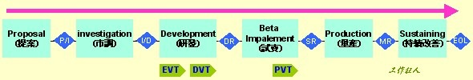

# 專有名詞

[TOC]

## BIOS

- **GOP** - 繪圖輸出通訊協定
  - GOP 驅動程式用來取代傳統視訊 BIOS
  - 能夠在沒有提供 CSM 的環境下使用 UEFI 預先開機韌體
  - 包在BIOS內

## 代工廠

- **BKC** - Best Known Configuration
- **RFP** - Request For Proposal 需求建議書
- FATP - final assembly test and pack 最後測試與包裝
- RMT - Recognition Memory Test
- ATD - Automotive Testing and Development
- IPS - Intel® Premier Support
  - ways to access Intel® Premier Support
- SMD - Surface Mount Device，表面貼焊零件
  - 所以這個辭是表示零件，泛指那些可以使用SMT製程或技術的電子零件
- SMT - Surface Mount Technology，表面貼焊技術
  - 所以這個辭指的是一種技術，一種將電子零件銲接於電路板表面的技術
- EVT - Engineering Verification Test (工程驗證測試階段)
  - 只有組裝電路板 (PCBA)，而且是那種很大一片的板子，我們通常稱之為【Big Board】
  - 硬體電路的工程驗證(verification)、除錯(debug)之用而已
  - 所有可能的設計問題都必須被提出來一一修正， 所以重點在考慮設計的可行性，並檢查是否有任何規格被遺漏了
- DVT - Design Verification Test (設計驗證測試階段)
  - 會把機構的外殼加上來，另外電路板也要達到實際的尺寸大小
  - 一開始只拿一塊大的樹脂用雷射鵰刻所製作出來的樣品(mockup)
  - 驗證整機的功能,把設計及製造的問題找出來
- PVT - Production Verification Test(生產驗證測試階段)
  - 不可再有設計上的變更
  - 工廠大量生產（Mass Production）前的製造流程測試
        

- 有人會用SR/ER/PR 有人用C0～C6，也有人用最簡單的A-Run/B-Run/C-Run
- PCB(Printed circuit board) 印刷電路板
- PCBA(Printed circuit board assembly) 印刷電路板+組裝
- FATP final assembly test and pack
  - 意思是最後裝配測試與包裝
- QC
  - IQC Incoming Quality Control 供應商品保
    - 控制來料的品質
    - 產線原料問題多不多要看IQC
  - IPQC InPut Process Quality Cortrol 製程控制
    - 產線製成品質問題多不多要看IPQC
  - OQC- Outgoing Quality Control 出貨檢驗 or 成品出廠檢驗、出廠質量控制出貨檢驗
    - 產品在出貨之前為保證出貨產品滿足客戶品質要求所進行的檢驗
    - 客訴 客退多不多要看OQC
- Shipping Mode 出廠設置：產品出廠前，工廠將會使用到此項，清空一些設置以及ADC
- SOW - Statement of Work 工作陳述

## EE

- **microcontroller**
  - 微控制器、MCU（MicroController Unit）、μC，似乎有些人暱稱為「micro」
  - 將CPU、RAM、ROM、Flash、I/O、A/D等等功能通通整合在一起，形成一個微型的電腦，所以也稱為單晶片（single-chip）、單晶片微電腦、單晶片控制器，大陸稱為單片機、單片微型計算機
  - 最廣為人知的是8051。
  - 指令集上早期的MCU是採用CISC的，後面被RISC取代
  - 在總線位數上，MCU覆蓋了4位、8位、16位、32位，應用十分廣泛
- **8051**
  - Intel於1980年代推出的MCS-51微控制器，通常稱呼為8051
  - 型號很多，但基本核心與指令皆相同，差別在於記憶體容量、型式、其他擴充功能
  - Intel於2007年3月終止此產品線，但仍有其他廠商的相容產品
- **shield**
  - 擴充板、周邊擴充板、daughterboard、add-on module、擴展板、轉接板、子板
- **breakout、breakout board**
  - 分線板
  - 通常是一塊小小的印刷電路板，作用是將某晶片的腳位接出來
  

- **fuse**
  - 非揮發性的設定值，若亂搞，單晶片可能會變得難以燒錄
- **datasheet**
  - 資料表、規格文件、規格資料。詳細列出電子元件的規格、功能、特性、腳位、溫度容忍範圍、等等。
- **data book**
  - 將許多電子零件晶片的datasheet收集在一本紙書裡，厚厚一本
  - 以前電子工程師的書架上通常會有一整排data book，但有了網際網路後，datasheet都變成電子檔囉
- **pinout、pin-out**
  - 電子元件或接頭插座之腳位功能對照表
  

- **programmer燒錄器**
  - 是一台裝置，有能力將資料燒錄進非揮發性記憶體，諸如EPROM、EEPROM、Flash、PAL、FPGA、可程式化邏輯等等
  - 以前學習單晶片時，並沒有像現在這麼方便 ，開發韌體時額外需要一台燒錄器，將單晶片放進去，然後燒錄，再拔起來插回電路里，非常麻煩
  - 燒錄器很貴，而且有些燒錄器只能燒錄幾個型號的晶片，後來才有萬用型燒錄器
- **ISP（In-System Programming）、ICSP（In-Circuit Serial Programming）**
  - 線上燒錄、線上即時燒錄
  - 不須將要被燒錄的單晶片從線路上拔起來
  - 微控制器內建燒錄功能(bootloader)，接出來後（型式可能不同，如RJ-11、6腳位、10腳位），連到燒錄連接線（又稱為下載線、ISP下載線、燒錄線、線上燒錄器）、再到電腦主機（的某軟體，例如avrdude、PonyProg、UISP），便可進行燒錄
- **ICE**
  - in-circuit debugger/programmer
- **PWM**
  - Pulse-Width Modulation脈波寬度調變，常用於電子式電壓調整，例如燈光亮度、馬達控制、螢幕亮度、等等。 其原理是藉由調整脈波的工作週期（Duty cycle）並影響平均值來控制電壓。
- **TTL**
  - 數位電路家族之一，由雙極接面電晶體（BJT，bipolar junction transistor）與電阻器組合而成，因為邏輯閘功能與放大功能皆由電晶體負責，所以稱為TTL（Transistor-Transistor Logic）
  - 最常見的積體電路IC為74系列，編號命名通常以德州儀器的為準
  - 原與CMOS分庭抗禮，以前，TTL速度較快，CMOS則較省電、成本較低，不過CMOS越來越進步，反應速度已超越TTL，且製作較容易；TTL幾乎沒有發展，目前主要應用在簡單的數位電路
  - TTL一詞也被拿來指稱「TTL邏輯電壓準位」，但並不一定使用TTL積體電路，而是指哪個電壓範圍代表HIGH，哪個電壓範圍代表LOW，譬如，若驅動電壓（Vcc）為5V，那麼LOW範圍會是0V~0.8V，而HIGH範圍則是2V到Vcc。常見驅動電壓還有3.3V。
- **Serial（序列傳輸）**
  - 顧名思義，一次只傳1個位元的傳輸介面，與之相對的是一次傳送好幾個位元的並列傳輸
  - 最少需要兩條連線，通常標示為負責傳送的TX（或TXD）以及接收的RX（RXD），雙方的接線需交叉連接方為正確
  - 在一般個人電腦中被稱為序列埠或通訊埠（COM port），並以RS-232實體介面的連接埠出現，而在電腦裡負責將資料在序列形式與並列形式之間作轉換的硬體稱為UART（Universal Asynchronous Receiver/Transmitter）
  - 現今的個人電腦幾乎看不見序列埠的身影，已被更高速的傳輸介面所取代，譬如USB與FireWire，但若插上藍牙轉序列埠或USB轉序列埠的轉接介面，就會以虛擬序列埠的姿態出現。
- **TTL Serial**
  - 符合TTL邏輯電壓準位的序列傳輸介面。
- **UART（Universal Asynchronous Receiver/Transmitter）**
  - 實作序列傳輸介面的硬體積體電路，將資料在序列與並列形式之間做轉換
  - 早期知名的晶片有8250、16550
  - 個人電腦以之實作出序列埠，在DOS/Windows下被標示為COM port，至於其外接線路與連接埠，通常採用RS-232與後繼標準
  - 若具備同步功能則稱為USART（Universal Synchronous/Asynchronous Receiver/Transmitter）
- **I²C（I2C、Inter-Integrated Circuit）**
  - 由Philips設計的一種序列通訊匯流排標準，屬於多主從架構，匯流排上可有多個主方（master）與多個從方（slave），主方多半是微控制器或單板電腦，從方則是各種I2C裝置
  - 透過兩條雙向連線進行傳輸，SDA（Serial Data Line）傳輸資料，SCL（Serial Clock）則為時脈，每個I2C從方裝置各需擁有一個獨一無二的位址，以資區別
  - 自2006年10月後，其他廠商不需權利金也能實作I2C協定，但若要取得I2C從方裝置的位址，還是要付出費用向NXP公司（其前身為Philips半導體部門）註冊。
- **SMBus**
  - 由Intel於1995年定義的標準
  - 以I2C為基礎但更嚴格的子集合
  - 期許能讓電子電路與裝置能夠更加穩定可靠，並且提昇互通性
  - 新近的I2C裝置多半也符合SMBus的規定，與之相容
- **SPI（Serial Peripheral Interface Bus）**
  - 一種全雙工同步序列資料傳輸協定
  - 在SPI匯流排上的裝置有一個為主方，其餘為從方，連接線有MOSI（Master Out Slave In）、MISO（Master In Slave Out）、SCLK（Serial Clock）、SS（Slave Select）
  - 主方便是透過SS指定欲與哪一個從方溝通，並不像I2C使用位址的方式指定，主方以SCLK發出時脈，以MOSI傳送資料給從方，而從方以MISO傳送資料給主方
  - SPI也常被稱為SSI（Synchronous Serial Interface）。
- **USB**
  - 每種USB設備都有一個PID和VID
    - VID是生產商的代號
    - PID是產品的代號，每個代號都是一個雙字節的整數
  - PID和VID不能隨意設置，它是由USB標準協會進行分配的，就像IP地址的分配一樣
    - 一個USB的PID/VID許可需要花費1500美元，在很多情況下，特別對小公司是一個很大的費用
    - 針對這種情況，有免費的PID/VID對，分別適用於HID類、CDC類和通用類設備
    - PID和VID在驅動程序和用戶程序中都將用到，它是windows識別USB設備的關鍵參數，用戶程序也需要通過PID和VID來查找相應的USB設備
    - 如果枚舉成功，它會提示安裝driver
    - 要識別為CDC類設備，請使用上面給出的ID，而不要使用廠商ID
- **FPGA**
  - FPGA(Field－Programmable Gate Array)，即現場可編程門陣列

## SW

- **RISC、CISC**
  - CISC的代表有x86、68000
  - RISC的代表有ARM、MIPS、Power
    - 因為處理器架構逐漸複雜，但其實常用的指令只佔一小部分，便提出RISC型的架構，精簡指令
    - 但經過多年發展後，RISC處理器的指令集也越來越大。
