# 啟動流程 & 程式碼

[toc]

## 名詞定義

|   縮寫     |    描述 |
| :-------- | --------:|
| GM App  | Gateway Management app |
| WKN  | Well-Know Name，有別於About的建立session方式 |
| ACL  | Access Control List |
| Config file  | 描述Alljoyn router的Policy(Allow or Deny) |
| SLS  | Sessionless Signal |

## Connector Code

1. Initialize Bus At  tachment：`Start` & `Connect`

``` c++
BusAttachment* bus = new BusAttachment("ConnectorApp", true);
bus->Start();
bus->Connect();
```

2. Initialize authentication：`EnablePeerSecurity`這個函數是用來啟動身分驗證與加密機制，使用前需要先`Start`

``` c++
keyListener.setPassCode("000000");

String keystore = "/opt/alljoyn/apps/" + wellknownName + "/store/.alljoyn_keystore.ks";

bus.EnablePeerSecurity("ALLJOYN_PIN_KEYX ALLJOYN_SRP_KEYX ALLJOYN_ECDHE_PSK", &keyListener, keystore.c_str(), false);
```

> 這裡所出現的keyListener是一種自定類別，繼承自`AuthListener`。
>`class SrpKeyXListener : public ajn::AuthListener`
>>
>>``` c++
>> SrpKeyXListener keyListener;
>> ```

>而`AuthListener`為啟動驗證機制時，負責傳達Password或其他與驗證機制相關的Class<br>
>繼承`AuthListener`時，有幾種virtual method可以實作，其中比較常用的有`RequestCredentials`/`AuthenticationComplete`
>
>>```c++
>>virtual bool RequestCredentials (const char *authMechanism, const char 
>>*peerName, uint16_t authCount, const char *userName, uint16_t credMask, >>Credentials &credentials)
>>```
>
>>``` c++
>>virtual void  AuthenticationComplete (const char *authMechanism, const >>char *peerName, bool success)=0
>>```

>以下用`SrpKeyXListener`改寫的內容做為範例：<br>
首先是`RequestCredentials`
>
>``` c++
>bool SrpKeyXListener::RequestCredentials(const char* >authMechanism, const char* authPeer,uint16_t authCount, >const char* userId, uint16_t credMask, Credentials& >creds)
>{
>    std::cout << "RequestCredentials for authenticating >" << authPeer << " using mechanism " << >authMechanism << std::endl;
>    if (strcmp(authMechanism, "ALLJOYN_SRP_KEYX") == >0 || strcmp(authMechanism, "ALLJOYN_PIN_KEYX") == >0 || strcmp(authMechanism, "ALLJOYN_ECDHE_PSK") == >0) {
>        if (credMask & AuthListener::CRED_PASSWORD) {
>            if (authCount <= 3) {
>                qcc::String passCodeFromGet;
>                if (m_GetPassCode) {
>                    m_GetPassCode(passCodeFromGet);
>                }
>                std::cout << "RequestCredentials >setPasscode to " << (m_GetPassCode ? >passCodeFromGet.c_str() : m_PassCode.>c_str()) << std::endl;
>                creds.SetPassword(m_GetPassCode ? >passCodeFromGet.c_str() : m_PassCode.>c_str());
>                return true;
>            } else {
>                return false;
>            }
>        }
>    }
>    return false;
>}
>```
>
>其中`Credentials`為`AuthListener`的Inner class，作為傳遞認證資訊的關鍵角色

>再來是`AuthenticationComplete`
>
>``` c++
>>void SrpKeyXListener::AuthenticationComplete(const >char* authMechanism, const char* authPeer, bool success)
>{
>    std::cout << "Authentication with " << authMechanism ><< (success ? " was successful" : " failed") << >std::endl;
>}
>```
>
> 此處只有一行`cout`，表明認證結果<br>
> 當Interface的secure設為True，第一次調用此Interface下的任何member，都會產生認證要求<br>
以下是上述Code的認證執行輸出
>>RequestCredentials for authenticating org.alljoyn.GWAgent.GMApp using mechanism ALLJOYN_ECDHE_PSK
RequestCredentials setPasscode to 000000
Authentication with ALLJOYN_ECDHE_PSK was successful

3. Initialize Connector

``` c++
class MyApp : public GatewayConnector

MyApp myApp(&bus, wellknownName.c_str());
myApp.init();
```

>繼承GatewayConnector時，有幾項Method需要實作
>
>``` c++
>virtual void shutdown() {…}
>virtual void mergedAclUpdated() {…}
>void receiveGetMergedAclAsync(QStatus unmarshalStatus,>GatewayMergedAcl* response) {…}
>```

基本上到目前為止，就已經完成一個Connector了。接著只需要跟Cloud互動，並在互動過程中適時的呼叫`myApp.updateConnectionStatus(...)`回報給`GM App`目前與雲端的連接狀態。`GM App`收到後，會發Signal給`Controler`，`Controler`收到後會呼叫`GM App`Interface的Method取得狀態。

>`GatewayConnector`這個Class透過WKN取得`GM App`的ProxyBusObject，其內部有2個Method與3個Signal，需要`RegisterSignalHandler`
>
>``` c++
>ifc->AddMethod("GetMergedAcl", NULL,  "a(obas)a(saya>(obas))", "exposedServices,remotedApps");
>ifc->AddMethod("UpdateConnectionStatus", "q", NULL, >"connectionStatus", MEMBER_ANNOTATE_NO_REPLY);
>ifc->AddSignal("MergedAclUpdated", NULL, NULL);
>ifc->AddSignal("ShutdownApp", NULL, NULL);
>```

## Manifest.xml

Build好`Connector`後的下一個工作，就是建置Manifest.xml了。Manifest.xml描述`Connector`的Service、感興趣的Interface、`Connector`執行時的參數傳入

是之後`Control App`用以建立ACL的依據

以下為Manifest.xml範例結構。

``` xml
<manifest xmlns="http://www.alljoyn.org/gateway/manifest">
    <connectorId>dummyapp1</connectorId>
    <friendlyName>dummyAppOne</friendlyName>
 <packageName>dummyAppOne_0.0.1-1_ar71xx.ipk</packageName>
 <version>0.0.1</version>
 <minAjSdkVersion>3.4.0</minAjSdkVersion>
 <exposedServices>
  <object name="EmergencyNotifications">
   <path>/emergency</path>
   <isPrefix>false</isPrefix>
   <interfaces>
    <interface name="NotificationInterface">org.alljoyn.Notification</interface>
   </interfaces>
  </object>
  <object name="WarningNotifications">
   <path>/warning</path>
   <isPrefix>false</isPrefix>
   <interfaces>
    <interface name="NotificationInterface">org.alljoyn.Notification</interface>
   </interfaces>
  </object>
 </exposedServices>
 <remotedServices>
  <object name="AllObjectPaths">
   <path>/</path>
   <isPrefix>true</isPrefix>
   <interfaces>
    <interface name="NotificationInterface">org.alljoyn.Notification</interface>
    <interface name="AboutInterface">org.alljoyn.About</interface>
    <interface name="AboutIcon">org.alljoyn.Icon</interface>
    <interface name="NotificationSuperInterface">org.alljoyn.NotificationSuper</interface>
    <interface name="ConfigInterface">org.alljoyn.Config</interface>
   </interfaces>
  </object>
 </remotedServices>
 <executionInfo>
  <executable>alljoyn-gwconnectorsample</executable>
  <env_variables>
   <variable name="LD_LIBRARY_PATH">/opt/alljoyn/apps/dummyapp1/lib</variable>
   <variable name="ER_DEBUG">7</variable>
   <variable name="INTERACTIVE_OFF">1</variable>
   <variable name="TWITTER_SCRIPT">postTweet.sh</variable>
  </env_variables>
  <arguments>
  </arguments>
 </executionInfo>
</manifest>
```

## 安裝Connector

有了Build好的`Connector`與`Manifest.xml`以後，接著就是`安裝`/`移除Connector`了。

安裝的第一步就是將lib、bin、Manifest.xml依照下列格式擺放。
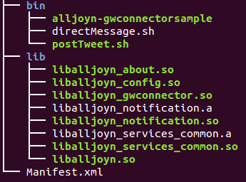

之後將整包壓縮成一個tar檔案。

```bash
tar czf dummyApp1.tar.gz -C gatewayConnector/tar
```


接著透過官方提供的`installPackage.sh`/`removePackage.sh`進行`安裝`/`移除`

```bash
./installPackage.sh dummyApp1.tar.gz
```

>`installPackage.sh`所做的事情很單純，
只是將tar檔裡的東西轉移到`/opt/alljoyn/apps/$connectorId`之中，然後創造一個Linux User，並將store這個Folder的擁有者，轉移到新創的Linux User下
>
>```bash
>baseDir=/opt/alljoyn
>manifestFile=$tmpDir/Manifest.xml
>appBinDir=$tmpDir/bin
> connectorId=$(grep "<connectorId>" $manifestFile | sed >-e "s/ *<connectorId>//" | sed -e "s/<\/connectorId *>//>")
>connectorAppDir=$baseDir/apps/$connectorId
>
>if [ $? -ne 0 ]; then
>    useradd $connectorId || exit 22
>    createdUser=1
>fi
>chown -R "$connectorId" "$pkgInstallDir/store" || exit 23
>chmod -R a+rx "$pkgInstallDir/bin" || exit 24
>chmod -R a+rx "$pkgInstallDir/lib" || exit 25
>```

經過上面安裝後，就會看到`/opt/alljoyn/apps/$connectorId`目錄，結構如下
>此時acls Folder內無東西。可以透過shell自行創造，或是啟動`GM App`與`Controller App`後，透過`Contorller App`建立。

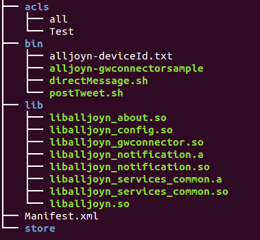

## 啟動

### 啟動Router

在啟動`GM App`與`Connectors`之前，先確定`alljoyn-daemon`是否已經安裝並啟動。

先確認是否Build好的`alljoyn-daemon`放在`/usr/bin/`中，並寫好`alljoyn.init`放在`/etc/init.d/alljoyn`之中。之後執行`service alljoyn start`

>以下為`alljoyn.init`的start script
>
>```bash
>start() {
>  if [ -f $PIDFILE ] && kill -0 $(cat $PIDFILE); then
>    echo 'Service already running' >&2
>    return 1
>  fi
>  echo 'Starting service…' >&2
>  local CMD="$SCRIPT --config-file=/opt/alljoyn/>alljoyn-daemon.d/config.xml &> \"$LOGFILE\" & echo \$!"
>  su -c "$CMD" $RUNAS > "$PIDFILE"
>  echo 'Service started' >&2
>}
>```
>
>執行時所帶的參數`--config-file`指出Router Config Policy的位置，此例為`/opt/alljoyn/alljoyn-daemon.d/config.xml`

注意Config File內，要include `GM App`執行時動態改變的Policy File，`此例為gwagent-config.xml`

``` xml
<busconfig>
    <type>alljoyn</type>
    <property name="router_advertisement_prefix">org.alljoyn.BusNode</property>
    <listen>unix:abstract=alljoyn</listen>
    <listen>tcp:r4addr=0.0.0.0,r4port=0</listen>
    <limit name="auth_timeout">5000</limit>
    
    <limit name="max_incomplete_connections">16</limit>
    <limit name="max_completed_connections">100</limit>
    <limit name="max_untrusted_clients">100</limit>
    <flag name="restrict_untrusted_clients">false</flag>
    
    <ip_name_service>
        <property interfaces="*"/>
        <property disable_directed_broadcast="false"/>
        <property enable_ipv4="true"/>
        <property enable_ipv6="true"/>
    </ip_name_service>
    <include>/opt/alljoyn/alljoyn-daemon.d/gwagent-config.xml</include>
</busconfig>
```

>Config File內所有可用的的Tag，與每個Tag的說明，請參閱以下網址。
>[XML Schema](images/https://allseenalliance.org/schemas/busconfig.xsd)
>[Routing Node Configuration File](images/https://allseenalliance.org/framework/documentation/learn/core/rn_config)

確認完成後，執行Router：`service alljoyn start`

### 啟動GM App

確認Config File 與`start alljoyn-daemon`以後，對於`GM App`我們也依法照做一次。

將Build好的`alljoyn-gwagent`放在`/usr/bin/`中，並寫好`alljoyn-gwagent.init`放在`/etc/init.d/alljoyn-gwagent`之中。之後執行`service alljoyn-gwagent start`

>以下為`alljoyn-gwagent.init`的start script
>
>```bash
>start() {
>  if [ -f $PIDFILE ] && kill -0 $(cat $PIDFILE); then
>    echo 'Service already running' >&2
>    return 1
>  fi
>  echo 'Starting service…' >&2
>  local CMD="$SCRIPT &> \"$LOGFILE\" & echo \$!"
>  su -c "$CMD" $RUNAS > "$PIDFILE"
>  echo 'Service started' >&2
>}
>```
>
>注意：雖然此例沒有使用，但事實上可以帶入參數`--gwagent-policy-file`指出`GM App`執行時動態產生的Config File，以及`--apps-policy-dir`指出根據ACL產生的Config File Folder

>以下為`GM App`程式碼片段
>
>``` c++
>String policyFileOption = "--gwagent-policy-file=";
>String appsPolicyDirOption = "--apps-policy-dir=";
>
>    for (int i = 1; i < argc; i++) {
>        String arg(argv[i]);
>        if (arg.compare(0, policyFileOption.size(), >policyFileOption) == 0) {
>            String policyFile = arg.substr>(policyFileOption.size());
>            QCC_DbgPrintf(("Setting gatewayPolicyFile >to: %s", policyFile.c_str()));
>            gatewayMgmt->setGatewayPolicyFile(policyFile.>c_str());
>        }
>        if (arg.compare(0, appsPolicyDirOption.size(), >appsPolicyDirOption) == 0) {
>            String policyDir = arg.substr>(appsPolicyDirOption.size());
>            QCC_DbgPrintf(("Setting appsPolicyDir to: >%s", policyDir.c_str()));
>            gatewayMgmt->setAppPolicyDir(policyDir.c_str>());
>        }
>    }
>```
>
> 例如：
>
>```bash
>start() {
>service_start /usr/bin/alljoyn-gwagent `--gwagent-policy-file`=/etc/>alljoyn/gwagent/gwagent.conf `--apps-policy-dir`=/etc/alljoyn/>gwagent-apps
>}
>```

>如果沒有特別指明，則<br>
> Default **gwagent-policy-file**：`/opt/alljoyn/alljoyn-daemon.d/gwagent-config.xml`<br>
> **apps-policy-dir**：`/opt/alljoyn/alljoyn-daemon.d/apps`
>
>``` c++
>static const qcc::String GATEWAY_POLICIES_DIRECTORY = "/opt/alljoyn/>alljoyn-daemon.d";
>
>GatewayRouterPolicyManager::GatewayRouterPolicyManager() : >m_AboutListenerRegistered(false), m_AutoCommit(false),
>    m_gatewayPolicyFile(GATEWAY_POLICIES_DIRECTORY + "/gwagent-config.>xml"), m_appPolicyDirectory(GATEWAY_POLICIES_DIRECTORY + "/apps")
>{
>}
>```

> 圖為此範例的目錄結構：


>**config.xml**：
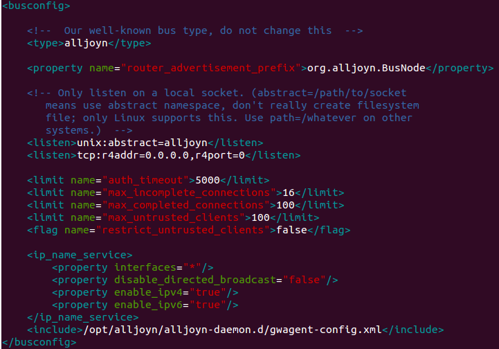

>**gwagent-config.xml**：


>apps-policy-dir內的**dummyapp1.xml**：
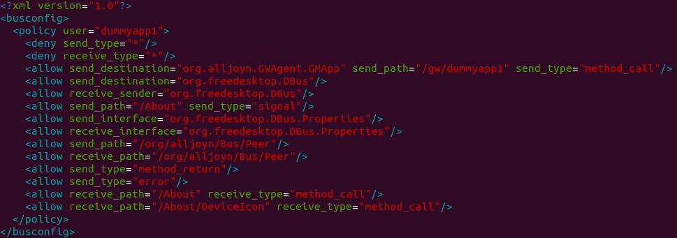

確認完成後，執行GM App：`service alljoyn-gwagent start`

### 驗證

透過`ps -ef | grep alljoyn`指令驗證


### 目錄結構

`/opt/alljoyn`下的樹狀結構：
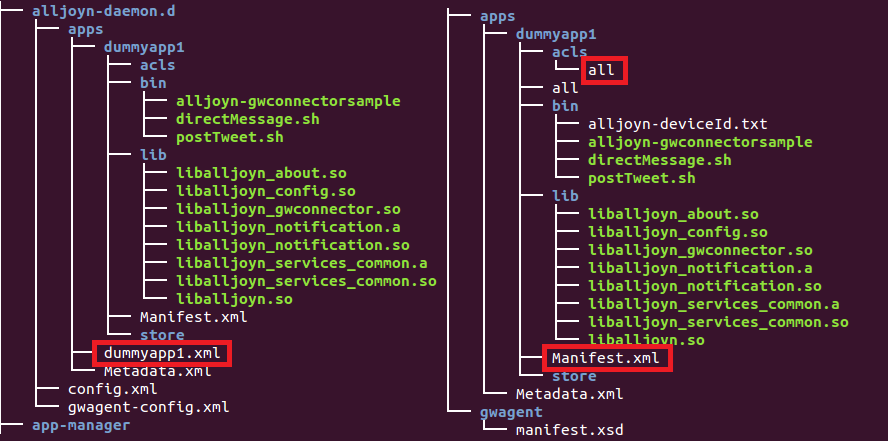

### Controller App畫面

進入搜尋到的`GM App`：
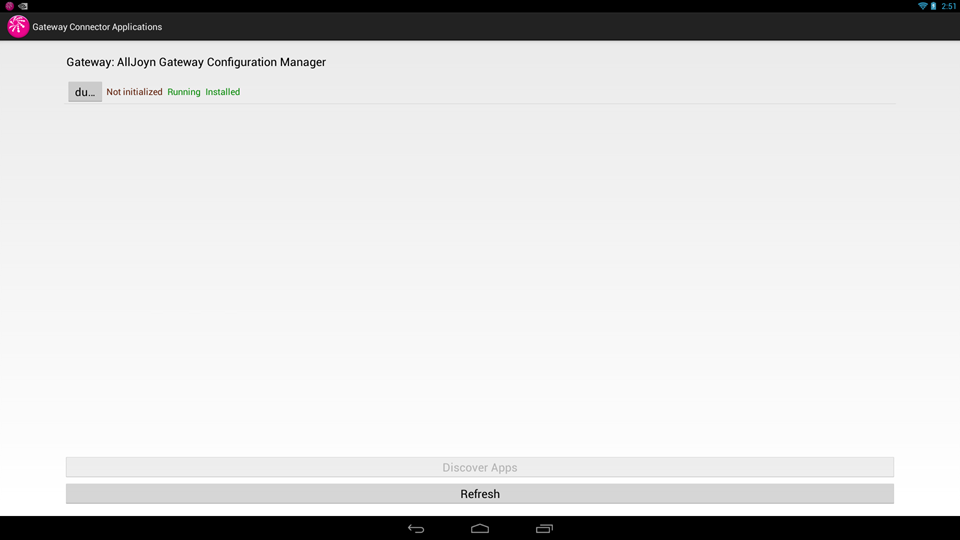

進入`Connector's acl`列表


允許`Connector`的服務：
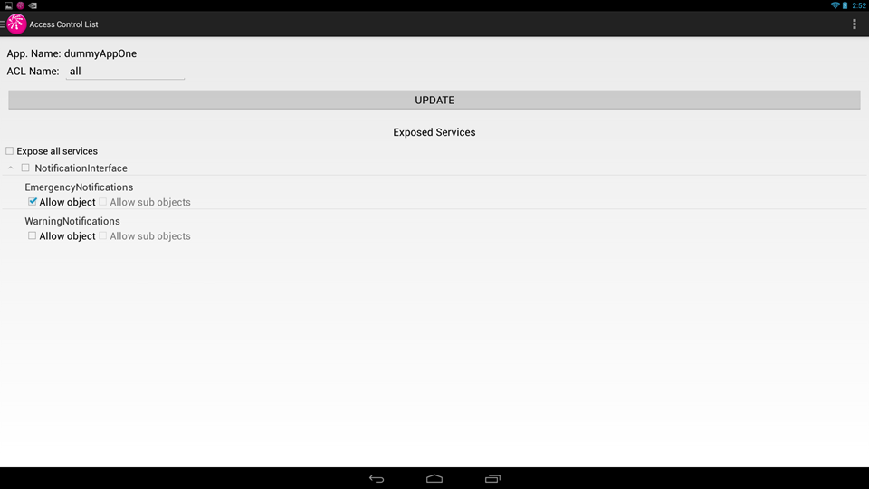

含有此**`Connector`感興趣的Interface**的Device：
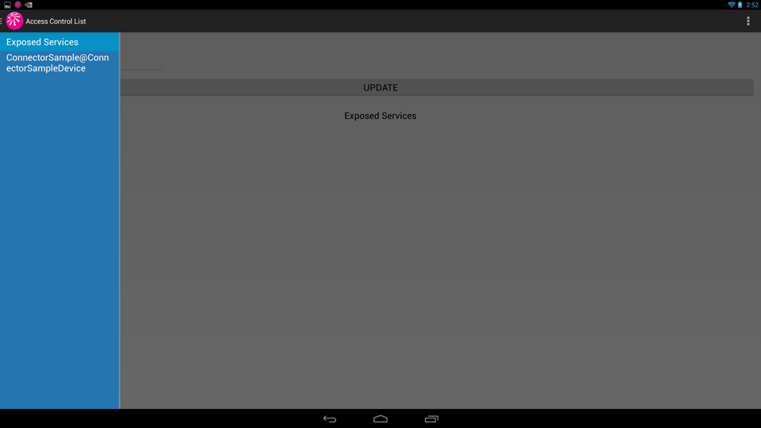

允許`Connector`存取此Device：
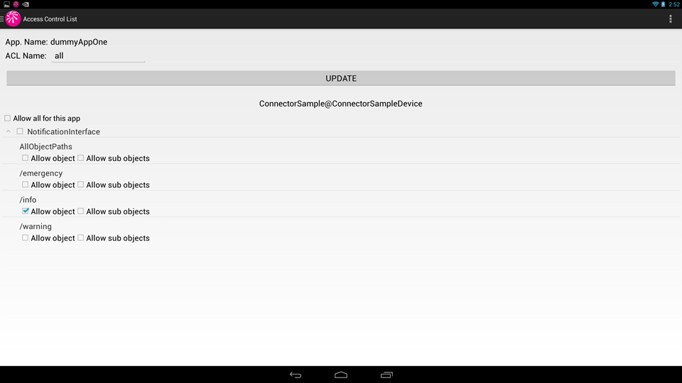

ACL產生：
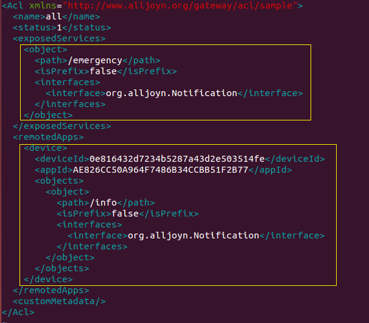

同時產生Config Policy：
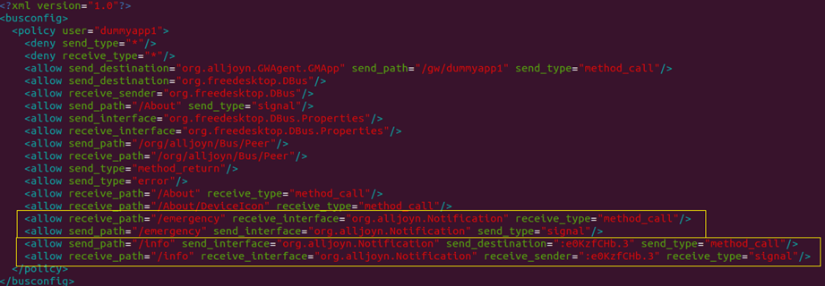
