# 乙太區域網路基本觀念

[TOC]

## 名詞定義

|   中文   | 英文簡稱 | 英文全稱|
| :--------: | :--------:| :------: |
|乙太網路|Ethernet|
|存取點|AP|Access Point|
|無遮蔽雙絞線|UTP|Unshielded Twisted-Pair|
|電磁干擾|EMI|Electromagnetic Interface|
|串音||crosstalk|
|最大傳輸單元|MTU|Maximum transmission unit|
|廣播位置||Broadcast address|
|群播位置||Multicast address|
|錯誤復原||error recovery|
|錯誤檢測||error detection|
|載波感應多重存取/碰撞偵測| CSMA/CD||

## 乙太網路概述

- **LAN區域網路**與**WAN廣域網路**不同
- **乙太網路**使用**乙太網路電纜**，所以是指有線區域網路
- **乙太網路**使用標準開頭**IEEE 802.3**
- **WLAN無線區域網路**使用**IEEE 802.11**，並不屬於乙太網路
- **HUB**、**Switch**、**Router**三者有別
- **AP**類似**Switch**

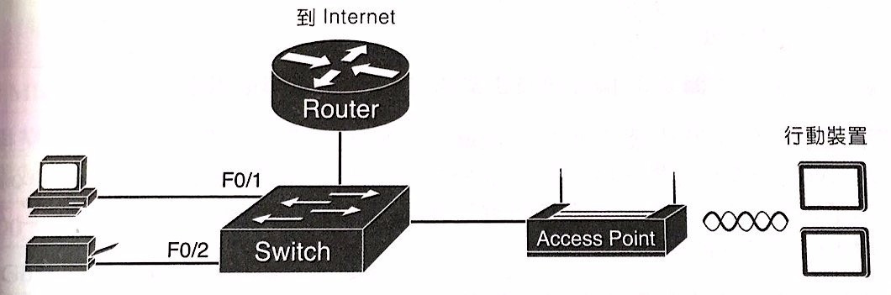
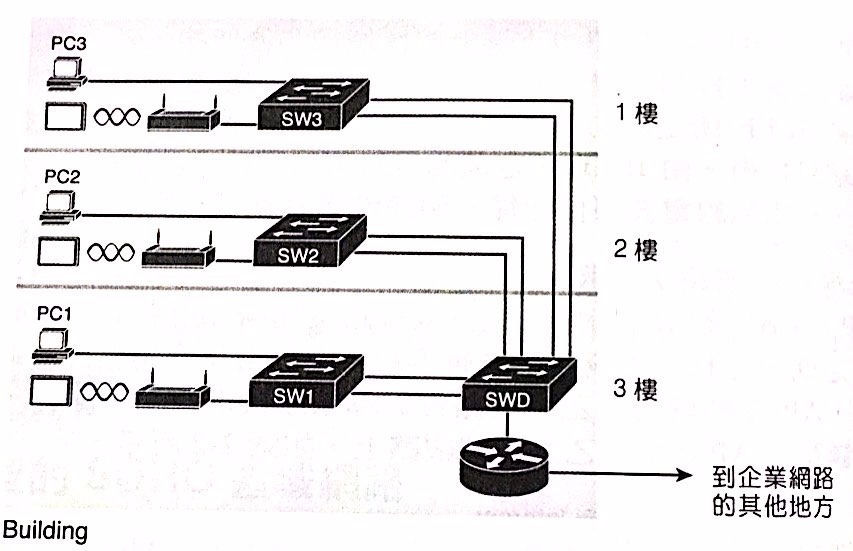

## 乙太網路定義

- **乙太網路**是指一系列**實體層**與**鏈結層**的標準。
- 每個**乙太網路**標準，是定義某**特定電纜**、某**特定速度**下的**協定**。

>一般來說，電纜分為**光纖電纜**或是**銅質電纜**。
>**光纖電纜**採用**玻璃纖維**。
>**銅質電纜**採用**無遮蔽雙絞線(UTP)**。

## 乙太網路實體層標準種類

- IEEE對乙太網路的簡稱: **速率+BASE+T(UTP) or X(光纖)**

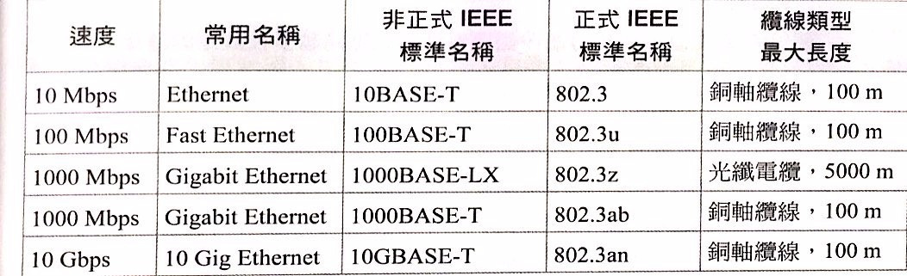

- 網路工程師選購設備，需知道此設備支援的乙太網路標準名稱
- 即便是不同類型，但只要是乙太網路，鏈結層**標頭標尾都一樣**
- 區網不同的線段，傳輸速率不一定一樣

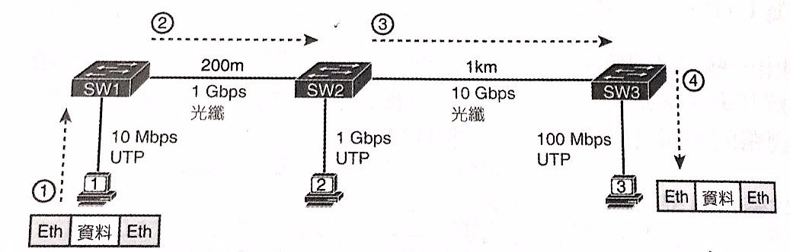

- 節點用**乙太網路埠**上的電路系統連接**一對芯線**造成**迴圈**

## 乙太網路實體層原理

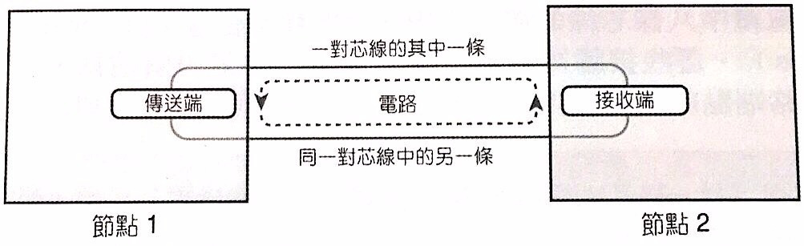

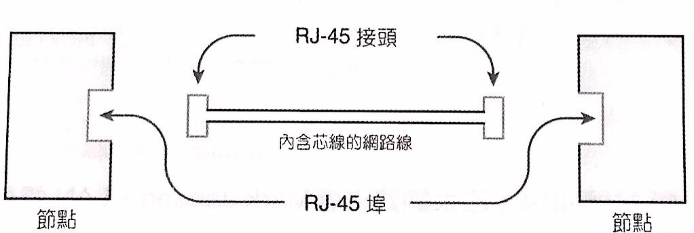

- **發送端**用相同**編碼**方式，隨時間推移，改變電氣訊號
- **接收端**用相同**編碼**方式，隨時間推移，將電氣訊號翻譯回0或是1。
- 10M代表千萬分之一秒翻譯一個0或是1
- 實際上UTP電纜的芯線是**互相扭絞**，並非平行。這是為了抵銷**電磁干擾(EMI)**
- 兩條芯線內的EMI稱為**串音(crosstalk)**
- 乙太網路UTP電纜的兩端為**RJ45接頭** & **RJ45埠**
- **10M** & **100M**是兩對芯線
- **1000M**是四對芯線
- 每一對芯線有自己的顏色，如藍色與藍白色
- **RJ11**接頭是北美電話線
- **GB乙太網路**有專屬的**Gigabit介面轉接器(GBIC)**。有些還帶**小型可插拔模組 SFP**

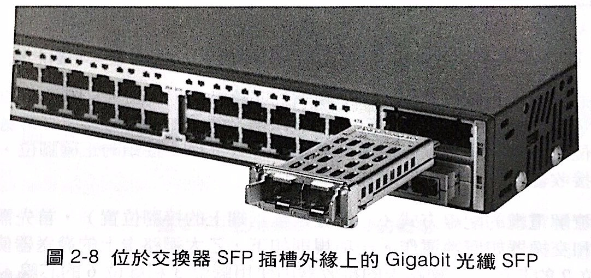

## 乙太網路實體層接腳

- 目前為止，就像在自家開車，無須規則，但上路後需要遵守規則
- 一對芯線送，一對芯線收

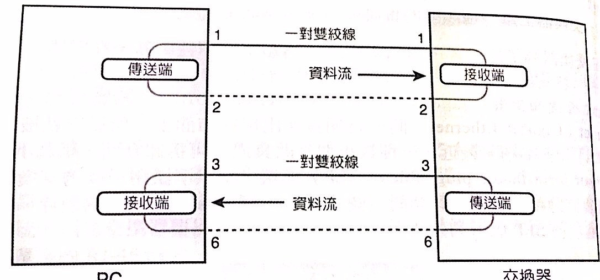

- PC網路卡vs交換器，是採用**平行腳腳位**(因為收送端相反)
- 兩種類似的設備相連，採用**交叉線腳位**

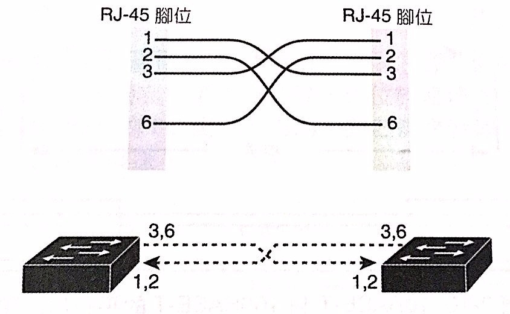
>即便你接錯誤的電纜，仍然正常運作，
>是因為Cisco交換器有**auto-mdix**的功能，改變錯誤的邏輯

- 1000M有四對芯線與更先進的設備，每一對可同時收送
- 1.2一對   3.6一對   4.5一對   7.8一對

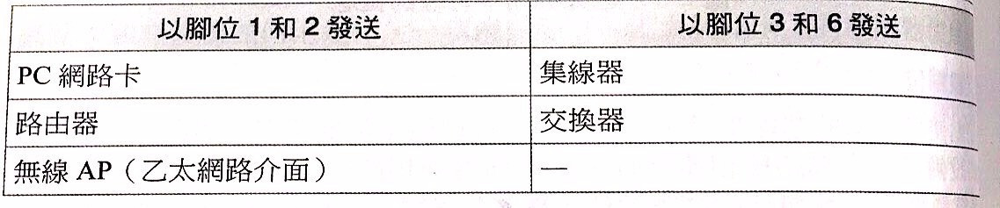

## 乙太網路資料鏈結層協定

- 乙太網路的優勢就是，這些協定的**鏈結層**都是**標頭-資料-標尾**
- 乙太網路實際上有數個標頭格式，圖中是最普遍的

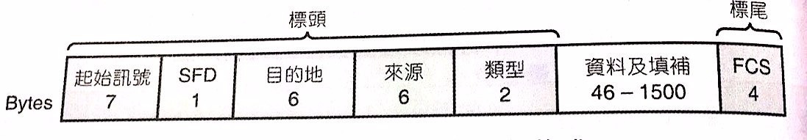

- **1500 bytes**是**IP MTU(最大傳輸單元)**
- 媒體存取控制 MAC 是**6 bytes**
- 正常MAC傳遞，稱為**單點傳播(Unicast)**，相對於**廣播(broadcast)**和**群播(muticast)**

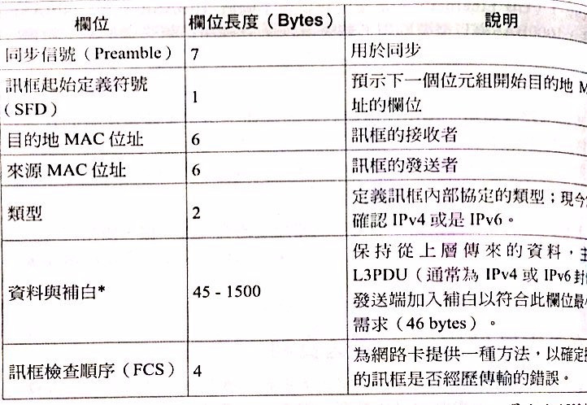

- MAC碼的前三Bytes為**製造商代碼**，是製造商向IEEE申請**3 bytes的組織唯一識別碼(OUI)**當開頭
- 後3 bytes是製造商分配的唯一值，且不能是任何存在的OUI碼(為了獨一無二)

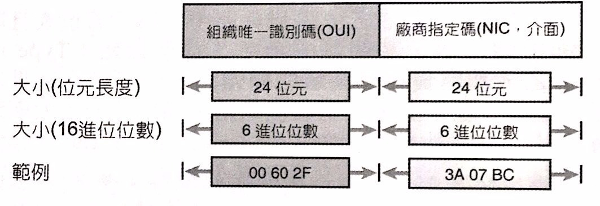

## 乙太網路中的MAC位置與廣播、群播的關係

- MAC又被稱為**實體位置**、**燒錄位置(BIA)**

> 指MAC被燒錄在網路卡的ROM晶片中

- **廣播位置(Broadcast address)**為**FFFF.FFFF.FFFF**，使乙太網路中的所有設備都被傳遞到
- **群播位置(Multicast address)**有特定位置，在此特定位置中的乙太網路設備都被傳遞到
- 網路層協定有**IPv4**、**IPv6**、**AppleTalk**、**DECnet**、**NetWare**、**SNA**
- IEEE定義所有每一種網路層協定，在標頭代表一個**Type**的數值
- FCS是用發送端對訊框做複雜數學運算後的值
- 接收端透過將FCS反運算來進行錯誤檢測(Error detection)

>錯誤檢測(error detection)並不等同於錯誤復原(error recovery)
>錯誤檢測後，凡是錯誤的訊框必須丟棄
>TCP會要求再次發送，來復原遺失的資料
>
## Hub與Switch的半雙工與全雙工

- **半雙工**是一種概念，代表著不能**同時發送**or**同時接收**，用來防止碰撞，如**Hub**
- **全雙工**則可以，如**PC網卡**、**Switch**
- **Hub**使用實體層標準，將電氣訊號**洪泛(flooding)**到所有其他的埠，屬於**第一層**設備
- **Hub**沒有訊框、IP等概念
- 兩個設備同時輸入訊號，到同一台時，電氣訊號會**碰撞**，而成**亂碼**
- 為了避免這種狀況，所以**Hub**採用**半雙工**

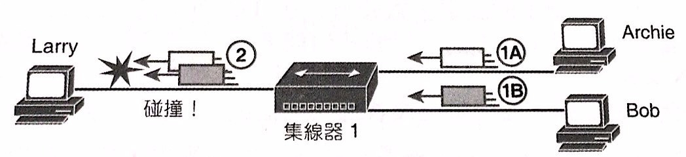

>也就是A要傳送資料給Hub時，
>B就注意到Hub正在接收某處的訊框，不能傳給Hub
>此演算法稱為**CSMA/CD(載波感應多重存取/碰撞偵測)**
>
>但也可能因為兩個節點正好同一瞬間，檢查一個進來的訊框，
>雙方都被判定沒有其他節點正在發送，於是發生碰撞
>
>此時，發送端要監聽到碰撞是否發生，並送出人為的**干擾**信號，
>告訴所有節點碰撞發生，大家各自挑一個隨機的時間再送一次
>此演算法屬於**碰撞偵測**與**復原**

- **Switch**屬於**第二層**設備，會檢查資料鏈路的**標頭標尾**
- **Switch**會檢查**MAC**位置，如果碰撞，會將訊框放置佇列
