# 廣域網路的原理

[TOC]

## 名詞定義

|   中文   | 英文簡稱 | 英文全稱|
| :--------: | :--------:| :------: |
|服務供應商|SP|Service Provider|
|用戶端設備|CPE|Customer Premises Equipment|
|局端|CO|Central Offices|
|用戶端設備|CPE|Customer Premises Equipment|
|通道服務單元|CSU|Channel Service Unit|
|資料服務單元|DSU|Data Service Unit|
|資料終端設備|DTE|Data Terminal Equipment|
|資料通訊設備|DCE|Data communications Equipment|
|高階資料鏈結控制協定|HDLC|High-Level Data Link Control|
|點對點通訊協定|PPP|Point-to-Point Protocol|
|網路連接點|POP|Point Of Presence|
|乙太網路仿真||Ethernet emulation|
|乙太網路多重協定標籤交換|EoMPLS|Ethernet over MPLS|
|數位用戶電路|DSL|Digital Subscriber Line|
|網際網路服務供應商|ISP|Internet Service Providers|
|公眾交換電話網路|PSTN|Public Switched Telephone Network|
|DSL存取多工器|DSLAM|DSL Access Multiplexer|

## WAN的簡介

- **WAN**和**LAN**都符合OSI的第一、第二層標準
- **WAN**的安裝需要穿過他人房產，而我們無權這麼做
- 故此由電信公司建構後出租
- WAN分為**專線**與**光纖乙太網路**標準之長距離電纜

## 專線WAN

- **專線**一詞，指的是使用專線的公司本身並不擁有這條線路
- 是**服務供應商(SP)**出租提供
- 專線完全為客戶著想，是高品質及客戶私有的
- 美國專線上的標準速度為256Kbps
- 缺點是**成本較高** & **較長的等待**佈線時間
- 圖中彎曲線路，視同省略細節

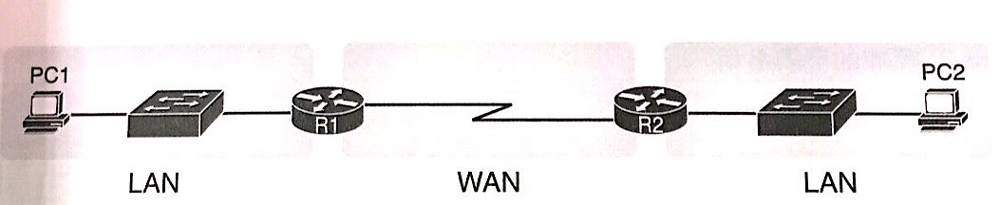

### 專線的實體細節

- 專線服務是使用**全雙工的邏輯**，在預定速度傳遞
- 實際上，使用了**兩對纜線**，兩個方向個使用一對，概念上是全雙工

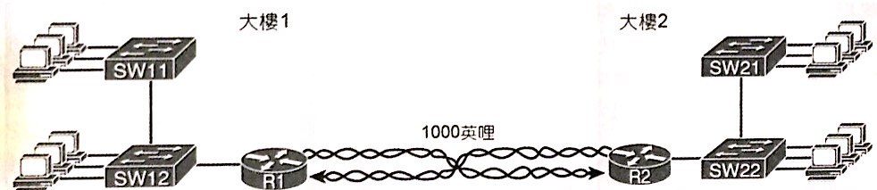

- **T1**是專線的一種特殊類型， 傳送速率每秒1.544Mbps

### 專線的佈線

- 專線的佈線，是將它們的設備設置在稱為**局端(CO)**的建築物內

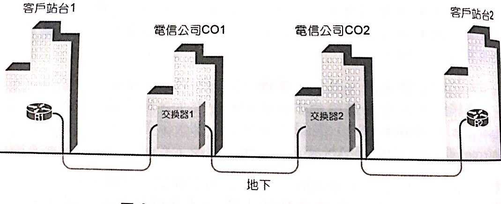

- 期望有一天能租給建築物內的人們
- 每個地點都會有**用戶端設備(CPE)**
- 所謂**CPE**包含**路由器**、**序列介面卡**、**CSU/DSU**

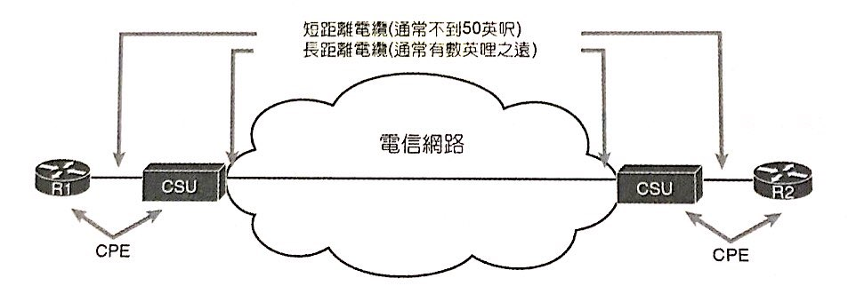

> 1. - **序列介面卡**有點像乙太網卡，裝在**路由器**內
>
>- **序列介面卡**無法直接連接到電信公司的**四芯電纜**(通常是**RJ-48**接頭，與RJ-45接頭大小外型一樣)
>- **序列介面卡**需先透過**短序列纜線**接到稱為**CSU/DSU**的功能上，再透過**CSU/DSU**去接到電信公司的**四芯電纜**
>
> 2. **短序列纜線**一端是**序列介面卡**接頭，一端是**CSU/DSU**接頭
> 3. **CSU/DSU**可以被整合到序列介面卡內，也可以脫離路由器，成為外部設備

- 用戶只能從電信公司提供的速率清單中擇一，不能任意指定速率

>- **短序列纜線**有兩條，在**路由器A** & **CSU/DSU**之間一條，另一條在**路由器B** & **CSU/DSU**之間，兩條分別有不同的名稱
>- **短序列纜線**有公接頭的叫**DTE**，是**平行線**
>- **短序列纜線**有母接頭的叫**DCE**，是**交叉線**
>- 一端是**DTE**，另一端就是**DCE**
>兩條可以直接相接
>最後，為了使線路正常，**DCE**接的那邊，需要有一個通常是由**CSU/DSU**提供的功能，稱為**時脈**
>**時脈**是用來告訴路由器，**何時發送一個位元**，進而轉成電氣訊號
>**時脈**也可以由**路由器的序列介面**提供，需要透過設定**clock rate**命令

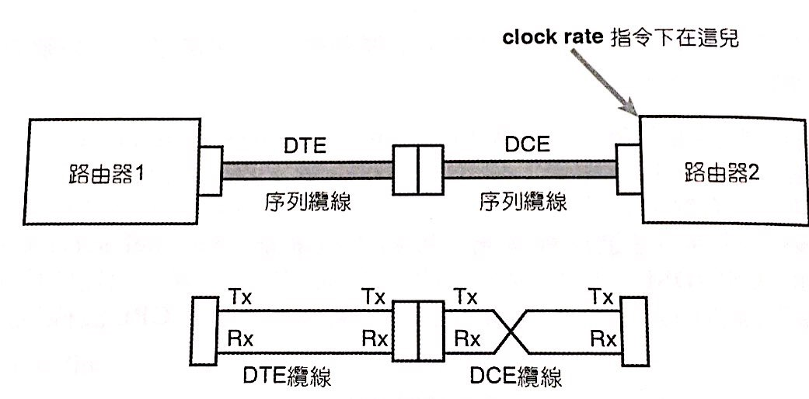

### 專線的資料鏈路細節

- 以上算是講實體層，現在來談資料鏈路層
- 最常見於此的協定有**HDLC**與**PPP**
- 對於點對點的專線來說，**HDLC**的**位置欄位**並無作用

>**HDLC**的**位置欄位**是由於電信公司發展了**多點電路**，因此可能有超過一個以上的目的地

- **HDLC**類似乙太網路的其他欄位

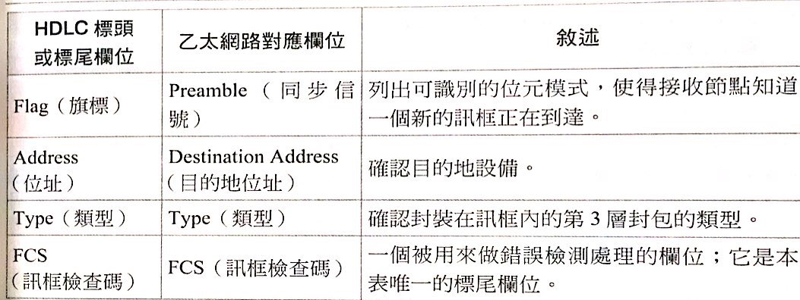

- **HDLC**是ISO的標準，同OSI組織，而**HDLC**卻沒有**Type欄位**(辨別此封包是IPv4 or IPv6)
- 於是Cisco路由器使用**Cisco專屬的HDLC**，自行添加了**Type欄位**

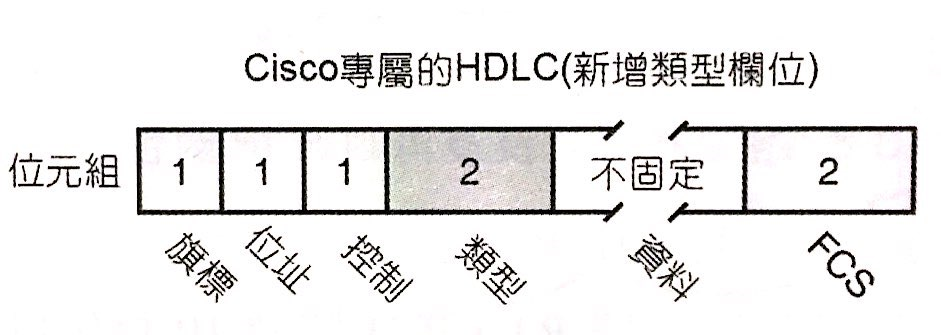

- 下圖為**TCP/IP的網路層**的視角(相當無感LAN與WAN)

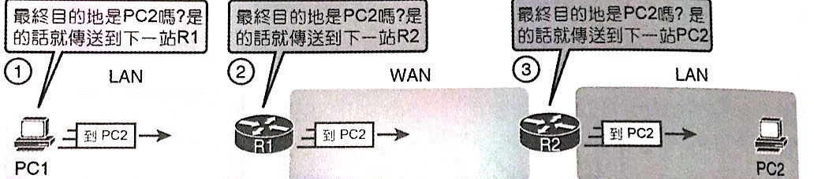

- 下圖為**資料鏈結層**的視角(需要正確的**封裝/解封裝**)

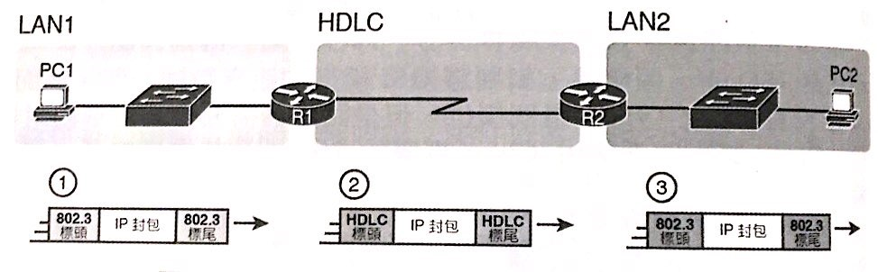

## 乙太網路做為WAN

- **1000BASE-LX**標準的單模光纖電纜(可支援5KM)
- **1000BASE-ZX**標準(可支援70KM)
- 乙太網路離開你家以後，連接到SP附近一些**網路連接點(POP)**
- 乙太網路WAN的服務有兩個名稱，**乙太網路仿真** & **乙太網路多重協定標籤交換(EoMPLS)**
- **EoMPLS**是一種能夠備用在SP內部雲的技術
- 提供兩個客戶設備之間的點對點連線
- 於資料鏈結層來看，圖中第二步驟解封裝後，依然會**捨棄標頭標尾**

- 新加上的標頭標尾，其位置改為**R1** to **R2**

## 存取Internet

- Internet是一個大型的WAN
- **Internet核心**由**網際網路服務供應商(ISP)**營運
- ISP彼此互相合作建立網狀

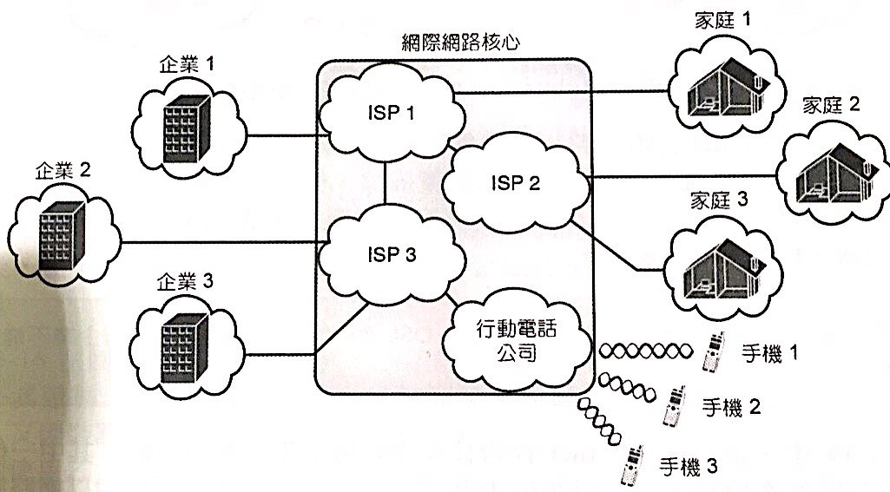

- 每一條鏈路稱為**Internet存取鏈路**
- **企業**傾向用**專線**連WAN
- 家庭常用的**DSL**已經安裝在家庭的**類比電話線路**，**cable**則使用**CCTV電纜**

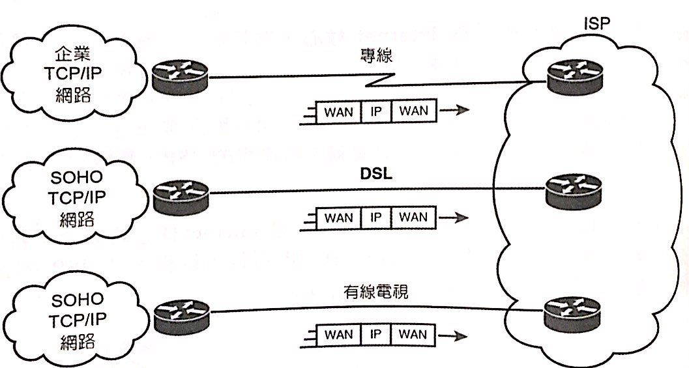

### 數位用戶電路(DSL)

- DSL只提供務住宅到電信公司網路這段的實體電路
- 一般電話線透過**RJ-11**接頭(比RJ-45瘦小)，從**電信商CO**連到**家庭的護牆版**
- 透過電信交換機的一個連接埠，轉送到**公眾交換電話網路(PSTN)**

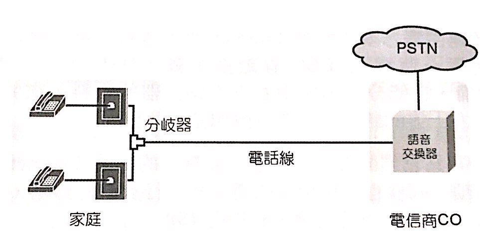

- 家中需要添增**DSL數據機**連接到一個空電話插座
- 電信公司CO需要添增**DSL存取多工器(DSLAM)**，將語音和路由器資料分離

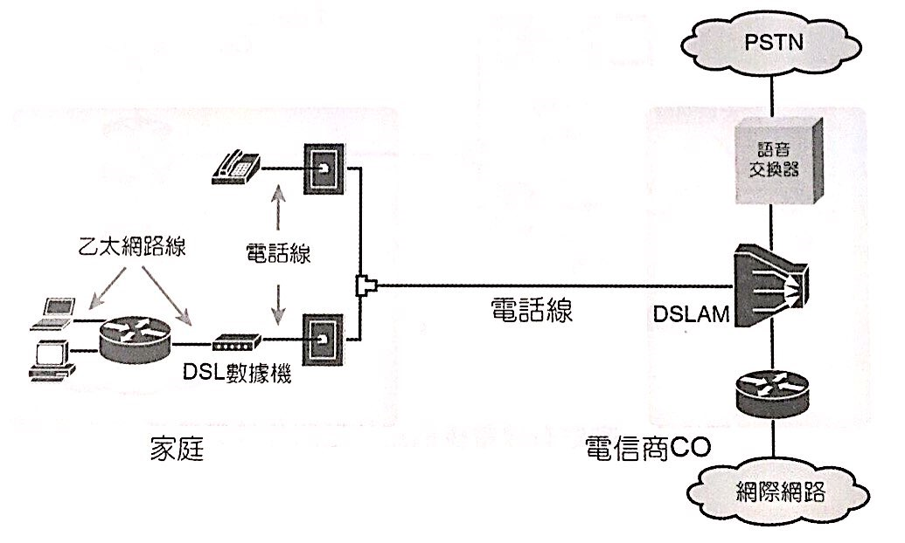

- DSL支援**不對稱**的速度。(下載快，上傳慢)

### 有線電視網路

- 同DSL，支援**不對稱**的速度
- 有線電視公司需要將資料和視訊分開

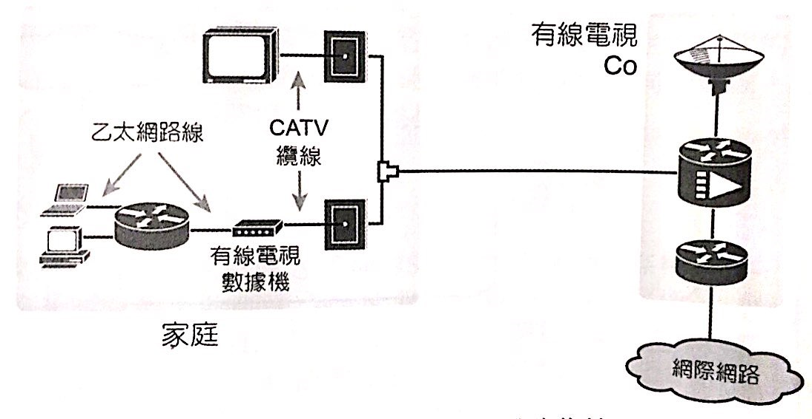

- 通常**Cable**比較**快**，但**DSL**比較**便宜**
- 兩者都提供**Always on**的服務，使連線無須採取某些行動
