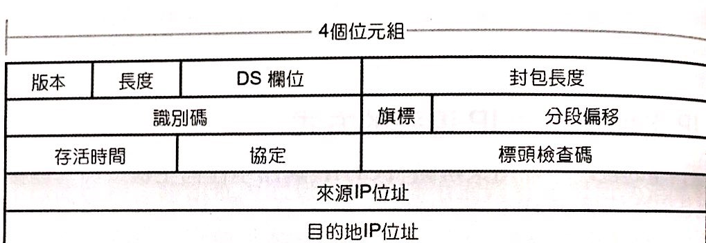
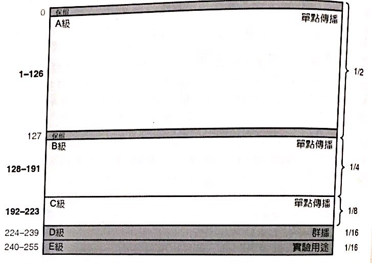
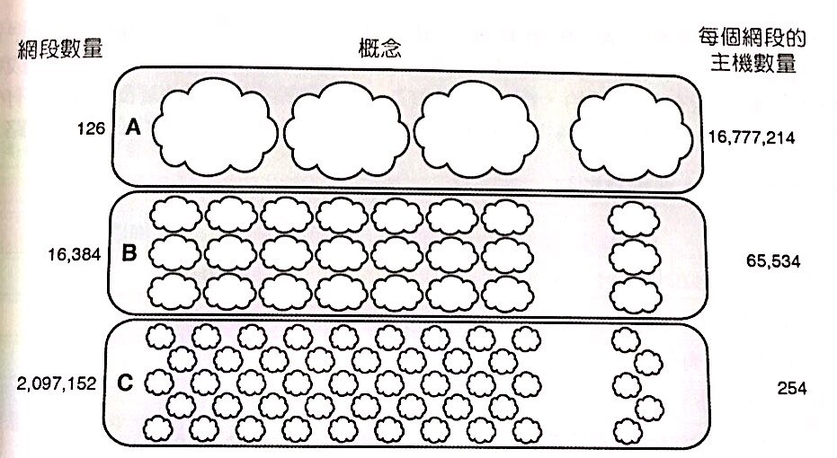
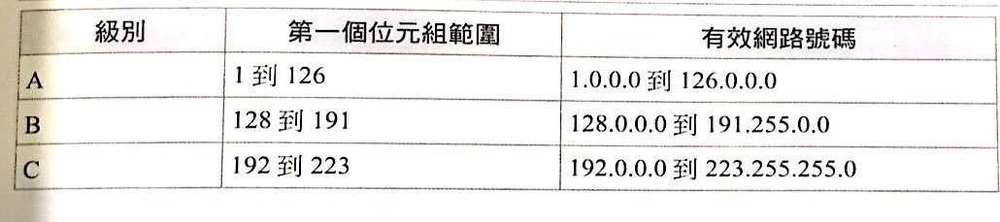
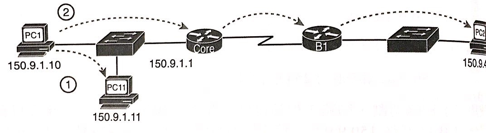
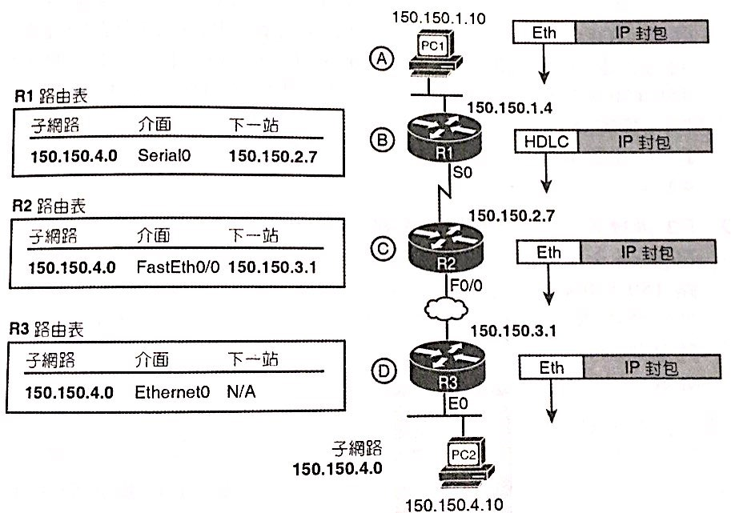
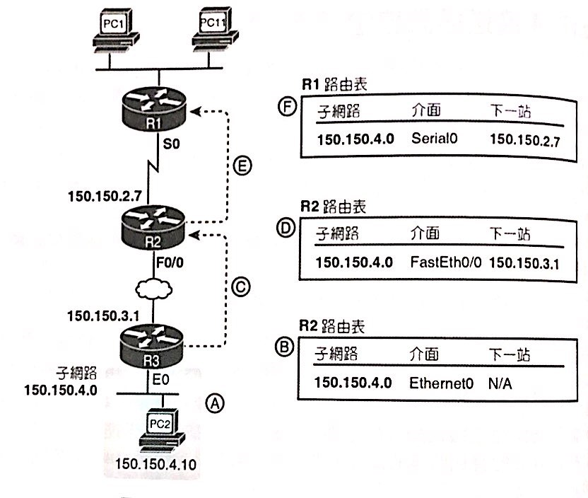
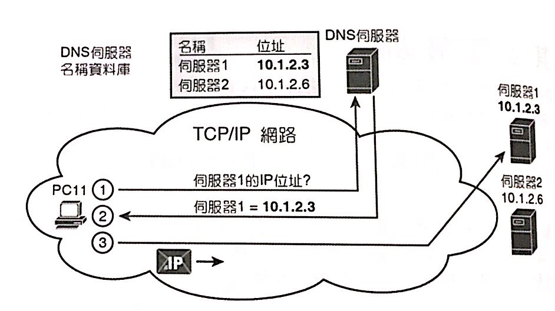
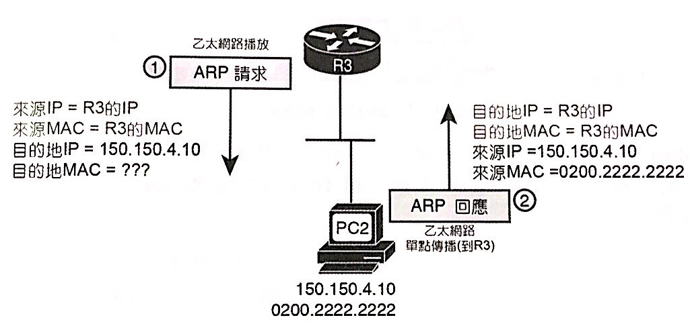
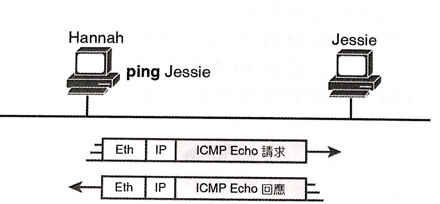

# IPv4定址及路由的基本原理

[TOC]

## 名詞定義

|   中文   | 英文簡稱 | 英文全稱|
| :--------: | :--------:| :------: |
|路徑選擇||Path Selection|
|預設閘道||Default gateway or Default router|
|位置解析協定|ARP|Address Resolution Protocol|
|網域名稱系統|DNS|Domain Name System|
||Ping|Packet Internet Groper|
|網際網路控制訊息協定|ICMP|Internet Control Message Protocol|

## 網路層功能概述

- **IP定址**：就像是郵遞區號的命名規則。
- **IP路由**：轉送IP封包的過程，就像是郵差透過IP定址送到目的地。
- **IP遶送通訊協定**：一個告訴一個當方式，來動態學習IP位址。

### 遶送的開始

- 路由就是**路徑選擇**的過程。
- 發送端將發現目的地IP與自己不在同一個LAN上。
- 於是將IP封包送至**預設閘道**(**Default gateway** or **Default router**)。

### 鏈結層遶送

- 每一台router都會有它的**IP路由表**。
- **IP路由表**就像是高速公路上的路標，LAN或WAN線路相當於道路。
- **IP路由表**中，紀錄如何到達每個IP網路，或IP子網路的路徑。
- 網路層表明遶送的過程，各router必須適當的**封裝**與**解封裝**。
- 為了封裝新的**標頭標尾**，需要透過**位置解析協定(ARP)**來決定標頭內所使用的MAC位置。
- **ARP**會**動態學習**LAN中Host IP對應的**MAC**，如圖中R3發給PC2前，透過ARP取得PC2的MAC。

### IP定址與IP遶送

- IP就像是郵政區號，一層一層定下來。
- 除了**來源IP**位置、**目的地IP**位置以外，還有12 bytes的各項標頭，組成了共**20 bytes**的**IPv4標頭**。

- **遶送通訊協定**的方式，是Host端開始發送封包到Gateway，Gateway再發給下一位router。
- 此時下一位router便知道，透過某Gateway，可以到達某個**IP子網路**。
- Gateway發送給下一位router的決定方式，也是透過**遶送通訊協定**得知的。

## IPv4定址

- 根據IP數字開頭，分為A、B、C、D、E級。
- **ABC**為一般**單點傳播**用，**D**為**群播(multicast)**位置、**E**為實驗位置。

- **A級**每個子網路有$2^{24}$個主機。
- **B級**每個子網路有$2^{16}$個主機。
- **C級**每個子網路有$2^{8}$個主機。

- **子網路切割**是自行再將某一級網域進行細部切割。

> A,B,C網域，除了開頭以外，其餘部分**全0**與**全1(廣播位置)**都不能使用。
>
## IPv4路由

- 目的地如果是同一區網，則直接傳送，否則則交給**預設閘道**處理。

- **預設閘道**會先複製封包、檢查FCS，若有錯誤則丟棄封包。
- 確定沒有錯誤，則丟棄訊框標頭，再查表來分析路徑、封裝、傳送。
- 下圖使用**OSPF遶送通訊協定**，一層一層查找。

## IPv4遶送

- 動態學習，將每個子網路路徑加入路由表。
- 若到某個子網路有超過一條路徑，則將**最佳路徑**加入。
- 路徑失效則刪除。
- 若有新路徑可以取代失效的路徑，則加入。
- 取代速度要快，期間稱為**收斂時間**。
- 防止迴路。

>遶送通訊協定有很多種，但有共通點。
>
>1. 直連的子網路，加入路由表。
>2. 每一台都互相告訴鄰居自己的路由表(**路徑更新**)。

## 其他網路層功能

### DNS

- DNS查詢的名稱也是世界通用協定。
- 並非某一台DNS知道全部名稱，而是由**全世界**的DNS互相學習、合作查詢。

### ARP

- 雖然知道IP的路徑，卻不知道下一位的**MAC**。
- 於是ARP用來**動態學習**LAN中另一台的MAC。
- 定義**ARP Request**與**ARP Reply**：如果這是你的IP，請回應我你的MAC位置。

- 將結果記錄到**ARP快取**或**ARP表**中，逾期則清除。
- 透過**arp -a**來觀察。

### Ping

- Ping使用**ICMP**協定，發送**ICMP echo request**到另一個IP。
- 若有收到，則回應**ICMP echo reply**。
- 僅用來測試，代表路徑通行。

>1. **ICMP**不依賴任何應用程式，只用了OSI第1、2、3層。
>2. **ICMP**具有更多功能。
